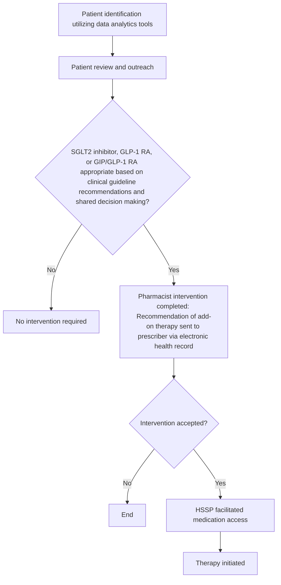
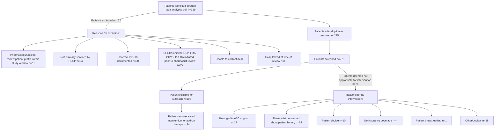

# A Health-System Specialty Pharmacy Approach to Optimize Medication Regimens Among Patients Diagnosed with Type 2 Diabetes Mellitus

cps logo

Casey Fitzpatrick, PharmD, BCPS; Sali Askar, PharmD Candidate; Andrew Wash, PharmD, PhD; Carly Giavatto, PharmD; Ana I. Lopez-Medina, PharmD, PhD; Lauren Bryant, PharmD, CDCES; Jessica Mourani, PharmD; Nick McDonald, PharmD; Elizabeth Carpenter, PharmD

## BACKGROUND

* Patients with uncontrolled type 2 diabetes mellitus (T2DM) are at greater risk for complications such as renal impairment, cardiovascular disease, and death.1

* Given their beneficial effects on cardiovascular outcomes, weight, and hypoglycemic risk, sodium-glucose contransporter-2 (SGLT2) inhibitors, glucagon-like peptide-1 receptor agonists (GLP-1 RAs), and a dual glucose-dependent insulinotropic peptide/GLP-1 (GIP/GLP-1) RA have become mainstays in the treatment of T2DM.2

* SGLT2 inhibitors, GLP-1 RAs, and GIP/GLP-1 RAs are often not prescribed nor accessible to patients who could benefit from them.3,4 Thus, opportunities exist to optimize their clinical use.

* The heath-system specialty pharmacy (HSSP) model embeds pharmacists within outpatient clinics where they can collaborate with prescribers to optimize therapeutic regimens.

## OBJECTIVE

To describe the findings of an HSSP initiative aimed at optimizing medication regimens for patients with T2DM in alignment with clinical guideline recommendations.

## METHODS

### Study Design

From December 2023 to February 2024, an HSSP quality improvement initiative was conducted at seven HSSPs, and associated outpatient clinics (endocrinology, family practice, or primary care), in which pharmacists recommended add-on therapy to prescribers for patients with T2DM based on clinical guideline recommendations.

| PATIENT INCLUSION                                                         | PATIENT EXCLUSION                 |
| ------------------------------------------------------------------------- | --------------------------------- |
| • Diagnosis of T2DM per applicable ICD-10-CM codes                        | • <18 years of age                |
| • Prescribed any insulin therapy                                          | • Unable to contact               |
| • Not prescribed a SGLT2 inhibitor, GLP-1 RA, or GIP/GLP-1 RA at baseline | • Not clinically serviced by HSSP |

### Initiative Framework

### Endpoints

| 1                                                          | 2                                                                  | 3                                                        | 4                                           |
| ---------------------------------------------------------- | ------------------------------------------------------------------ | -------------------------------------------------------- | ------------------------------------------- |
| Number of patients eligible for pharmacist review/outreach | Number of therapy recommendation interventions made to prescribers | Number and breakdown of pharmacist intervention outcomes | Number and breakdown of new therapies added |

## RESULTS

### Figure 1: Patient Identification and Outreach

### Table 1: Patient Demographics Among Those Eligible for Outreach

| Characteristic              | Patients (n=108) |
| --------------------------- | ---------------- |
| Median age (IQR) – yr       | 67 (48-86)       |
| Female sex – n (%)          | 64 (59)          |
| Baseline hemoglobin A1C - % |                  |
| Median (IQR)                | 9.5 (5.8-13.2)   |

### Figure 2: Pharmacist Intervention Outcomes (n=34)

| Outcome  | Percentage |
| -------- | ---------- |
| Accepted | 71%        |
| Denied   | 29%        |

### Figure 3: New Therapies Added (n=24)

| Therapy Type     | Percentage |
| ---------------- | ---------- |
| GLP-1 RA         | 46%        |
| SGLT-2 Inhibitor | 46%        |
| GIP/GLP-1 RA     | 8%         |

## DISCUSSION AND CONCLUSION

Gaps in guideline-directed prescribing remain for patients with T2DM, and HSSP pharmacists are well positioned to support prescribers and ensure patients are optimally managed.

Pharmacists tend to be well versed in clinical guidelines and can utilize their clinical expertise to recommend patient-specific therapeutic options.

The 71% prescriber acceptance rate in this study highlights the trust that the clinic prescribers placed in the HSSP pharmacists’ expertise and recommendations.

The findings of this initiative further strengthen the argument for integration of clinical pharmacists into multidisciplinary teams.

### Limitations

* There was lack of documentation by pharmacists regarding rationale for why a particular medication was added (e.g., comorbidity or A1C not at goal).

* Patient out-of-pocket costs were not analyzed.

* A relatively short window (i.e., four months) for patient review and outreach; 61 patients were excluded as pharmacists were unable to review within the study period.

* For some patients, it was documented that the prescriber was opting to evaluate the patient in-person at their next office visit prior to initiating therapy, but some office visits fell outside the study window.

### Future Direction

* Efforts are planned to evaluate additional patients with T2DM (e.g., not on insulin therapy) who may benefit from add-on therapy.

* A six-to-twelve-month follow-up is being considered to evaluate clinical outcomes (e.g., change in A1C) for patients who received a new therapy.

## REFERENCES

1. Zhang R, Mamza JB, Morris T, et al. Lifetime risk of cardiovascular-renal disease in type 2 diabetes: a population-based study in 473,399 individuals [published correction appears in BMC Med. 2022 Mar 23;20(1):121]. BMC Med. 2022;20(1):63.

2. American Diabetes Association Professional Practice Committee; 9. Pharmacologic Approaches to Glycemic Treatment: Standards of Care in Diabetes—2024. Diabetes Care 1 January 2024; 47 (Supplement_1): S158–S178.

3. Mahtta D, Ramsey DJ, Lee MT, et al. Utilization Rates of SGLT2 Inhibitors and GLP-1 Receptor Agonists and Their Facility-Level Variation Among Patients With Atherosclerotic Cardiovascular Disease and Type 2 Diabetes: Insights From the Department of Veterans Affairs. Diabetes Care. 2022;45(2):372-380. doi:10.2337/dc21-1815

4. Medications for Type 2 diabetes, weight loss & kidney health not always provided as needed. American Heart Association Epidemiology, Prevention, Lifestyle & Cardiometabolic Health Conference, Abstracts 52, MP36 and P499. March 19, 2024. Accessed on April 17, 2024.

