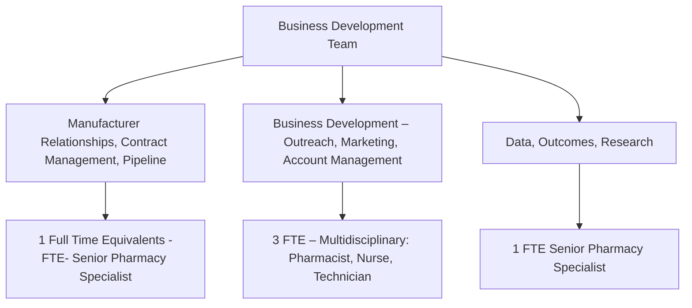
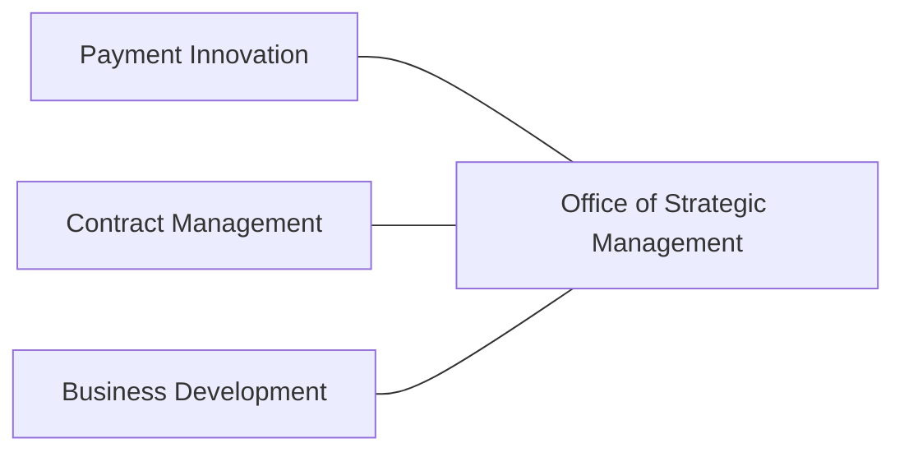

Yale New Haven Health logo

# Business Development Team Enhances Clinical Continuity by Leveraging Health System Partners

Tina Do, PharmD, MS, BCPS; Aislinn Devoe, MSN, CMSRN; Mark D’Ambrosi, RPh, CSP; Natalie Amendola, CPhT;
Victoria Lucero, PharmD; Kimhouy Tong, PharmD, BCPS; Vinay Sawant, RPh, MPH, MBA

## Background

Integrated health system specialty pharmacies (HSSP) are well-positioned to enhance patient care and improve specialty clinical continuity, whereby clinical care and specialty drug fulfilment is provided in an unfragmented manner. HSSP’s ability to leverage existing health system teams can enhance coordination, clinical care, and specialty drug fulfillment. In 2021, Yale New Haven Health’s (YNHH) HSSP established a business development team to foster further collaborative team-based care, market HSSP’s value proposition, and enhance and build external relationships (e.g., payers, manufacturers) to expedite clinical continuity.

Figure 1. Growth Strategy

| Point | Description                                            |
| ----- | ------------------------------------------------------ |
| 1     | Provide patients with comprehensive pharmacy offerings |
| 2     | Clinician Resilience                                   |
| 3     | Value Proposition                                      |
| 4     | PRODUCT                                                |
| 5     | State-of-the-Art Facility                              |
| 6     | PROCESS                                                |
| 7     | Patient Experience                                     |

## Objective

Establish and deploy a multidisciplinary business development team to strengthen engagement and collaboration, leading to better clinical continuity.

## Method

Figure 2. Business Development Team Structure

## Results

Figure 3. Health System Partners

Figure 4. Activities

| Access Strategy: 184 Limited Distribution Drugs | Pipeline Monitoring | Shared Customer Relationship Management (CRM) Tool |
| ----------------------------------------------- | ------------------- | -------------------------------------------------- |

Figure 5. Clinics Engaged in Initiative
Eligible Clinics by Engagement Status*
n = 536

| Status         | Percentage |
| -------------- | ---------- |
| Live/Scheduled | 34%        |
| Future         | 66%        |

\*Initiative started January 2023. Data up to date 8/1/23.

Table 1. Clinical Continuity Post Go Live

| Clinical Continuity Change (%) from Baseline\* |
| ---------------------------------------------- |
| + 22.4%                                        |

\*Compared clinics engaged in the preferred specialty pharmacy initiative to the average overall baseline clinical continuity

## Discussion

* Having a strong relationship with health system partners and departments allows YNHH HSSP to leverage existing connections and teams to provide expertise in areas such as contracting. It also ensures partnership in current and future strategies impacting the health system.

* Having a multidisciplinary team dedicated to outreach and account management allowed for effective acceleration of clinic engagement, network expansion, and perspectives.

* Maintaining relationships with manufacturers and having the ability to monitor the medication pipeline ensures strong rapport with companies and proactive approach for obtaining medication access.

* Having the ability to connect and coordinate projects related to data and outcomes allow better messaging of YNHH HSSP’s value proposition to different partners.

## Conclusion

Forming a business development team to leverage health system partners can expedite and increase clinical continuity and key stakeholder engagement.

## Future Direction

To further expand the business development team to support the increasingly complex and growing portfolio of specialty medications and payer landscape. In addition, strengthen existing internal and external partnerships.

## Acknowledgments

The authors of this poster would like to thank Terri Sue Rubino, PharmD, CSP, Todd Cooperman, PharmD, MBA, Ryan Isacsson, PharmD, MBA, and YNHH partners for helping to increase clinical continuity and medication access.

The authors of this presentation have nothing to disclose concerning possible financial or personal relationships with commercial entities that may have a direct or indirect interest in the subject matter of this presentation.
NASP Annual Meeting & Expo 2023. September 18-21, 2023.

