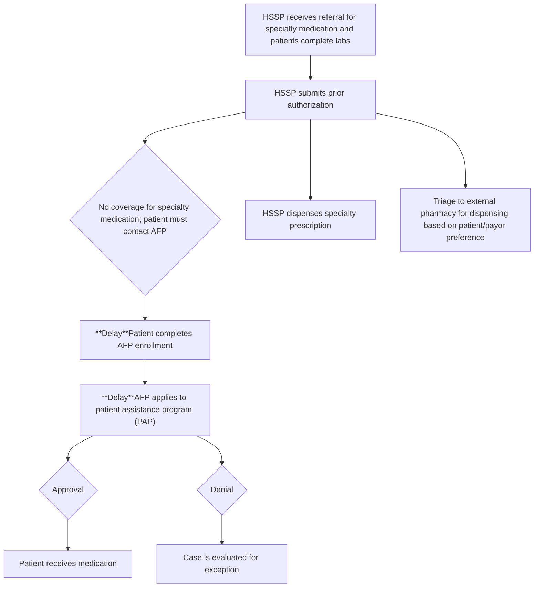

# Exploring the Impact of alternative funding programs on medication access and clinical outcomes

Trent Towne, PharmD; Ana Lopez-Medina, PharmD, PhD; Lori Lane, BHS, CPhT; Amber Skrtic, PharmD; Carly Giavatto, PharmD; Andrew Wash, PharmD, PhD; Jessica Mourani, PharmD; Tony Zahorian, PharmD; Casey Fitzpatrick; Logan Franke, PharmD

cps logo

## BACKGROUND

* The increasing cost of specialty medications has led employers to implement strategies to reduce their overall drug spending, including requiring employees to use Alternative Funding Programs (AFPs) for high-cost medications.1

* AFPs work for vendors to help patients obtain their medication by enrolling them in charitable patient assistance programs, thereby shifting the cost away from the prescription plan.

* However, AFPs often fail to meet expectations because patients face numerous obstacles in obtaining their medication.

## OBJECTIVES

1. Compare turnaround time to access medication between patients receiving their specialty therapies from a health-system specialty pharmacy (HSSP) or externally through an AFP.

2. Evaluate the hospitalization rate for patients who received their specialty therapies externally due to AFPs and through HSSP.

## METHODS

### Study Design

Retrospective, observational study within a single HSSP from January 1, 2022, to May 31, 2023

| INCLUSION CRITERIA                                                                                                                      | EXCLUSION CRITERIA                                                                         |
| --------------------------------------------------------------------------------------------------------------------------------------- | ------------------------------------------------------------------------------------------ |
| \* Adult patients (>18 years old)                                                                                                       | \* Patients on infusion therapy or not eligible to fill medication during the study period |
| \* Newly prescribed adalimumab, capecitabine, dupilumab, enzalutamide, etanercept, guselkumab, osimertinib, palbociclib or upadacitinib | \* Patients who did not start medication                                                   |

### Endpoints

**Primary:**

Time to treat: Length of time (in days) between when the patient was referred to the specialty pharmacy and the treatment start date

**Secondary:**

* Rate of hospitalization related to the specialty disease

* Rate of hospitalization due to any cause

Rate of hospitalization was calculated by dividing the number of hospitalizations by the total number of patients in each group

### Data analysis

Continuous variables were compared between both groups using the student’s t-test, while a χ² test was used for categorical variables. A p-value of <0.05 was considered statistically significant.

## RESULTS

### Table 1: Patient Demographic

| BASELINE CHARACTERISTICS | AFP (N=37) | HSSP (N=176) |
| ------------------------ | ---------- | ------------ |
| Female sex, n (%)        | 23 (62.1)  | 94 (53.4)    |
| Age, mean \[SD]          | 48.2 (1.9) | 57.3 (1.3)   |
| Disease State            |            |              |
| Oncology                 | 8 (21.6)   | 61 (34.7)    |
| Rheumatology             | 29 (78.4)  | 115 (65.3)   |

### Figure 1: Most common medications

| Medication   | AFP | HSSP |
| ------------ | --- | ---- |
| Upadacitinib | 5   | 15   |
| Enzalutamide | 5   | 25   |
| Etanercept   | 10  | 30   |
| Capecitabine | 5   | 30   |
| Adalimumab   | 10  | 75   |

### Figure 2: Median Time to Treat

| Group        | Time to Treat (days) |
| ------------ | -------------------- |
| AFP (N=37)   | 21                   |
| HSSP (N=176) | 9                    |

\*p= <0.0001

Turnaround time to access medication was a 133 % higher for those filling their specialty therapies externally due to AFPs compared to HSSP

### Figure 3: Rate of Hospitalizations

| Hospitalization Type             | AFP (N=37) | HSSP (N=176) |
| -------------------------------- | ---------- | ------------ |
| Related to the specialty disease | 0.49       | 0.32         |
| All-cause hospitalization        | 1.29       | 1.19         |

\*Related to the specialty disease: p= 0.025
\*All-cause hospitalization: p= 0.478

## DISCUSSION AND CONCLUSION

* This study demonstrates a significant delay in therapy initiation for patients filling medication externally due to AFPs compared to those filling their prescription with HSSP

* Patients required to use an AFP also had higher hospitalization rate related to the specialty disease, when compared to those able to utilize an HSSP. Additionally, patients required to use an AFP also had higher all-cause hospitalization, when compared to those able to utilize an HSSP, but those differences were not statistically significant.

### Impact on Patient Care

### Limitations

Difficulty in accurately determining the medication start date for patients filling medication externally due to AFPs. We estimate that the median time to treat in the AFP group was higher than what we calculated

### Future studies

Future studies with a larger sample size should assess the impact of filling specialty medications externally due to AFPs, on other clinical outcomes as well as in other diseases states. Additionally, future studies should also investigate the percentage of patients who do not start medication due to AFP issues.

## REFERENCES

1. Immune Deficiency Foundation. Alternative Funding Programs hinder access to medications. Accessed Jun 2024. https://primaryimmune.org/resources/news-articles/alternative-funding-programs-hinder-access-medications#:~:text=An%20AFP%20acts%20as%20a,driven%20entirely%20by%20the%20AFP.

speaker icon

