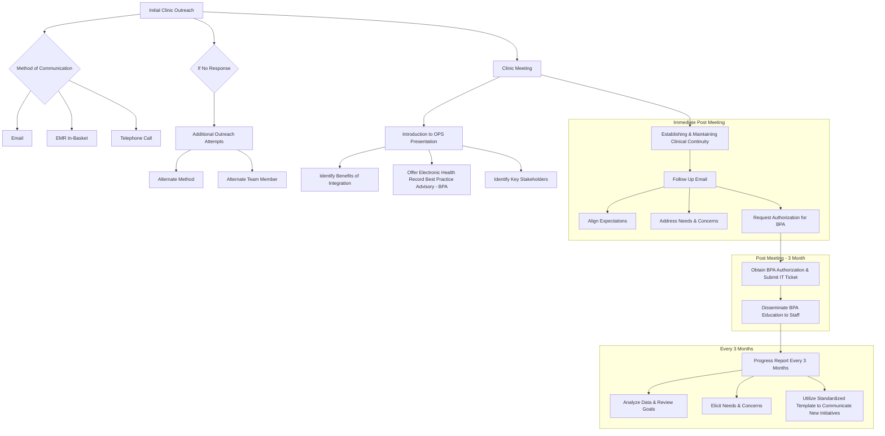

Yale New Haven Health logo

# Specialty Pharmacy Continuity Optimization

Ryan C Isacsson, PharmD, MBA; Mark D’Ambrosi, RPh, CSP; Aislinn Devoe RN, MSN, CMSRN, CV-BC; Natalie Amendola, BS, CPhT; Todd Cooperman, PharmD, MBA, PRS, PAHM; Vinay Sawant, RPh, MPH, MBA

Yale New Haven Health, Department of Pharmacy, New Haven, CT

NASP National Association of Specialty Pharmacy logo

## Background

* Specialty clinical continuity
    - Clinical care and specialty drug fulfilment provided in an unfragmented manner.
    - Can improve access to therapy and improve adherence.
    - Established as a key initiative.
    - One proxy is the percent of written specialty drug orders retained within the health system (also known as prescription capture).

* Variation in clinical continuity across YNHH’s ~800 clinics results in fractured prescription fulfillment and clinical pharmacy services.

* Establishment of a team at Outpatient Pharmacy Services at YNHH (OPS) to promote clinical continuity and support clinics is key to patient care.

## Objectives

To develop, implement, and evaluate a multidisciplinary outreach team based out of the OPS specialty team who will create a process to enhance clinical continuity.

## Discussion

* Successful outreach requires coordination across disciplines.

* The multidisciplinary outreach team effectively collaborated and blended diverse skills and perspectives to achieve a common goal.

* Stakeholder engagement is imperative to success.

* Outreach team rebranded the “BPA” initiative to electronic health record “Reminder” to make it more palatable to stakeholders.

## Methods

### Clinic Selection Criteria

|                | Multidisciplinary Team Strategy                                                                      | Clinic Request                                                                                                                                         | OPS Pharmacist Request                                                                                                                                                                           | New Drug Launch                                                                                                                                                                                  |                                                                                   |                     |
| -------------- | ---------------------------------------------------------------------------------------------------- | ------------------------------------------------------------------------------------------------------------------------------------------------------ | ------------------------------------------------------------------------------------------------------------------------------------------------------------------------------------------------ | ------------------------------------------------------------------------------------------------------------------------------------------------------------------------------------------------ | --------------------------------------------------------------------------------- | ------------------- |
| Identification | Analysis of Clinical Continuity Dashboard • Clinic/Provider - High Revenue - Low Capture | Communication received from clinic to educate/offer services                                                                                           | Communication received from OPS Pharmacist to provide education to clinic • Define issue \[ ] Education \[ ] Process                                                                 | • New Drug Available • New formulation available                                                                                                                                             |                                                                                   |                     |
|                | Screening                                                                                            | \[ ] Population Serviced \[ ] Determine prescription opportunity \[ ] Capture rate \[ ] Fill rate \[ ] Determine financial opportunity | \[ ] Prescribes Specialty Medications \[ ] Population Serviced \[ ] Determine prescription opportunity \[ ] Capture rate \[ ] Fill rate \[ ] Determine financial opportunity | \[ ] Prescribes Specialty Medications \[ ] Population Serviced \[ ] Determine prescription opportunity \[ ] Capture rate \[ ] Fill rate \[ ] Determine financial opportunity | \[ ] List procured from report run by team \[ ] List from drug representative |                     |
|                |                                                                                                      | Exclusion                                                                                                                                              | ✓ External network ✓ Subject to other pharmacy initiative ✓ No per management                                                                                                            | ✓ No/little opportunity ✓ Do not serve disease state                                                                                                                                         |                                                                                   | ✓ Drug availability |

### Introducing Outpatient Pharmacy Services

* Evaluated and prioritized clinics for outreach if capture rate was below 90 percent for prescribed specialty medications.

* Tailored materials were developed to describe the benefits of OPS towards supporting specialty drug clinical continuity to improve the patient’s overall treatment experience and reduce barriers to care.

Icon depicting a multidisciplinary team

Clinical continuity team, comprising a nurse, pharmacists, and technician, engaged key stakeholders within these clinics.

Screenshot of Electronic Health Record Best Practice Advisory (BPA) message: "Our system integrated YNHH Specialty Pharmacy- Outpatient Pharmacy Services (OPS), provides high quality coordinated medication therapy management for patients receiving specialty medications. This order contains Specialty Medication(s) that OPS may be able to service for your patient. If you have questions, please contact OPS at 203-747-3933."

In addition, an electronic health record Best Practice Advisory (BPA) offering was developed to reinforce the opportunity for utilization of OPS.

## Results

| 343 clinics                   | 118 clinics                                                                 | 66 clinics                           | 27 clinics         |
| ----------------------------- | --------------------------------------------------------------------------- | ------------------------------------ | ------------------ |
| Continuity rate less than 90% | Initial targeted list Based on potential specialty prescription opportunity | Outreach conducted • EHR BPA offered | EHR BPA authorized |

| Multidisciplinary Outreach Team | BPA Usage | Capture Rate |
| ------------------------------- | --------- | ------------ |
| July 2021- June 2022            |           | 31% ↑        |

## Conclusions

* The primary outcome of this initiative, improvement in specialty prescription capture from targeted clinics compared with baseline was achieved.

* The multidisciplinary outreach team built awareness surrounding the suite of services offered at Outpatient Pharmacy Services, ensured clear communication with stakeholders, and supported clinicians and patients.

### Impact on the Patient Experience

* By improving clinical continuity across outreached clinics, the multidisciplinary outreach team provided access to high value, patient-centered care.

## Barriers/Limitations

* Slow adoption of prescribing pattern changes

* Insurance lockouts

* Patient preference

* Information technology limitations

## Future Directions

* Continued outreach and maintenance of current relationships by the multidisciplinary outreach team is pivotal to the success of Outpatient Pharmacy Services at Yale New Haven Health.

Disclosure: The authors of this presentation have nothing to disclose concerning possible financial or personal relationships with commercial entities that may have a direct or indirect interest in the subject matter of this presentation.
NASP Annual Meeting & Expo 2022. September 19-22, 2022

