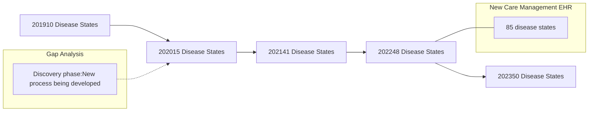

Yale NewHaven Health

# Developing a disease state specific patient management program at an integrated health system specialty pharmacy

Michele Riccardi, PharmD, BCPS; Kimhouy Tong, PharmD, BCPS; Todd Cooperman, PharmD, MBA; Sarah Wright, PharmD, BCACP; Terri Sue Rubino, PharmD, CSP; Tina Do, PharmD, MS, BCPS; Vinay Sawant, RPh, MPH, MBA

## Background

* Despite general agreement on the components of specialty pharmacy patient management, strategies to creating a clinical program vary greatly from one-size-fits-all to highly disease-specific approaches.

* There are merits to creating one standard patient care clinical process regardless of medication or condition. However, this approach is complicated by the variability and number of disease states treated with specialty drugs.

* Additionally, emerging trends in specialty pharmacy accreditation and payor requirements emphasize disease state specific clinical processes and workflows.

* In response, health system specialty pharmacy (HSSP) Outpatient Pharmacy Services (OPS) at Yale New Haven Health undertook an initiative to enhance its comprehensive disease-state specific patient management program.

## Objective

To create a standardized approach in the development of a HSSP patient management program (PMP) that addresses the diversity and unique needs of a broad spectrum of specialty conditions.

## Methods

**Gap Analysis**
* Surveyed pharmacy staff
* Assessed specialty medication utilization to identify gaps in patient management program
* Stratified priority to develop PMP module based on historical & current patient volumes
* Utilized standards of care and guidelines

**Template Module Design**
* Utilized standards of care and guidelines as foundation for template design
* Internally designed template outlining process of managing each disease state with a standardized approach
* HSSP subject matter experts created evidence-based modules comprised of:
  - A standard operating procedure for best practices
  - An in-service presentation
  - A learning assessment

**Quality Assurance**
* Vetted modules through the internal clinical oversight committee
* Reviewed and approved annually by the internal clinical oversight committee
* Select PMP modules vetted through physician specialists

## Results

The PMP modules increased from ten in 2019 to fifteen in 2020 while the new process was under development. Using the new PMP development process, 41 PMP modules were developed in 2021. The PMP modules were used as the foundation to build the patient management programs for a new electronic health record (EHR) care management system for OPS in 2022. The care management EHR redesign allowed historically unattainable customizations to workflow processes and clinical documentation for each PMP module. Currently OPS manages patients across 85 different disease states.

### Timeline PMP Module Development

| PMP Modules Template                                                                                                                                                                                                                                                                                                                                | Foundational Support | New Care Management EHR                                                                                                                                                                                                            | 50 PMP Modules                                                                                                                                                                                                                                                                |
| --------------------------------------------------------------------------------------------------------------------------------------------------------------------------------------------------------------------------------------------------------------------------------------------------------------------------------------------------- | -------------------- | ---------------------------------------------------------------------------------------------------------------------------------------------------------------------------------------------------------------------------------- | ----------------------------------------------------------------------------------------------------------------------------------------------------------------------------------------------------------------------------------------------------------------------------- |
| • Covers a single disease or multiple diseases in a group • Overview of the disease specific program • Inclusion patient criteria • Onboarding of patients and initial education • Ongoing management • Intervention triggers and process to address them • Goals of the program and how they are measured • References |                      | • Customizations for: • Specific disease states • Workflow processes • Clinical documentation • Screening tools • Added clinical support electronically for PMP modules • 85 case management episode types | • Provides guidance on managing specialty disease state • Educational resource for staff • Supports URAC, ACHC accreditation & third-party payor requirements • 85 disease states • 10 screening tools • Established therapeutic goals for disease states |

### Representative Mapping of EHR Episode Types to PMP Module

| Oncology PMP                 | Oncology PMP                |
| ---------------------------- | --------------------------- |
| Acute leukemia (ALL, AML)    | Lung Cancer                 |
| Anemia-Hematology/Oncology   | Malignant melanoma          |
| Basal cell carcinoma of skin | Multiple myeloma            |
| Bladder Malignancy           | Myeloproliferative Neoplasm |
| Breast cancer                | Non-Hodgkin lymphoma        |
| Central Nervous System tumor | Ovarian cancer              |
| Cervical cancer              | Pancreatic adenocarcinoma   |
| Chronic lymphocytic leukemia | Prostate cancer             |
| Chronic myeloid leukemia     | Renal cell carcinoma        |
| Colorectal cancer            | Thrombocytopenia            |
| Gastric Cancer               | Thyroid Carcinoma           |
| Hepatocellular carcinoma     | Iron Overload - Oncology    |
| Hodgkin lymphoma             |                             |

## Discussion

* Initial gap analysis identified several opportunities to customize patient care within condition-specific disease state modules.

* PMP creation process enabled consistent gap analysis and creation of subsequent PMP modules.

* Patients managed for conditions that fall outside scope of specific PMPs are managed using a standard specialty pharmacy program module that meets all accreditation requirements.

* PMP modules were mapped to case management system episodes to further customize care for specialty patients.

* Shared EHR tools support interdisciplinary documentation of condition-specific evaluations, thereby reducing redundant assessments and improving clinical decision making.

## Conclusions

A standardized approach to develop individual disease state program modules grew an HSSP patient management program from ten to 85 disease states.

## Future Directions

* Utilizing electronic clinical pathways that incorporate each PMP disease module on the management of each disease state.

* As the patient management program grows, consolidation of multiple modules into one module without impacting content.

* Further development of certain disease states such as rare disease and oncology, for ACHC accreditation with distinction.

### Clinical Screening Tools

| Quality of Life | • CDC HRQOL • Multiple Sclerosis                                  |
| --------------- | --------------------------------------------------------------------- |
| Inflammatory    | • RAPID3 • Flares • BASDAI • DLQI • CDLQI • IDQOL |
| Asthma          | • ACT Adult • ACT Children                                        |

## Acknowledgments

The authors of this poster would like to thank Bisni Narayanan, PharmD, MS, Mitchell DelVecchio, PharmD, CSP, Lena DeVietro, PharmD, BCPS and the pharmacists in the call center of Outpatient Pharmacy Services at Yale New Haven Health for their help with implementing this project.

## References

URAC Patient Management Program Standards Version 4.0. ACHC Section 5: Provisions of Care and Record Management 7/2023.

**Disclosure**: The authors of this presentation have nothing to disclose concerning possible financial or personal relationships with commercial entities that may have a direct or indirect interest in the subject matter of this presentation.

NASP Annual Meeting & Expo 2023. September 18-21, 2023.

