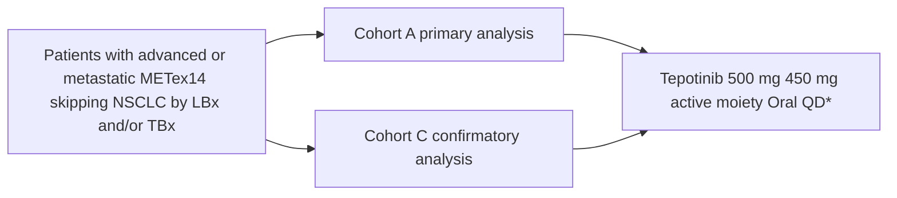
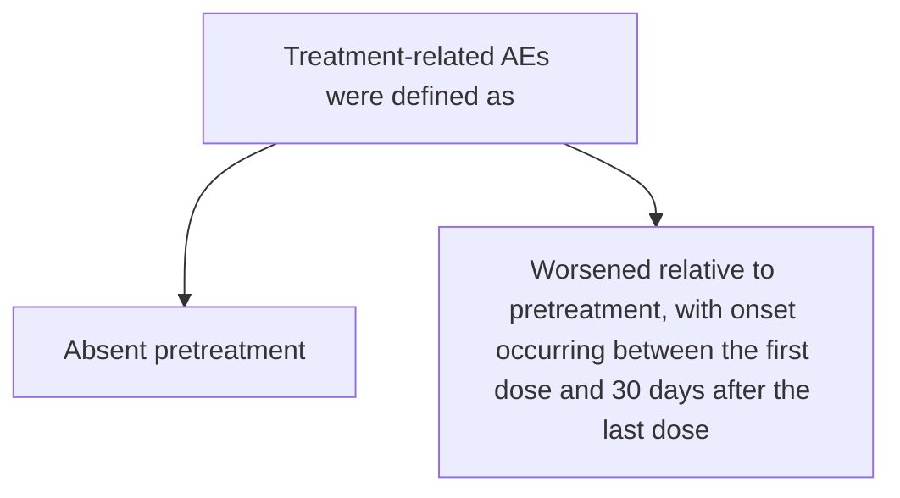
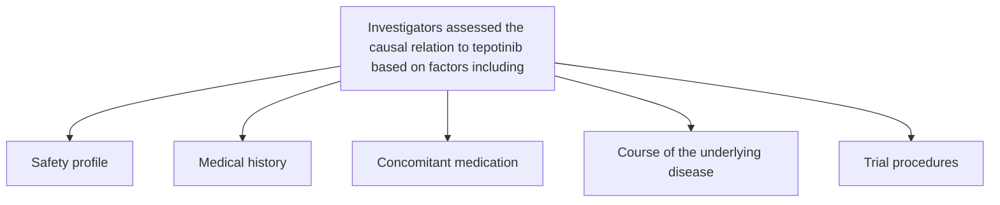

# Safety update: Tepotinib in METex14 skipping NSCLC

QR code

Marina C. Garassino1,2, Remi Veillon3, Hiroshi Sakai4, Xiuning Le5, Enriqueta Felip6, Alexis B. Cortot7, Egbert Smit8, Keunchil Park9, Frank Griesinger10, Christian Britschgi11, Yi-Long Wu12, Rolf Bruns13, Gordon Otto14, Karin Berghoff15, Paul Paik16,17

Copies of this e-poster obtained through QR code are for personal use only and may not be reproduced without written permission of the authors

1Department of Medicine, Section of Hematology/Oncology, Knapp Center for Biomedical Discovery, The University of Chicago, Chicago, IL, USA; 2Department of Medical Oncology, Fondazione IRCCS Istituto Nazionale dei Tumori, Milan, Italy; 3Service des Maladies, CHU Bordeaux, Bordeaux, France; 4Department of Thoracic Oncology, Saitama Cancer Center, Saitama, Japan; 5Department of Thoracic Head and Neck Medical Oncology, The University of Texas MD Anderson Cancer Center, Houston, TX, USA; 6Department of Oncology, Vall d'Hebron Institute of Oncology (VHIO), Barcelona, Spain; 7Department of Thoracic Oncology, CHU Lille, Lille, France; 8Department of Thoracic Oncology, Netherlands Cancer Institute, Amsterdam, The Netherlands; 9Samsung Medical Center, Sungkyunkwan University School of Medicine, Seoul, Republic of Korea; 10Pius-Hospital, University Medicine Oldenburg, Department of Hematology and Oncology, University Department Internal Medicine-Oncology, Oldenburg, Germany; 11Department of Medical Oncology and Hematology, Comprehensive Cancer Center Zurich, University Hospital Zurich, Zurich, Switzerland; 12Guangdong Lung Cancer Institute, Guangdong Provincial People's Hospital & Guangdong Academy of Medical Sciences, Guangzhou, China; 13Department of Biostatistics, the healthcare business of Merck KGaA, Darmstadt, Germany; 14Global Clinical Development, the healthcare business of Merck KGaA, Darmstadt, Germany; 15Global Patient Safety, the healthcare business of Merck KGaA, Darmstadt, Germany; 16Thoracic Oncology Service, Memorial Sloan Kettering Cancer Center, New York, New York, USA; 17Weill Cornell Medical College, New York, NY, USA

## Conclusions icon CONCLUSIONS

* In the VISION study, comprising a large population of patients with METex14 skipping NSCLC, tepotinib was generally well tolerated

* The most common TRAE, peripheral edema, which is a class effect of MET inhibitors, was mostly mild or moderate and managed with tepotinib dose reduction or treatment interruption

* Proactive monitoring for edema is recommended, with consideration of early dose modifications (e.g. dose reductions or short treatment interruptions) or prophylactic conservative management measures, such as support stockings, limb elevation, and increased physical activity

## VISION study design icon VISION study design

* VISION is a single-arm, Phase II trial of the MET inhibitor tepotinib in patients with NSCLC harboring MET alterations (NCT02864992)1

* Based on results from the Phase II VISION study, tepotinib was approved for advanced NSCLC with METex14 skipping in the US in February 20212

### Figure 1. Study design, endpoints, and eligibility criteria of VISION

\*Treatment continues until disease progression, intolerable toxicity, or withdrawal of consent.

| Selected endpoints |                                                                                                                                                                                                  |
| ------------------ | ------------------------------------------------------------------------------------------------------------------------------------------------------------------------------------------------ |
| Primary            | • Objective response by IRC according to RECIST v1.1 criteria                                                                                                                                    |
| Secondary          | • DOR, PFS • Safety – TRAEs were assessed using NCI-CTCAE v4.03 – To manage AEs, treatment could be interrupted for up to 21 days or the tepotinib dose could be reduced to 250 mg\* |

\*Reduced 250 mg dose contains 225 mg tepotinib free base.

**Key inclusion criteria**
* Advanced NSCLC (EGFR/ALK wild-type, all histologies)
* Liquid and/or tissue biopsy MET alterations (central lab)
* First, second or third line of therapy
* Prior immunotherapy allowed

**[X] Key exclusion criteria**
* Any unresolved toxicity Grade 2 or more from previous anticancer therapy
* Inadequate hematologic, liver or renal function, impaired cardiac function, uncontrolled hypertension

## Safety analysis icon Safety analysis: Methods

* Treatment-emergent AEs were graded according to NCI-CTCAE v4.03

* Time to first onset and time to resolution were analyzed for AEs of clinical interest, including composite categories comprising preferred terms, irrespective of the causal relation to study treatment

**Peripheral edema** – a disorder characterized by swelling due to excessive fluid accumulation in the upper or lower extremities
**NCI CTCAE v4.03 definitions**

* **Grade 1**: 5–10% inter-limb discrepancy in volume or circumference at point of greatest visible difference; swelling or obscuration of anatomic architecture on close inspection
* **Grade 2**: >10–30% inter-limb discrepancy in volume or circumference at point of greatest visible difference; readily apparent obscuration of anatomic architecture; obliteration of skin folds; readily apparent deviation from normal anatomic contour; limiting instrumental ADL
* **Grade 3**: >30% inter-limb discrepancy in volume; gross deviation from normal anatomic contour; limiting self-care ADL

## Results icon RESULTS

### VISION: Patient characteristics and efficacy

* Patients with METex14 skipping were elderly (median age 72.0 years, range: 41–94), approximately half were male, and half had a history of smoking

**Baseline characteristics (N=255)***

**Sex**

| Category | Percentage |
| -------- | ---------- |
| Female   | 51.8       |
| Male     | 48.2       |

**Race†**

| Category      | Percentage |
| ------------- | ---------- |
| White         | 67.1       |
| Asian         | 28.2       |
| Other/unknown | 4.7        |

**ECOG performance status**

| Category  | Percentage |
| --------- | ---------- |
| ECOG PS 0 | 27.8       |
| ECOG PS 1 | 72.2       |

**Smoking history‡**

| Category | Percentage |
| -------- | ---------- |
| No       | 48.6       |
| Yes      | 47.5       |
| Missing  | 3.9        |

\*Safety population comprised all patients from VISION Cohorts A and C who received at least one dose of tepotinib. †Three patients were black/African American, one patient was 'other', and race was unknown or missing in eight patients. ‡Smoking history was missing in ten patients.

* Tepotinib had robust and durable efficacy1,3

**Efficacy (IRC-assessed)**

| Efficacy according to IRC   | N=152\*           |
| --------------------------- | ----------------- |
| ORR, % (95% CI)             | 44.7 (36.7, 53.0) |
| Median DOR, months (95% CI) | 11.1 (8.4, 18.5)  |
| Median PFS, months (95% CI) | 8.9 (8.2, 11.2)   |

\*The efficacy analysis population comprised all patients from VISION Cohort A (data cut-off: July 1, 2020).

### Overall safety profile of tepotinib

* Median treatment duration in the safety population was 5.1 months (range <1–43.3) with treatment still ongoing in 101 patients (39.6%)

* Most treatment-related AEs were mild-to-moderate

**Tepotinib safety profile**

| AEs, n (%)                           | METex14 skipping N=255\* All cause | METex14 skipping N=255\* Treatment-related |
| ------------------------------------ | -------------------------------------- | ---------------------------------------------- |
| All grades                           | 246 (96.5)                             | 220 (86.3)                                     |
| Serious AEs                          | 115 (45.1)                             | 31 (12.2)                                      |
| Grade ≥ 3                            | 135 (52.9)                             | 64 (25.1)                                      |
| Leading to dose reduction            | 76 (29.8)                              | 71 (27.8)                                      |
| Leading to treatment interruption    | 112 (43.9)                             | 90 (35.3)                                      |
| Leading to permanent discontinuation | 52 (20.4)                              | 27 (10.6)                                      |

\*Safety population comprised all patients from VISION Cohorts A and C who received at least one dose of tepotinib (data cut-off: July 1, 2020).

### Treatment-related AEs

* ILD-like events occurred in six patients (2.4%)

**Treatment-related AEs (any Grade) occurring in ≥ 5% of patients (N=255)**

| Preferred term       | All Grades (%) | Grades 3–4 (%) |
| -------------------- | -------------- | -------------- |
| Peripheral Edema     | 54.1           | 7.5            |
| Nausea               | 20.0           | 0.4            |
| Creatinine increased | 19.6           | 0.4            |
| Diarrhea             | 17.6           | 0.4            |
| Hypoalbuminemia      | 14.5           | 2.4            |
| ALT increased        | 8.6            | 2.0            |
| Amylase increased    | 8.2            | 0.4            |
| Decreased appetite   | 7.5            | 2.0            |
| Lipase increased     | 7.1            | 0.4            |
| Fatigue              | 7.1            | 0              |
| Alopecia             | 6.7            | 0              |
| AST increased        | 6.3            | 2.7            |
| Pleural effusion     | 6.3            | 3.1            |
| Edema                | 5.9            | 0              |
| Upper abdominal pain | 5.9            | 1.2            |
| Constipation         | 5.5            | 0.0            |
| Asthenia             | 5.5            | 0.4            |
| Vomiting             | 5.5            | 0.4            |

* Three patients had fatal treatment-related AEs
  - Acute respiratory failure secondary to ILD (n=1)
  - Severe worsening of dyspnea (n=1)
  - Acute hepatic failure after they had withdrawn consent (n=1)

### AEs of clinical interest

| Overall N=255 AEs (all cause) of clinical interest, n (%) | Overall N=255 All Grades | Overall N=255 Grade 3 | Overall N=255 Grade 4 |
| ------------------------------------------------------------- | ---------------------------- | ------------------------- | ------------------------- |
| **Edema (composite term)**                                    |                              |                           |                           |
| Edema (composite term)                                        | 178 (69.8)                   | 24 (9.4)                  | 0                         |
| Peripheral edema                                              | 153 (60.0)                   | 20 (7.8)                  | 0                         |
| Edema                                                         | 18 (7.1)                     | 0                         | 0                         |
| Generalized edema                                             | 13 (5.1)                     | 5 (2.0)                   | 0                         |
| Face edema                                                    | 7 (2.7)                      | 0                         | 0                         |
| Localized edema                                               | 6 (2.4)                      | 1 (0.4)                   | 0                         |
| Genital edema                                                 | 6 (2.4)                      | 3 (1.2)                   | 0                         |
| Periorbital edema                                             | 2 (0.8)                      | 0                         | 0                         |
| Scrotal edema                                                 | 2 (0.8)                      | 0                         | 0                         |
| Peripheral swelling                                           | 1 (0.4)                      | 0                         | 0                         |
| **Gastrointestinal AEs of clinical interest**                 |                              |                           |                           |
| Nausea                                                        | 68 (26.7)                    | 2 (0.8)                   | 0                         |
| Diarrhea                                                      | 67 (26.3)                    | 1 (0.4)                   | 0                         |
| Vomiting                                                      | 33 (12.9)                    | 3 (1.2)                   | 0                         |
| **Creatinine increase (composite)**                           |                              |                           |                           |
| Creatinine increase (composite)                               | 66 (25.9)                    | 1 (0.4)                   | 0                         |
| Blood creatinine increased                                    | 64 (25.1)                    | 1 (0.4)                   | 0                         |
| Hypercreatininemia                                            | 2 (0.8)                      | 0                         | 0                         |

### Time to first onset and time to resolution

* Median time to first onset of gastrointestinal AEs (2.4–5.1 weeks) and creatinine increase (3.1 weeks) were shorter than edema (7.9 weeks)

| AE                  | Median time to first onset Weeks | Median time to first onset Range | Median time to resolution Weeks | Median time to resolution Range |
| ------------------- | ------------------------------------ | ------------------------------------ | ----------------------------------- | ----------------------------------- |
| Edema               | 7.9                                  | 0.1–58.3                             | 67.0                                | 0.1–162\*                           |
| Nausea              | 4.0                                  | 0.1–89.0                             | 5.9                                 | 0.&#x31;*–88.6*                     |
| Diarrhea            | 2.4                                  | 0.1–48.0                             | 1.8                                 | 0.1–37.4                            |
| Vomiting            | 5.1                                  | 0.1–61.7                             | 0.3                                 | 0.1–25.4                            |
| Creatinine increase | 3.1                                  | 0.1–78.4                             | 12.1                                | 0.4\*–104.3                         |

| AE (patients with ≥1 event)         | Edema (n=178) | Nausea (n=68) | Diarrhea (n=67) | Vomiting (n=33) | Creatinine increase (n=66) |
| ----------------------------------- | ------------- | ------------- | --------------- | --------------- | -------------------------- |
| Total events                        | 337           | 87            | 112             | 47              | 96                         |
| Events resolved at time of analysis | 115           | 67            | 102             | 44              | 67                         |

Analyses of time to first onset and time to resolution were carried out for AEs of clinical interest, including composite categories comprising preferred terms, and were analyzed irrespective of causal relation to study treatment. Time to first onset was described by median and range for observed AEs, not accounting for competing events. Time to resolution was analyzed using Kaplan–Meier methods in a descriptive manner, not accounting for the fact that one patient could contribute by more than one event of the respective AE. \*Denotes a censored value.

### Management of AEs of clinical interest

Tepotinib dosing recommendations for AEs of clinical interest presented:2

* **Grade 2**: Maintain dose level. If intolerable, consider withholding tepotinib until resolved, then resume at a reduced dose
* **Grade 3**: Withhold tepotinib until resolved, then resume at a reduced dose
* **Grade 4**: Permanently discontinue tepotinib

### Management of edema (composite term)

* Edema was manageable, and resulted in few permanent treatment discontinuations

**Management recommendations**

* Proactive monitoring for edema, including weight measurement and peripheral measurement of limbs at baseline to detect increases

* If weight/peripheral circumference increase, initiate management measures (e.g. support stockings, limb elevation, increased physical activity, kinesiotherapy)

− Cross-functional management in a lymphedema clinic can also be considered4

* Dose modifications such as dose reduction or temporary treatment interruption should be considered early to mitigate severity of edema

**Frequency of treatment modifications due to edema**

| Patients with at least one event leading to: | Edema (all cause) |
| -------------------------------------------- | ----------------- |
| Dose reduction, n (%)                        | 48 (18.8)         |
| Temporary interruption, n (%)                | 59 (23.1)         |
| Permanent discontinuation, n (%)             | 11 (4.3)          |

### Management of edema (composite term) contd.

**Edema incidence across clinically relevant subgroups**

| Subgroup                   | All cause (%) | Treatment-related (%) |
| -------------------------- | ------------- | --------------------- |
| ≥ 75 years (n=109)         | 74.3          | 66.4                  |
| < 75 years (n=146)         | 66.4          | 59.7                  |
| Male (n=123)               | 70.7          | 68.9                  |
| Female (n=132)             | 68.9          | 66.7                  |
| Asian (n=72)               | 66.4          | 66.4                  |
| White (n=171)              | 75.0          | 70.7                  |
| BMI\* <18.5 (n=12)         | 90.0          | 75.0                  |
| BMI\* ≥ 18.5 – <25 (n=143) | 73.7          | 66.4                  |
| BMI\* ≥ 25 – <30 (n=72)    | 73.6          | 66.1                  |
| BMI\* ≥ 30 (n=20)          | 66.1          | 66.1                  |
| Smoker (n=121)†            | 72.8          | 66.9                  |
| Non-smoker (n=124)†        | 66.9          | 66.9                  |
| Treatment-naïve (n=125)    | 72.8          | 66.9                  |
| Previously treated (n=130) | 66.9          | 66.9                  |

\*BMI was missing for eight patients; †Smoking history was missing for ten patients.

### Management of nausea, diarrhea and vomiting

* A low proportion of patients had a treatment modification as a result of gastrointestinal AEs

**Management recommendations**

* Tepotinib should be taken soon after a meal, which may decrease the risk of gastrointestinal AEs

* Diarrhea can be managed with standard anti-diarrheal treatments such as loperamide, and treatment can be temporarily interrupted to manage gastrointestinal AEs

**Frequency of treatment modifications due to gastrointestinal AEs**

| Patients with at least one event leading to: | Nausea (all cause) | Diarrhea (all cause) | Vomiting (all cause) |
| -------------------------------------------- | ------------------ | -------------------- | -------------------- |
| Dose reduction, n (%)                        | 2 (0.8)            | 0                    | 0                    |
| Temporary interruption, n (%)                | 5 (2.0)            | 5 (2.0)              | 1 (0.4)              |
| Permanent discontinuation, n (%)             | 1 (0.4)            | 1 (0.4)              | 0                    |

**Incidence of gastrointestinal AEs across clinically relevant subgroups**

| AE       | Subgroup                   | All cause (%) | Treatment-related (%) |
| -------- | -------------------------- | ------------- | --------------------- |
| Nausea   | ≥ 75 years (n=109)         | 26.7          | 19.5                  |
| Nausea   | < 75 years (n=146)         | 26.6          | 19.9                  |
| Nausea   | Male (n=123)               | 33.3          | 20.2                  |
| Nausea   | Female (n=132)             | 33.3          | 15.4                  |
| Nausea   | Asian (n=72)               | 23.8          | 24.2                  |
| Nausea   | White (n=171)              | 30.6          | 16.7                  |
| Nausea   | BMI\* <18.5 (n=12)         | 40.0          | 18.9                  |
| Nausea   | BMI\* ≥ 18.5 – <25 (n=143) | 34.5          | 22.2                  |
| Nausea   | BMI\* ≥ 25 – <30 (n=72)    | 30.4          | 30.0                  |
| Nausea   | BMI\* ≥ 30 (n=20)          | 23.1          | 25.7                  |
| Nausea   | Treatment-naïve (n=125)    | 26.7          | 8.3                   |
| Nausea   | Previously treated (n=130) | 26.6          | 24.0                  |
| Diarrhea | ≥ 75 years (n=109)         | 25.3          | 20.3                  |
| Diarrhea | < 75 years (n=146)         | 27.5          | 23.6                  |
| Diarrhea | Male (n=123)               | 31.8          | 19.2                  |
| Diarrhea | Female (n=132)             | 25.0          | 20.2                  |
| Diarrhea | Asian (n=72)               | 25.9          | 14.6                  |
| Diarrhea | White (n=171)              | 40.0          | 24.2                  |
| Diarrhea | BMI\* <18.5 (n=12)         | 25.1          | 8.3                   |
| Diarrhea | BMI\* ≥ 18.5 – <25 (n=143) | 31.9          | 21.0                  |
| Diarrhea | BMI\* ≥ 25 – <30 (n=72)    | 24.8          | 16.7                  |
| Diarrhea | BMI\* ≥ 30 (n=20)          | 27.7          | 30.0                  |
| Diarrhea | Treatment-naïve (n=125)    | 25.3          | 17.5                  |
| Diarrhea | Previously treated (n=130) | 27.5          | 26.4                  |
| Vomiting | ≥ 75 years (n=109)         | 13.7          | 6.8                   |
| Vomiting | < 75 years (n=146)         | 11.9          | 3.7                   |
| Vomiting | Male (n=123)               | 8.1           | 4.1                   |
| Vomiting | Female (n=132)             | 17.4          | 6.8                   |
| Vomiting | Asian (n=72)               | 8.3           | 0.0                   |
| Vomiting | White (n=171)              | 12.6          | 5.6                   |
| Vomiting | BMI\* <18.5 (n=12)         | 13.9          | 6.9                   |
| Vomiting | BMI\* ≥ 18.5 – <25 (n=143) | 20.0          | 5.0                   |
| Vomiting | BMI\* ≥ 25 – <30 (n=72)    | 14.6          | 6.4                   |
| Vomiting | BMI\* ≥ 30 (n=20)          | 6.9           | 2.8                   |
| Vomiting | Treatment-naïve (n=125)    | 13.7          | 8.0                   |
| Vomiting | Previously treated (n=130) | 11.9          | 3.1                   |

\*BMI was missing for eight patients.

### Management of creatinine increase (composite term)

* Treatment modifications as a result of creatinine increase were uncommon

**Management recommendations**

* Patients typically experience a rapid creatinine increase that plateaus without renal impairment

  - Based on non-clinical studies, increases in creatinine may reflect direct inhibitory effects on renal tubular transporters5–7

* Alternative markers for measuring glomerular filtration rate can determine if creatinine elevation reflects renal impairment

**Frequency of treatment modifications due to creatinine increase**

| Patients with at least one event leading to: | Creatinine increase (all cause) |
| -------------------------------------------- | ------------------------------- |
| Dose reduction, n (%)                        | 7 (2.7)                         |
| Temporary interruption, n (%)                | 16 (6.3)                        |
| Permanent discontinuation, n (%)             | 2 (0.8)                         |

**Creatinine increase incidence across clinically relevant subgroups**

| Subgroup                           | All cause (%) | Treatment-related (%) |
| ---------------------------------- | ------------- | --------------------- |
| ≥ 75 years (n=109)                 | 26.0          | 19.9                  |
| < 75 years (n=146)                 | 25.7          | 14.7                  |
| White (n=171)                      | 22.8          | 11.1                  |
| Asian (n=72)                       | 37.5          | 36.1                  |
| Normal renal function\* (n=118)    | 23.7          | 5.9                   |
| Mild renal impairment\* (n=51)     | 37.2          | 18.6                  |
| Moderate renal impairment\* (n=78) | 31.8          | 23.1                  |
| Prior IO (n=66)                    | 23.8          | 19.7                  |
| No prior IO (n=189)                | 13.7          | 16.9                  |

\*Renal impairment status was missing for eight patients.

**Abbreviations**: ADL, activities of daily living; AE, adverse event; ALK, anaplastic lymphoma kinase; CI, confidence interval; DOR, duration of response; ECOG PS, Eastern Cooperative Oncology Group performance status; EGFR, epidermal growth factor receptor; ILD, interstitial lung disease; IO, immuno-oncology therapy; IRC, independent review committee; LBx, liquid biopsy; MET, mesenchymal-epithelial transition factor; METex14, MET exon 14; NCI CTCAE, National Cancer Institute Common Terminology Criteria for Adverse Events; NSCLC, non-small cell lung cancer; ORR, objective response rate; PFS, progression-free survival; QD, once daily; RECIST, Response Evaluation Criteria in Solid Tumors; TBx, tissue biopsy; TRAE, treatment related adverse event.

**References**: 1. Paik PK, et al. N Engl J Med. 2020;383(10):931–43; 2. Tepotinib US Prescribing Information, 2021; 3. Paik PK, et al. Presented at WCLC 2021. Abstract MA11.05; 4. Goodwin K, et al. Presented at NACLC 2020. Abstract MO01.04; 5. Arakawa H, et al. J Pharm Sci. 2017;106(9):2899–2903; 6. Omote S, et al. Sci Rep. 2018;8(1):9237; 7. Mohan A, et al. Am J Kidney Dis. 2021:S0272-6386(21)00640-5.

**Acknowledgements**: We thank all the patients and their families, as well as the investigators and study teams at each participating center. Medical writing assistance was provided by Syneos Health, UK and funded by EMD Serono, the healthcare business of Merck KGaA, Darmstadt, Germany in the U.S. and Canada.

**Disclosures**: MCG- Boehringer Ingelheim, Novartis, Pfizer, Seattle Genetics, Daiichi Sankyo, Sanofi, Otsuka Pharma, Incyte, Eli Lilly, BMS, Roche, Celgene, Takeda, MSD, AstraZeneca; RV- MSD, Pfizer, Novartis, BMS, Roche, Takeda, AbbVie, the healthcare business of Merck KGaA, Darmstadt, Germany; XL- AstraZeneca, Eli Lilly, EMD Serono, Boehringer Ingelheim; EF- Pfizer, Roche, Boehringer Ingelheim, AstraZeneca, BMS, Guardant Health, Novartis, Takeda, AbbVie, Blue Print Medicines, Lilly, the healthcare business of Merck KGaA, Darmstadt, Germany, Merck Sharp & Dohme, Janssen, Samsung, Medscape, prIME Oncology, Touchtime, Fundación Merck Salud, Grant for Oncology Innovation (GOI), Grifols; ABC- the healthcare business of Merck KGaA, Darmstadt, Germany, Novartis, AstraZeneca, BMS, MSD, Pfizer, Roche, Takeda; ES- Lilly, AstraZeneca, Boehringer Ingelheim, Roche/Genentech, BMS, the healthcare business of Merck KGaA, Darmstadt, Germany, MSD Oncology, Takeda, Bayer, Regeneron, Novartis, Daiichi Sankyo, Seattle Genetics; KP- AstraZeneca, Boehringer Ingelheim, Clovis, Eli Lilly, Hanmi, Novartis, Ono, Roche; FS- AstraZeneca, Roche/Genentech, Pfizer, Boehringer Ingelheim, MSD, BMS, Celgene, Takeda, AbbVie, Novartis, Bayer, Ipsen, Lilly, Roche; CB- AstraZeneca, Pfizer, Roche, Takeda, Janssen-Cilag, Boehringer Ingelheim; YLW- AstraZeneca, Roche, Boehringer Ingelheim, BMS, MSD, Eli Lilly, Pfizer; RB, GO, KB- Employee of the healthcare business of Merck KGaA, Darmstadt, Germany; PP- AbbVie, BMS, Calithera, Celgene, Lilly, Takeda, EMD Serono.

Poster originally accepted and presented at WCLC, 28–31 January 2021

Presented at the National Association of Specialty Pharmacy (NASP) Annual Meeting | September 27-30, 2021 | Virtual

**Poster recording**
Materials obtained through this Quick Response (QR) Code are for personal use only and may not be reproduced without the consent of the poster author.
QR code

