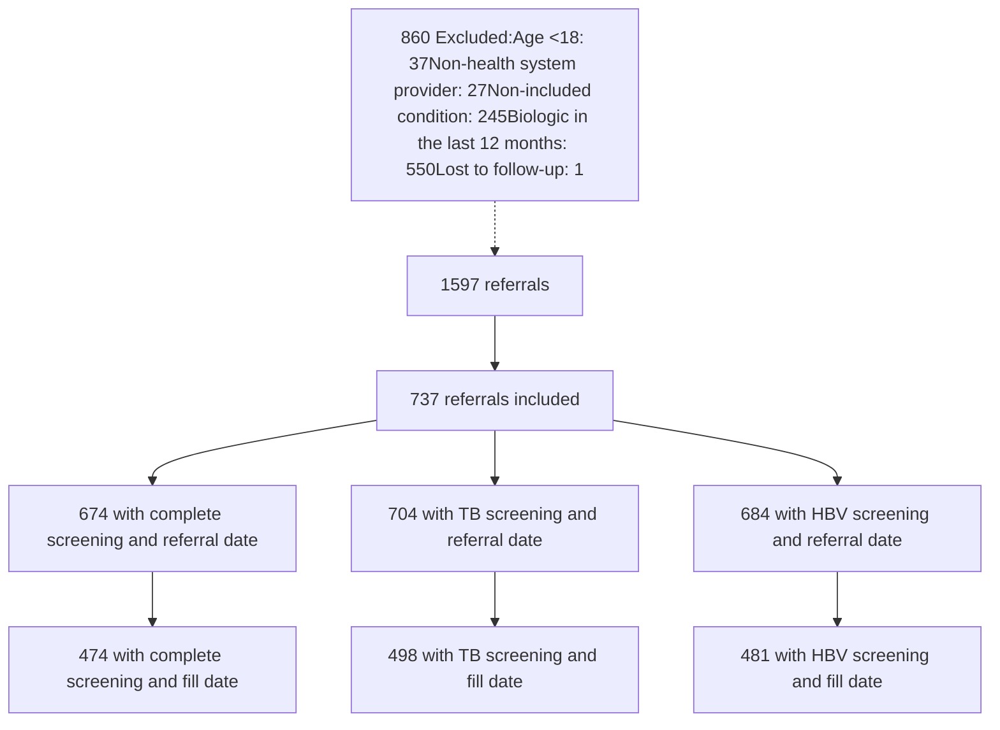

# Safety screening completion in patients initiating immune response mediator therapy for rheumatology, dermatology, and gastroenterology conditions: A multisite prospective analysis

Autumn D. Zuckerman, PharmD, BCPS, CSP1; Erica Godley, PharmD, CSP2; Karen C. Thomas, PharmD, PhD, MBA.3; Nicolas Gargurevich, MS4; Kimhouy Tong, PharmD, BCPS5

QR Code

\*Study completed under the Vanderbilt Health-System Specialty Pharmacy Research Consortium
1Vanderbilt Specialty Pharmacy, 2Novant Health Specialty Pharmacy, 3UIC Retzky College of Pharmacy, 4Vanderbilt University Medical Center, 5Yale New Haven Health Outpatient Pharmacy Services

# CONCLUSIONS
Most patients with a health-system specialty pharmacy referral are screened for TB and HBV prior to treatment.
Omitted safety screening is commonly driven by the prescribing provider.

## PURPOSE

Despite the recommendation that patients initiating immune response mediator therapies for chronic autoimmune conditions be screened for tuberculosis (TB) and hepatitis B virus (HBV) prior to initiation, previous studies have found low screening rates.

This analysis assessed TB and HBV screening completion rates at the time of immune response mediator initiation and reasons for incomplete screening in health-system specialty pharmacies.

## METHODS AND POPULATION

| Design       | • Multisite (12 sites), prospective, observational cohort                                                                                                                                                                                                                                                                                                                                      |
| ------------ | ---------------------------------------------------------------------------------------------------------------------------------------------------------------------------------------------------------------------------------------------------------------------------------------------------------------------------------------------------------------------------------------------- |
| Sample       | • Inclusion: Adult patients initiating a medication with risk for TB or HBV reactivation indicated for a rheumatology, dermatology, or gastroenterology condition between March 1 and May 31, 2023 • Exclusion: Biologic medication use within 1 year prior to index referral date, referral from a non-health system provider, lost to follow-up before screening or treatment initiation |
| Data sources | • Electronic health record was reviewed for screening documentation • Fill data from health system specialty pharmacy claims or electronic health record data • Data independently collected from each site and imported into shared data warehouse hosted at Vanderbilt University Medical Center                                                                                     |

## RESULTS

### Figure 2. Safety Screening by Screening Type

| Timeframe     | Complete (%) | TB (%) | HBV (%) |
| ------------- | ------------ | ------ | ------- |
| Ever          | 95           | 96     | 97      |
| 2 years + 60d | 82           | 89     | 86      |
| 1 year + 60d  | 75           | 84     | 80      |

\*Results presented for entire cohort (n=737)

| Complete screening | TB screening       | HBV screening      |
| ------------------ | ------------------ | ------------------ |
| Ever: 95%          | Ever: 96%          | Ever: 97%          |
| 2 years + 60d: 82% | 2 years + 60d: 89% | 2 years + 60d: 86% |
| 1 year + 60d: 75%  | 1 year + 60d: 84%  | 1 year + 60d: 80%  |

### Figure 3. TB Screening Timing

| Years relative to referral | Percent |
| -------------------------- | ------- |
| -2.0                       | 1       |
| -1.5                       | 1       |
| -1.0                       | 2       |
| -0.5                       | 5       |
| -0.25                      | 10      |
| 0.0                        | 58      |

Years TB screening took place relative to referral

\*Results for patients with referral and TB screening date available (n=704)

* In patients with referral date and screening result date available (n=704), 62% of patients screened within 30 days before or after referral and 79% screened within 6 months + 30 days after referral

* In patients with fill and result data available (n=498), median time from TB result to first fill was 20 days (IQR 6, 98)

### Figure 4. HBV Screening Timing

| Years relative to referral | Percent |
| -------------------------- | ------- |
| -2.0                       | 1       |
| -1.5                       | 1       |
| -1.0                       | 2       |
| -0.5                       | 5       |
| -0.25                      | 10      |
| 0.0                        | 55      |

\*Results for patients with referral and HBV screening date available (n=684)

* In patients with referral date and screening result data available (n=684), 56% of patients screened within 30 days before or after referral and 74% screened within 6 months + 30 days after referral

* In patients with fill and result data available (n=481), median time from HBV result to first fill was 27 days (IQR 8, 158)

### Figure 1. Attrition and Screening Outcomes

### Table 1. Patient Demographics

| Demographic            | N=737 n (%) |
| ---------------------- | ----------- |
| Age- mean (SD)         | 48 (16)     |
| Gender- Female         | 469 (64)    |
| Race                   |             |
| White                  | 492 (67)    |
| Black/African American | 95 (13)     |
| Clinical Area          |             |
| Dermatology            | 214 (29)    |
| Gastroenterology       | 114 (16)    |
| Rheumatology           | 409 (56)    |

### Figure 5. Safety Screening by Clinical Area

| Clinical Area    | Complete (%) | HBV (%) | TB (%) |
| ---------------- | ------------ | ------- | ------ |
| Rheumatology     | 73           | 78      | 82     |
| Gastroenterology | 67           | 75      | 79     |
| Dermatology      | 84           | 87      | 91     |
| All clinics      | 75           | 80      | 84     |

\*Results presented for entire cohort (n=737) with rates reported for screening within 1 year + 60 days of referral

| Complete Screening    | TB Screening          | HBV Screening         |
| --------------------- | --------------------- | --------------------- |
| Rheumatology: 73%     | Rheumatology: 82%     | Rheumatology: 78%     |
| Gastroenterology: 67% | Gastroenterology: 79% | Gastroenterology: 75% |
| Dermatology: 84%      | Dermatology: 91%      | Dermatology: 87%      |

### Table 2. Reasons not Screened by Clinical Area

| Reason not screened TB screening | Dermatology n (%) TB screening | Gastroenterology n (%) TB screening | Rheumatology n (%) TB screening | Overall n (%) TB screening |
| ------------------------------------ | ---------------------------------- | --------------------------------------- | ----------------------------------- | ------------------------------ |
| Provider driven                      | 1 (11)                             | 1 (33)                                  | 9 (53)                              | 11 (38)                        |
| Patient driven                       | 1 (11)                             | 0 (0)                                   | 3 (18)                              | 4 (14)                         |
| Lab error                            | 2 (22)                             | 0 (0)                                   | 0 (0)                               | 2 (7)                          |
| Noninitiation                        | 2 (22)                             | 0 (0)                                   | 0 (0)                               | 2 (7)                          |
| Unknown                              | 3 (33)                             | 2 (67)                                  | 5 (29)                              | 10 (34)                        |
| HBV screening                        |                                    |                                         |                                     |                                |
| Provider driven                      | 4 (33)                             | 7 (70)                                  | 13 (65)                             | 24 (57)                        |
| Patient driven                       | 3 (25)                             | 0 (0)                                   | 2 (10)                              | 5 (12)                         |
| Noninitiation                        | 2 (17)                             | 0 (0)                                   | 0 (0)                               | 2 (5)                          |
| Unknown                              | 3 (25)                             | 3 (30)                                  | 5 (25)                              | 11 (26)                        |

Reasons for lack of screening are presented for patients who never had any screening in the entire cohort (n=737)

### Acknowledgments

We would like to acknowledge all participating study sites: Northwell Health/Vivo Health Pharmacy, University of Kansas Health System, University of Rochester Medical Center, Dartmouth-Hitchcock Specialty Pharmacy, University of Kentucky Specialty Pharmacy, Froedtert Health Home Delivery and Specialty Pharmacy, University of Washington Specialty Pharmacy, Boston Medical Center

VANDERBILT UNIVERSITY MEDICAL CENTER logo

