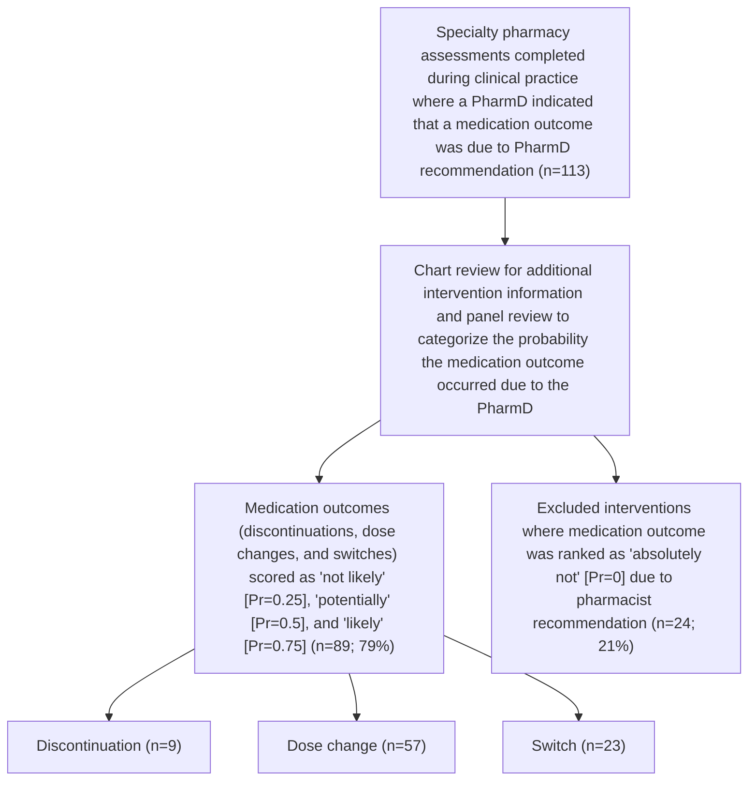

VANDERBILT Vanderbilt Health logo HEALTH | Specialty Pharmacy

# Pharmacist Involvement in Specialty Medication Discontinuations and Dose Changes

Kristin Perciavalle, PharmD1; Meredith Edelman, PharmD Candidate2; Autumn D. Zuckerman, PharmD, BCPS, CSP1, Josh DeClercq, MS3; Leena Choi, PhD3; Chelsea P. Renfro, PharmD1

1Vanderbilt Specialty Pharmacy, Vanderbilt Health; 2Vanderbilt Specialty Pharmacy Student Research Program; 3Department of Biostatistics, Vanderbilt University Medical Center QR Code

# HIGHLIGHTS
* Pharmacists avoided $129,705 - $162,133 in direct costs through interventions.
* Health system specialty pharmacy pharmacists intervene to support safe and effective specialty medication use and avoid unnecessary costs.
* These results can be used to rationalize the employment and support for pharmacists in the specialty pharmacy setting beyond filling prescriptions.

## Purpose

Data describing HSSP pharmacists' role and financial implications in intervening to discontinue or switch ineffective or unsafe treatments is needed. The purpose of this study is to evaluate the health-system specialty pharmacy (HSSP) pharmacists' involvement in specialty medication discontinuations, switches, and dose changes and the resulting cost avoidance.

## Study Design and Population

Single-center, retrospective cohort analysis of data collected from an electronic medical record and specialty pharmacy management system.

Patients were included if they had an intervention where the HSSP pharmacist indicated the discontinuation, dose change or switch resulted from the pharmacist's recommendation.

## Results

### Table 1. Patient Demographics (n=91)

| Characteristics                             | n (%)        |
| ------------------------------------------- | ------------ |
| Age (at time of intervention), median (IQR) | 53 (27 – 65) |
| **Gender**                                  |              |
| Female                                      | 55 (60)      |
| Male                                        | 36 (40)      |
| **Race, White**                             | 76 (84)      |
| **Pharmacy Insurance**                      |              |
| Medicare                                    | 38 (46)      |
| Commercial                                  | 23 (28)      |
| Medicaid                                    | 17 (21)      |
| **Clinic**                                  |              |
| Neurology                                   | 23 (25)      |
| Rheumatology                                | 27 (30)      |

### Figure 2. Costs Per Fill Avoided

Cost icon
**Total Monthly Estimated Costs Avoided**
$129,705 - $162,133

| Outcome         | Metric   | Cost Avoided (Approximate Median) |
| --------------- | -------- | --------------------------------- |
| Discontinuation | AWP      | $100                              |
| Discontinuation | AWP -20% | $80                               |
| Discontinuation | WAC      | $70                               |
| Dose change     | AWP      | $500                              |
| Dose change     | AWP -20% | $400                              |
| Dose change     | WAC      | $350                              |
| Switch          | AWP      | $1,000                            |
| Switch          | AWP -20% | $800                              |
| Switch          | WAC      | $700                              |

### Table 2. Total Cost Avoidance

| Cost Avoidance by Medicationa Medicationb | Cost Avoidance by Medicationa Cost Avoidance |
| --------------------------------------------- | ------------------------------------------------ |
| Emicizumab-kxwh                               | $73,187                                          |
| Ustekinumab                                   | $23,865                                          |
| Etanercept                                    | $19,033                                          |
| Adalimumab                                    | $17,653                                          |
| Secukinumab                                   | $10,386                                          |
| Cost Avoidance by Clinica                     |                                                  |
| Clinic                                        | Cost Avoidance                                   |
| Hematology                                    | $73,773                                          |
| Rheumatology                                  | $45,330                                          |
| Peds GI/IBD                                   | $15,910                                          |
| Dermatology                                   | $8,309                                           |
| Adult GI/IBD                                  | $7,980                                           |
| Total Monthly Estimated Cost Range            |                                                  |
| Discontinuations                              | $5,290 - $6,613                                  |
| Dose Changes                                  | $97,824 - $122,281                               |
| Switches                                      | $26,591 - $33,239                                |

aCost avoidance reported for one month AWP
bRepresents top 5 medications with cost avoidance

## Methods

### Icon Defining medication outcomes
**Discontinuation**: Medication stopped with no new specialty medication started within 30 days
**Switch**: Medication stopped and patient started a different specialty medication
**Dose change**: Medication stayed the same, but with a different dose

### Icon Scoring outcome probability
A 3-investigator panel categorized each intervention on the probability (Pr) that the medication outcome occurred due to the pharmacist:
from **absolutely not [Pr=0]** to **likely [Pr=0.75]**

### Icon Calculating cost avoidance
Medication costs calculated using:
* Wholesale acquisition cost (WAC)
* Average wholesale price (AWP)
* AWP minus 20%

**Cost avoidance calculation**:
1 fill of medication costs X the assigned Pr of the medication outcome

### Figure 1. Study Attrition

### Figure 3. Intervention Reasons

| Reason for Intervention      | Discontinuation | Dose change | Switch |
| ---------------------------- | --------------- | ----------- | ------ |
| Weight-based dose adjustment | 0               | 5           | 0      |
| Non-adherence                | 3               | 1           | 1      |
| Dose titration               | 0               | 5           | 0      |
| Other                        | 1               | 6           | 3      |
| Administration issues        | 0               | 12          | 0      |
| Side effects                 | 4               | 7           | 10     |
| Medication no longer working | 1               | 21          | 9      |

Medication outcomes that were at least somewhat likely due to the pharmacist intervention that resulted in cost avoidance are presented.

### Figure 4. Method of Pharmacist Identification of Intervention Need

| Method of identification        | Discontinuation | Dose change | Switch |
| ------------------------------- | --------------- | ----------- | ------ |
| Office visit                    | 5%              | 15%         | 10%    |
| MRQ (refill assessment)         | 60%             | 45%         | 50%    |
| Patient called in               | 10%             | 20%         | 25%    |
| Scheduled pharmacist evaluation | 20%             | 15%         | 10%    |
| Other                           | 5%              | 5%          | 5%     |

Other methods of identification: pharmacist contact to provide counseling (n=3); pharmacy technician notified pharmacist (n=3); messaging via electronic health record (n=1)

Abbreviations: HSSP = health system specialty pharmacy; PharmD = pharmacist; Pr = probability

