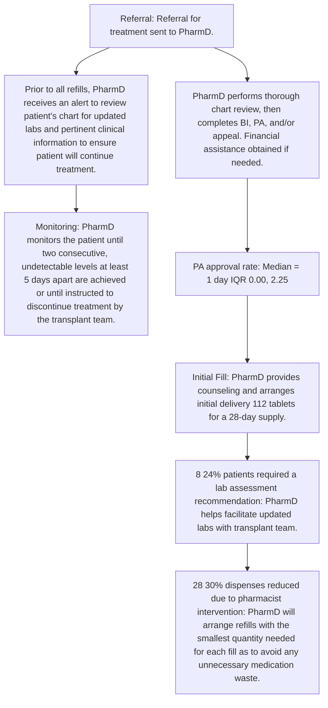
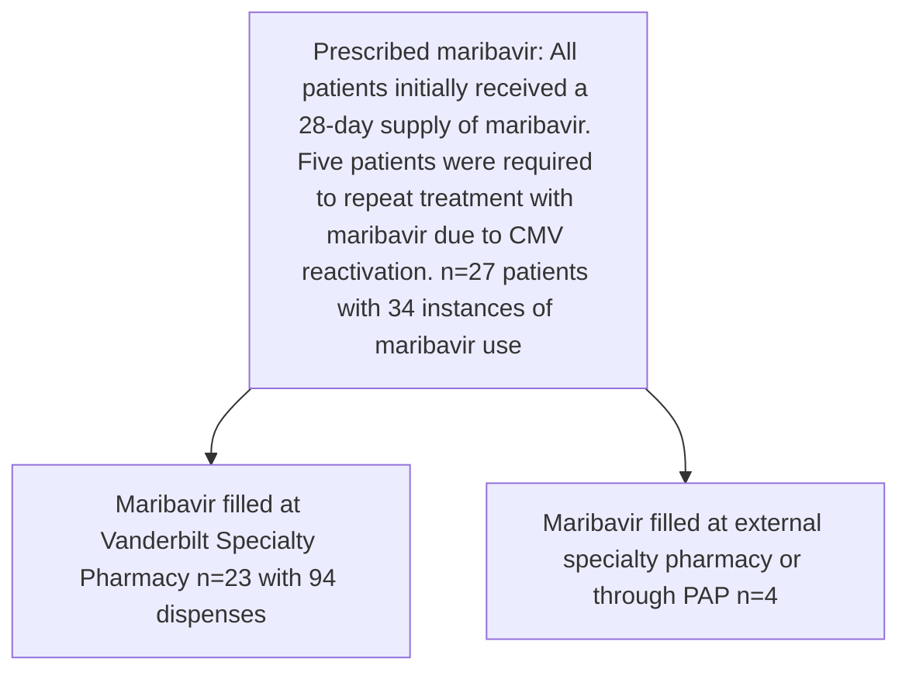

VANDERBILT Vanderbilt Health logo HEALTH | Specialty Pharmacy

# Optimizing Maribavir Management: The Role of Health System Specialty Pharmacies in Access, Monitoring, and Waste Reduction

# HIGHLIGHTS

* Pharmacists facilitated access to maribavir by obtaining timely insurance prior authorizations (median = 1 day) and intervened to reduce 28 (30%) fills across 94 dispenses to avoid waste.

* Maribavir quantity was reduced for 10 dispenses during the final treatment course, based on CMV levels and time until next lab appointment, which resulted in $119,517 - $149,396 in avoided costs.

Strong Oboh, PharmD Candidate1; Chelsea P. Renfro, PharmD2; Autumn D. Zuckerman, PharmD, BCPS, CSP2, Nicolas Gargurevich, MS3; Dustin R. Donald, PharmD, CSP2

1Vanderbilt Specialty Pharmacy Student Research Program; 2Vanderbilt Specialty Pharmacy, Vanderbilt Health; 3Department of Biostatistics, Vanderbilt University Medical Center QR Code

## Purpose

Maribavir, which treats cytomegalovirus (CMV) infection in post-transplant recipients who are refractory to first-line treatments, is a high cost, limited distribution medication, that requires frequent lab monitoring to assess for efficacy. This study evaluated the specialty pharmacist's role in medication access, treatment monitoring, and reducing maribavir waste.

## Study Design

Single-center, retrospective cohort analysis of data collected from an electronic medical record and specialty pharmacy management system.

Patients were included if they were prescribed maribavir from 4/1/2022 to 12/31/2023. Patients were followed from the time of maribavir initiation to four months after therapy discontinuation.

## Results

### Figure 2. Patient Demographics (n=27)

| Gender                                                       | Age                                                                                                                                               | Race                                 |
| ------------------------------------------------------------ | ------------------------------------------------------------------------------------------------------------------------------------------------- | ------------------------------------ |
| 33% Female (n=9) 67% Male (n=18)                         | Median 62 years IQR 52, 65                                                                                                                | 15% Black (n=4) 85% White (n=23) |
|                                                              |                                                                                                                                                   |                                      |
| Pharmacy Insurance                                           | Transplant Typea                                                                                                                                  |                                      |
| 52% Commercial (n=14) 44% Medicare (n=12)                | Heart icon 11% Heart (n=3) Lung icon 33% Lung (n=9) Kidney icon 37% Kidney (n=10) Liver icon 15% Liver (n=4) aMulti-organ n=1, 4% |                                      |
|                                                              |                                                                                                                                                   |                                      |
| CMV Status                                                   | Indication                                                                                                                                        |                                      |
| 100% \[x] Donor CMV Status 78% \[ ] Recipient CMV Status | Resistance to prior treatment 44% Indication icon 56% Refractory to prior treatment                                                               |                                      |

### Figure 3. Maribavir Access and Monitoring: Pharmacist’s Workflow

## Methods

### Patient Population
Patients who initiated maribavir for post-transplant CMV infection/disease that is refractory to treatment (with or without genotypic resistance) with ganciclovir, valganciclovir, cidofovir, or foscarnet

### Dollar icon Calculating Waste Avoided
Medication costs calculated using:
* Wholesale acquisition cost (WAC)
* Average wholesale price (AWP)
* AWP minus 20%

**Cost avoidance calculation:**
14-day supply of maribavir not dispensed due to PharmD intervention X AWP / AWP minus 20% / WAC

### Figure 4. Waste Avoidance Intervention

Pharmacist intervention to reduce quantity filled from 28-day supply to 14-day supply depending on CMV level and time until next lab appointment (n=28 dispenses)

* **CMV still detectable:** Pharmacist intervention **<u>does not</u>** lead to waste avoidance (n=18 dispenses)
* **CMV undetectable:** Pharmacist intervention **<u>leads</u>** to waste avoidance during final treatment course (n=10 dispenses)

### Figure 1. Study Attrition

### Figure 5. Cost Avoided

| Day Supply of Avoided Cost |
| -------------------------- |
| Calendar showing 14 days   |

|                       | AWP-20%     | WAC         | AWP         |
| --------------------- | ----------- | ----------- | ----------- |
| Total Cost Avoided    | $119,517.44 | $124,499.20 | $149,396.80 |
| Cost Avoided per Fill | $11,951.74  | $12,449.92  | $14,939.68  |

Abbreviations: CMV = cytomegalovirus; PAP = patient assistance program; PharmD = pharmacist; BI = benefits investigation; PA = prior authorization; IQR = interquartile range
Acknowledgements: Leena Choi, PhD

