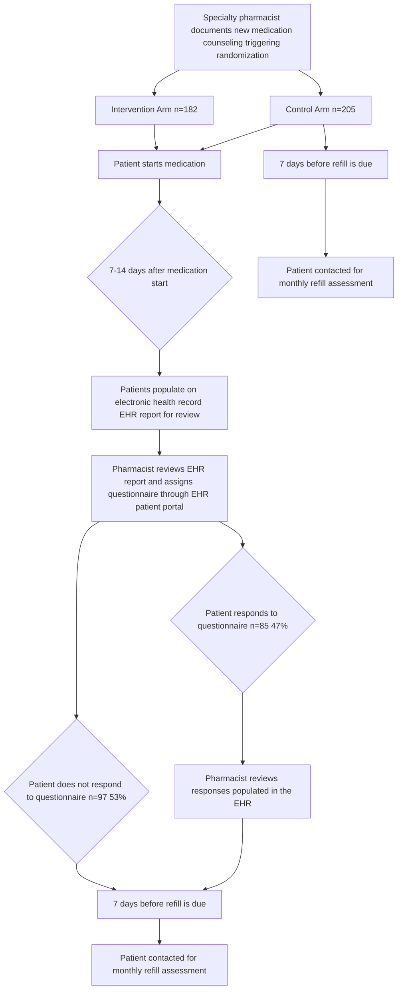

Vanderbilt Health logo VANDERBILT HEALTH | Specialty Pharmacy

# Implementation of oral anticancer early monitoring using electronic questionnaires

QR code

Brooke D. Looney, PharmD, CSP1 | Tiffany Bui, Pharm D2 | Josh DeClercq, MS3 | Kristen W. Whelchel, PharmD, CSP1 | Autumn D. Zuckerman, PharmD, BCPS, CSP1

1Vanderbilt Specialty Pharmacy, 2Northwestern, 3Vanderbilt University Medical Center

# CONCLUSIONS

* Patients who responded to the early monitoring questionnaire had a higher rate and faster time to pharmacists identifying and addressing adverse events from newly initiated oral anticancer therapy.

* Patients in the usual care arm were 2x more likely to have healthcare utilization than intervention patients.

* Increasing response rate to the electronic early monitoring questionnaire is needed to optimize its impact on outcomes.

**PURPOSE** Evaluate the effectiveness of implementing early oral anticancer medication monitoring questionnaires sent through an electronic patient portal at identifying adverse effects that require pharmacist intervention.

# RESULTS

## METHODS

<u>**Study Design**</u>
icon
Single-center, randomized, pragmatic, cohort study. 1:1 stratified randomization based on age and sex

<u>**Study Setting**</u>
icon
Vanderbilt Ingram Cancer Center, Integrated Health System Specialty Pharmacy

<u>**Study Sample**</u>
Adults with an active patient portal filling new oral anticancer medications at Vanderbilt Specialty Pharmacy at least once between August 15, 2023 and February 29, 2024

> **Aim 1**
> To evaluate differences in **timing and frequency of adverse effect identification** resulting in a pharmacist intervention during the first 45 days of treatment between intervention and usual care (control).

> **Aim 2**
> To evaluate the difference in **medication changes and clinical outcomes at 90 days** after initial medication dispense between intervention and usual care (control).

\*Electronic questionnaire implementation evaluation and results were previously presented at SERC 2024 and published in AJHP (see QR code)

## Figure 2. AE-Related Intervention Within 45 Days

| Group 1                   | Group 2                     | Analysis Type                                     | Result                                                                               |
| ------------------------- | --------------------------- | ------------------------------------------------- | ------------------------------------------------------------------------------------ |
| Intervention (n=182): 23% | Usual Care (n=205): 19%     | Primary analysis: Intervention vs. usual care     | Number of pharmacist interventions was not significantly different (OR 1.2, p=0.394) |
| Responders (n=85): 38%    | Non-Responders (n=302): 16% | Secondary analysis: Responders vs. Non-responders | Number of pharmacist interventions was significantly different (OR 2.8, p<0.001)     |

[blue square] Pharmacist Intervention
[grey square] No Pharmacist Intervention

Responders: intervention patients who completed the questionnaire
Non-Responders: intervention patients who did not complete the questionnaire + control patients

## Figure 3. Types and Outcomes of Interventions within 45 Days

| Category                              | Intervention (%) | Usual Care (%) |
| ------------------------------------- | ---------------- | -------------- |
| Category for alert                    |                  |                |
| Adverse event                         | 28               | 22             |
| Adherence                             | 4                | 3              |
| Medication reconciliation/interaction | 3                | 2              |
| Healthcare use                        | 2                | 1              |
| Administration issue                  | 1                | 1              |
| Care Coordination                     | 1                | 1              |
| Action                                |                  |                |
| Patient counseling provided           | 22               | 18             |
| Patient chart reviewed                | 18               | 15             |
| Prescriber contacted                  | 12               | 10             |
| Medication reconciliation             | 3                | 2              |
| Referred to care                      | 2                | 1              |
| Financial counseling provided         | 1                | 1              |
| Education provided                    | 1                | 1              |
| Intervention outcome                  |                  |                |
| Issue resolved                        | 18               | 15             |
| Adjunct therapy started               | 5                | 4              |
| Medication held                       | 4                | 3              |
| Care scheduled                        | 3                | 2              |
| Dose adjusted                         | 2                | 1              |

Patients could have multiple interventions. Within a single intervention, patients could have multiple categories of alert, actions, and intervention outcomes.

## Figure 1. Study Procedures and Attrition

## Table 1. Demographics

| Characteristic             | Intervention n=182 | Usual care n=205 |
| -------------------------- | ------------------ | ---------------- |
| Sex: Male, n (%)           | 111 (61)           | 116 (57)         |
| Age group: >= 60, n (%)    | 123 (68)           | 144 (70)         |
| CCI\*, Median (IQR)        | 7 (5 - 9)          | 8 (5 - 9)        |
| Drug class category, n (%) |                    |                  |
| Anti-androgens/HRAs\*      | 70 (38)            | 59 (29)          |
| Anti-neoplastic agents     | 112 (62)           | 146 (71)         |
| Diagnosis category, n (%)  |                    |                  |
| Breast                     | 32 (18)            | 30 (15)          |
| Central nervous system     | 24 (13)            | 20 (10)          |
| GI                         | 18 (10)            | 40 (20)          |
| GU                         | 83 (46)            | 81 (40)          |
| Other\*\*                  | 25 (14)            | 34 (17)          |
| Cancer stage, n (%)        |                    |                  |
| Stage I or II              | 36 (20)            | 30 (15)          |
| Stage III                  | 36 (20)            | 30 (15)          |
| Stage IV                   | 107 (59)           | 142 (69)         |
| Staging not available      | 3 (2)              | 3 (1)            |

\*Abbreviations: CCI (Charlson Comorbidity Index), IQR: interquartile range, HRAs (hormone receptor antagonists), GI: gastrointestinal, GU: genitourinary
\*\* Other: Gynecologic, Head/neck, Lung, Melanoma/sarcoma

## Figure 4. Time to Pharmacist Interventions

### Intervention vs. Usual Care

| Time (days) | Intervention (n at risk) | Usual Care (n at risk) |
| ----------- | ------------------------ | ---------------------- |
| 0           | 182                      | 205                    |
| 10          | 176                      | 200                    |
| 20          | 161                      | 198                    |
| 30          | 144                      | 173                    |
| 40          | 142                      | 169                    |

No significant difference between groups. Time to first AE-related intervention (HR 1.2, p=0.347)

### Responders vs. Non-Responders

| Time (days) | Responders (n at risk) | Non-Responders (n at risk) |
| ----------- | ---------------------- | -------------------------- |
| 0           | 85                     | 205                        |
| 10          | 80                     | 200                        |
| 20          | 65                     | 198                        |
| 30          | 55                     | 173                        |
| 40          | 54                     | 169                        |

Significant difference between groups. Faster time to first AE-related intervention for responders (HR 2.5, p<0.001)

Responders: intervention patients who completed the questionnaire, Non-Responders: intervention patients who did not complete the questionnaire + control patients

## Figure 5. 90-day Outcomes

| Outcome                           | Intervention (%) | Usual Care (%) |
| --------------------------------- | ---------------- | -------------- |
| Dose modification (p=0.123)       |                  |                |
| 1 instance                        | 7                | 11             |
| 1 instance                        | 2                | 4              |
| Healthcare utilization (p=0.005)  |                  |                |
| 1 instance                        | 7                | 17             |
| 1 instance                        | 4                | 10             |
| Treatment modifications (p=0.766) |                  |                |
| 1 instance                        | 4                | 5              |
| 1 instance                        | 7                | 3              |

Patients in the usual care arm were 2x more likely to have healthcare utilization >1 instance than intervention patients.

icon 3 \*Pharmacist interventions are provided based on patient need and could occur during an assessment or by contacting the pharmacy directly

Acknowledgments and Disclosures: funded by a grant from ASHP Foundation

