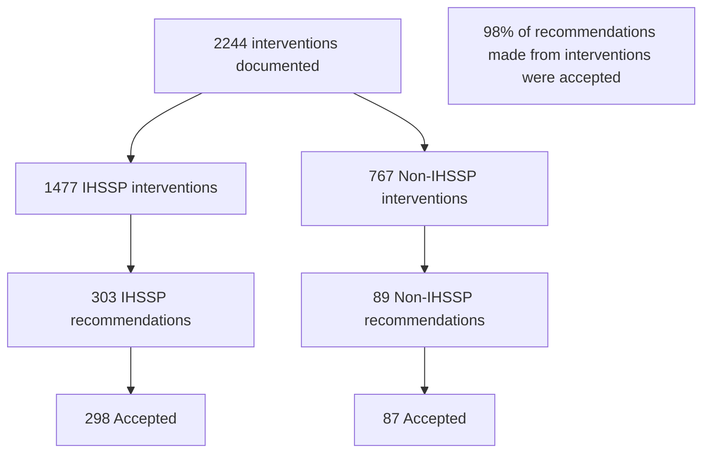

# Neurology Specialty Pharmacist Interventions for Integrated Health System Specialty Pharmacy vs. Non-Integrated Health System Pharmacy Patients
Vanderbilt University Medical Center logo

Morteza Kaveh, PharmD Candidate1; Katie Cruchelow, PhD2; Sabrina Livezey, PharmD, CSP2; Ryan Moore, MS3; Kayla Johnson, PharmD, BCPS, BCPP2

1The University of Tennessee Health Science Center College of Pharmacy, Nashville, TN
2Vanderbilt Specialty Pharmacy, Vanderbilt Health System, Nashville, TN
3Department of Biostatistics, Vanderbilt University Medical Center, Nashville, TN

QR Code

# CONCLUSIONS

* Non-IHSSP patients needed more financial assistance and prescription transfers
* Non-IHSSP interventions required more pharmacists’ time
* Almost all intervention recommendations were accepted by providers

# PURPOSE

Specialty pharmacists guide treatment selection and manage medications for patients with non-MS neurologic conditions, even when patients fill prescriptions at external pharmacies due to payer restrictions or personal choice.

Research is needed to understand the services pharmacists at integrated health system specialty pharmacies (IHSSP) provide for these patients and the impact on their workload.

# RESULTS

# METHODS

## Table 1. Baseline Patient Demographics

| Study Design                                                                                                                                                                     | Objective                                                                                                                              | Sample                                                                                                                                                         | Outcomes                                                                                                                                                                                                                                                                                                                                                         |
| -------------------------------------------------------------------------------------------------------------------------------------------------------------------------------- | -------------------------------------------------------------------------------------------------------------------------------------- | -------------------------------------------------------------------------------------------------------------------------------------------------------------- | ---------------------------------------------------------------------------------------------------------------------------------------------------------------------------------------------------------------------------------------------------------------------------------------------------------------------------------------------------------------- |
| Single-center retrospective study  January 1, 2023, to March 31, 2023  Interventions extracted from the electronic health record and specialty pharmacy software | Evaluate differences in interventions performed by a specialty pharmacist for patients filling at an IHSSP versus non-IHSSP pharmacies | All patients prescribed a specialty medication from non-MS neurology clinics at Vanderbilt University Medical Center with at least one pharmacist intervention | Compare the number, type, impact score, and time spent on interventions for patients filling at an IHSSP compared to those filling at non-IHSSP pharmacies  Evaluate number of interventions performed and recommendations made and accepted \*\*Recommendation\*\* = provider contacted regarding potential therapy change or additional monitoring |

|                    | Non-IHSSPn = 230n (%) | IHSSPn = 511n (%) |
| ------------------ | --------------------- | ----------------- |
| Age, Median \[IQR] | 58 \[25-71]           | 61 \[20-73]       |
| Sex                |                       |                   |
| Female             | 100 (44)              | 234 (46)          |
| Male               | 130 (57)              | 276 (54)          |
| Race               |                       |                   |
| White              | 181 (82)              | 418 (84)          |
| African American   | 19 (9)                | 51 (10)           |
| Primary Insurance  |                       |                   |
| Commercial         | 120 (52)              | 111 (22)          |
| Government/Other   | 110 (48)              | 400 (78)          |

IQR = Interquartile Range

## Figure 2. Type of Pharmacist Interventions

| Intervention Type             | IHSSP (n = 1477) (%) | Non-IHSSP (n = 767) (%) |
| ----------------------------- | -------------------- | ----------------------- |
| Therapy Change                | 34                   | 31                      |
| Safety Monitoring             | 7                    | 2                       |
| Financial Assistance Referral | 14                   | 24                      |
| Appointment Made              | 8                    | 3                       |
| Patient Counseling            | 10                   | 5                       |
| Transferred Prescriptions     | 3                    | 8                       |

\* IHSSP patients had more clinical interventions such as safety monitoring, counseling, and making appointments
\* Non-IHSSP patients required more financial assistance interventions and work to transfer prescriptions

## Figure 1. Interventions performed

## Figure 3. Intervention Impact Scores

| Impact Level                                     | IHSSP (n = 1477) (%) | Non-IHSSP (n = 767) (%) |
| ------------------------------------------------ | -------------------- | ----------------------- |
| Level 1: Review only, no intervention            | 26                   | 18                      |
| Level 2: Quality of life impact, intervention    | 73                   | 81                      |
| Level 3: Negative impact of health, intervention | 2                    | 1                       |

Most interventions were noted to likely impact patients’ quality of life. IHSSP pharmacists perform interventions that have an impact on patients regardless of where they fill their neurology specialty medication. 98% of recommendations made from interventions were accepted.

Impact scores are assigned by the pharmacist performing the intervention at the time of the intervention. Level 4 Impact Score was never required.

## Figure 4. Regression Analysis on Intervention Time

| Variable                                                       | Odds Ratio for Greater Intervention Time |
| -------------------------------------------------------------- | ---------------------------------------- |
| Age (Years)                                                    | 1.0                                      |
| \*\*VSP Patient (Reference: No)\*\*                            |                                          |
| Yes                                                            | < 1.0                                    |
| \*\*Intervention Type (Reference: Pharmacist Intervention)\*\* |                                          |
| Quick Action                                                   | < 1.0                                    |
| \*\*Insurance (Reference: Commercial)\*\*                      |                                          |
| Medicaid                                                       | > 1.0                                    |
| Medicare                                                       | > 1.0                                    |
| None                                                           | > 1.0                                    |
| Tricare or Other                                               | > 1.0                                    |
| \*\*Clinic (Reference: Movement Disorders)\*\*                 |                                          |
| Amyloidosis                                                    | > 1.0                                    |
| Autonomics                                                     | > 1.0                                    |
| Epilepsy                                                       | > 1.0                                    |
| Inpatient                                                      | > 1.0                                    |
| Neuromuscular                                                  | > 1.0                                    |
| Other                                                          | > 1.0                                    |

Clock icon **IHSSP patients had shorter intervention times** Check icon
* IHSSP: median 8 minutes, IQR 5–15
* Non-IHSSP patients: median 10 minutes, IQR 5–15
* p<0.001

Nothing to Disclose

