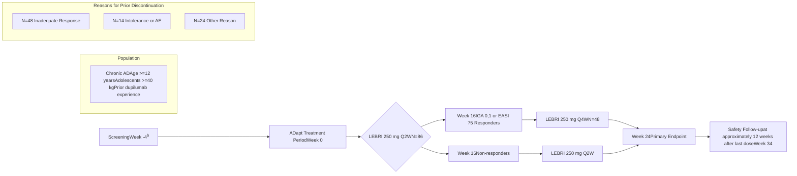

OPR54-EN

# Lebrikizumab Improves Atopic Dermatitis and Quality of Life in Patients With Moderate-to-Severe Atopic Dermatitis Previously Treated With Dupilumab: Results From the ADapt Trial

Jonathan Silverberg1, Lindsay Ackerman2, Jerry Bagel3, Linda Stein Gold4, Andrew Blauvelt5, David Rosmarin6, Raj Chovatiya7, Matthew Zirwas8, Gil Yosipovitch9, Jill Waibel10, Jenny E. Murase11, Ben Lockshin12, Jamie Weisman13, Amber Reck Atwater14, Jennifer Proper14, Maria Silk14, Evangeline Pierce14, Maria Lucia Buziqui Piruzeli14, Sonia Montmayeur14, Christopher Schuster14, Jinglin Zhong15, Maria Jose Rueda14, Sreekumar Pillai14, Eric Simpson16, Dhara Shukla (Non-author Presenter)14

1George Washington University School of Medicine and Health Sciences, Washington, DC, USA, 2U.S. Dermatology Partners, Phoenix, USA, 3Psoriasis Treatment Center of Central New Jersey, East Windsor, USA, 4Henry Ford Hospital, Detroit, USA, 5Blauvelt Consulting, LLC, Portland, USA, 6Indiana University School of Medicine, Indianapolis, USA, 7Chicago Medical School, Rosalind Franklin University of Medicine and Science, North Chicago, USA, and Center for Medical Dermatology + Immunology Research, Chicago, USA, 8Dermatologists of the Central States, Probity Medical Research, and Ohio University, Bexley, USA, 9University of Miami Miller School of Medicine, Miami, USA, 10Miami Dermatology and Laser Institute, Miami, USA, 11University of California, San Francisco, San Francisco, USA, and Palo Alto Foundation Medical Group, Mountain View, USA, 12DermAssociates, Silver Spring, USA, 13Medical Dermatology Specialists, Atlanta, USA, 14Eli Lilly and Company, Indianapolis, USA, 15IQVIA, Durham, USA, 16Oregon Health & Science University, Portland, USA

**Sponsored by Eli Lilly and Company**

## OBJECTIVES

* In real-world settings, approximately 18-20% of patients with moderate-to-severe AD discontinue dupilumab within 3-4 years of treatment, and the primary reasons are loss of efficacy (26-40%), AEs (20%), and cost issues and insurance coverage (18%)1,2

* The open-label, Phase 3b, 24-week ADapt trial (NCT05369403) aims to assess the efficacy and safety of lebrikizumab in patients previously exposed to dupilumab

  - Other clinical questions include:

    • How are patients with inadequate response to dupilumab likely to respond to lebrikizumab?

    • Are patients who stopped dupilumab because of an AE likely to experience the same AE with lebrikizumab?

* This analysis reports the efficacy and safety of lebrikizumab following 24 weeks of treatment in patients with moderate-to-severe AD previously treated with dupilumab in the ADapt trial

## CONCLUSIONS

* Lebrikizumab provides meaningful improvements in skin (including face and hand) clearance, itch, and QoL in patients with moderate-to-severe AD who were previously treated with dupilumab

* The ADapt safety profile is consistent with other lebrikizumab phase 3 trials3-6

## How Efficacious Is Lebrikizumab in Patients Previously Exposed to Dupilumab?

### EASI 75

| Weeks | LEBRI Induction (%) | LEBRI Maintenance (pooled Q2W and Q4W arms) (%) |
| ----- | ------------------- | ----------------------------------------------- |
| 0     | 0                   | 0                                               |
| 2     | 11                  |                                                 |
| 4     | 24                  |                                                 |
| 8     | 37                  |                                                 |
| 16    | 51                  | 57                                              |
| 24    | 53                  | 60                                              |

These results are similar to Phase 3 monotherapy trials of lebrikizumab in patients with moderate-to-severe AD without prior dupilumab exposure:
* The EASI 75 response rate at Week 16 using pooled ADvocate 1 & 2 data was 55.4%4,b

aAs observed; bIn ADvocate 1 and ADvocate 2, patients who discontinued treatment due to loss of efficacy or initiated protocol-defined rescue therapy were imputed as non-responders in the NRI/MI analysis.

Notes: NRI/MI analyses are based on all N=86 patients at each timepoint and were performed for Week 0 to Week 24 after pooling together the LEBRI 250 mg Q2W and Q4W arms. Patients who discontinued treatment due to lack of efficacy were imputed as non-responders; all other missing data were imputed using MI.

### F-IGA (0,1) With ≥2-Point Improvementa

| Weeks | LEBRI Induction (%) | LEBRI Maintenance (pooled Q2W and Q4W arms) (%) |
| ----- | ------------------- | ----------------------------------------------- |
| 0     | 0                   | 0                                               |
| 2     | 10                  |                                                 |
| 4     | 21                  |                                                 |
| 8     | 34                  |                                                 |
| 16    | 50                  | 54                                              |
| 24    | 47                  | 52                                              |

aITT population with baseline F-IGA ≥2; bAs observed.
Notes: NRI/MI analyses are based on all N=69 patients at each timepoint and were performed for Week 0 to Week 24 after pooling together the LEBRI 250 mg Q2W and Q4W arms. Patients who discontinued treatment due to lack of efficacy were imputed as non-responders; all other missing data were imputed using MI.

## How Are Patients With Inadequate Response to Dupilumab Likely to Respond to Lebrikizumab?

### Achievement of EASI 75 at Week 16 by Reason for Prior Dupilumab Discontinuation

| Reason for Prior Dupilumab Discontinuation | Achievement of EASI 75 at Week 16 (%) |
| ------------------------------------------ | ------------------------------------- |
| Inadequate Response\*                      | 45.7 (16/35)                          |
| Intolerance or AE                          | 80.0 (8/10)                           |
| Other Reason                               | 68.8 (11/16)                          |

\*Dupilumab inadequate response subgroup (n/Nx): 2/3 had no response to dupilumab; 7/21 had partial response to dupilumab; and 7/11 lost response to dupilumab

Notes: 61 patients had observed data at Week 0 and Week 16 and were included in this subgroup analysis. Data inside the bars are n/Nx. Reasons for dupilumab discontinuation were patient-reported. The inadequate response group consists of patients who discontinued dupilumab due to no response to treatment, defined as having a peak response for skin and itch that did not improve at all and/or improved less than 25%; partial response to treatment, defined as having a peak response for skin and itch that only improved partially and/or improved between 25% and 50%; or lost response to treatment, defined as "initially responded but lost response to dupilumab" with respect to skin and/or itch. Other reasons included being unable to afford treatment, health insurance changes, and previous open-label clinical trial participation that completed with no discontinuation for AEs. Due to the small sample size of all subgroups, no conclusions can be drawn from these analyses.

## In a Patient Who Discontinued Dupilumab Due to Loss of Response, Lebrikizumab Shows Improvement in Facial Atopic Dermatitis

| Baseline                          | Week 4                          | Week 16                          | Week 24                          |
| --------------------------------- | ------------------------------- | -------------------------------- | -------------------------------- |
| Patient face at baseline, F-IGA 4 | Patient face at week 4, F-IGA 3 | Patient face at week 16, F-IGA 3 | Patient face at week 24, F-IGA 2 |
| F-IGA 4                           | 3                               | 3                                | 2                                |

©2024 Eli Lilly and Company. All rights reserved.

## Lebrikizumab Improved Hand Dermatitis Through Week 24

* In dupilumab-experienced patients with moderate-to-severe hand dermatitis at baseline (N=41), defined by mTLSS ≥12, mTLSS decreased by an average of 69% (as observed; NRI/MI, 64%) at Week 16 and by 75% (as observed; NRI/MI, 68%) at Week 24

Notes: NRI/MI analyses are based on all N=41 patients at each timepoint and were performed for Week 0 to Week 24 after pooling together the LEBRI 250 mg Q2W and Q4W arms. Patients who discontinued treatment due to lack of efficacy were imputed as non-responders; all other missing data were imputed using MI.

## Study Design

aPatients received LD of 500 mg given SC at Week 0 and Week 2; bScreening window was up to 30 days.
Notes: The use of low- and/or mid-potency TCS, TCIs, topical PDE-4 inhibitors, or high-potency TCS up to 10 days was permitted. Patients requiring rescue therapy (high-potency TCS >10 days, topical JAK inhibitors, phototherapy, systemic medication) were discontinued from the study.

## Results

## Lebrikizumab Improved QoL and Symptoms of Itch Through Week 24

* Of dupilumab-experienced patients with baseline DLQI ≥4 (N=77), 83% (as observed) achieved ≥4-point improvement in DLQI from baseline at Weeks 16 and 24 (NRI/MI, 81% and 80%, respectively)

* Of dupilumab-experienced patients with baseline Pruritus NRS ≥4 (N=62), 53% and 62% (as observed) achieved ≥4-point improvement in Pruritus NRS from baseline at Week 16 and 24 (NRI/MI, 49% and 48%), respectively

Notes: NRI/MI analyses are based on all N=77 or N=62 patients at each timepoint and were performed for Week 0 to Week 24 after pooling together the LEBRI 250 mg Q2W and Q4W arms. Patients who discontinued treatment due to lack of efficacy were imputed as non-responders; all other missing data were imputed using MI.

## Baseline Demographics and Disease Characteristics AEsa Through Week 24

| Characteristic                              | All LEBRI (N=86) | Reason for Dupilumab Discontinuationᵃ Inadequate Response (N=48) | Reason for Dupilumab Discontinuationᵃ Intolerance or AE (N=14) | Reason for Dupilumab Discontinuationᵃ Other Reason (N=24) |
| ------------------------------------------- | ---------------- | -------------------------------------------------------------------- | ------------------------------------------------------------------ | ------------------------------------------------------------- |
| Age, years                                  | 46.4 (20.0)      | 43.0 (20.8)                                                          | 53.1 (15.8)                                                        | 49.1 (20.0)                                                   |
| Adult (≥18 years), n (%)                    | 77 (89.5)        | 40 (83.3)                                                            | 14 (100.0)                                                         | 23 (95.8)                                                     |
| Adolescent (≥12 to <18 years), n (%)        | 9 (10.5)         | 8 (16.7)                                                             | 0                                                                  | 1 (4.2)                                                       |
| Female, n (%)                               | 41 (47.7)        | 21 (43.8)                                                            | 7 (50.0)                                                           | 13 (54.2)                                                     |
| BMI, kg/m²                                  | 27.9 (6.0)       | 27.2 (5.5)                                                           | 29.3 (6.7)                                                         | 28.7 (6.7)                                                    |
| Age at AD onset, years                      | 26.6 (25.9)      | 22.3 (25.2)                                                          | 27.4 (25.4)                                                        | 34.7 (26.6)                                                   |
| Duration since AD onset, years              | 20.2 (19.9)      | 21.1 (20.8)                                                          | 26.2 (21.6)                                                        | 14.8 (16.2)                                                   |
| IGA, n (%)                                  |                  |                                                                      |                                                                    |                                                               |
| 3 (Moderate)                                | 65 (75.6)        | 33 (68.8)                                                            | 13 (92.9)                                                          | 19 (79.2)                                                     |
| 4 (Severe)                                  | 21 (24.4)        | 15 (31.3)                                                            | 1 (7.1)                                                            | 5 (20.8)                                                      |
| F-IGA, n (%)                                |                  |                                                                      |                                                                    |                                                               |
| 2 (Mild)                                    | 21 (24.4)        | 15 (31.3)                                                            | 2 (14.3)                                                           | 4 (16.7)                                                      |
| 3 (Moderate)                                | 40 (46.5)        | 25 (52.1)                                                            | 6 (42.9)                                                           | 9 (37.5)                                                      |
| 4 (Severe)                                  | 8 (9.3)          | 3 (6.3)                                                              | 3 (21.4)                                                           | 2 (8.3)                                                       |
| Pruritus NRS                                | 6.6 (2.4)        | 6.5 (2.5)                                                            | 7.0 (2.4)                                                          | 6.6 (2.2)                                                     |
| ≥4, n (%)                                   | 62 (87.3)        | 32 (84.2)                                                            | 11 (91.7)                                                          | 19 (90.5)                                                     |
| EASI                                        | 24.1 (10.7)      | 25.8 (12.2)                                                          | 20.2 (4.3)                                                         | 22.8 (9.6)                                                    |
| BSA % affected                              | 32.2 (18.5)      | 35.3 (19.9)                                                          | 24.8 (11.5)                                                        | 30.3 (17.7)                                                   |
| DLQIᵇ                                       | 14.4 (7.0)       | 15.1 (6.9)                                                           | 15.4 (7.2)                                                         | 12.7 (6.8)                                                    |
| mTLSSᶜ                                      | 10.0 (5.0)       | 10.4 (5.0)                                                           | 9.0 (4.4)                                                          | 9.8 (5.3)                                                     |
| Number of prior systemic treatments,ᵈ n (%) |                  |                                                                      |                                                                    |                                                               |
| 1                                           | 50 (58.1)        | 27 (56.2)                                                            | 6 (42.9)                                                           | 17 (70.8)                                                     |
| 2                                           | 22 (25.6)        | 13 (27.1)                                                            | 4 (28.6)                                                           | 5 (10.8)                                                      |
| ≥3                                          | 14 (16.3)        | 8 (16.7)                                                             | 4 (28.6)                                                           | 2 (8.3)                                                       |

| AE Category/Event                        | Pooled LEBRI 250 mg Q2W and Q4W (N=86) |
| ---------------------------------------- | -------------------------------------- |
| TEAEᵇ                                    | 46 (53.5)                              |
| Mild                                     | 26 (30.2)                              |
| Moderate                                 | 17 (19.8)                              |
| Severe                                   | 3 (3.5)                                |
| SAE                                      | 2 (2.3)                                |
| Death                                    | 0                                      |
| AE leading to treatment discontinuationᶜ | 5 (5.8)                                |
| TEAE within special safety topics        |                                        |
| Infections                               | 19 (22.1)                              |
| Skin infections                          | 1 (1.2)                                |
| Potential hypersensitivityᵈ              | 5 (5.8)                                |
| Dermatitis atopic                        | 4 (4.7)                                |
| Urticaria                                | 1 (1.2)                                |
| Injection site reactionsᵉ                | 4 (4.7)                                |
| Conjunctivitis clusterᶠ                  | 3 (3.5)                                |
| Malignancies                             | 1 (1.2)                                |
| NMSC                                     | 1 (1.2)                                |
| Malignancies excluding NMSC              | 0                                      |
| AD exacerbation                          | 7 (8.1)                                |
| Hepatic events                           | 1 (1.2)                                |
| Alanine aminotransferase increased       | 1 (1.2)                                |
| Aspartate aminotransferase increased     | 1 (1.2)                                |

* 3 participants reported TEAEs of conjunctivitis, which were mild or moderate and did not lead to discontinuation

aReasons for dupilumab discontinuation were patient-reported. The dupilumab inadequate response subgroup consists of patients who discontinued dupilumab due to no response to treatment, defined as having a peak response for skin and itch that did not improve at all and/or improved less than 25%; partial response to treatment, defined as having a peak response for skin and itch that only improved partially and/or improved between 25% and 50%; or lost response to treatment, defined as "initially responded but lost response to dupilumab" with respect to skin and/or itch. Other reasons included being unable to afford treatment, health insurance changes, previous open-label clinical trial participation that completed with no discontinuation for adverse events; bPatients <16 years of age at baseline completed the cDLQI and continued to complete the cDLQI for the duration of the study; c41 patients in the all lebrikizumab cohort had mTLSS ≥12, and the mean (SD) score among these patients was 14.0 (2.0); d1=dupilumab only, 2=dupilumab and 1 other prior systemic treatment, 3=dupilumab and ≥2 other prior systemic treatments.

Notes: Data are mean (SD) unless stated otherwise. Number of patients with non-missing data was used as the denominator.

aAssessed in patients who received ≥1 dose of LEBRI; bPatients with multiple events with different severity were counted under the highest severity; cDetermined to be due to dermatitis atopic, drug eruption, immune-mediated dermatitis, rash morbilliform, and headache (n=1 each); dEvents that occurred on the day of drug administration identified using a narrow algorithm search; eInjection site reactions are defined using MedDRA high-level term of injection site reactions excluding joint-related Preferred Terms; fDefined using the following MedDRA Preferred Terms: conjunctivitis, conjunctivitis allergic, conjunctivitis bacterial, conjunctivitis viral, and giant papillary conjunctivitis. Note: Data are n (%).

## Are Patients Who Stopped Dupilumab Because of an AE Likely to Experience the Same AE With Lebrikizumab?

### Primary Intolerance or AE Leading to Prior Dupilumab Discontinuation N=14

| Reason                                                       | Count (n) |
| ------------------------------------------------------------ | --------- |
| Not reported                                                 | 1         |
| New onset/worsening of facial dermatitis                     | 2         |
| New onset/worsening of inflammatory arthritis                | 1         |
| New onset/worsening of ocular surface disease/conjunctivitis | 4         |
| Eyes were burning and itching                                | 1         |
| Eye irritation                                               | 1         |
| Otherᵃ                                                       | 3         |
| New onset/worsening of inflammatory arthritis                | 1         |

aOther includes increased itching; weight gain and worsening of itch; hives, rash, pruritus, and swelling (n=1 each).

### In the ADapt Trial

* Of the 10 patients who reported eye-related events, facial dermatitis, or inflammatory arthritis as the reason for prior dupilumab discontinuation, none reported similar events with lebrikizumab

* Of the 14 patients with prior dupilumab discontinuation due to AEs

  - 2 discontinued treatment with lebrikizumab due to an AE:

    • Dermatitis atopic, n=1

    • Immune-mediated rash, n=1

References: 1. Kimball AB, et al. Dermatol Ther (Heidelb). 2023;13:2107-2120. 2. Kang DH, et al. J Dermatol. 2024;51:e63-e65. 3. Silverberg JI, et al. N Engl J Med. 2023;388:1080-1091. 4. Blauvelt A, et al. Br J Dermatol. 2023;188:740-748. 5. Paller AS, et al. Dermatol Ther (Heidelb). 2023;13:1517-1534. 6. Simpson EL, et al. JAMA Dermatol. 2023;159:182-191.

Abbreviations: AD=atopic dermatitis; AE=adverse event; BMI=body mass index; BSA=body surface area; cDLQI=Children’s DLQI; DLQI=Dermatology Life Quality Index; EASI=Eczema Area and Severity Index; EASI 75=≥75% improvement from baseline in EASI; F-IGA=Face-IGA; IGA=Investigator’s Global Assessment; IGA (0,1)=IGA response of clear or almost clear; ITT=intent-to-treat; JAK=Janus kinase; LD=loading dose; LEBRI=lebrikizumab; mTLSS=modified Total Lesion Symptom Score; MI=multiple imputation; NMSC=non-melanoma skin cancer; NRI=non-responder imputation; NRS=Numeric Rating Scale; Nx=number of patients with non-missing values; PDE-4=phosphodiesterase-4; Q2W=every 2 weeks; Q4W=every 4 weeks; QoL=quality of life; SAE=serious adverse event; SC=subcutaneous; SD=standard deviation; TCI=topical calcineurin inhibitor; TCS=topical corticosteroids; TEAE=treatment-emergent adverse event; W=Week

Disclosures: J. Silverberg has received grants and/or personal fees from: AbbVie, AFYX Therapeutics, Arena Pharmaceuticals, Asana BioSciences, Bluefin Biomedicine, Boehringer Ingelheim, Celgene, Dermavant, Dermira, Eli Lilly and Company, Galderma, GlaxoSmithKline, Incyte Corporation, Kiniksa Pharmaceuticals, LEO Pharma, Luna Pharma, Menlo Therapeutics, Novartis, Pfizer, RAPT Therapeutics, Regeneron, and Sanofi; L. Ackerman has received honoraria as an advisory board member, consultant, and/or speaker and served as an investigator for: AbbVie, Amgen, Apollo Therapeutics, argenx, AstraZeneca, Biofrontera, Bristol Myers Squibb, Castle Biosciences, ChemoCentryx, CorEvitas, Corrona, DermTech, Eli Lilly and Company, Exact Sciences, GlaxoSmithKline, Helsinn Healthcare, IgGenix, Incyte Corporation, Janssen, Kymera Therapeutics, Kyowa Kirin, LEO Pharma, Lilly ICOS, Mindera, Novartis, Regeneron, Replimune, Sanofi, Sun Pharma, Takeda, Timber Pharmaceuticals, Trevi Therapeutics, and UCB Pharma; J. Bagel has received research funds payable to the Psoriasis Treatment Center of New Jersey from: AbbVie, Amgen, Arcutis, Boehringer Ingelheim, Brickell Biotech, Bristol Myers Squibb, Celgene, Corrona, Dermavant, Dermira, Eli Lilly and Company, Janssen, Kadmon Corporation, LEO Pharma, Menlo Therapeutics, Mindera, Novartis, Pfizer, Regeneron, Sanofi, Sun Pharma, TARGET PharmaSolutions, Taro Pharmaceutical Industries, UCB Pharma, and Valeant Pharmaceuticals; and has received consultant fees or speaker fees from: AbbVie, Amgen, Arcutis, Bristol Myers Squibb, Dermavant, Eli Lilly and Company, Incyte Corporation, Janssen, Mindera, Novartis, and UCB Pharma; L. Stein Gold is an investigator, consultant and/or speaker for: AbbVie, Amgen, Arcutis, Bristol Myers Squibb, Dermavant, Eli Lilly and Company, Galderma, Incyte Corporation, Janssen, Novartis, Ortho Dermatologics, Pfizer, Regeneron, Sanofi, and UCB Pharma; A. Blauvelt has received consulting fees, speaker honoraria, and/or served as a clinical study investigator for: AbbVie, Abcentra, ACELYRIN, Aclaris Therapeutics, Affibody, Aligos Therapeutics, Allakos Therapeutics, Almirall, Alumis, Amgen, AnaptysBio, Apogee Therapeutics, Arcutis, Arena Pharmaceuticals, ASLAN Pharmaceuticals, Athenex, Bluefin Biomedicine, Boehringer Ingelheim, Bristol Myers Squibb, Cara Therapeutics, Concert Pharmaceuticals, CTI BioPharma, Dermavant, EcoR1 Capital, Eli Lilly and Company, Escient Pharmaceuticals, Evelo Biosciences, Evommune, Forte Biosciences, Galderma, HighlightII Pharma, Incyte Corporation, Innovent Bio, Janssen, Landos Biopharma, LEO Pharma, Lipidio Pharma, Microbion Biosciences, Merck, Monte Rosa Therapeutics, Nektar, Novartis, Overtone Therapeutics, Paragon Therapeutics, Pfizer, Q32 Bio, Rani Therapeutics, RAPT Therapeutics, Regeneron, Sanofi, Sanofi Genzyme, Spherix Global Insights, Sun Pharma, Takeda, TLL Pharmaceutical, TrialSpark, UCB Pharma, UNION Therapeutics, Ventyx Biosciences, Vibliome Therapeutics, and Xencor; D. Rosmarin has received honoraria as a consultant, received research support, conducted trials, and/or served as a speaker for: AbbVie, Abcuro, AltruBio, Amgen, Arena Pharmaceuticals, Boehringer Ingelheim, Bristol Myers Squibb, Celgene, Concert Pharmaceuticals, CSL Behring, Dermavant, Dermira, Eli Lilly and Company, Galderma, Incyte Corporation, Janssen, Kyowa Kirin, Merck, Nektar, Novartis, Pfizer, RAPT Therapeutics, Recludix Pharma, Regeneron, Revolo Biotherapeutics, Sanofi, Sun Pharma, UCB Pharma, Viela Bio, and Zura Bio; R. Chovatiya has served as an advisory board member, consultant, and/or investigator for: AbbVie, Apogee Therapeutics, Arcutis, Arena Pharmaceuticals, argenx, ASLAN Pharmaceuticals, Beiersdorf, Boehringer Ingelheim, Bristol Myers Squibb, Cara Therapeutics, Dermavant, Eli Lilly and Company, EPI Health, Incyte Corporation, LEO Pharma, L'Oréal, National Eczema Association, Pfizer, Regeneron, Sanofi, and UCB Pharma, and as a speaker for: AbbVie, Arcutis, Dermavant, Eli Lilly and Company, EPI Health, Incyte Corporation, LEO Pharma, Pfizer, Regeneron, Sanofi, and UCB Pharma; M. Zirwas has served as a consultant, investigator, and/or speaker for: AbbVie, Acrotech Biopharma, Advanced Derm Solutions, Aldeyra Therapeutics, all® free clear, Amgen, AnaptysBio, Apogee Therapeutics, Arcutis, Bausch + Lomb, Biocon, Bristol Myers Squibb, Cara Therapeutics, Castle Biosciences, Concert Pharmaceuticals, Dermavant, Edesa Biotech, Eli Lilly and Company, Evelo Biosciences, Galderma, Genentech, Incyte Corporation, Janssen, L'Oréal, LEO Pharma, Level Ex, LUUM, Meta, Nimbus Therapeutics, Novan, Novartis, Pfizer, Sanofi Regeneron, Trevi Therapeutics, UCB Pharma, Verrica Pharmaceuticals, and WCG Trifecta; G. Yosipovitch has conducted clinical trials for or received research funds and/or honoraria for serving on the scientific advisory boards of: AbbVie, Arcutis, Eli Lilly and Company, Escient Pharmaceuticals, Galderma, Kiniksa Pharmaceuticals, LEO Pharma, Novartis, Pfizer, Regeneron, and Sanofi; J. Waibel has served as a consultant and/or investigator and/or on scientific advisory boards for: Allergan, Amgen, argenx, BellaMia Technologies, Bristol Myers Squibb, Candela Healthcare, Cytrellis Biosystems, Eli Lilly and Company, Emblation, Galderma, Horizon Therapeutics, Janssen/Johnson & Johnson, Lumenis, Neuronetics, Pfizer, Procter & Gamble, RegenX, Sanofi, SkinCeuticals, Shanghai Biopharma, and Port Wine Birthmark; and is a recipient of a: VA Merit Grant for Amputated Veterans; J. E. Murase is on the speaker's board for non-branded disease state management talks for: UCB Pharma; has served on advisory boards for: Eli Lilly and Company, LEO Pharma, Sanofi Genzyme, and UCB Pharma; and provided dermatologic consulting services for: AbbVie and UpToDate; B. Lockshin has received grants and/or research support from: AbbVie, Dermira, Franklin Bioscience, Galderma, Incyte Corporation, Pfizer, Regeneron, and Sanofi; J. Weisman has been a speaker and/or investigator for and/or has received grants and/or honoraria from: AbbVie, Amgen, Biogen, Boehringer Ingelheim, Celgene, Eli Lilly and Company, Janssen, LEO Pharma, Merck, Novartis, Pfizer, Regeneron, Stiefel, and Valeant Pharmaceuticals; A. Reck Atwater is a former employee of: Eli Lilly and Company; J. Proper, M. Silk, E. Pierce, M. L. B. Piruzeli, S. Montmayeur, C. Schuster, M. J. Rueda, S. Pillai and D. Shukla are employees and shareholders of: Eli Lilly and Company; J. Zhong is an employee of: IQVIA; E. Simpson reports personal fees from: AbbVie, Advances in Cosmetic Medical Dermatology Hawaii, Amgen, AOBiome, Arcutis, Arena Pharmaceuticals, ASLAN Pharmaceuticals, Bristol Myers Squibb, CorEvitas, Dermira, Eli Lilly and Company, Evelo Biosciences, Excerpta Medica, FIDE, Forte Bio RX, Galderma, GlaxoSmithKline, Impetus Healthcare, Incyte Corporation, Innovaderm Research, Janssen, Johnson & Johnson, Kyowa Kirin, LEO Pharma, Maui Derm, Medscape, Merck, MJH Holding, MLG Capital, Pfizer, Physicians World, Prime Pharmaceuticals, Recludix Pharma, Regeneron, Revolutionizing Atopic Dermatitis, Roivant Sciences, Sanofi Genzyme, Trevi Therapeutics, Valeant Pharmaceuticals, Vindico Medical Education, and WebMD; and has received grants or serves as principal investigator for: AbbVie, Acrotech Biopharma, Amgen, Arcutis, ASLAN Pharmaceuticals, Castle Biosciences, CorEvitas, Dermira, Dermavant, Eli Lilly and Company, Incyte Corporation, Kymab, Kyowa Kirin, National Jewish Health, LEO Pharma, Pfizer, Regeneron, Sanofi, Target, and VeriSkin. These potential conflicts of interest have been reviewed and managed by Oregon Health & Science University

Medical writing assistance was provided by Heidi Tran, PhD, of ProScribe – Envision Pharma Group, and was funded by Eli Lilly and Company
Previously presented at the Fall Clinical 2024; Las Vegas, USA; 24-27 October 2024

Scan the QR code for the audio recording
Scan the QR code for a list of all Lilly content presented at the congress. Other company and product names are trademarks of their respective owners.
Supplemental Materials Scan the QR code for additional Methods and Results

| Scan the QR code for the audio recording | Scan the QR code for a list of all Lilly content presented at the congress. Other company and product names are trademarks of their respective owners. | Supplemental Materials Scan the QR code for additional Methods and Results |
| ---------------------------------------- | ------------------------------------------------------------------------------------------------------------------------------------------------------ | -------------------------------------------------------------------------- |

Copyright ©2025 Eli Lilly and Company. All rights reserved.

This study was funded by Eli Lilly and Company. Almirall, S.A. has licensed the rights to develop and commercialize lebrikizumab for the treatment of dermatology indications, including atopic dermatitis, in Europe. Lilly has exclusive rights for development and commercialization of lebrikizumab in the United States and the rest of the world outside of Europe.

NASP 2025 Annual Meeting & Expo; Denver, CO, USA; September 14-17, 2025

