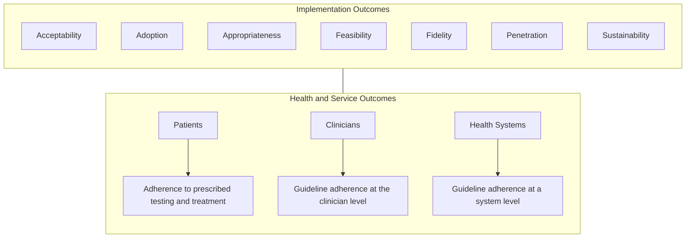
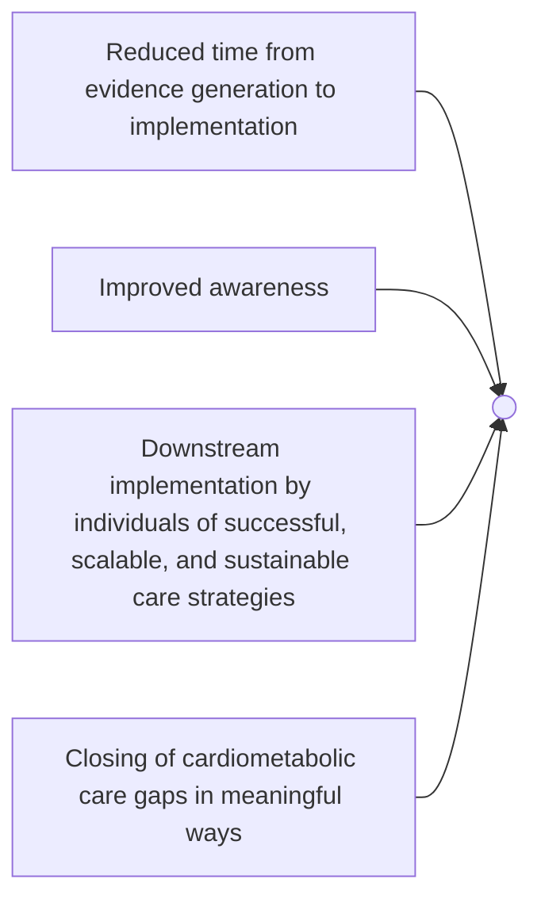

# Accelerating Evidence Generation to Implementation in Cardiometabolic Health: Establishment of the LATTICE Consortium

LATTICE logo

Laney K Jones1, Ankeet S Bhatt2, Leandro Boer1, Gemme Campbell-Salome1, Erica Davis1, Nihar Desai3, Jyothis George1, Ty J Gluckman4, Lisa Head1, Francoise A Marvel5, Marc Penn6, Eric D Peterson7, Nishant Shah8, Katherine Wilemon9, Bethany Kalich1, Seth S Martin5
1Amgen Inc., Thousand Oaks, CA, USA; 2Kaiser Permanente Northern California, Oakland, CA, USA; 3Yale School of Medicine, New Haven, CT, USA; 4Providence Heart Institute, Portland, OR, USA; 5Johns Hopkins University School of Medicine, Baltimore, MD, USA; 6Summa Cardiovascular Institute, Akron, OH, USA; 7UT Southwestern Medical Center, Department of Medicine, Division of Cardiology, Dallas, TX, USA; 8Duke University School of Medicine, Durham, NC, USA; 9Family Heart Foundation, Pasadena, CA, USA

## BACKGROUND

* Cardiovascular disease is the leading cause of death in the US.1

* Recent scientific advancements have led to the development of innovative therapies to reduce the risk of cardiometabolic events.2

* However, it can take years for evidence generation in the research setting to be implemented in the care setting, resulting in negative consequences for patients, clinicians, and health systems.3

## OBJECTIVE

* The LATTICE (Leading Awareness To action Through Implementation of Cardiometabolic Efforts) Consortium aims to improve collaboration among patients, clinicians, health systems, payers, patient advocacy, and life science companies to translate evidence-based advancements into clinical practice.

> Reducing time between evidence generation in the research setting and implementation in the care setting will improve cardiovascular outcomes for patients.

## METHODS

* LATTICE is a first-of-its-kind community dedicated to addressing cardiometabolic patient needs through implementation science.

* The LATTICE Consortium helps unite partners contributing to the overall mission of improving cardiometabolic health by creating an inclusive platform for sharing evidence-based tools, methodologies, and strategies and collaborating to improve the effectiveness of cardiometabolic patient care at scale.

Who icon

## Who?

The LATTICE Consortium is a coalition of experts with a shared goal to address cardiometabolic patient care through the implementation of evidence-based tools and methodologies

What icon

## What?

Evidence-based tools and methodologies that address clinical inertia are shared for learning, ideating, and collaborating to enable scalable action across the healthcare ecosystem

LATTICE icon

## How?

Creating synergistic networks for the integration of implementation science through the following:

* LATTICEConsortium.com resource repository

* Educational symposia events

* Regional sharing sessions

Why icon

## Why?

Implementation science has the potential to improve processes and outcomes in the cardiometabolic space

Connecting like-minded teams can facilitate efficient adaptation and adoption of evidence-based solutions across health systems

| Evidence-Based Tool            | Description                                                                                                                                                                                                                                                                                             |
| ------------------------------ | ------------------------------------------------------------------------------------------------------------------------------------------------------------------------------------------------------------------------------------------------------------------------------------------------------- |
| Prompts and reminders          | Improve healthcare delivery and engagement • EHR prompts • Pre-visit LDL orders • Patient alerts                                                                                                                                                                                            |
| Education                      | **Patient education** • Shared decision-making tools: information aids, conversation aids, decision aids • Smartphone applications (apps) • E-learning • Telehealth **HCP education** • Education modules • Platform to inform LDL management performance • Newsletters |
| Navigators and care team model | • Healthcare navigators and holistic care models provide opportunities to reduce barriers to patient care                                                                                                                                                                                               |
| Performance dashboard          | • Supports awareness of progress and areas for improvement                                                                                                                                                                                                                                              |
| Motivation                     | • Articulation of the benefit of sustained support of implementation strategies adopted into practice of healthcare system management (ie, value proposition, sustainability models, etc)                                                                                                               |

EHR, electronic health record; HCP, healthcare provider; LDL, low-density lipoprotein.

## OUTCOMES

**DISCLOSURES:** LKJ, LB, GCS, ED, JG, LH, and BK are employees of and own stock in Amgen Inc. ASB has received research grant support from the American College of Cardiology Foundation, Centers for Disease Control and Prevention, National Institutes of Health/National Heart, Lung, and Blood Institute, and National Institutes of Health/National Institute on Aging; and consulting fees from Amgen Inc., AstraZeneca, Heart Health Leaders, Merck, Novo Nordisk, and Sanofi Pasteur. ND works under contract with the Centers for Medicare and Medicaid Services; and reports research grants and consulting fees from Amgen Inc., AstraZeneca, Bayer, Boehringer Ingelheim, Bristol Myers Squibb, CSL Behring, Cytokinetics, Merck, Novartis, scPharmaceuticals, Verve Therapeutics, and Vifor. FAM is co-founder and holds equity in Corrie Health; serves as a consultant for Amgen Inc., Apple, Kaneka, and New Amsterdam; and has received grant support in the form of funding or material support from the American Heart Association Empowered to Serve Business Accelerator, Amgen Inc., Apple, the Louis B. Thalheimer Fund, the Maryland Innovation Initiative, the PJ Schafer Cardiovascular Research Fund, and the Wallace H. Coulter Translational Research Partnership. SSM is a co-founder and holds equity in Corrie Health; reports personal consulting fees from Amgen Inc., Arrowhead, AstraZeneca, Chroma, HeartFlow, Kaneka, Merck, NewAmsterdam Pharma, Novartis, Novo Nordisk, Premier, and Verve Therapeutics; and has received grant support in the form of funding or material support from the American Heart Association, Amgen Inc., Apple, David and June Trone Family Foundation, Google, Merck, National Institutes of Health, Patient-Centered Outcomes Research Institute, the Pollin Digital Innovation Fund, and Sandra and Larry Small. TJG, MP, EDP, NS, and KW have nothing to disclose.

**FUNDING:** This study was funded by Amgen Inc. Medical writing and editorial support were provided by Lisa Carson, PhD, of Red Nucleus, and funded by Amgen Inc.

**REFERENCES:** 1. Martin SS, et al. Circulation. 2025;151:e41-e660. 2. Tokgözoğlu L, et al. Eur Heart J. 2022;43:3198-3208. 3. Rubin R. JAMA. 2023;329:1333-1336.

## PROGRAM EVALUATION

Success of the LATTICE Consortium will be measured by:

Improved awareness icon

QR code for more information

For more information on LATTICE, scan the QR code

Amgen logo © 2025 All rights reserved

Poster presented at the 2025 National Association of Specialty Pharmacy Annual Meeting and Expo; September 14–17, 2025; Denver, CO, USA

