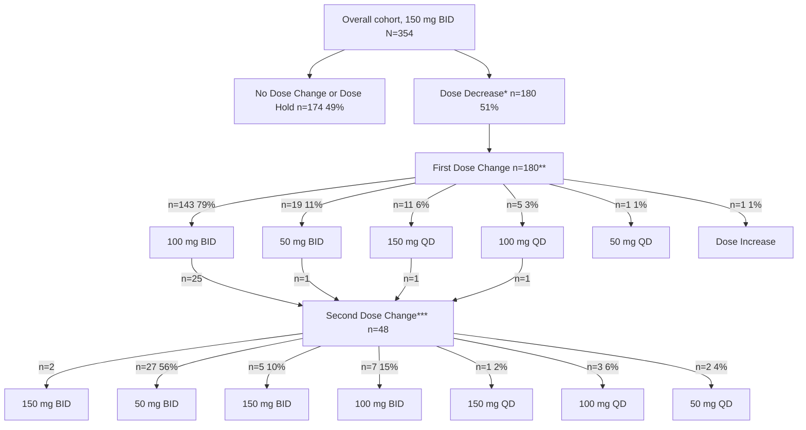

# Clinical Characteristics and Treatment Persistence in US Patients with HR+/HER2-, Node Positive Early Breast Cancer Treated with Abemaciclib: Real-World Study from First Year After Approval

QR code for Lilly content

Scan the QR code for a list of all Lilly content presented at the congress. Other company and product names are trademarks of their respective owners.

Kathryn Hudson1, Wambui Gathirua-Mwangi2, Zhanglin Lin Cui2, Madeline Richey3, Brenda Grimes2, Jingru Wang3, Astra M Liepa2, Erich Brechtelsbauer2, Raisa Volodarsky2, Katheryn Moreira2, Hatem Soliman4, Jay Barcelon (Non-author Presenter)2

1Texas Oncology, Austin, TX, USA; 2Eli Lilly and Company, Indianapolis, IN, USA; 3Flatiron Health, New York City, NY, USA; 4Moffitt Cancer Center and Research Institute, Tampa, FL, USA

Study was sponsored by Eli Lilly and Company

## OBJECTIVE

This retrospective study describes clinical characteristics, dose modification patterns, and 3-month treatment persistence in patients with HR+/HER2-, node-positive EBC initiating abemaciclib at 150 mg BID in the first year following FDA approval.

## CONCLUSIONS

❖ The majority of patients (88%) continued abemaciclib beyond 3 months. The low rate of adjuvant abemaciclib discontinuation in US clinical practice suggests that abemaciclib is well tolerated by most patients.

- Among patients who discontinued, 70% did not attempt dose modifications.

❖ Half of the patients continued on the approved 150 mg BID dose and half had a dose reduction, with a median time to first dose reduction of 2 months.

❖ Patients with dose reductions had improved persistency, with 93% continuing abemaciclib beyond 3 months

❖ Given that the common onset of diarrhea is within the first 1-2 weeks of abemaciclib treatment and that dose reductions do not compromise efficacy, anti-diarrheal medicine and timely dose modifications should be utilized to improve tolerability and treatment persistence with abemaciclib.

## BACKGROUND

- Abemaciclib, a selective inhibitor of CDK4/6, is approved for use in combination with endocrine therapy (ET) for the adjuvant treatment of adult patients with HR+, HER2- node-positive, early breast cancer (EBC) who are at a high risk of recurrence and is recommended by international guidelines.1-7

- In monarchE, adjuvant abemaciclib + ET significantly improved invasive disease-free survival (IDFS) and distant relapse-free survival (DRFS), with sustained benefit beyond the 2-year treatment period resulting in a 5-year benefit in IDFS (7.9%) and DRFS (7.1%)*.4

- In monarchE, 18.5% of patients discontinued abemaciclib due to adverse events (AEs), and the discontinuation rate due to AE was highest in the first month. Diarrhea occurred early on treatment (median 8 days to onset) and was the most common reason for discontinuation and/or dose reduction.8

- Abemaciclib is dosed at 150 mg twice daily (BID)7 with a recommendation for dose reductions to 100 mg or 50 mg to improve tolerability. Efficacy of adjuvant abemaciclib is not compromised by dose reductions.9

- Understanding utilization and dose modification of abemaciclib in the real-world setting can provide insights into the treatment patterns beyond the controlled clinical trial setting and help inform AE management strategies to improve tolerability and support treatment persistence.

\*5-year IDFS and DRFS rates are from the FDA-approved population from monarchE (Cohort 1).

## METHODS / STUDY DESIGN

- **Study Design**: Retrospective study of patients initiating abemaciclib in the adjuvant setting.

- **Data Source**: US Flatiron Health* electronic health records-derived de-identified database comprising structured and unstructured data.

### Study Period
Index Period (first-year post FDA approval for abemaciclib in EBC)
Index date = abemaciclib start date for each patient

Oct 13, 2021 [________________________________________________] Nov 30, 2022 [__________] Feb 28 2023
(to allow ≥3 months of follow-up)

- **Patient Selection**: Included patients were aged ≥ 18 years, diagnosed with node-positive, stage I-III EBC, and initiating abemaciclib at 150 mg BID in the index period. Excluded patients with evidence of prior use of any CDK4/6 inhibitor or any other primary malignancy, except non-melanoma skin cancer and other benign in situ neoplasm while on treatment for EBC.

- **Analysis**: Baseline patient demographics and clinical characteristics; dose modifications; and 3-month treatment persistence were analyzed descriptively.
    

    - Persistence rate is the proportion of patients on abemaciclib at 3 months, allowing for up to a 60-day medication gap.
    

    - Dose modification includes dose hold or a change in dose (increase or decrease) as indicated in patient's chart.

\*The Flatiron Health database is a longitudinal, EHR-derived, de-identified database comprising patient-level structured and unstructured data curated via technology-enabled abstraction.10,11 Additional data abstraction was conducted to supplement the existing database. The data presented herein originated from approximately 280 cancer clinics (~800 sites of care) from across the US, with 80% of patients from community practices and 20% from academic research hospitals.

## LIMITATIONS

- This is a descriptive study with a moderate sample size of patients who initiated abemaciclib during the first year after FDA approval in EBC, and hence, the results should be interpreted with caution.

- The relatively short median follow-up time (8.8 months) allowed reliable assessment of persistency only in the first 3 months, suggesting that longer follow-up is needed.

- AE grades and information on co-medication such as anti-diarrheal medications was not assessed in this study.

## RESULTS

### Dose Modification Patterns

- Median time to dose decrease: 59 days (IQR: 35, 99)
- Median time to dose increase (n=13), 34 days (IQR: 22, 79)
- \*47% (84/180) of patients also had a dose hold
- Median time to dose decrease (n=33), 56 days (IQR: 28, 103)

- ~50% stayed on 150 mg BID
- ~50% dose reduced mostly to 100 mg BID and 50 mg BID
- Median time to 1st dose reduction is ~ 2 months

\*\*1 patient dose unknown. \*\*\*Details on dose change from 1st dose change are included only for patients with large numbers in the 2nd dose change (see Supplemental table 1 for complete data); Dose change was unknown for 3 patients.

### Dose Modifications by Age

| Age, years    | Dose modification: No (%) | Dose modification: Yes (%) |
| ------------- | ------------------------- | -------------------------- |
| <50 (n=107)   | 66                        | 34                         |
| 50-64 (n=164) | 43                        | 57                         |
| ≥65 (n=83)    | 39                        | 61                         |

- A higher proportion of patients ≥50 years old changed dose vs <50 years.

### Majority of patients continued on treatment beyond 3 months

| Status                        | n   | %   |
| ----------------------------- | --- | --- |
| Continued on Treatment\*      | 312 | 88% |
| Discontinued due to AEs       | 40  | 11% |
| Discontinued (other reasons)+ | 2   | 1%  |

**In those who discontinued due to AEs:**
- Most common AEs were diarrhea (n=24), fatigue (n=16), and nausea/vomiting (n=12)
- Dose modifications not attempted in majority of patients (70%)
- Characteristics of those who discontinued#:
    - Median age of 64.0 years (IQR 52.5, 71.0)
    - 55.0% had ≥1 comorbidities

- Discontinuations occurred in the first two months, median 39 days (IQR 20, 54)

- High treatment continuation (93%) and low discontinuation rate (7%) in patients who experienced dose reductions

+1 financial and 1 non-cancer related medical issue. \*Includes 20 patients who had dose hold >60 days and resumed treatment within the follow-up period; and 3 patients on dose hold whose follow-up time did not allow for assessment of resumption of treatment. #Additional characteristics are included in supplemental table 2.

### Baseline Demographics and Clinical Characteristics

| Patients,                               | N =354            |
| --------------------------------------- | ----------------- |
| Follow up time (months), median (IQR)   | 8.8 (5.9, 12.1)   |
| Age (years) at index date, median (IQR) | 56.0 (48.0, 64.0) |
| Female, n (%)                           | 353 (99.7%)       |
| Racea, n (%)                            |                   |
| White                                   | 204 (57.6)        |
| Black or African American               | 45 (12.7)         |
| Asian                                   | 14 (4.0)          |
| Other Race                              | 44 (12.4)         |

| ECOG Performance Statusa,b at Index Date, | n (%)      |
| ----------------------------------------- | ---------- |
| 0                                         | 205 (57.9) |
| 1                                         | 89 (25.1)  |
| 2                                         | 9 (2.5)    |

| No. of Comorbidities, | n (%)      |
| --------------------- | ---------- |
| 0                     | 234 (66.1) |
| 1                     | 77 (21.8)  |
| 2+                    | 43 (12.1)  |

| Practice Type,       | n (%)      |
| -------------------- | ---------- |
| Academic             | 53 (15.0)  |
| Community            | 286 (80.8) |
| Academic & Community | 15 (4.2)   |

| Menopausal Statusa at Index Date, | n (%)      |
| --------------------------------- | ---------- |
| Pre and perimenopausal            | 137 (38.7) |
| Postmenopausal                    | 196 (55.4) |

| Stage at Diagnosisa,c, | n (%)      |
| ---------------------- | ---------- |
| Stage I                | 59 (16.7)  |
| Stage II               | 148 (41.8) |
| Stage III              | 136 (38.4) |

| Pathologic Node Status at Diagnosisa,c,d, | n (%)      |
| ----------------------------------------- | ---------- |
| N1                                        | 160 (45.2) |
| N2                                        | 125 (35.3) |
| N3                                        | 50 (14.1)  |

| Tumor grade at Diagnosisa, | n (%)      |
| -------------------------- | ---------- |
| Grade 1                    | 31 (8.8)   |
| Grade 2                    | 185 (52.3) |
| Grade 3                    | 136 (38.4) |

| Treatments received prior to initiating abemaciclib | Treatments received prior to initiating abemaciclib |
| --------------------------------------------------- | --------------------------------------------------- |
| Neoadjuvant therapy, n (%)                          | 164 (46.3)                                          |
| Chemotherapy n (%)                                  | 294 (83.1)                                          |
| Adjuvant ET, n (%)                                  | 262 (74.0)                                          |
| Time on prior adjuvant ET (months), median (IQR)    | 1.6 (0.0, 5.0)                                      |

| Endocrine Therapy Choicee,                              | n (%)      |
| ------------------------------------------------------- | ---------- |
| Abemaciclib + AI (anastrozole, exemestane or letrozole) | 322 (91.0) |
| Abemaciclib + tamoxifen                                 | 32 (9.0)   |

- With a median follow-up of 8.8 months, this cohort of patients was more racially diverse and older than in monarchE.3

- The majority of patients have Stage II or Stage III disease.

- >90% of patients were treated with abemaciclib+AI.

aRace, ECOG PS and menopausal status at index date and stage, node status, and tumor grade at diagnosis data was unknown/not documented for 47, 51, 21, 11, 4, and 2 patients, respectively; bECOG performance status closest to the index date (30 days prior to 7 days after the index date); cStage and node status at diagnosis were derived from clinician notes for patients who received neoadjuvant therapy and pathologic reports for patients who did not receive neoadjuvant therapy; dNodal status was determined from clinician notes in 19 patients; eRegimens may also include ovarian suppression.

**References**: 1. FDA expands early breast cancer indication for abemaciclib with endocrine therapy. https://www.fda.gov/drugs/resources-information-approved-drugs/fda-expands-early-breast-cancer-indication-abemaciclib-endocrine-therapy. 2. Verzenio [package insert]. Indianapolis, IN: Eli Lilly and Company; 2023. https://uspl.lilly.com/verzenio/verzenio.html#pi. 3. Johnston SRD, et al. J Clin Oncol. 2020;38:3987-4000. 4. Rastogi P, et al. J Clin Oncol. 2024; 42(9), 987-993. 5. NCCN Clinical Practice Guidelines in Oncology-Breast Cancer. Version 5. 2024. 6. Caswell-Jin JL, et al. JCO Oncol Pract. 2024 Sep 20:OP2400663. 7. Loibl S, et al. Ann Oncol. 2024;35(2):159-82. 8. Rugo et al. Ann Oncol. 2022 Jun;33(6):616-627. 9. Goetz et al. NPJ Breast Cancer 2024; 34(10). 10. Ma X, et al. Medrxiv. doi: https://doi.org/10.1101/2020.03.16.20037143. 11. Birnbaum B, et al. Arxiv. doi: https://doi.org/10.48550/arXiv.2001.09765

**Abbreviations**: AI, aromatase inhibitors; CDK, Cyclin-dependent kinase; 4/6; EBC, early breast cancer; ECOG, Eastern Cooperative Oncology Group; EHR, electronic health record; ET, endocrine treatment; HR+, hormone receptor-positive; HER2-, human epidermal growth factor receptor 2-negative; IQR, interquartile range.

**Disclosures**: KH participated on a Data Safety Monitoring/Advisory Board of Daiichi Sankyo, AstraZeneca, and Gilead. WGM, ZLC, BG, AML, EB, RV, KM and JB are employees and minor shareholders of Eli Lilly and Company. MR and JW are employees of Flatiron Health. HS has received consulting fees from Novartis, Eli Lilly and Company, Sermonix, Pfizer, and AstraZeneca. This study was previously presented at San Antonio Breast Cancer Symposium (SABCS) 47th Annual Meeting; San Antonio, TX; December 10-14, 2024.

**Acknowledgments**:

- Medical writing support was provided by Keerthana Muthiah of Eli Lilly and Company

National Association of Specialty Pharmacy - 2025 Annual Meeting (NASP); Denver, CO; September 14-17, 2025

Copyright ©2025 Eli Lilly and Company. All rights reserved.

