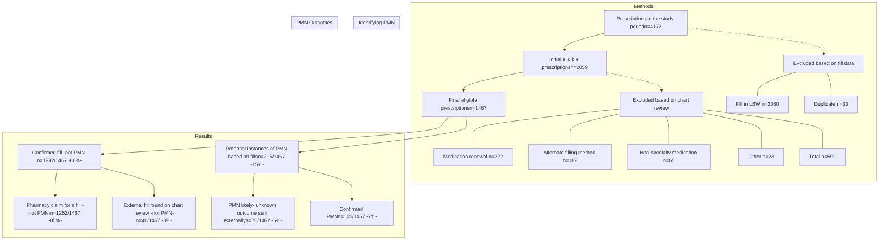

# Comparing rates of primary medication nonadherence among patients at Vanderbilt Specialty Pharmacy to external specialty pharmacies

Sarah Layne PharmD Candidate1; Autumn Zuckerman PharmD, BCPS, CSP2; Josh DeClercq, MS3; Leena Choi PhD3; Bridget Lynch PharmD2; Katie Cruchelow PhD2

1Belmont University School of Pharmacy, 2Vanderbilt Specialty Pharmacy, 3Vanderbilt University Medical Center

QR Code

# HIGHLIGHTS

* Patients with a prescription sent to **non-HSSP pharmacies** were **60% more likely to have PMN**, indicating that HSSPs can help more patients access and initiate therapy compared to non-HSSPs.

* The reason for PMN differed by where the prescription was sent, with more patients not obtaining insurance coverage if their prescription was sent to a non-HSSP pharmacy and patient decision driving PMN for HSSP patients.

## PURPOSE

Compare primary medication nonadherence (PMN) rates between a health-system specialty pharmacy (HSSP) - Vanderbilt Specialty Pharmacy- and external specialty pharmacies (non-HSSP)

## METHODS

**Study Design**
* Retrospective cohort study
* Fill data obtained from HSSP software and Surescripts® (Non-HSSP patients)

**Setting**
* Vanderbilt Health System Oncology, Inflammatory (Rheumatoid Arthritis [RA], Inflammatory Bowel Disease [IBD], and Dermatology), or Multiple Sclerosis (MS) clinics
* Pharmacy was categorized into HSSP and non-HSSP

**Sample**
* **Inclusion Criteria**: Patients with a new specialty medication prescription between June 1, 2021, to May 31, 2022
* **Exclusion Criteria**:
    - Prescription/fill of a specialty medication within 180 days of the index prescription occurred
    - Alternative filling method used (inpatient, clinical trial, manufacturer free drug)
    - The ultimate outcome of the prescription could not be determined (e.g., patient lost to follow up or prescription sent to non-HSSP pharmacy with no confirmation of outcome)

**Analysis**
* Wilcoxon rank sum test: PMN rates by filling pharmacy and clinic type
* Logistic regression model controlling for age, sex, clinic, race, insurance and filling pharmacy tested for associations with PMN

### Lookback Window: 180 Days

Minimum duration prior to index prescription where patient may revert to naïve status and be considered as a "new" prescription and potential case of PMN.

### Duplicate Window: 30 Days

Duration of time within which two sequential prescriptions for the same medication or therapeutic equivalent can be considered a duplicate.

## RESULTS

### Table 1. Baseline Demographics

| Characteristic           | HSSP (N=987) | Non-HSSP (N=480) | Total (N=1467) |
| ------------------------ | ------------ | ---------------- | -------------- |
| Age, years, median (IQR) | 60 (45-70)   | 50 (35-61)       | 56 (41-68)     |
| Female, n (%)            | 516 (52.3%)  | 295 (61.5%)      | 811 (55.3%)    |
| Insurance, n (%)         |              |                  |                |
| Commercial               | 495 (51.4%)  | 327 (69.6%)      | 822 (57.4%)    |
| Government/Other         | 468 (48.6%)  | 143 (30.4%)      | 611 (42.6%)    |
| Clinic, n (%)            |              |                  |                |
| Multiple Sclerosis       | 58 (5.88%)   | 48 (10.0%)       | 106 (7.23%)    |
| Inflammatory             | 306 (31.0%)  | 268 (55.8%)      | 574 (39.1%)    |
| Oncology                 | 623 (63.1%)  | 164 (34.2%)      | 787 (53.6%)    |

\*There was a significant difference in PMN rates between HSSPs and non-HSSPs for the overall population (p=0.027) and for patients in the MS Clinic (p=0.013).

### Figure 1. PMN Rates

| Clinic              | HSSP (%) | Non-HSSP (%) |
| ------------------- | -------- | ------------ |
| Overall             | 6        | 10\*         |
| MS Clinic           | 4        | 21\*         |
| Inflammatory Clinic | 6        | 11\*         |
| Oncology Clinic     | 7        | 6            |

### Figure 2. Reason for PMN

| Reason                                                      | HSSP (%) | Non-HSSP (%) |
| ----------------------------------------------------------- | -------- | ------------ |
| Patient decision                                            | 32       | 12           |
| Medication never approved by insurance                      | 10       | 28           |
| Patient unable to afford                                    | 18       | 10           |
| Unknown due to sent to external pharmacy and never received | 0        | 22           |
| Lost to follow-up                                           | 12       | 10           |
| Other                                                       | 8        | 10           |
| Medication no longer clinically appropriate                 | 5        | 2            |
| Medication held                                             | 4        | 1            |
| Medication change                                           | 3        | 2            |
| Patient death                                               | 2        | 1            |
| Provider Change                                             | 1        | 1            |

The most common reason of PMN for HSSP patients was **patient decision**.
Non-HSSP patients were more likely to have PMN due to **medication never being approved**.
The final outcome of prescription access was unknown for many non-HSSP patients.

### Figure 3. PMN Identification and Results

### Figure 4. Logistic Regression Results

| Variable           | Comparison/Reference                   | Odds Ratio (95% CI) |
| ------------------ | -------------------------------------- | ------------------- |
| Age at index       | 70 vs. 40                              | 1.00                |
| Clinic             | Oncology (Ref: Multiple sclerosis)     | 0.60                |
| Clinic             | Inflammatory (Ref: Multiple sclerosis) | 0.50                |
| Insurance          | Commercial (Ref: Government/Other)     | 0.85                |
| Medication sent to | Non-HSSP (Ref: HSSP)                   | 1.60                |
| Race               | Other (Ref: White)                     | 1.10                |
| Race               | Black (Ref: White)                     | 0.90                |
| Sex                | Male (Ref: Female)                     | 0.95                |

Non-HSSP patients were **60% more likely** to experience PMN

Sarah Layne: sarah.layne@bruins.belmont.edu
The authors report nothing to disclose related to this work.

ashp logo

