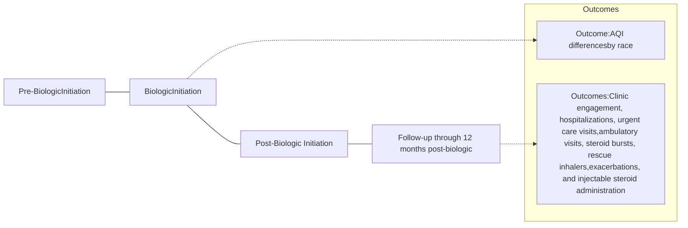

# Health Disparities Among Patients with Moderate to Severe Asthma in a Health System with Specialty Pharmacy: A retrospective chart review

QR Code

VANDERBILT UNIVERSITY MEDICAL CENTER logo

Briana Hunt, PharmD Candidate1, Monica Littlejohn, PharmD, MHA2, Autumn D. Zuckerman, PharmD2, Nicholas Gargurevich, MS3, Katie Cruchelow, PhD2, Leena Choi, PhD3
1Belmont University College of Pharmacy, 2Vanderbilt Specialty Pharmacy, 3Vanderbilt University Medical Center

## HIGHLIGHTS

* Black or African American/Other patients may be more likely to **miss scheduled appointments** than White patients.

* Black or African American/Other patients were exposed to certain harmful air particles at a higher rate than White patients.

* Few patients experienced an exacerbation or healthcare utilization in the first year of biologic therapy. No differences in response outcomes were seen by race.

## PURPOSE

This study described clinical outcomes in patients with moderate to severe asthma in the first year of biologic therapy and evaluated air quality and clinic engagement by race.

## METHODS

**Design**
* Retrospective cohort study
* Enrollment: 1/1/2019-6/20/2022 with a 12-month follow up through 6/30/2023
* Patients were geocoded then matched with air quality index (AQI) data from the Environmental Protection Agency

**Sample**
* Inclusion criteria: initiated a new biologic (benralizumab, dupilumab, mepolizumab, and omalizumab) between 1/1/2019 and 6/30/2022
* Exclusion criteria:
    - Indication other than moderate to severe asthma
    - Biologic not prescribed by a Vanderbilt Allergy/ Immunology Clinic provider

## Figure 1. Study Design

## RESULTS

### Baseline Demographics (N=185)

| Gender             | Age                       | Insurance              | Race              |
| ------------------ | ------------------------- | ---------------------- | ----------------- |
| 54% Female (n=100) | Median                    | 56% Commercial (n=103) | 68% White (n=126) |
| 46% Male (n=85)    | 46 years                  | 16% Medicaid (n=30)    | 32% Black/AA/     |
|                    | Interquartile range (IQR) | 25% Medicare (n=38)    | Other\* (n=59)    |
|                    | 24, 58                    | 8% Other (n=14)        |                   |

**Asthma Diagnosis**

| Diagnosis           | Percent |
| ------------------- | ------- |
| Severe-persistent   | 48%     |
| Moderate-persistent | 52%     |

**Medication**

| Medication   | Percent |
| ------------ | ------- |
| Dupilumab    | 82%     |
| Mepolizumab  | 11%     |
| Omalizumab   | 3%      |
| Benralizumab | 4%      |

**Smoking status**

| Status                 | Percent of patients |
| ---------------------- | ------------------- |
| Exposure only          | 9                   |
| Currently smoke        | 10                  |
| Previously smoked      | 21                  |
| Never smoked/exposed/? | 60                  |

## Figure 2. Air Quality Index Differences by Race

AQI is a scale that measures air pollution levels of the 6 major pollutants (ozone, carbon monoxide, nitrogen dioxide, sulfur dioxide, and two sizes of particulate matter). Patients with moderate to severe asthma are at a greater risk from breathing small particles and irritating gases as they can worsen asthma symptoms.

**NO2**: A gaseous pollutant that is created by burning fuels like gasoline
**Ozone**: A gas in the air. Pollutants react chemically in sunlight to create bad ozone
**PM2.5**: A mixture of solids and liquid droplets ≤2.5 micrometers often from motor vehicles, forest fires, and power plants

| Median (IQR) of percent days of AQI parameters | White          | Black or African American | P-value |
| ---------------------------------------------- | -------------- | ------------------------- | ------- |
| NO₂                                            | 0 (0, 5.5)     | 5.5 (0, 6)                | P<0.001 |
| Ozone                                          | 44.5 (33, 100) | 33.2 (20, 25)             | P<0.001 |
| PM₂.₅                                          | 51.2 (0, 61)   | 60.8 (60, 75)             | P<0.001 |

## Clinic Engagement

### Figure 3. Appointment Cancellations

| Race                              | Percentage of appointments cancelled |
| --------------------------------- | ------------------------------------ |
| White                             | \~33                                 |
| Black or African American + Other | \~15                                 |

### Figure 4. Appointment No Shows

| Race                              | Percentage of appointments no show |
| --------------------------------- | ---------------------------------- |
| White                             | \~5                                |
| Black or African American + Other | \~25                               |

### Average (SD) percent of appointments cancelled

| Race                   | Average (SD) % |
| ---------------------- | -------------- |
| White                  | 19% (± 26%)    |
| Black/African American | 11% (± 20%)    |

**p=0.04**
White patients were more likely to cancel and reschedule their appointment

### Average (SD) percent of appointments missed without rescheduling

| Race                   | Average (SD) % |
| ---------------------- | -------------- |
| White                  | 4% (± 10%)     |
| Black/African American | 16% (± 27%)    |

**p<0.001**
Black/AA patients were more likely to not attend or reschedule their appointment

### Table 1. Clinical Outcomes 12 months from Biologic Initiation

| Outcome                            | Frequency of Outcomes n (%) 0 | Frequency of Outcomes n (%) 1 | Frequency of Outcomes n (%) 2 | Frequency of Outcomes n (%) 3+ |
| ---------------------------------- | --------------------------------- | --------------------------------- | --------------------------------- | ---------------------------------- |
| Hospitalizations                   | 171 (92)                          | 10 (5)                            | 3 (2)                             | 1 (<1)                             |
| Urgent care visits                 | 168 (91)                          | 14 (8)                            | 2 (1)                             | 1 (<1)                             |
| Ambulatory visits                  | 150 (81)                          | 25 (14)                           | 9 (5)                             | 1 (<1)                             |
| Steroid bursts                     | 149 (81)                          | 26 (14)                           | 6 (3)                             | 4 (2)                              |
| Rescue inhalers                    | 106 (57)                          | 15 (8)                            | 9 (5)                             | 55 (30)                            |
| Injectable steroid administrations | 181 (98)                          | 4 (2)                             | 0 (0)                             | 0 (0)                              |
| Exacerbations                      | 120 (65)                          | 29 (16)                           | 18 (10)                           | 18 (10)                            |

Differences in clinical outcomes were not significantly different by race.

**References**: Air Pollutants. Centers for Disease Control and Prevention. Accessed October 22, 2024. https://www.cdc.gov/air-quality/pollutants/index.html.

**Acknowledgements**: This research was supported by Sanofi, Inc.

**Conflicts of Interest**: None related to this work.

*Other race: American Indian/Alaskan Native, Native Hawaiian/other Pacific Islander, Middle Eastern, Mixed race

