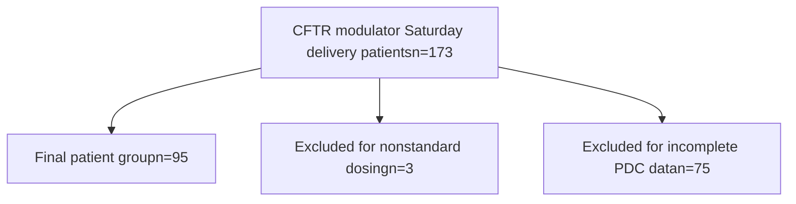

VYTL NE logo

# Evaluation of Intervention to Improve Adherence in Patients Receiving Cystic Fibrosis Transmembrane Conductance Regulator (CFTR) Modulators

Jacee Billings, PharmD; Bonnie K. Dugie, PharmD, MBA, CSP, FTSHP; Alicia Morris, PharmD, CSP

ashp Accredited logo

# Background

* Cystic fibrosis transmembrane conductance regulator (CFTR) modulators have revolutionized cystic fibrosis (CF) treatment, but adherence remains critical for their effectiveness1
* CFTR modulators for people with certain CFTR mutations include ivacaftor, lumacaftor/ivacaftor, tezacaftor/ivacaftor, and elexacaftor/tezacaftor/ivacaftor
* While adherence to CFTR modulators is generally expected to be higher due to their oral administration and effectiveness, there is limited data available2
* Pharmacy Quality Alliance recognizes adherence standard as a PDC threshold of 80%3
* Non-adherence in CF can result in hospitalizations, poor health outcomes, and significant personal and economic impacts4
* This study aims to retrospectively evaluate procedure modifications to observe if a change in adherence to CFTR modulators in a specialty pharmacy setting occurred

# Objectives

## Primary Objective

Change in proportion of days covered (PDC) of nonadherent patients on CFTR modulators who utilized Saturday delivery between May-October 2024

## Secondary Objectives

1. **Medication refill method** in nonadherent patients who utilized Saturday delivery
2. **Percentage of overall utilization** of Saturday delivery in patients on CFTR modulators
3. **Patient reported outcomes** in nonadherent patients post intervention

# Methods

## Study Design

* Maxor Specialty Pharmacy services patients nationally
* A longitudinal retrospective chart review gathered data from descriptive reports from 2 locations to assess for inclusion from November 1, 2023, to October 31, 2024

## Data Collection & Analysis

* The pharmacy operating system and supporting clinical platforms provided information for data collection
* Collected data included age, zip code, first administration date, medication dose, frequency, duration, PDC, day of week refilled, and patient reported outcomes
* PDC was calculated as days with medication available divided by number of days from index start thru last day of observation period with a 6 month lookback
* PDC defined as very adherent >90%, adherent 80-89%, nonadherent <80%
* Data was analyzed using descriptive statistics

## Inclusion Criteria | Exclusion Criteria

* **Inclusion Criteria**: Patients with CF who filled a CFTR modulator prescription through Maxor Specialty Pharmacy prior to November 1, 2023, utilized Saturday delivery since May 1, 2024, and had complete PDC data through October 31, 2024
* **Exclusion Criteria**: Patients who do not have CF, patients with CF not on a CFTR modulator, patients who received their initial CFTR modulator order after November 1, 2023, patients with incomplete PDC data, and patients on nonstandard dosing

# Results

## Eligibility Criteria

## Patient Demographics

| Category       | Series 1   | Series 2    | Series 3  |
| -------------- | ---------- | ----------- | --------- |
| Sex            | Male 53%   | Female 47%  |           |
| Age (Years)    | (0-17) 37% | (18-25) 21% | (26+) 42% |
| Rural Zip Code | Yes 20%    | No 80%      |           |

## Primary Objective

**Nonadherent Patients n=21**

| Pre Saturday Delivery (PDC Average) | Post Saturday Delivery (PDC Average) |
| ----------------------------------- | ------------------------------------ |
| 64.9%                               | 71.1%                                |

**6.2% Increase**

* 52% of nonadherent patients (n=11) moved to adherent
* Of the newly adherent patients,
    - 36% (n=4) increased to very adherent
    - 45% (n=5) had >20% increase in PDC

Very adherent: >90% PDC; Adherent: 80-89% PDC; Nonadherent: <80% PDC

## Secondary Objectives

icon **Nonadherent Patient Refill Method**

| Refill Method     | Pre Saturday Delivery | Post Saturday Delivery |
| ----------------- | --------------------- | ---------------------- |
| Outbound Call     | 68.9%                 | 55.4%                  |
| Inbound Call      | 28.9%                 | 33.9%                  |
| Click to Refill\* | 2.2%                  | 10.7%                  |

\*Digital engagement sent via text message

**3% utilization (n=185)** of Saturday delivery for CFTR modulator prescriptions

icon **Nonadherent Patient Reported Outcomes**

| Outcome         | Pre Saturday Delivery | Post Saturday Delivery |
| --------------- | --------------------- | ---------------------- |
| Remained Stable | 95.9%                 | 91.3%                  |
| Gotten Worse    | 4.1%                  | 1.7%                   |
| Improved        | 0%                    | 7%                     |

7% improvement icon

# Discussion

## Conclusions

* 22.1% of patients were identified as nonadherent
* Transition of care aged patients between 18-25 years old were 8% more likely to be nonadherent
* 43% of nonadherent patients had a rural zip code compared to 20% of the overall patient population
* There was a 6.2% increase in PDC averages for nonadherent patients after Saturday delivery was offered
* Greater than 50% of the previously nonadherent patients achieved adherence after Saturday delivery implementation
* Staff phone efficiency with nonadherent patients increased after intervention as there was a 13.5% decrease in outbound refill calls and 8.5% increase in click to refill
* Overall utilization of Saturday delivery for CTFR modulator prescriptions was 3% with 12 patients utilizing Saturday delivery more than once
* Nonadherent patient reported outcomes improved by 7% and decreased worsening by 2.4%

## Limitations

* Small sample size due to limited study patient eligibility from incomplete PDC data
* Given the small sample size, the evaluation was not powered to provide statistical significance, so descriptive statistics were evaluated only
* PDC cannot account for intentional gaps in therapy and can overestimate nonadherence due to administrative delays
* Because PDC is a claims based metric, refill data can indicate potential adherence but does not verify actual usage
* Other interventions to improve compliance ran concurrently with the Saturday delivery intervention, making it difficult to determine a direct causal relationship
* Other noncontrollable factors that potentially influenced the data include seasonal adherence changes, increase in alternative dispensing organizations, reenrollment requirement changes, payer delays, and technology outages

# References

1. Hansen CME, Breukelman AJ, van den Bemt PMLA, Zwitserloot AM, van Dijk L, van Boven JFM. Medication adherence to CFTR modulators in patients with cystic fibrosis: a systematic review. Eur Respir Rev. 2024;33(173):240060. Published 2024 Aug 14. doi:10.1183/16000617.0060-2024
2. Olivereau L, Nave V, Garcia S, et al. Adherence to lumacaftor-ivacaftor therapy in patients with cystic fibrosis in France. J Cyst Fibros. 2020;19(3):402-406. doi:10.1016/j.jcf.2019.09.018
3. Pharmacy Quality Alliance. Adherence Measures. Available at: https://www.pqaalliance.org/adherence-measures. Accessed November 1, 2024.
4. Platt T, Kormelink LN, Autry EB, Rossoll SJ, Kuhn RJ. Assessment of long-term medication adherence with cystic fibrosis: An integrated approach. Pediatr Pulmonol. 2024;59(2):458-464. doi:10.1002/ppul.26774

**Disclosure**: The authors of this presentation have nothing to disclose concerning possible financial or personal relationships with commercial entities that may have a direct or indirect interest in the subject matter of this presentation.

