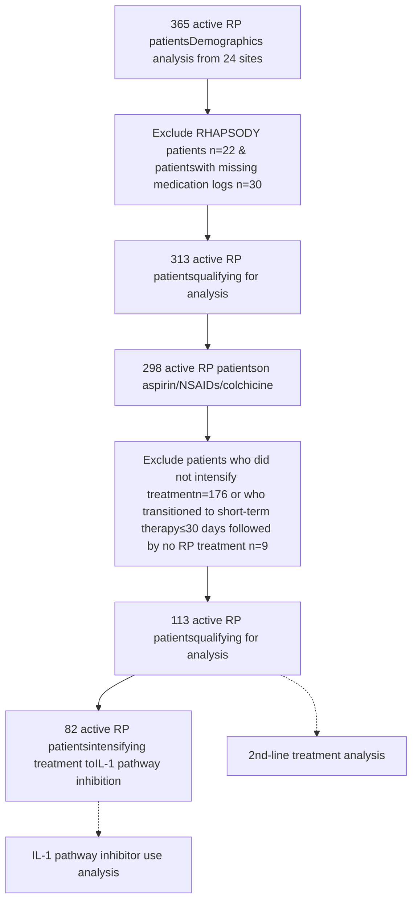

# Increased Adoption of IL-1 Pathway Inhibition and the Steroid-Sparing Paradigm Shift: Temporal Trends in Recurrent Pericarditis Treatment from the RESONANCE Patient Registry

Paul C. Cremer<sup>1</sup>, Michael Garshick<sup>2,3</sup>, Sushil A. Luis<sup>4</sup>, Ajit Raisinghani<sup>5</sup>, Brittany Weber<sup>6</sup>, Vidhya Parameswaran<sup>7</sup>, Allison Curtis<sup>7</sup>, Allan L. Klein<sup>8</sup>, and John F. Paolini<sup>7</sup>, on behalf of the RESONANCE Study Group

<sup>1</sup>Northwestern University, Chicago, IL; <sup>2</sup>Cardio-Rheumatology Program, Center for the Prevention of Cardiovascular Disease, NYU Langone Health, New York, NY; <sup>3</sup>Leon H. Charney Division of Cardiology, Department of Medicine New York University School of Medicine, New York, NY; <sup>4</sup>Department of Cardiovascular Medicine, Mayo Clinic, Rochester, MN; <sup>5</sup>Division of Cardiology, Department of Medicine, Sulpizio Cardiovascular Center, University of California San Diego, San Diego, CA; <sup>6</sup>Division of Cardiovascular Medicine, Department of Medicine, Brigham and Women’s Hospital, Harvard Medical School, Boston, MA; <sup>7</sup>Kiniksa Pharmaceuticals, Lexington, MA; <sup>8</sup>Cleveland Clinic, Cleveland, OH.

# BACKGROUND

## Recurrent Pericarditis (RP)

* RP is a chronic autoinflammatory disease mediated by interleukin-1 (IL-1).<sup>1</sup>

* RP negatively impacts quality of life, and refractory disease requires treatment over several years.<sup>1-3</sup>

* While the 2015 European Society of Cardiology (ESC) Guidelines position IL-1 pathway inhibition only after corticosteroids, complications associated with long-term steroid use underscore the importance of steroid-sparing strategies.

* Rilonacept, an IL-1α and IL-1β cytokine trap, is the only FDA-approved treatment for RP (available in the US since April 2021), supported by data from the pivotal trial, RHAPSODY.<sup>3,4</sup>

* In RHAPSODY, 50% of participants transitioned to rilonacept from steroids in the traditional (3<sup>rd</sup>-line) paradigm, and 50% transitioned from NSAIDs/colchicine (2<sup>nd</sup>-line), two manifestations of the steroid-sparing paradigm. Outcomes were similar between the two groups.<sup>3</sup>

* Greater understanding RP disease natural history and treatment paradigm selection will better inform clinical decision-making.

## RESONANCE: The First Multicenter US RP Patient Registry<sup>5,6</sup>

* The REgiStry Of the NAtural history of recurreNt periCarditis in pEdiatric and adult patients (RESONANCE) (NCT04687358) launched in March 2021 with plans to continue through 2026 and an enrollment target of 500 patients in up to 50 centers across the US.<sup>5,6</sup>

**Hypothesis:** Rilonacept availability for RP has enabled implementation of the corticosteroid-sparing paradigm in patients failing aspirin/NSAIDs/colchicine, with use of IL-1 pathway inhibition as 2<sup>nd</sup>-line therapy instead of corticosteroids.

# METHODS

## Data Collection

* Retrospective data (up to 1 year prior to enrollment) were combined with prospective data into a single seamless ambispective observation period (Fig 1).

* Observation Period: Data were collected from study start (March 2021) until the data cutoff date (DCO) (July 1, 2024).

## Data Analysis

* 2<sup>nd</sup>-line treatment analysis: In patients on aspirin/NSAIDs/colchicine, proportion who added/switched to conventional disease-modifying antirheumatic drugs (csDMARDs), corticosteroids, anakinra, or rilonacept during the observation period; data censored at last check-in visit.

* IL-1 pathway inhibitor use analysis: In patients failing aspirin/NSAIDs/colchicine, proportion who intensified treatment during the observation period directly to IL-1 pathway inhibition (2<sup>nd</sup>-line) or as a 3<sup>rd</sup>-line treatment (steroids → IL-1 pathway inhibition); data censored at last check-in visit.

* Statistics: Normally distributed data presented as mean ± standard deviation (SD); all other data presented as median [Q1, Q3] and n (%). Chi-square test for independence and Fisher's exact test were conducted to examine the association between treatment intensification patterns and comparative time periods. Two-tailed P<0.05 was considered to be statistically significant.

## FIGURE 1. RESONANCE PATIENT REGISTRY STUDY DESIGN<sup>6,7</sup>

```mermaid
graph LR
    A[Documented RP Episode] --> B[Eligibility Period]
    B --> C[Enrollment Date]
    C --> D[Final Data Collection(Start Date + 5 Years)]
    
    subgraph "OBSERVATION PERIOD"
    E[Medical History] --- F[3 Years]
    G[Retrospective Data] --- H[1 Year]
    I[Prospective Data] --- J[5 Years]
    end
    
    E --> G
    G --> I
    I --> K[Ambispective Data Collection]
```

## FIGURE 2. RESONANCE SITE LOCATIONS

| Principal Investigator          | Site                                     | State | Patients |
| ------------------------------- | ---------------------------------------- | ----- | -------- |
| Allan Klein                     | Cleveland Clinic Foundation              | OH    | 73       |
| S. Allen Luis                   | Mayo Clinic Rochester                    | MN    | 52       |
| Moneal Shah                     | Allegheny Health Network                 | PA    | 46       |
| Brittany Weber                  | Brigham & Women's Hospital               | MA    | 29       |
| Jonathan Salik                  | Massachusetts General Hospital           | MA    | 26       |
| Michael Garshick                | NYU Langone Health                       | NY    | 26       |
| Georgia Thomas                  | Virginia Commonwealth University         | VA    | 20       |
| Jesson Yeh                      | TKL Research (decentralized site)        | NJ    | 17       |
| Dennis Finkelstein/James Walter | Northwell Health/Lenox Hill Hospital     | NY    | 15       |
| Amanda Verma                    | Barnes Jewish/Washington University      | MO    | 12       |
| Dipan Shah                      | Houston Methodist                        | TX    | 12       |
| Nicolas Phreaner                | University of California, San Diego      | CA    | 12       |
| David Lin                       | Minneapolis Heart Institute Foundation   | MN    | 11       |
| Luigi Adamo                     | Johns Hopkins                            | MD    | 10       |
| Thomas Waggoner                 | Pima Heart and Vascular                  | AZ    | 7        |
| Michael Portman                 | Seattle Children's Hospital              | WA    | 6        |
| Austin Robinson                 | Scripps                                  | CA    | 6        |
| Robert Siegel                   | Cedars Sinai                             | CA    | 6        |
| Mohamed Al-Kazaz                | Northwestern University                  | IL    | 6        |
| John Ryan                       | University of Utah                       | UT    | 6        |
| Tracy Hagerty                   | University of Vermont                    | VT    | 5        |
| Suneet Purohit                  | Alaska Heart and Vascular Institute      | AK    | 3        |
| John Peterson                   | Swedish Medical Center/Providence Health | WA    | 2        |
| Chadi Alraies                   | Wayne State/Detroit Medical Center       | MI    | 1        |
| Allan Klein (Craig Asher)       | Cleveland Clinic - Florida               | FL    | 1        |
| Kathleen Zhang                  | University of Texas Southwestern         | TX    | 0        |
| Sarosh P. Batlivala             | Cincinnati Children's Hospital           | OH    | 0        |
| Ashraf Harahsheh                | Children's National Hospital             | DC    | 0        |
| Timothy Henry                   | Christ Hospital                          | OH    | 0        |


Map of the United States showing active RESONANCE site locations

Note: all treatments were prescribed as part of routine clinical care. The registry did not influence the diagnosis or management of RP patients in the study.
PRESENTED BY AAMER KHAN, PHARMD, KINIKSA PHARMACEUTICALS AT THE NATIONAL ASSOCIATION OF SPECIALTY PHARMACY 2025 ANNUAL MEETING AND EXPO • AUGUST 14 – 17, 2025 • DENVER, CO, USA

# RESULTS

## PATIENT AND DISEASE CHARACTERISTICS

## FIGURE 3. INTERVAL ANALYSIS PATIENT FLOW CHART



## TABLE 1. SELECT PATIENT AND DISEASE CHARACTERISTICS

| Characteristic                                    | All Patients (N=365)      |
| ------------------------------------------------- | ------------------------- |
| Age\*, years; mean ± SD                           | 51 ± 16.1                 |
| Female, %                                         | 59.9%                     |
| White, %                                          | 82.4%                     |
| Etiology, %                                       |                           |
| Idiopathic / viral pericarditis                   | 68.5%                     |
| Post-cardiac injury / post-procedural             | 8.2%                      |
| Other causes                                      | 9.6%                      |
| Not reported / unknown / missing                  | 13.7%                     |
| RP disease duration\*, years; median \[Q1, Q3]    | 2.9 \[1.9, 5.1]           |
| Number of prior recurrences\*\*; median \[Q1, Q3] | 3 \[2, 5]                 |
| Observation period, years, median \[Q1, Q3]; sum  | 2.1 \[1.1, 2.8]; 754.5 PY |


\*At the end of the observation period (last check-in visit or DCO); RP disease duration calculated as time since index acute episode
\*\*At time of enrollment
PY: patient-years

## RP DISEASE MANAGEMENT DURING RESONANCE OBSERVATION PERIOD

## FIGURE 4. 2<sup>nd</sup>-LINE TREATMENT CHOICE OVER TIME IN PATIENTS FAILING ASPIRIN/NSAIDS/COLCHICINE

| Period             | Rilonacept€ | csDMARDs | Anakinra | Corticosteroids |
| ------------------ | ----------- | -------- | -------- | --------------- |
| 2020-2021\* (n=10) | 10          | 10       | 0        | 80              |
| 2021\*\* (n=31)    | 35          | 3        | 13       | 48              |
| 2022 (n=42)        | 55          | 5        | 3        | 36              |
| 2023£ (n=30)       | 60          | 3        | 0        | 37              |


\*Partial year 2021 prior to rilonacept availability on April 1, 2021; \*\*Partial year 2021 after rilonacept availability after April 1, 2021
<sup>€</sup> Of 52 patients starting rilonacept after aspirin/NSAIDs/colchicine, 5 patients utilized steroids as a short-term bridge prior to starting rilonacept (n=2 in 2021, n=2 in 2022, n=1 in 2023); 4 patients (n=2 in 2021, n=2 in 2023) utilized anakinra as a short-term bridge prior to starting rilonacept
<sup>£</sup> Data censored at last check-in visit
csDMARDs: conventional disease-modifying antirheumatic drugs; RP: recurrent pericarditis
Overall P = 0.005

## FIGURE 5. 2<sup>nd</sup>-LINE AND 3<sup>rd</sup>-LINE IL-1 PATHWAY INHIBITOR USE OVER TIME

| Year          | 2nd-Line Use      | 3rd-Line Use¥     |
| ------------- | ----------------- | ----------------- |
| 2021\* (n=24) | 63 (R:46% A:17%)  | 38 (R:29% A:8.3%) |
| 2022 (n=35)   | 71 (R:66% A:5.7%) | 29 (R:26% A:3%)   |
| 2023£ (n=23)  | 78 (R:78% A:0%)   | 22 (R:22% A:0%)   |


\*Partial year 2021 after rilonacept availability on April 1, 2021
<sup>¥</sup> Of 49 patients who started steroids after aspirin/NSAIDs/colchicine, 24 patients (49%) ultimately transitioned to IL-1 pathway inhibition
<sup>£</sup> Data censored at last check-in visit
A: anakinra; R: rilonacept; RP: recurrent pericarditis
2<sup>nd</sup>-line overall P = 0.012; 3<sup>rd</sup>-line overall P = 0.62

# DISCUSSION

* As of data-cutoff, patients observed in RESONANCE (median of 3 prior recurrences at enrollment) had accumulated a median RP disease duration of 2.9 years.

* For patients intensifying treatment from aspirin/NSAIDs/colchicine

  – Prior to rilonacept availability in RP, patients transitioned to corticosteroids substantially more frequently (80%) than to IL-1 pathway inhibition (10%).

  – After rilonacept availability in RP, patients transitioned to IL-1 pathway inhibition as a 2<sup>nd</sup>-line therapy (driven by rilonacept) more frequently (60%) than to corticosteroids (37%).

  – Of those patients who intensified treatment to corticosteroids as 2<sup>nd</sup>-line therapy, 49% subsequently transitioned from corticosteroids to IL-1 pathway inhibition as 3<sup>rd</sup>-line use.

* In the period since rilonacept availability in RP, there has been growing adoption of a steroid-sparing paradigm, with 2<sup>nd</sup>-line use of IL-1 pathway inhibition increasing relative to 3<sup>rd</sup>-line use.

## LIMITATIONS

* Patients were not randomized to interventions, given the observational nature of the study.

* Data are derived from an interim download from an unlocked database; data may be missing or incomplete and/or may change with future data cleaning.

# CONCLUSIONS

* A temporal shift in RP management to a steroid-sparing paradigm was demonstrated amongst pericarditis-focused cardiologists in RESONANCE, with IL-1 pathway inhibition being used more frequently than chronic corticosteroids in patients failing colchicine.

* In patients failing inflammasome inhibition, initiation of IL-1 pathway inhibition instead of corticosteroids represents an advance beyond 2015 ESC Guideline recommendations and reduces corticosteroid burden.

## ACKNOWLEDGEMENTS

The authors would like to acknowledge the RESONANCE study investigators, including their research staff, as well as the patients who agreed to participate in the study; James Lastra, and Nichole Reed of Red Nucleus for clinical research operations and data management; and Pamela Harvey from Acumen Medical Communications for assistance with medical writing. Funding for this study, including statistical analysis performed by DeltaMed Solutions, Inc., was provided by Kiniksa Pharmaceuticals.

## DISCLOSURES

P.C. Cremer: grants and consultant fees from Kiniksa Pharmaceuticals, grants and personal fees from Sobi; M. S. Garshick: consultant fees from Kiniksa Pharmaceuticals; S.A. Luis: consultant fees from Kiniksa Pharmaceuticals, Cardiol Therapeutics, and Medtronic; A. Raisinghani: consultant fees from Kiniksa Pharmaceuticals; B. Weber: consultant fees from Kiniksa Pharmaceuticals; C. Grancorvitz, V. Parameswaran, A. Curtis, and J. F. Paolini are shareholders and employees of Kiniksa Pharmaceuticals; A.L. Klein: grants and consultant fees from Kiniksa Pharmaceuticals, Cardiol Therapeutics, and Pfizer.

## REFERENCES

1. Imazio M, Lazaros G, Gattorno M, et al. Anti-interleukin-1 agents for pericarditis: a primer for cardiologists. European Heart Journal 2022;43:2946–2957.

2. Chiabrando JG, Bonaventura A, Vecchie A, et al. Management of Acute and Recurrent Pericarditis. J Am Coll Cardiol 2020;75:76-92.

3. Klein AL, Imazio M, Cremer P, et al. Phase 3 Trial of Interleukin-1 Trap Rilonacept in Recurrent Pericarditis. N Engl J Med 2021;384:31-41.

4. ARCALYST (rilonacept) [package insert]. London: Kiniksa Pharmaceuticals (UK), Ltd.; 2021. ARCALYST® is a registered trademark of Regeneron Pharmaceuticals, Inc.

5. Luis SA, Cremer PC, Raisinghani A, et al. Rilonacept utilization in a steroid-sparing paradigm for recurrent pericarditis: real-world evidence demonstrating Increased adoption. JACC 2024; Apr, 83 (13_Supplement) 408.

6. Reid A, Klein A, Lin D, et al. RESONANCE Registry: rationale and design of the retrospective and prospective longitudinal, observational registry in pediatric and adult patients with recurrent pericarditis. Eur Heart J 2021;42: Issue Supplement 1.

7. Clair J, PC Cremer, SA Luis, et al. Baseline demographics and disease characteristics of patients enrolled in the registry of the natural history of recurrent pericarditis in pediatric and adult patients (RESONANCE). J Am Coll Cardiol 2023;81 (8_Supplement):626.


