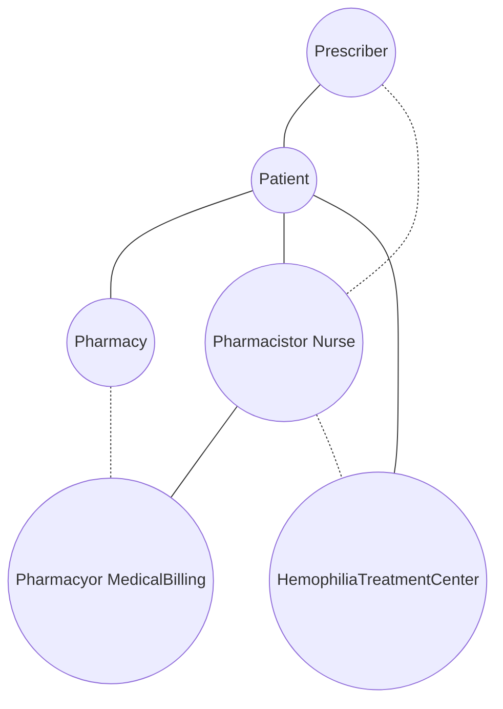

SHIELDS HEALTH SOLUTIONS logo

# Clinical and Quality Outcomes of a Bleeding Disorder Program in a Health System Specialty Pharmacy

Melissa Racine, MS, RN; Kerry Mello-Parker, PharmD, MBA; Martha Stutsky, PharmD, BCPS; Shreevidya Periyasamy, MS HIA; Carolkim Huynh, PharmD, CSP

QR Code

SCAN ME icon

**Disclosure:**

The authors of this presentation have nothing to disclose concerning possible financial or personal relationships with commercial entities that may have a direct or indirect interest in the subject matter of this presentation.

## BACKGROUND

Bleeding disorders such as Hemophilia and Von Willebrand Disease are rare diseases requiring complex management and high-cost medications. An interdisciplinary patient care model for management of hemophilia patients was previously implemented at a Hemophilia Treatment Center (HTC) associated with an integrated health system specialty pharmacy (HSSP). Outcome measures were identified based on payor requirements and established indicators of quality clinical care. Maintenance of a low variance percentage of dose dispensed compared to dose prescribed is an indicator of reduced waste and is often monitored by insurance payors.

Annualized Bleed Rate (ABR) serves as a measure of effectiveness of current treatment regimen.1 Patients who have enough factor concentrate on hand to treat a bleed have reduced complications and therefore lower healthcare resource utilization.2 The objective of this analysis is to evaluate the clinical and quality outcomes of a bleeding disorder program at a HSSP.

Figure 1: Patient Care Model

## METHODS

**Study Design:** Retrospective chart review of clinical and quality data from a patient care management system from January 3, 2020 to April 22, 2024.

**Eligibility:** Adult and pediatric patients from a HTC associated with an academic medical center enrolled in specialty pharmacy program for one year or more with diagnoses of mild, moderate, or severe hemophilia A, hemophilia B, acquired hemophilia, or von Willebrand disease types 1, 2 or 3. Patients receiving desmopressin or antifibrinolytic therapy were excluded.

**Definitions:**

*   **Annualized Bleed Rate:** [(number of bleeds)/(study duration in days) x 365], reported as a median [interquartile range]1

*   **Variance:** Difference between dose of factor dispensed and dose prescribed

**Clinical Outcomes:**

*   **Primary:** Annualized Bleed Rate, absenteeism, presence of on-hand supply of emergency factor, mean variance percentage

*   **Secondary:** Unplanned emergency department (ED) and hospital utilization rates; average patient reported pain score (1-10 scale)

## RESULTS

A total of 46 patients were screened and 29 patients met inclusion criteria, of which 19 (66%) utilized prophylactic treatment and 10 (34%) used on-demand factor concentrate for episodic treatment of bleeds. Table 1 summarizes the characteristics of patients included in the analysis and clinical outcome measures. Patient reported absenteeism was identified in 3 patients (10%) with a range of 1-6 days of missed planned activities.

Table 1: Patient Characteristics and Clinical Outcomes

| Characteristic                                   | N=29    |
| ------------------------------------------------ | ------- |
| Age (n)                                          |         |
| <18                                              | 7       |
| ≥18                                              | 22      |
| Sex (n, %)                                       |         |
| M                                                | 25 (86) |
| F                                                | 4 (14)  |
| Diagnosis (n, %)                                 |         |
| Hemophilia A                                     |         |
| Moderate                                         | 1 (3)   |
| Mild                                             | 1 (3)   |
| Severe                                           | 18 (62) |
| Hemophilia B                                     |         |
| Severe                                           | 2 (7)   |
| Mild                                             | 2 (7)   |
| Acquired Hemophilia                              | 1 (3)   |
| Von Willebrand Disease                           |         |
| Type 1                                           | 3 (10)  |
| Type 2                                           | 1 (3)   |
| Infusion Protocol (n, %)                         |         |
| Prophylactic                                     | 19 (66) |
| On-Demand                                        | 10 (34) |
| Clinical Outcomes                                |         |
| Average Pain Score                               | 1       |
| Absenteeism (n, %)                               | 3 (10)  |
| Unplanned ED and Hospital Utilization Events (n) | 1       |

Figure 2: Annualized Bleed Rate*

| Infusion Protocol | Annualized Bleed Rate |
| ----------------- | --------------------- |
| Episodic          | 1.3                   |
| Prophylactic      | \[illegible]          |

\*Interquartile range [0.545-2.25]

Figure 3: Variance Percentage and Emergency Supply of Factor

| Metric                                 | Percentage |
| -------------------------------------- | ---------- |
| Variance Percentage                    | 2%         |
| Patients with Supply of Factor On Hand | 92%        |

## CONCLUSIONS

This analysis demonstrates positive clinical and QoL outcomes for patients with bleeding disorders managed at a HSSP in partnership with a HTC. The HSSP plays a crucial role in ensuring that patients have sufficient home supply of factor concentrate. The ability to treat bleeds at home leads to fewer treatment delays, less complications, and less hospital/ED utilization.2 The mean variance of dispensed factor concentrate was 2%, below the standard ordering of +/- 10%, showcasing the pharmacy’s ability to minimize medication waste. Measures including pain and absenteeism are strongly influenced by number of bleeds and complications arising from frequent bleeds.

## REFERENCES

1. Chai-Adisaksopha C, Hillis C, Thabane L, et al. A systematic review of definitions and reporting of bleeding outcome measures in haemophilia. Haemophilia 2015;21:731-735.

2. National Hemophilia Foundation, Medical and Scientific Advisory Committee. MASAC recommendations regarding doses of clotting factor concentrate in the home. MASAC Document #242. 2016.

