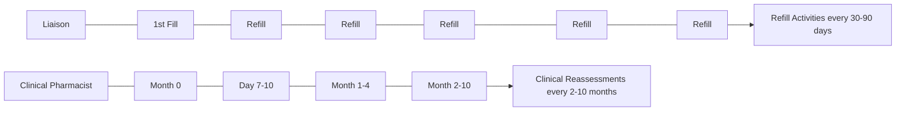
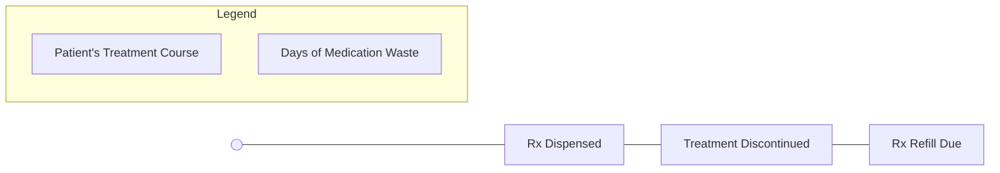

SHIELDS HEALTH SOLUTIONS logo

# Analysis of Oral Oncolytic Waste for Patients Filling at a Health System Specialty Pharmacy

Zarna Patel, PharmD, AAHIVP, CSP;
Chelsey Lindner, PharmD, BCOP, CSP;
Martha Stutsky, PharmD, BCPS;
Tincey Wang, PharmD, AAHIVP, CSP;
Kleona Kolludra, PharmD, AAHIVP, CSP;
Caleb Chun, MA

Speaker icon

## BACKGROUND

Cancer is among the leading causes of death in America, and the rising cost of treatment is increasing the financial burden placed on patients, payers and health systems. While oral oncology medications offer advantages over traditional facility-administered treatments, the frequency of modifications associated with these agents directly contribute to medication waste and ultimately cost incurrence. The objective of this analysis was to evaluate existing oral oncology medication waste events among patients filling at a health system specialty pharmacy (HSSP).

Figure 1: HSSP Program Workflow

## METHODS

**Study Design**: This was a retrospective evaluation of all oral oncology medication fill records from four targeted oncology clinics associated with a HSSP from January 1 through December 31, 2024. Medication discontinuations occurring prior to the next planned refill date (30-90 days from previous fill date) were evaluated to determine whether a medication waste event occurred.

*   **Preventable medication waste events** resulted from dispenses that could have been postponed, filled for a partial quantity or cancelled altogether due to potentially predictable circumstances.

*   **Non-preventable medication waste events** resulted from unforeseen therapy discontinuations.

Figure 2: Medication Waste Event Definition

$$ \text{Waste Cost} = \$AWP \times \frac{\text{Days of Medication Waste}}{\text{Days Covered}} $$

Calendar icon Days of Treatment Dispensed (30-90 days)

**Cost Estimate**: Days’ supply of medication wasted and the drug average wholesale price (AWP) were used to approximate the total cost associated with each medication waste event. Medication AWPs were obtained from Medi-Span for the associated NDC number identified from each waste event.

## RESULTS

Figure 3. Sixty-two medication waste events were identified for 55 unique patients, resulting in a total of $504,160 calculated medication waste. Medication waste events were categorized as either preventable or non-preventable events. Just under half of the identified medication waste events (29/62) were considered preventable. Table 1. The most common medications identified in a medication waste event are listed. Figure 4. The most common reasons for preventable medication waste events were early refills and suspected progression of disease.

Figure 3: Calculated Medication Waste

| Category                  | Value    |
| ------------------------- | -------- |
| Clinic 1                  | Lung     |
| Clinic 2                  | Breast   |
| Clinic 3                  | Prostate |
| Clinic 4                  | Kidney   |
| Total Medication Fills    | 2264     |
| Total Waste Events        | 62       |
| Total Waste Cost          | $504,160 |
| Non-Preventable (33) Cost | $205,634 |
| Preventable (29) Cost     | $298,526 |

Table 1: Top Medications Wasted (Preventable & Non-Preventable)

| Medication          | Number of Events | Associated Waste |
| ------------------- | ---------------- | ---------------- |
| Osimertinib         | 11               | $110,486         |
| Palbociclib         | 7                | $72,668          |
| Abiraterone acetate | 7                | $43,439          |
| Abemaciclib         | 10               | $29,044          |
| Capecitabine        | 4                | $11,667          |

Figure 4: Preventable Waste Event Reasons

| Reason                        | Number of Events |
| ----------------------------- | ---------------- |
| Early refill                  | 7                |
| Suspected disease progression | 7                |
| Known side effect challenges  | 5                |
| No planned start date         | 3                |
| Dose modification             | 3                |
| Planned therapy completion    | 3                |
| Wrong strength ordered        | 1                |

## CONCLUSIONS

Overall, waste events were low in proportion to the total number of medication fills from the target clinics. Considering the prevalence of preventable medication waste events, this retrospective analysis presents an opportunity to implement targeted interventions to minimize oral oncology medication waste and promote cost avoidance.

