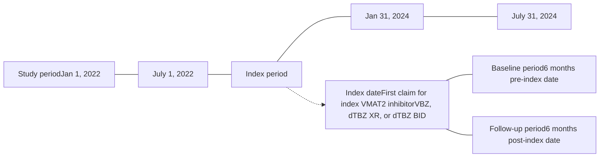

# Comparing real-world therapeutic dose attainment and dosing trends of valbenazine and deutetrabenazine among patients with tardive dyskinesia in a United States claims database

M. Mercedes Perez-Rodriguez,1 Justin Nedzesky,2 Michael Serbin,2 Shivani Pandya,3 Riddhi Doshi,3 Xiaoyu Zhou,3 Hyunwoo Kim,2 Dawn Vanderhoef,2 Morgan Bron2
1Icahn Medical Institute, New York, NY; 2Neurocrine Biosciences, Inc., San Diego, CA; 3IQVIA, Durham, NC

## INTRODUCTION

* Tardive dyskinesia (TD) is a movement disorder characterized by involuntary and repetitive movements.1 It is frequently caused by prolonged exposure to dopamine receptor-blocking agents, particularly antipsychotics, and can severely impact social, emotional, and physical functioning1,2

* Current United States (US) guidelines recommend vesicular monoamine transporter 2 (VMAT2) inhibitors, valbenazine (VBZ), and deutetrabenazine (dTBZ) for first-line treatment of TD1,3-6

* VBZ is administered once daily at an initial dose of 40 mg and dTBZ is administered as either a once-daily extended-release (XR) or twice-daily (BID) formulation, with initial doses of 12 mg once daily and 6 mg twice daily, respectively5,6

## OBJECTIVE

* To compare real-world dosing trends, therapeutic dose attainment, and change in pharmacy costs among patients with TD who initiated VBZ or dTBZ

## METHODS

### Study design

* We conducted a retrospective cohort study using linked data from IQVIA's US longitudinal prescription and professional fee claims databases

* The study period ranged from 1/1/2022 to 7/31/2024 (**Figure 1**). Adult patients with TD were indexed at VMAT2 inhibitor initiation between 7/1/2022 and 1/31/2024. Patient characteristics were assessed during the 6-month baseline period and outcomes were assessed during the 6-month follow-up period

* Eligible patients had ≥1 pharmacy claim during both the 6-month baseline and follow-up periods, ≥1 claim for VBZ or dTBZ (either BID or XR) during the selection period, and ≥1 claim with a diagnosis of TD during the study period

* Patients were stratified into 3 separate cohorts: VBZ, dTBZ BID, or dTBZ XR

* Patients with a VMAT2 inhibitor claim during the baseline period, multiple VMAT2 inhibitor agents on the index date, or a diagnosis of Huntington's disease during the study period were excluded

### Figure 1. Study design

Key: BID, twice daily; dTBZ, deutetrabenazine; VBZ, valbenazine; VMAT2, vesicular monoamine transporter 2; XR, extended release.

### Outcomes

* Based on the minimum efficacious dose in phase 3 clinical trials,7-9 therapeutic dosing thresholds were set at 40 mg/day for VBZ and 24 mg/day for dTBZ

* Outcomes were compared between VBZ and each dTBZ cohort, including monthly dosing trends and therapeutic dose attainment. Doses were rounded to the nearest available dosage form

* Additional outcomes, including dose changes and changes in monthly pharmacy cost, were assessed among a persistent subgroup. Persistence was defined as patients who remained on treatment for the full 6-month follow-up period without discontinuation (defined as a gap of >45 days) or switching agents. Costs were adjusted to 2023 US dollars (USD) using the Consumer Price Index

### Statistical analysis

* The results were analyzed descriptively, and pairwise comparisons were conducted using Chi-square tests for categorical variables, the Wilcoxon rank-sum test for continuous variables, and independent samples *t*-test for means. Statistical significance was indicated by a *P*-value <0.05

## RESULTS

### Patient baseline demographic and clinical characteristics (Table 1)

* In total, the study included 3,527 patients in the VBZ cohort, 2,166 patients in the dTBZ BID cohort, and 326 patients in the dTBZ XR cohort

* Across cohorts, most patients (66%–73%) were female. The mean patient age ranged from 59.6 to 60.3 years

* The most common baseline psychiatric conditions were depression (33%–35%), bipolar disorder (29%–32%), and schizoaffective disorder (15%–17%). Most patients were taking antipsychotic medications (65%–71% across cohorts)

### Table 1. Patient baseline demographic and clinical characteristics

| Characteristic                            | VBZ cohort (N=3,527) | dTBZ BID cohort (N=2,166) | dTBZ XR cohort (N=326) |
| ----------------------------------------- | -------------------- | ------------------------- | ---------------------- |
| Age, years, mean (SD)                     | 59.6 (13.4)          | 60.3 (13.5)               | 60 (13.2)              |
| Gender, female, n (%)                     | 2,448 (69.4)         | 1,574 (72.7)              | 214 (65.6)             |
| Region, n (%)                             |                      |                           |                        |
| Northeast                                 | 533 (15.1)           | 287 (13.3)                | 32 (9.8)               |
| Midwest                                   | 823 (23.3)           | 504 (23.3)                | 72 (22.1)              |
| South                                     | 1,415 (40.1)         | 901 (41.6)                | 151 (46.3)             |
| West                                      | 726 (20.6)           | 462 (21.3)                | 71 (21.8)              |
| Unknown/missing                           | 30 (0.9)             | 12 (0.6)                  | 0 (0.0)                |
| Payer type, n (%)                         |                      |                           |                        |
| Medicare/Medicaid                         | 2,542 (72.1)         | 1,442 (66.6)              | 173 (53.1)             |
| Commercial                                | 956 (27.1)           | 707 (32.6)                | 153 (46.9)             |
| Other/unknown                             | 29 (0.8)             | 17 (0.8)                  | 0 (0)                  |
| Index year                                |                      |                           |                        |
| 2022                                      | 1,157 (32.8)         | 825 (38.1)                | 0 (0.0)                |
| 2023                                      | 2,199 (62.3)         | 1,270 (58.6)              | 286 (87.7)             |
| 2024                                      | 171 (4.8)            | 71 (3.3)                  | 40 (12.3)              |
| Provider specialty,a n (%)                |                      |                           |                        |
| Neurology                                 | 677 (19.2)           | 504 (23.3)                | 64 (19.6)              |
| Geriatrics                                | 15 (0.4)             | 9 (0.4)                   | 2 (0.6)                |
| Primary care provider                     | 229 (6.5)            | 123 (5.7)                 | 20 (6.1)               |
| Nurse practitioner                        | 1,369 (38.8)         | 794 (36.7)                | 128 (39.3)             |
| Physician assistant                       | 297 (8.4)            | 182 (8.4)                 | 38 (11.7)              |
| Psychiatry                                | 868 (24.6)           | 502 (23.2)                | 71 (21.8)              |
| Other/unknown                             | 72 (2.0)             | 52 (2.4)                  | 3 (0.9)                |
| CCI, mean (SD)                            | 1.49 (2.35)          | 1.53 (2.32)               | 1.34 (2.14)            |
| Serious mental illness                    | 2,562 (72.6)         | 1,519 (70.1)              | 226 (69.3)             |
| Psychiatric conditions of interest, n (%) |                      |                           |                        |
| Depression                                | 1,236 (35.0)         | 717 (33.1)                | 115 (35.3)             |
| Schizophrenia                             | 535 (15.2)           | 281 (13.0)                | 40 (12.3)              |
| Schizoaffective disorder                  | 606 (17.2)           | 345 (15.9)                | 49 (15.0)              |
| Bipolar disorder                          | 1,095 (31.0)         | 696 (32.1)                | 96 (29.4)              |
| Anxiety disordersb                        | 1,630 (46.2)         | 953 (44.0)                | 149 (45.7)             |
| Antipsychotic use, n (%)                  |                      |                           |                        |
| First-generation antipsychotics           | 351 (10.0)           | 183 (8.4)                 | 29 (8.9)               |
| Second-generation antipsychotics          | 2,201 (62.4)         | 1,343 (62.0)              | 217 (66.6)             |
| Clozapine                                 | 75 (2.1)             | 25 (1.2)                  | 5 (1.5)                |
| Long-acting injectable antipsychotics     | 250 (7.1)            | 119 (5.5)                 | 21 (6.4)               |

aAssessed on index date; if multiple specialties were identified, then a hierarchy was applied (Neurologist > Psychiatrist > Geriatrics > Primary care physician). bAnxiety disorders included phobia, panic disorder, obsessive-compulsive disorder, and post-traumatic stress disorder.
Key: CCI, Charlson comorbidity index; dTBZ, deutetrabenazine; SD, standard deviation; VBZ, valbenazine; XR, extended release.

### Therapeutic dose attainment

* All VBZ patients (n=3,527) reached a therapeutic dose as the starting dosage strength of VBZ is clinically effective (**Figure 2**)

* Significantly fewer dTBZ patients reached a therapeutic dose within 6 months (BID: 47.5% [n=1,029/2,166]; XR: 54.3% [n=177/326]; both *P* <0.001) (**Figure 2**)

* For those dTBZ patients who did reach a therapeutic dose, it took, on average, 3 to 4 weeks to attain (BID: mean [SD], 24 days [38]; XR: 22 days [30])

* After reaching a therapeutic dose, nearly 10% of dTBZ patients did not maintain a therapeutic dose (BID: 8.5% [n=87/1,029]; XR: 9.6% [n=17/177])

### Figure 2. Monthly dose distribution and therapeutic dose attainment by cohort

| VBZ Time | VBZ Mean Dose (mg) | VBZ Median Dose (mg) | VBZ Therapeutic Threshold (mg) |
| ------------ | ---------------------- | ------------------------ | ---------------------------------- |
| Index dose   | 40                     | 40                       | 40                                 |
| Month 1      | 40                     | 40                       | 40                                 |
| Month 2      | 40                     | 40                       | 40                                 |
| Month 3      | 40                     | 40                       | 40                                 |
| Month 4      | 40                     | 40                       | 40                                 |
| Month 5      | 40                     | 40                       | 40                                 |
| Month 6      | 40                     | 40                       | 40                                 |
| dTBZ BID     |                        |                          |                                    |
| Time         | Mean Dose (mg)         | Median Dose (mg)         | Therapeutic Threshold (mg)         |
| Index dose   | 12                     | 12                       | 24                                 |
| Month 1      | 18                     | 18                       | 24                                 |
| Month 2      | 24                     | 24                       | 24                                 |
| Month 3      | 24                     | 24                       | 24                                 |
| Month 4      | 24                     | 24                       | 24                                 |
| Month 5      | 24                     | 24                       | 24                                 |
| Month 6      | 24                     | 24                       | 24                                 |
| dTBZ XR      |                        |                          |                                    |
| Time         | Mean Dose (mg)         | Median Dose (mg)         | Therapeutic Threshold (mg)         |
| Index dose   | 12                     | 12                       | 24                                 |
| Month 1      | 18                     | 18                       | 24                                 |
| Month 2      | 24                     | 24                       | 24                                 |
| Month 3      | 24                     | 24                       | 24                                 |
| Month 4      | 24                     | 24                       | 24                                 |
| Month 5      | 24                     | 24                       | 24                                 |
| Month 6      | 24                     | 24                       | 24                                 |

Notes: ◇ Diamond indicates mean; - solid horizontal bar in each box indicates median; the upper and lower boundary of the box indicate Q1 and Q3, respectively; the upper and lower boundary indicate minimum and maximum, respectively, excluding outliers; ○ Outliers are plotted as a dot above or below the whiskers; -- the dotted line on each graph represents the therapeutic dose threshold.
Key: BID, twice daily; dTBZ, deutetrabenazine; VBZ, valbenazine; XR, extended release.

### Dosing and cost trends among persistent patients

* The total number of persistent patients per cohort was 1,856 in the VBZ cohort, 1,007 in dTBZ BID, and 126 in the dTBZ XR cohort

* Significantly more dTBZ patients had ≥1 dose change after month 1 compared to VBZ (VBZ: 33.7% [n=626/1,856]; BID: 48.1% [n=484/1,007]; XR: 54.0% [n=68/126]; both *P* <0.001)

* After 6 months, average monthly pharmacy costs increased roughly 3 times more from the index date for dTBZ (BID: $1,656; XR: $1,904) vs VBZ ($601) (**Figure 3**)

### Figure 3. Absolute difference in monthly pharmacy cost compared to index date cost

| Time    | VBZ  | dTBZ XR | dTBZ BID |
| ------- | ---- | ------- | -------- |
| Index   | $0   | $0      | $0       |
| Month 1 | $177 | $430    | $415     |
| Month 2 | $415 | $883    | $715     |
| Month 3 | $563 | $1,320  | $1,132   |
| Month 4 | $584 | $1,582  | $1,386   |
| Month 5 | $546 | $1,701  | $1,533   |
| Month 6 | $601 | $1,952  | $1,656   |

Key: BID, twice daily; dTBZ, deutetrabenazine; VBZ, valbenazine; XR, extended release.

## LIMITATIONS

* This study used open (unadjudicated) claims data from participating plans, which may have incomplete data capture for patients receiving care outside of participating plans

* Drug samples are not captured in claims data, which may limit the understanding of the use and impact of titration packs

## CONCLUSIONS

* To our knowledge, this is the first study to apply therapeutic dosing thresholds based on TD trial results to a real-world population

* Within 6 months, roughly half of dTBZ-treated patients did not reach a therapeutic dose, while all VBZ-treated patients reached a therapeutic dose

* Compared to VBZ, significantly more dTBZ patients experienced a dose change or did not maintain a therapeutic dose, which may represent a clinician and patient burden

* More research is needed to investigate why patients did not reach this therapeutic threshold (eg, tolerability, titration difficulty, effectiveness, etc) compared to VBZ and the economic, clinical, and psychosocial consequences of subtherapeutic VMAT2 inhibitor dosing in TD

## REFERENCES

1. Ricciardi L, et al. *Can J Psychiatry*. Jun 2019;64:388-399.
2. Jain R, et al. *J Clin Psychiatry*. Apr 3 2023;84:22m14694.
3. Keepers GA, et al. *Am J Psychiatry*. 2020;177:868-872.
4. Bhidayasiri R, et al. *J Neurol Sci*. 2018;389:67-75.
5. Ingrezza. Package insert. Neurocrine Biosciences, Inc.; 2017.
6. Austedo. Package insert. Teva Neuroscience Inc; 2017.
7. Hauser RA, et al. *Am J Psychiatry*. 2017;174:476-484.
8. Anderson KE, et al. *Lancet Psychiatry*. Aug 2017;4:595-604.
9. Hauser RA, et al. *Front Neurol*. 2022;13:773999.

**Acknowledgements:** This study was funded by NEUROCRINE® BIOSCIENCES, INC. (San Diego, CA). Writing and graphical assistance were provided by Cencora (Conshohocken, PA). Please contact medinfo@neurocrine.com with any questions.

PRESENTED AT THE NATIONAL ASSOCIATION OF SPECIALTY PHARMACY ANNUAL MEETING SEPTEMBER 14-17, 2025; DENVER, CO

QR Code

NEUROCRINE is a registered trademark of Neurocrine Biosciences, Inc. ©2025 Neurocrine Biosciences, Inc. All Rights Reserved.

