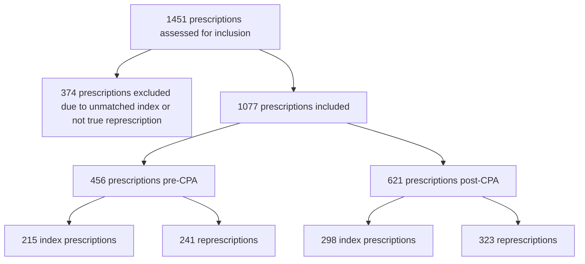

VANDERBILT HEALTH Specialty Pharmacy logo

# Development and Implementation of Collaborative Practice Agreements in an Integrated Health-System Specialty Pharmacy: A Quantitative Analysis

Chelsea P. Renfro1, Katie R. Cruchelow1, Josh DeClercq2, Ailsa Watson3, Autumn D. Zuckerman1 QR Code

1Vanderbilt Specialty Pharmacy, Vanderbilt Health; 2Department of Biostatistics, Vanderbilt University Medical Center; 3Vanderbilt Specialty Pharmacy Student Research Program

## Conclusion

* A reduction in the number of represcriptions was not observed in the first 6 months post-CPA implementation.

* Directly after implementation, clinic staff and pharmacists are identifying workflow processes that work best for their clinics, evidenced by the second highest reason for represcriptions post-CPA being internal miscommunication.

* Additional data is needed to assess the long-term impact of CPAs on the rate represcriptions in IHSSP clinics.

## Purpose

CPAs within IHSSPs may improve specialty medication management and decrease administrative burden for clinic staff.

The purpose of this study was to evaluate the impact of CPA implementation on rate of represcriptions to determine if CPAs decreased the administrative burden in an IHSSP setting.

## Study Design, Setting, and Population

Single-center, retrospective cohort analysis of data collected from an electronic medical record.

Patients were included in the analysis if they had a specialty medication generated in a VSP clinic where a CPA was implemented (Figure 1).

## Results

### Table 1. Patient Demographics (n=457)

| Characteristics                       | Pre-CPAn=178; n (%) | Post-CPAn=253; n (%) | Bothn=26; n (%) |
| ------------------------------------- | ------------------- | -------------------- | --------------- |
| Age (at represcription), median (IQR) | 47 (34 – 59)        | 48 (34 – 59)         | 45 (37 – 58)    |
| Gender, Female                        | 94 (53)             | 129 (51)             | 9 (35)          |
| Race, White                           | 133 (75)            | 197 (78)             | 23 (89)         |
| Clinic                                |                     |                      |                 |
| Cystic Fibrosis                       | 32 (18)             | 31 (12)              | 3 (12)          |
| Hemostasis – Adult and Pediatric      | 15 (8)              | 25 (10)              | 2 (8)           |
| Hepatology – Adult                    | 16 (9)              | 31 (12)              | 1 (4)           |
| Hepatology – Pediatric                | 0 (0)               | 2 (1)                | 0 (0)           |
| Infectious Diseases                   | 19 (11)             | 14 (6)               | 4 (15)          |
| Movement Disorders                    | 36 (20)             | 49 (19)              | 2 (8)           |
| Multiple Sclerosis                    | 60 (34)             | 101 (40)             | 14 (54)         |

Patients listed have at least 1 index medication with a represcription.

Pre-CPA = 204 patients with 215 index prescriptions and post-CPA = 279 patients with 298 index prescriptions

### Fig 3. Represcription Rate

| Period   | Represcription Rate (%) |
| -------- | ----------------------- |
| Pre-CPA  | 38                      |
| Post-CPA | 41                      |

There was not a statistically significant difference between represcribing rates pre- and post-CPA implementation (p=0.445).

Represcription rate was calculated as: number of index prescriptions with an associated represcription / number of index prescriptions within the study period.

### Fig 4. Pharmacist Prescriptions

| Category                 | Percentage (%) |
| ------------------------ | -------------- |
| Pharmacist Prescriptions | 36             |

Out of the 621 prescriptions generated in the 6 months post-CPA by all health care providers, pharmacists generated 36% (n=226). This highlights the opportunity for pharmacists operating within a CPA to contribute to the number of patients cared for and decrease physician and clinic staff workload.

## Figure 1. CPA Implementation Timeline

* **2021 SEPTEMBER**
    - Multiple Sclerosis and Neuroimmunology (MS): September 1, 2021
    - Viral Hepatitis/Infectious Diseases (ID): September 20, 2021
* **2022 APRIL**
    - Hemostasis (Adult and Pediatric): April 6, 2022
    - Hepatology (Adult and Pediatric): April 6, 2022
* **2022 JUNE**
    - Neurology-Movement Disorders: June 1, 2022
    - Cystic Fibrosis (CF): June 6, 2022

## Study Methods

**Primary Outcome**: Rate of represcriptions (defined as another prescription generated from the same clinic for the same patient for any specialty medication within 14 days following the index specialty medication) by any health care provider.

**Secondary Outcomes**:
1) Number and type of prescriptions generated by clinical pharmacists
2) Reasons for represcribing

**Data Analysis**: Data were collected 6 months before and after the index date (defined as the date the CPA went live in each clinic). The Pearson’s Chi-squared test was used for comparison of represcription rates pre- and post-CPA implementation.

### Fig 5. Total Prescriptions Generated by Pharmacist Post-CPA

| Clinic                    | Pharmacist Prescriptions (n/Total) |
| ------------------------- | ---------------------------------- |
| Movement Disorder         | n = 31/115                         |
| Adult Hepatology          | n = 21/69                          |
| Adult and Peds Hematology | n = 19/58                          |
| Multiple Sclerosis        | n = 113/255                        |
| Cystic Fibrosis           | n = 39/76                          |
| Peds Hepatology           | n = 3/5                            |

Percent of prescriptions within each clinic

## Figure 2. Prescription Sample Attrition

### Fig 6. Most Common Reasons for Represcribing

| Represcribing Reason                                       | Pre-CPA (n=241) | Post-CPA (n=323) |
| ---------------------------------------------------------- | --------------- | ---------------- |
| Modification of destination pharmacy                       | 44%             | 42%              |
| Other                                                      | 6%              | 10%              |
| Small supply followed by full supply after appointment/lab | 5%              | 10%              |
| Duplicate refill request sent by external pharmacy         | 7%              | 7%               |
| Clarification for quantity written and refills authorized  | 5%              | 6%               |
| Clarification for unclear or incorrect directions          | 6%              | 5%               |
| Drug restrictions (payor)                                  | 7%              | 3%               |
| Prior approval process                                     | 3%              | 5%               |
| Patient assistance program                                 | 3%              | 3%               |
| Clarification for dosing                                   | 2%              | 4%               |

**Other reasons for represcribing**:
* Use of samples
* Internal miscommunication
* Duplicate order sent

Multiple reasons could be identified for each represcription

Acknowledgements: Benny Jemmott, Amy Mitchell, Matt Phillips

CPA = Collaborative Practice Agreement; IHSSP = Integrated Health-System Specialty Pharmacy; VSP = Vanderbilt Specialty Pharmacy; IQR = Interquartile range

Follow us on X at @vumc_spec_pharmacy

