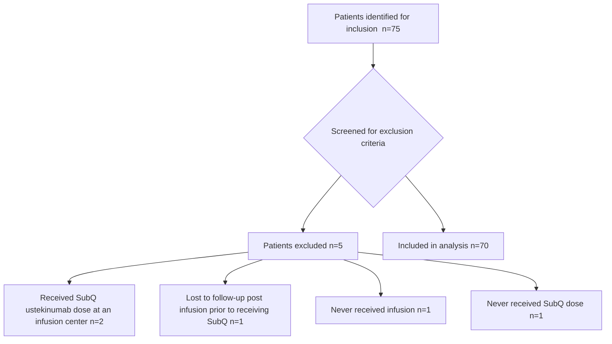

VANDERBILT UNIVERSITY MEDICAL CENTER logo

# Ustekinumab Infusion to Subcutaneous Transition: Coordinating Care and Identifying Potential Gaps

Chelsea P. Renfro, PharmD, CHSE1; Rachael Baggett, PharmD Candidate2; Jessica Fann, PharmD1; Patrick Nichols, PharmD, CSP1; Miranda Kozlicki, PharmD1; Josh DeClercq, MS3; Leena Choi, PhD3; Autumn D. Zuckerman, PharmD, CSP1

QR Code

1Vanderbilt Specialty Pharmacy, Vanderbilt Health; 2Vanderbilt Specialty Pharmacy Student Research Program; 3Department of Biostatistics, Vanderbilt University Medical Center;

## Conclusion
* Patients transitioning from ustekinumab IV infusion to SubQ maintenance dosing may experience delays due to PA requirements.
* SubQ prescriptions from the integrated health-system specialty pharmacy were more likely to ship in the appropriate timeframe window post-infusion.

## Purpose

Evaluate factors impacting the transition timing from clinic administered intravenous (IV) infusion to self-administered, subcutaneous (SubQ) injection ustekinumab for Crohn’s disease (CD) and Ulcerative Colitis (UC) and potential delays or barriers in the patient journey

## Study Design and Setting

Single-center, retrospective cohort analysis of data collected from electronic medication records and specialty pharmacy management system

Patients prescribed ustekinumab for CD or UC by a Vanderbilt University Medical Center (VUMC) provider

## Results

### Table 1. Patient Demographics (n=70)

| Characteristic                      | VSPn=33n (%) | Non-VSPn=37n (%) |
| ----------------------------------- | ------------ | ---------------- |
| Age (at time of SubQ), median (IQR) | 44 (29 – 60) | 32 (27 – 39)     |
| Female                              | 20 (61)      | 22 (60)          |
| White                               | 31 (94)      | 32 (87)          |
| Diagnosis                           |              |                  |
| Crohn’s Disease                     | 24 (73)      | 22 (60)          |
| Ulcerative Colitis                  | 9 (27)       | 15 (41)          |
| Commercial insurance                | 21 (64)      | 34 (92)          |
| Infusion received at VUMC           | 9 (27)       | 16 (43)          |

## Study Methods

**Inclusion and Exclusion Criteria**
* **Inclusion**: Patients prescribed ustekinumab for CD or UC by a VUMC provider between 11/1/21 – 3/31/22
* **Exclusion**: Patients who never received an infusion or SubQ dose, received the SubQ dose at an infusion center, or lost to follow-up

### Figure 1. Study Attrition

**Outcome Measures**
* **Primary outcomes**: 1) Time from decision to treat with ustekinumab to SubQ shipment date and 2) Number of patients with a SubQ ustekinumab shipments 4-8 weeks post-infusion
* **Secondary outcomes**: Time between each step in the patient journey

**Data Analysis**
A logistic regression model was utilized to test for associations between shipment of SubQ within the appropriate window and age, insurance type (commercial vs not commercial) and whether the patient filled at VSP

### Prior Authorization Approval Process
**8 (11%) initial SubQ PAs were denied**
* Formulary alternative required (n=6)
* Patient not meeting criteria (n=1)
* Infusion completion required prior to SubQ approval (n=1)

### Figure 2. Patient Journey from Ustekinumab Infusion to SubQ

| Step Transition                                                    | Time (Median (IQR) days) |
| ------------------------------------------------------------------ | ------------------------ |
| Decision to treat with ustekinumab → Infusion orders               | 1 (0-10) days            |
| Infusion orders → Infusion received                                | 15 (1-26) days           |
| Decision to treat with ustekinumab → Submit SubQ PA                | 3 (1-8) days             |
| Infusion received → SubQ shipment (goal = 4-8 weeks post-infusion) | 58 (39-77) days          |
| SubQ shipment → SubQ administered (goal = 6-8 weeks post-infusion) |                          |

All values reported are listed as: median (IQR)

### Figure 3. Primary Outcome Measures

| Measure                                                           | Non-VSP    | VSP        |
| ----------------------------------------------------------------- | ---------- | ---------- |
| Days from treatment decision to medication shipment, median (IQR) | 55 (37-79) | 71 (59-82) |
| Patients with goal SubQ shipment time (4-8 weeks post-infusion)   | \~35%      | \~55%      |

\* Receiving a SubQ shipment prior to infusion may lead to waste if the patient does not tolerate the infusion.

VSP patients had 2.5 times higher odds of having medication shipped within 4 to 8 weeks from infusion (OR 2.5, 95% CI 0.8 - 7.8, p = 0.126)

VSP = Vanderbilt Specialty Pharmacy; PA = prior authorization

