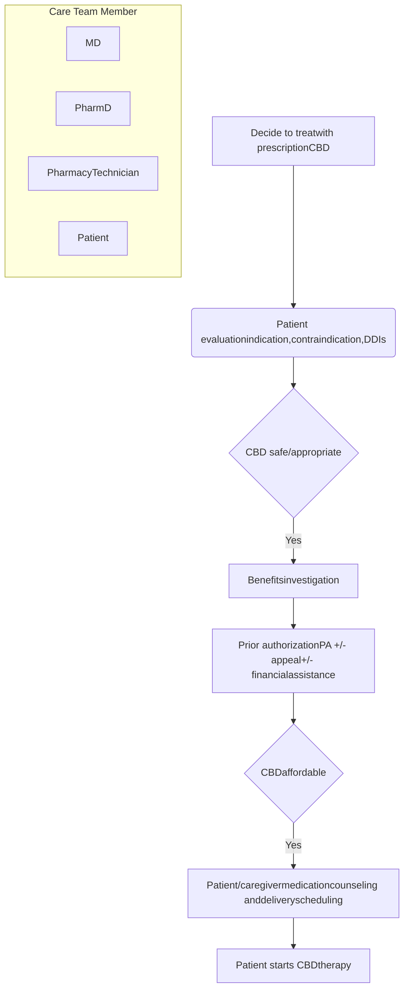
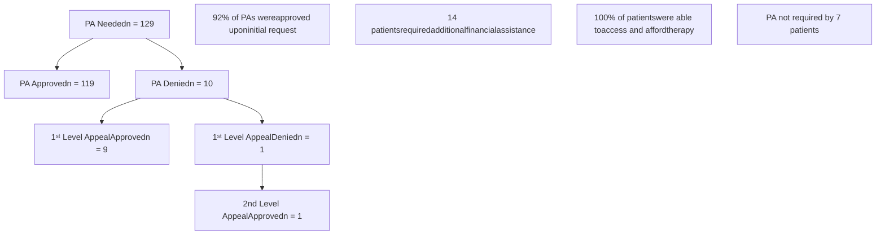

# Role of Specialty Pharmacist in Cannabidiol Use Vanderbilt University Medical Center logo

Kayla Johnson, PharmD, BCPS, BCPP1 | Holly Dial, PharmD Candidate2 | Wendi Owens, CPhT1 | Josh DeClercq, MS3 | Leena Choi, PhD3 | Autumn D. Zuckerman, PharmD, BCPS, AAHIVP, CSP1 | Nisha B. Shah, PharmD1
1Vanderbilt Specialty Pharmacy, Vanderbilt University Medical Center; 2Lipscomb University College of Pharmacy; 3Department of Biostatistics, Vanderbilt University Medical Center

## BACKGROUND

* Prescription cannabidiol (CBD) is approved for the treatment of Dravet, Lennox Gaustaut, and Tuberous Sclerosis Syndromes as adjunct therapy in combination with other anti-epileptic drugs (AEDs).1

* CBD may affect multiple metabolism pathways, leading to a variety of pharmacodynamic (PD) and pharmacokinetic (PK) drug-drug interactions (DDI). Therefore, specialty pharmacists can play an important role in ensuring safe treatment initiation and management.

## STUDY OBJECTIVE

Describe the number and type of actions performed by a neurology specialty pharmacist at time of prescription CBD initiation

Figure 1. Role of Integrated Neurology Specialty Pharmacist

## METHODS

| Design          | Single-center, retrospective cohort study                                                                                                               |
| --------------- | ------------------------------------------------------------------------------------------------------------------------------------------------------- |
| Inclusion       | All patients prescribed CBD for the management of a seizure disorder by the center’s outpatient neurology clinics from January 1, 2019 – April 30, 2020 |
| Exclusion       | Access and fulfillment of prescription CBD was not handled by the integrated specialty pharmacy or participation in a prescription CBD clinical trial   |
| Data sources    | Electronic health record and specialty pharmacy management system                                                                                       |
| PK Interactions | An interaction involving metabolism pathways which effects the risk of side effects, toxicity, or therapeutic control                                   |
| PD Interactions | An interaction involving additive side effect risks without altering medication levels                                                                  |

## RESULTS

Table 1. Cohort Demographics (N = 136)

|                             | Pediatric (N=92) % (n) | Adult (N=44) % (n) |
| --------------------------- | -------------------------- | ---------------------- |
| Age, years \[median, (IQR)] | 10 (5 – 14)                | 28 (21 – 44)           |
| Gender, female              | 47 (43)                    | 57 (25)                |
| Race, white                 | 84 (77)                    | 86 (38)                |
| Insurance type              |                            |                        |
| Medicaid/Medicare           | 73 (67)                    | 78 (34)                |
| Commercial                  | 20 (18)                    | 23 (10)                |
| Tricare                     | 8 (7)                      | --                     |
| Height, cm \[median, (IQR)] | 130 (102 – 147)            | 164 (153 – 173)        |
| Weight, kg \[median, (IQR)] | 29 (17 – 38)               | 62 (49 – 76)           |
| Lennox-Gastaut Syndrome     | 89 (82)                    | 80 (35)                |

IQR = Interquartile range

Figure 2. Number and Type of Pharmacist Actions at CBD Initiation

| Action Type                  | Number of Actions |
| ---------------------------- | ----------------- |
| DDI Management               | 236               |
| Patient/Caregiver Education  | 136               |
| Medication Access Navigation | 154               |

Figure 3. PA Outcomes

Figure 4. Types of DDI

| DDI Type | Count |
| -------- | ----- |
| PK + PD  | 45    |
| PK       | 22    |
| PD       | 42    |
| None     | 27    |

Figure 5. Outcomes of DDI Management (N = 236)

| Prescription CBD Interacting Medication              | PharmD Management of DDI                             |
| ---------------------------------------------------- | ---------------------------------------------------- |
| Antidepressant (n = 8, 3.4%)                         | No change, pharmacist counseling only (n = 210, 89%) |
| Antihistamine (n = 10, 4.2%)                         |                                                      |
| Antipsychotic (n = 6, 2.5%)                          |                                                      |
| Benzodiazepines (excluding clobazam) (n = 58, 24.6%) |                                                      |
| Carbamazepine (n = 1, 0.4%)                          |                                                      |
| Clobazam (n = 63, 26.7%)                             |                                                      |
| mTor inhibitor (n = 1, 0.4%)                         |                                                      |
| Other AEDs (n = 31, 13.1%)                           |                                                      |
| Other medications (n = 9, 3.8%)                      |                                                      |
| Phenobarbital (n = 5, 2.1%)                          |                                                      |
| Valproic acid (n = 26, 11%)                          |                                                      |
| Artisinal CBD (n = 18, 7.6%)                         | Other agent dose change (n = 6, 2.5%)                |
|                                                      | Other agent stopped (n = 20, 8.5%)                   |

* The most common DDIs were benzodiazepines (24.6%), clobazam (26.7%), other AEDs (13.1%), and valproic acid (11%)

## CONCLUSIONS

* Our study provides previously unavailable data on real-world management of patients utilizing an integrated specialty pharmacy at time of prescription CBD initiation.

* Our findings demonstrate the integral role of a neurology specialty pharmacist in securing insurance approval, educating patients, and managing possible DDIs to ensure safe initiation of prescription CBD therapy.

* Further research is ongoing to evaluate the role of a neurology specialty pharmacist in the long-term management of this patient population.

References: 1. Epidiolex (cannabidiol) oral solution [package insert]. Carlsbad, CA: Greenwich Biosciences, Inc.; April 2020. Authors of this study have the following financial or personal relationships with commercial entities that may have a direct or indirect interest in the subject matter of this presentation: Autumn Zuckerman – Pfizer, AstraZeneca; Nisha Shah – Pfizer, AstraZeneca.

