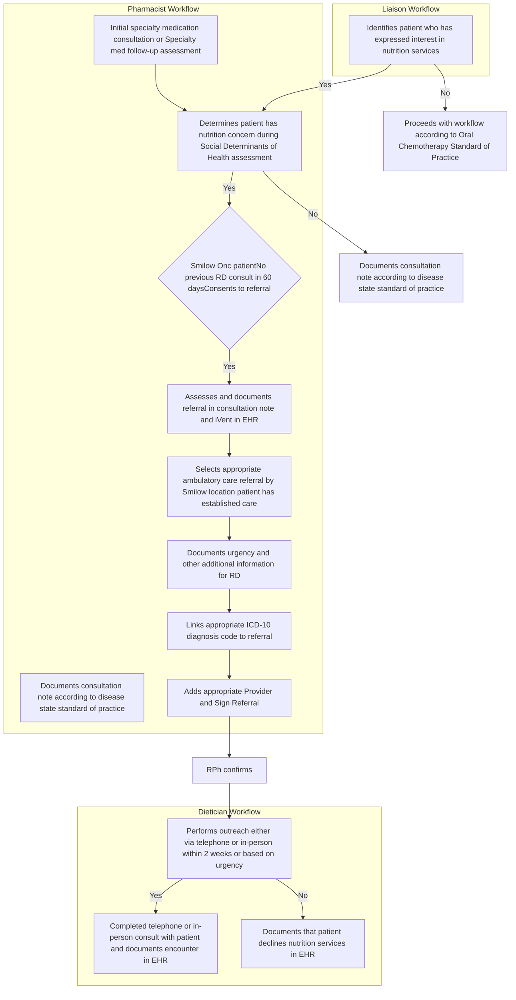

Yale New Haven Health logo

# Collaborative Cancer Nutrition Referral Program

Matthew Merola, PharmD; Kimhouy Tong, PharmD, BCPS; Terri Sue Rubino, PharmD, CSP; Vinay Sawant, RPh, MPH, MBA

Yale New Haven Health, Department of Pharmacy, New Haven, CT

NASP National Association of Specialty Pharmacy logo

## Background

* Social determinants of health (SDoH) have become a focus of care in health system agendas.

* Specialty pharmacy accreditation standards include a requirement to triage identified SDoH issues.

* One SDoH gap identified by the Yale New Haven Health (YNHH) health system specialty pharmacy (HSSP), Outpatient Pharmacy Services (OPS), was a lack of awareness about nutrition support/education offered to YNHH Smilow Cancer Hospital Care Center patients.

* There is an opportunity to leverage health system resources to comprehensively support nutrition needs of oncology patients on their medication journey.

## Objectives

* Develop and implement a referral program focused on nutrition counseling for health system oncology patients receiving oral chemotherapy.

## Results

| Quarter | Months     | Number of Referrals |
| ------- | ---------- | ------------------- |
| Q1      | June-Sept  | 24                  |
| Q2      | Oct-Dec    | 12                  |
| Q3      | Jan-March  | 11                  |
| Q4      | April-June | 2                   |
| Total   |            | 49                  |

| Referral Program Efficiency                        | Referral Program Efficiency | Avg  |
| -------------------------------------------------- | --------------------------- | ---- |
| Time from Referral Placement to RD outreach (days) |                             | 4.83 |
| Time from Referral Placement to RD consult (days)  |                             | 7.09 |
| Length of Consultation (minutes)                   |                             | 26.2 |

## Discussion

* Approximately 1600 oncology patients were assessed by specialty pharmacists for nutrition support needs.

* The number of referrals were highest (~50%) around the program implementation where pharmacists were recently trained on how to ask, identify, and proceed with the nutrition referral.

* The thorough creation of and collaboration on the Standard of Practice (SoP) contributed to the success of the program. The quarterly reviews performed did not identify any SoP optimizations were required.

## Conclusions

* An interdisciplinary nutrition referral program for oral chemotherapy patients can empower HSSPs to identify and refer SDoH issues for specialty patients.

## Methods

| Timeline     | Activities                                                                                                                                                 |
| ------------ | ---------------------------------------------------------------------------------------------------------------------------------------------------------- |
| FY2021 Q1    | \* Overview and vision of program \* Project Charter created \* Clinic education about OPS \* Nutrition Assessment template                    |
| FY2021 Q2    | \* Referral workflow created \* Initial SBAR for staff awareness \* Discussion with Legal \* Confirmation that service is free                 |
| FY2021 Q3    | \* Establish relationship with RDs \* Creation of OPS/RD FAQ sheet \* Optimize EHR to document/send referral \* Nutrition team inbasket live   |
| FY2021 Q4    | \* Finalized Standard of Practice \* Screening questions & iVent live \* Training sessions for RPh/liaisons \* Finalized SBAR & Go-Live 6/1/21 |
| FY2022 Q1-Q4 | \* Track referral data to gauge success of program \* Quarterly review to identify and implement changes as needed                                     |

## Workflow Diagram

| Referral Outcomes                    | n (%)     |
| ------------------------------------ | --------- |
| Patients reached                     | 39 (79.6) |
| Patients consulted                   | 36 (73.5) |
| Patients inappropriately referred    | 1 (2)     |
| Patients who declined at RD outreach | 3 (6.1)   |

## Barriers / Limitations

### Barriers

* **Rapidly expanding**- OPS has grown, and is continuing to, since the launch of the nutrition referral program. There is a need for new pharmacy staff training and education on the process.

* **Sustainability**- steady decline of referrals in Q4 compared to Q1. Need for refresher education on how to identify and refer patients in need of our services.

### Limitations

* Nutrition referral program training provided to team dedicated to oncology patients.

* Highly integrated EHR needed to enable seamless assessment, implementation, and documentation by liaison, RPh, and RD.

* YNHH RDs able to absorb additional referrals generated by the program.

* Free service provided only to Smilow Cancer Hospital Care Center at YNHH oncology patients.

## Future Directions

* Training for new staff and refresher for current

* Continue optimization of workflow

* Expand the implementation of this program to other disease states

* Incorporate documentation of clinical endpoints into workflow

**SBAR**: Situation, Background, Assessment, Recommendation
**RD**: Registered Dietician
**iVent**: EHR Intervention documentation

**Acknowledgements**: Along with the authors of the poster presentation, we would like to also extend acknowledgement to Danijela Krivokuca, CPhT for her role in helping to develop the program. We would also like to thank Lisa Mastroianni and the Smilow Registered Dietician team for their collaboration on the nutrition specialty referral program. Lastly, we would like to thank the Smilow Cancer Hospital Care Centers for allowing this program to be offered free of charge for our shared patient population.

**Disclosure**: The authors of this presentation have the following to disclose concerning possible financial or personal relationships with commercial entities that may have a direct or indirect interest in the subject matter of this presentation: Matthew Merola, PharmD; Kimhouy Tong, PharmD, BCPS; Terri Sue Bukowski, PharmD, CSP; Vinay Sawant, RPh, MPH, MBA: nothing to disclose.

NASP Annual Meeting & Expo 2021. September 27-30, 2021

