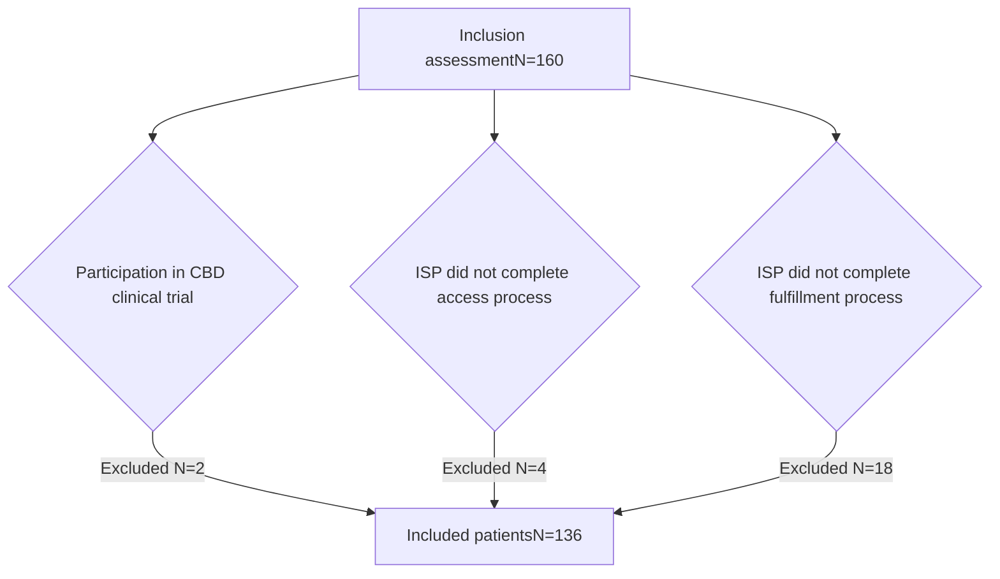

# CANNABIDIOL USE AT AN INTEGRATED CARE CENTER VANDERBILT UNIVERSITY MEDICAL CENTER logo

Kayla Johnson, PharmD, BCPS, BCPP1 | Holly Dial, PharmD Candidate2 | Wendi Owens, CPhT1 | Josh DeClercq, MS3 | Leena Choi, PhD3 | Autumn D. Zuckerman, PharmD, BCPS, AAHIVP, CSP1 | Nisha B. Shah, PharmD1
1Vanderbilt Specialty Pharmacy, Vanderbilt University Medical Center, Nashville, TN; 2Lipscomb University College of Pharmacy, Nashville, TN; 3Department of Biostatistics, Vanderbilt University Medical Center

## BACKGROUND

* Prescription cannabidiol (CBD) is approved for the management of patients ≥ 1 years old with Dravet, Lennox-Gastaut, or Tuberous Sclerosis Syndromes as adjunct therapy with other anti-epileptic drugs (AEDs).1

* Limited data describing real-world use of prescription CBD exists; such data would provide valuable insights into post-approval practices.

## OBJECTIVE

To describe patient characteristics and medication use patterns for prescription CBD within an integrated care center.

## METHODS

| Design       | Single-center, retrospective cohort study                                                                                                    |
| ------------ | -------------------------------------------------------------------------------------------------------------------------------------------- |
| Inclusion    | Patients prescribed CBD through the center’s neurology clinic from January 2019 through April 2020                                           |
| Exclusion    | Clinical trial participation or prescription CBD access or fulfillment process not completed by center’s integrated specialty pharmacy (ISP) |
| Data sources | Electronic health records and specialty pharmacy patient management database                                                                 |

## RESULTS

**Table 1. Patient Characteristics and Medication Use**

| Characteristic              | Pediatric (N=92)% (N) | Adult (N=44)% (N) |
| --------------------------- | --------------------- | ----------------- |
| Age, years \[median, (IQR)] | 10 (5 – 14)           | 28 (21 – 44)      |
| Gender, female              | 47 (43)               | 57 (25)           |
| Race, white                 | 84 (77)               | 86 (38)           |
| Insurance type              |                       |                   |
| Medicaid                    | 73 (67)               | 32 (14)           |
| Commercial                  | 20 (18)               | 23 (10)           |
| Medicare                    | --                    | 46 (20)           |
| Tricare                     | 8 (7)                 | 0 (0)             |
| Height, cm \[median, (IQR)] | 130 (102 – 147)       | 164 (153 – 173)   |
| Weight, kg \[median, (IQR)] | 29 (17 – 38)          | 62 (49 – 76)      |
| Diagnosis                   |                       |                   |
| Lennox-Gastaut Syndrome     | 89 (82)               | 80 (35)           |
| Dravet Syndrome             | 4 (4)                 | 5 (2)             |
| Tuberous Sclerosis          | 1 (1)                 | 2 (1)             |
| Other                       | 5 (5)                 | 14 (6)            |
| Route of administration     |                       |                   |
| By mouth                    | 78 (72)               | 93 (41)           |
| G-tube                      | 19 (17)               | 7 (3)             |
| Other\*                     | 3 (3)                 | 0 (0)             |

IQR = Interquartile range
\*Other: J-tube, combination of by mouth and g-tube administration

**Figure 3. Prior and Concurrent AEDs at Time of Prescription CBD Initiation**

| AED           | Previous (%) | Concurrent (%) |
| ------------- | ------------ | -------------- |
| Levetiracetam | 70           | 45             |
| Clobazam      | 65           | 50             |
| Topiramate    | 55           | 15             |
| Valproic acid | 50           | 20             |
| Lamotrigine   | 45           | 25             |
| Zonisamide    | 40           | 15             |
| Lacosamide    | 35           | 15             |
| Clonazepam    | 35           | 10             |
| Oxcarbazepine | 35           | 10             |
| Rufinamide    | 30           | 10             |
| Phenobarbital | 25           | 5              |
| Artisinal CBD | 20           | 0              |
| Other AEDs    | 15           | 10             |
| Gabapentin    | 15           | 0              |
| Phenytoin     | 10           | 0              |
| Carbamazepine | 5            | 5              |
| Perampanel    | 5            | 5              |
| Vigabatrin    | 5            | 5              |
| Ethosuximide  | 5            | 5              |
| Pregabalin    | 5            | 0              |
| Felbamate     | 5            | 0              |
| Diazepam      | 5            | 5              |
| Brivaracetam  | 5            | 0              |
| Clorazepate   | 5            | 0              |

* The median number of prior AEDs trialed was 7 (IQR 5, 11).

* A median number of 3 (IQR 2, 4) concurrent AEDs were continued when the patient initiated prescription CBD therapy.

## RESULTS

**Figure 1. Patient Attrition**

**Figure 2. Prior Non-Pharmacological Therapies**

| Therapy        | Count (n) |
| -------------- | --------- |
| None           | 68        |
| Surgery        | 19        |
| VNS            | 36        |
| Ketogenic diet | 46        |
| DBS            | 1         |

50% of patients failed at least one non-pharmacological therapy.

The most commonly failed non-pharmacological therapy was the ketogenic diet (34%).

VNS = vagal nerve stimulation DBS = deep brain stimulation

## CONCLUSIONS

* Our findings reveal prominent patient characteristics and the often-complex medication use patterns of patients prescribed CBD.

* Further studies are needed to evaluate the long-term outcomes of prescription CBD therapy in a real-world setting.

References: 1. Epidiolex (cannabidiol) oral solution [package insert]. Carlsbad, CA: Greenwich Biosciences, Inc.; April 2020. Authors of this study have the following financial or personal relationships with commercial entities that may have a direct or indirect interest in the subject matter of this presentation: Autumn Zuckerman – Pfizer, AstraZeneca; Nisha Shah – Pfizer, AstraZeneca.

