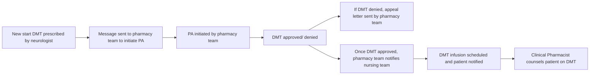

Novant Health logo

# Impact of specialty pharmacy taking ownership of the prior authorization process of Multiple Sclerosis specialty medications to increase access to disease-modifying therapy (DMT)

Miranda Whetstone, CPhT; Julie Kidd, PharmD, MPH, BCPS, CPP; Jeff Reichard, PharmD, MS, BCOP, BCPS
Lisa Blanchette, PharmD, MHA, BCPS-AQ ID; Shelley Sigmon, MA

## Objectives

* Increase the number of approved authorizations of infusible disease-modifying therapy (DMT).

* Increase the timeliness of authorizations in order for patients to receive appropriate and timely DMT.

## Background

* Novant Health is a not-for-profit, integrated healthcare system in Virginia, North Carolina, South Carolina, and Georgia with 15 medical centers and 580 outpatient locations.

* Novant Health Specialty Pharmacy (NHSP) is projected to supply over 15,000 specialty prescriptions to patients in 2019.

* Novant Health Center for Multiple Sclerosis (MS) located in Charlotte, NC provides team-based care to over 600 patients with MS.

* MS is an autoimmune inflammatory demyelinating disease of the central nervous system that is a leading cause of disability.

* DMT have been approved and introduced to the market to treat MS but are costly and require Prior Authorizations (PA) which can lead to barriers in accessing DMT.

## Methods

* Patients were included if initiated on an infusible DMT for MS between September 2018 – April 2019.

* A note was sent in the electronic medical record (EMR) to the pharmacy team to initiate the PA process when the neurologist prescribed a new DMT.

* Communication was made to the neurology team regarding the status of the DMT PA before scheduling the patient for their infusion.

## Program Description

* This project was a response to the need for timely PA approval for patients needing infusible DMT within a large neurology practice.

* A previous project reviewed the impact of NHSP taking ownership of all DMTs in regards to approved authorizations and timeliness of the approval after observation by an embedded clinical pharmacist revealed that many patients were being delayed in starting their DMT due to lack of PA approval or through delay in the medical team having adequate time to start the PA process. Additionally, many patients were receiving significant bills after their infusions were complete due to lack of PA approval prior to an infusible DMT.

* After this aforementioned project highlighting the need and cost savings to the institution, an additional staff member was added to focus on infusible DMT PA.

## NEW PA'S COMPLETED (N=92)

| Category | Count | Percentage |
| -------- | ----- | ---------- |
| Approved | 83    | 90%        |
| Denied   | 3     | 3%         |
| Other    | 6     | 7%         |

## Results

**Access:**

* A total of 92 patients had a new PA completed. Eighty-three (90%) authorizations were approved and 3 (3%) were denied.

* Of the 3 denials, additional appeals were done either by completing appeal letters or scheduling peer-to-peers.

* Five PA’s were cancelled. Three of these required authorization through pharmacy benefits verses medical benefits, one received free medication through the manufacturer thus the PA was cancelled, and one did not have a referral from the Veterans Health Administration (VA) to be seen outside of the VA. One authorization was not covered due to the plan only covering preventative care.

* Overall, 89 (96.7%) of patients received their DMT infusion.

**Timeliness:**

* Turnaround time for PA’s was reduced to 24-72 hours with the onboarding of NHSP within the clinic. This is a turnaround from previous PA’s timeliness which took more than 72 hours.

## Conclusions

* This program provides a new service to increase the number of approved infusible DMT to improve access for MS patients.

* Utilizing a multi-disciplinary team to organize this program helped to optimize clinical outcomes in a MS clinic.

Novant Health logo

Disclosures: None of the authors have anything to disclose as it relates to this topic.

