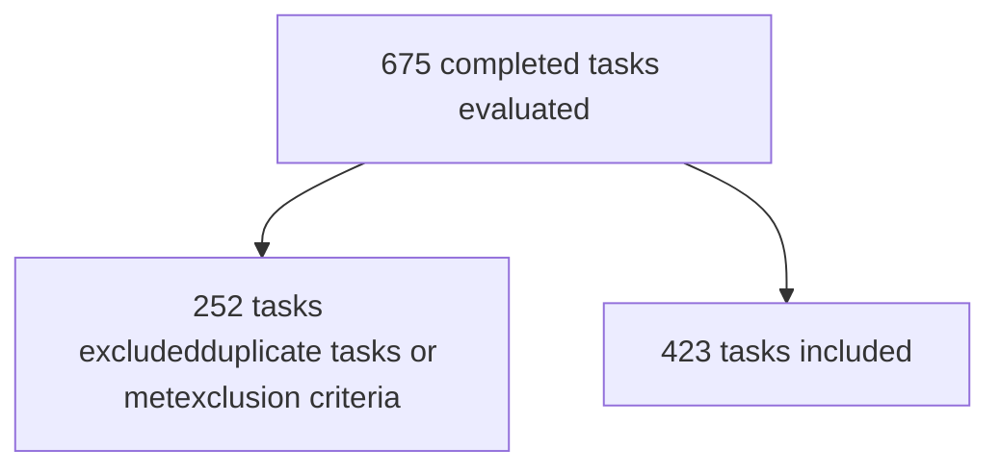

UH Meds logo ACHC ACCREDITED logo urac ACCREDITED logo

# Appeal Approval Rating of Specialty Pharmacists

Alexis Mod, PharmD1; Emily Acheson, PharmD, CSP1; Karen Houser, RPh, CSP1; Lisa Kenney, PharmD1; Svetlana Lyamkin, PharmD, CSP1; Allene Naples, PharmD, MBA, CSP, RYT-200
1. University Hospitals Specialty Pharmacy, Warrensville Heights, Ohio

ashp logo Accredited

# Background

* University Hospitals Specialty Pharmacy (UHSP) is an integrated specialty pharmacy model and employs both centralized and decentralized Clinical Specialty Pharmacists. After prior authorization (PA) denial, these pharmacists with subject matter expertise complete an appeal letter to the insurance company, with the goal of obtaining medication authorization.

* The 2021 American Medical Association (AMA) Prior Authorization Physician Surveys showed that the majority of providers reported the current insurance prior authorization process can cause delays in access to care, treatment abandonment and adverse events.1 In 2016, physicians reported only 7% of PA requests were approved on appeal.2

* Currently, no data exists to show the impact of a pharmacist-lead appeal initiative at an integrated healthy-system specialty pharmacy.

# Objectives

The objective of this study is to determine the appeal approval rating of UHSP Clinical Specialty Pharmacists and the direct impact on medication access and patient outcomes.

**Primary Objective:**
* Determine overall appeal approval rating during the study period

**Secondary Objectives:**
* Determine appeal approval rating per appeal level
* Describe common prior authorization denial reasons
* Identify time in business days from PA denial to appeal approval
* Document overall patient outcomes as result of appeal

# Methods

**Study Design:**
* Approved by the Institutional Review Board (IRB) at University Hospitals
* Retrospective chart review of appeal tasks completed by Clinical Specialty Pharmacists in the internal clinical monitoring program utilized by UHSP
  - Completed tasks included: appeal, appeal follow-up, appeal letter assistance, appeal infusion, letter of medical necessity (LOMN)

| Time Frame: January 2021 – December 2021 Inclusion Criteria                                 | Time Frame: January 2021 – December 2021 Exclusion Criteria       |
| ----------------------------------------------------------------------------------------------- | --------------------------------------------------------------------- |
| Appeal letter or LOMN written and submitted to insurance by UHSP Clinical Specialty Pharmacists | PA resubmissions or appeal submitted by any other healthcare provider |
| Patient age 1-99 years old                                                                      | Patient/provider consent not obtained                                 |
|                                                                                                 | Appeal never submitted or cancelled by insurance for any reason       |

# Results

| Basic Demographic Information (n=423) | Basic Demographic Information (n=423) | Basic Demographic Information (n=423) |
| ------------------------------------- | ------------------------------------- | ------------------------------------- |
| Type of Medication (#, %)             | Specialty                             | 306 (72.3)                            |
| Service Line (#, %)                   | Centralized Pharmacists               | 115 (27.2)                            |
| Medication (#, %)                     | Adalimumab                            | 36 (8.5)                              |
| Fills with UHSP? (#, %)               | No                                    | 243 (57.5)                            |

# Results

Primary Outcome: Overall Appeal Approval Rating

| Status   | Percentage |
| -------- | ---------- |
| Approved | 27         |
| Denied   | 71         |
| Unknown  | 2          |

# Secondary Outcomes

| Appeal Approval Rating per Appeal Level | Appeal Approval Rating per Appeal Level |
| --------------------------------------- | --------------------------------------- |
| 1ˢᵗ Appeal                              | 67.6% (286/423)                         |
| 2ⁿᵈ Appeal                              | 27.3% (9/33)                            |
| 3ʳᵈ Appeal/Peer-to-Peer                 | 30.8% (4/13)                            |

| Common PA Denial Reasons (#, %)     | Common PA Denial Reasons (#, %) |
| ----------------------------------- | ------------------------------- |
| Non-preferred/Non-formulary         | 106 (25)                        |
| Off-label                           | 77 (18.2)                       |
| Failure to Meet Qualifying Criteria | 68 (16.1)                       |
| Step Therapy                        | 59 (14)                         |
| Missing Clinical Information        | 47 (11.1)                       |
| Frequency or Dose                   | 22 (5.2)                        |
| Unknown                             | 21 (5)                          |
| LOMN Needed                         | 13 (3.1)                        |
| Question Response                   | 10 (2.4)                        |

| Median Time (Business Days) to Approval per Appeal Level | Median Time (Business Days) to Approval per Appeal Level |
| -------------------------------------------------------- | -------------------------------------------------------- |
| Overall (n = 281)                                        | 8.5 (Interquartile Range: 4 – 15)                    |
| 1 appeal (n = 268)                                       | 8 (Interquartile Range: 4 – 15)                      |
| More than 1 appeal (n = 13)                              | 33 days (Interquartile Range: 14.5 – 38.5)           |

# Secondary Outcomes Continued

Overall Patient Outcomes
**92% Med Access Rate**

| Outcome                | Percentage |
| ---------------------- | ---------- |
| Started Appealed Med   | 82         |
| Changed Therapy        | 10         |
| No New Therapy Started | 8          |

# Strengths & Limitations

* **Strengths:**
  - Access to patient medical records
  - Year-long study period
  - All appeals of record included

* **Limitations:**
  - Small, single-center study
  - Retrospective chart review
  - Inconsistent documentation across EMR systems and UHSP team members

# Discussion & Conclusions

* In 2021, a vast majority of appeals written by UHSP Clinical Specialty Pharmacists were approved with quick turn-around time from denial to approval, resulting in high medication access rates among patients.

* Systemic barriers within the insurance PA and appeal process still present challenges in obtaining medication approval in a timely manner, even in the specialty pharmacy setting.

# Future Opportunities

* An appeal letter template was created to standardize appeals written by Clinical Specialty Pharmacists. With the standard template, technicians help with completing non-clinical parts of appeals, which will save pharmacist time and allow for quicker appeal submission.

* A quality improvement project (QIP) is currently under way for standardizing documentation in the internal clinical monitoring program and EMR systems.

* University Hospitals is switching to Epic, which will provide several innovative features to keep providers engaged in the PA process.

# References

1 American Medical Association. 2021 AMA Prior Authorization Physician Survey. https://www.ama-assn.org/system/files/prior-authorization-survey.pdf. Published 2022. Accessed February 16th, 2022.
2 American Medical Association. 2016 AMA Prior Authorization Physician Survey. https://www.ama-assn.org/sites/ama-assn.org/files/corp/media-browser/public/government/advocacy/2016-pa-survey-results.pdf. Published 2017. Accessed February 16th, 2021.

# Disclosures

| Disclosures                           | Disclosures                              |
| ------------------------------------- | ---------------------------------------- |
| 1. Alexis Mod - Nothing to disclose   | 4. Lisa Kenney– Nothing to disclose      |
| 2. Emily Acheson- Nothing to disclose | 5. Svetlana Lyamkin- Nothing to disclose |
| 3. Karen Houser- Nothing to disclose  | 6. Allene Naples- Nothing to disclose    |

