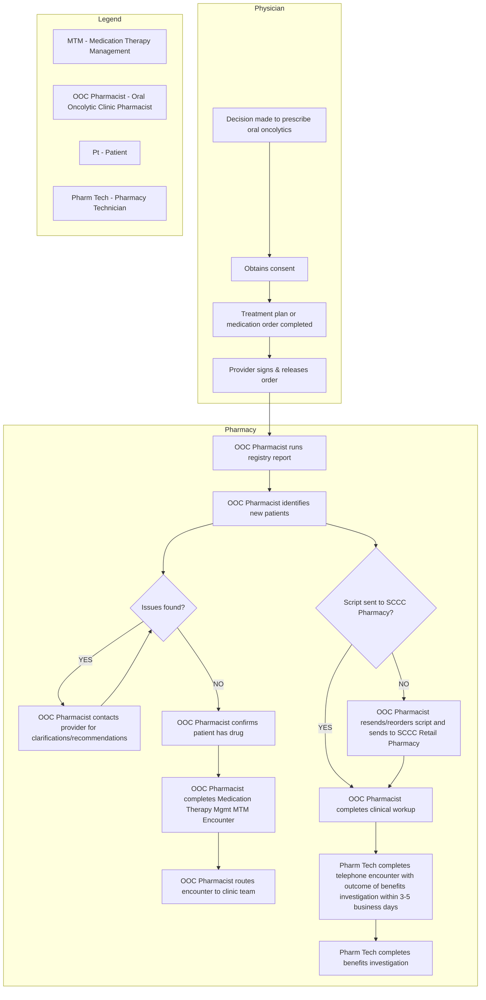

# Improving Oral Oncolytic Program: Phase II Financial Stewardship

UT Southwestern Health System's Celebration of Excellence logo

UT Southwestern Medical Center Magnet Recognized logo

# UT Southwestern Medical Center

Financial Stewardship

Christine Hong, Pharm.D, MBA, BCOP
Shraddha Kansagra, Pharm.D, BCOP
Tayebeh Monabbat, Pharm.D, BCOP
Cristina Hernandez, CPhT, MBA
Hetalkumari Patel, Pharm.D, BCOP

Peggy Bartholomew, MHSM, RN, PMP, CSSGB
Kevin Yutani
Denise McCauley, BBA

X. De’Anne Carmichael, RPh, CSP
Arif Arif, Pharm.D.
Sonali Niyogi, Pharm.D, CSP
Waddah Arafat, MD
Donna Bryant, MSN, APRN, ANP-BC, OCN

## Background

The prescribing of oral oncolytics is becoming increasingly common with cancer care advancement. Oncolytics are defined as oral medications used to treat cancer. Literatures report that this advancement introduces new challenges requiring high quality care coordination to ensure patient safety, timely treatment initiation and adherence and the importance of creating a structured oral oncolytic programs in the health-system.

UT Southwestern convened a taskforce to optimize oral oncolytic program by developing system strategies to address inconsistent processes of ordering, care coordination, and monitoring the adherence in patients on oral oncolytics via gap analysis.

These inconsistencies can lead to delays in treatment, gaps in standards required by the Quality Oncology Practice Initiative (QOPI®) Certified program, and potential missed opportunity in the prescription-fill capture rate.

For Phase I, the project focused on standardizing the process of ordering oral oncolytic to identify and monitor patients who starts on the new treatment using Epic Beacon Treatment Plan, an institutional standardized oncology treatment protocol for built based on the evidence-based clinical guidelines with treatment cycle, duration, and parameters for high quality patient care.

Prior to Phase II, the identification and oral oncolytics status update have been managed by the oncology pharmacist and pharmacy technician via manual list, maintained by using a retrospective report, clinic schedule and staff messages in Epic.

## Aim Statement

The goal is to improve oral oncolytic process and financial performance through: (1) increase new oral oncolytic referral from SCCC Clinics to UTSW SCCC Specialty Pharmacy by 10% from baseline 169 to 186 monthly referrals, (2) increase average monthly specialty prescription (Rx) fill volume from 368 to 405 prescriptions, and (3) improve financial stewardship by May 2023.

## Pre-Assessment

For the Phase II, the project focused on developing an automated notification queue to aid pharmacy team to reduce the redundancies by streamlining workflow, allowing the pharmacy technician to focus on prescription status updates including prior authorization, benefits investigation, medication access and/or patient assistance status while the pharmacists are prioritizing the clinical review and patient education.

In addition, this tool will aid in increased prescription referrals and to improve care coordination workflow and the institution's financial stewardship.

### Phase II: Oral Oncolytic Care Coordination Process

## Interventions

| Key Activities                                                                                                                                                  | Completed |
| --------------------------------------------------------------------------------------------------------------------------------------------------------------- | --------- |
| Created new oral oncolytics medication grouper in Epic per NCCN guideline                                                                                       | 07/2020   |
| Created treatment plan use baseline data & monitoring measure                                                                                                   | 11/2020   |
| Implemented provider-level soft-stop BPA if ordering oral oncolytics outside the Beacon Treatment Plan and the blank Beacon Treatment plan for custom protocols | 01/2021   |
| Mapped current process workflow of oral oncolytics program management, prescribing to monitoring                                                                | 07/2021   |
| Expansion of Solid tumor and BMT clinic pharmacy specialists in oral oncolytics program                                                                         | 08/2021   |
| Observe and educate Beacon Treatment Plan functionality with the providers for end-user challenges                                                              | 08/2021   |
| Cancer Center leadership communication: Faculty education                                                                                                       | 08/2021   |
| Faculty education on benefits of standardized Beacon Treatment Plan for enhanced safety, workflow                                                               | 11/2021   |
| Phase II: Develop Epic automated oral oncolytic work queue and workflow to increase prescription referral and care coordination                                 | 02/2023   |

Screenshot of Epic Workqueue List for Referral/Authorization

## Analysis and Results

This is a two-phase initiative. For Phase I, our goals were met and exceeded by improving the overall utilization of Beacon Treatment Plan for starting oral oncolytic treatment from 65% in July 2020 to 87% in June 2023. For Phase II, our goals were met and exceeded in both outcomes: (1) New oral oncolytic Rx referrals increased from 169 referrals in pre-implementation to 212 referrals in May 2023. On average, the monthly referrals increased by 24% (210 referrals) in January 2024 post-implementation of Epic oral oncolytic referral queue workflow. (2) The average monthly specialty prescription fill volume has increased from 368 Rx to 436 Rx in May 2023 and 501 Rx in January 2024, representing the increase of 18% and 36% by May 2023 and January 2024, respectively. (3) This result displays increased new oral oncolytic specialty pharmacy prescription dispensation volume and the overall improvement in revenue from $2.9 Million in January to $3.5 Million in May 2023, and to $5.2 Million in January 2024. It represents an average revenue of $3.4M in FY23 to $4.8M in January FY24 Year to Date.

### % of Beacon Treatment Plan Utilization Compliance for Ordering

| Month of Med\_Start\_Date | % Compliance |
| ------------------------- | ------------ |
| Jul 20                    | 65.15%       |
| Aug 20                    | 68.84%       |
| Sep 20                    | 71.23%       |
| Oct 20                    | 71.56%       |
| Nov 20                    | 74.12%       |
| Feb 21                    | 77.57%       |
| Jul 21                    | 78.95%       |
| Aug 21                    | 80.43%       |
| Nov 21                    | 80.94%       |
| Jul 22                    | 84.20%       |
| Mar 23                    | 84.64%       |
| Jun 23                    | 86.66%       |
| Jul 23                    | 87.30%       |
| Aug 23                    | 87.95%       |
| Sep 23                    | 87.21%       |
| Dec 23                    | 85.45%       |

### Number of New Rx Referrals and Total Specialty Rx Filled

| Month  | # Referrals received | # of Specialty Rx Filled |
| ------ | -------------------- | ------------------------ |
| Sep-22 | 363                  | 315                      |
| Oct-22 | 343                  |                          |
| Nov-22 | 401                  | 337                      |
| Dec-22 | 391                  |                          |
| Jan-23 | 447                  |                          |
| Feb-23 | 449                  |                          |
| Mar-23 | 468                  |                          |
| Apr-23 | 496                  |                          |
| May-23 | 484                  | 436                      |
| Jun-23 | 489                  |                          |
| Jul-23 | 466                  |                          |
| Aug-23 | 476                  |                          |
| Sep-23 | 490                  |                          |
| Oct-23 | 524                  |                          |
| Nov-23 | 586                  |                          |
| Dec-23 |                      |                          |
| Jan-24 |                      | 501                      |

### Specialty Pharmacy: Oral Oncolytic Prescription Fill and Financial Performance

| Month  | Rx Filled | Revenue ($) |
| ------ | --------- | ----------- |
| Sep-22 | 750       | 2,200,000   |
| Oct-22 | 800       | 2,400,000   |
| Nov-22 | 850       | 2,600,000   |
| Dec-22 | 900       | 2,800,000   |
| Jan-23 | 950       | 2,900,000   |
| Feb-23 | 900       | 2,700,000   |
| Mar-23 | 950       | 2,800,000   |
| Apr-23 | 1000      | 3,100,000   |
| May-23 | 1100      | 3,500,000   |
| Jun-23 | 1050      | 3,300,000   |
| Jul-23 | 1100      | 3,600,000   |
| Aug-23 | 1150      | 3,800,000   |
| Sep-23 | 1200      | 4,100,000   |
| Oct-23 | 1250      | 4,400,000   |
| Nov-23 | 1350      | 4,800,000   |
| Dec-23 | 1300      | 4,600,000   |
| Jan-24 | 1450      | 5,200,000   |

## Conclusion

The providers’ adherence to institutional Beacon Treatment Plan was a critical first step towards oral oncolytics safety which has improved with multiple interventions and pharmacists’ support in the oncology clinic during Phase I.

For Phase II, we leveraged an Epic financial referral queue to develop and standardize the oral oncolytics workflow queue that captures the new prescription upon order entry in Beacon Treatment Plan. The pharmacy technician monitors the prescription status through collaborating with Institutional and external specialty pharmacy. The oncology pharmacists can focus on the clinical reviews and patient education in oral oncolytics management. With the implementation of automated notification queue, the project has seen an increased number of new oral oncolytic referrals that resulted in an increased prescription fill rate at about 36% and an increased monthly revenue at about $2 Million by January 2024.

Using the dashboard, we will periodically monitor institutional treatment plan utilization to educate and promote its benefit including improved medication access support, high quality of patient care and the financial stewardship to sustain UTSW oral oncolytic program.

## References

Finn A, Bondarenka C., et al. Evaluation of electronic health record implementation on pharmacist interventions related to oral chemotherapy management. J Oncol Pharm Pract. 2017 Dec;23(8):563-574. doi: 10.1177/1078155216665247. Epub 2016 Aug 29. PMID: 27573921.

Adelson, Kerin B., et al. Implementation of Electronic Chemotherapy Ordering: An Opportunity to Improve Evidence-Based Oncology Care. J Oncol Pharm Pract. 2014 10:2, 2113-e119

EXCELLENCE – INNOVATION – TEAMWORK - COMPASSION

