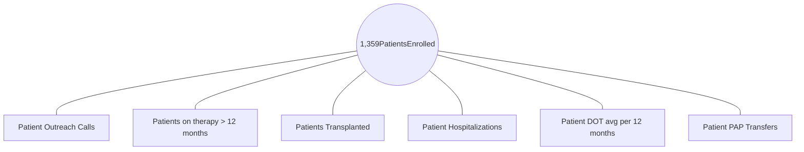

Omnicell Specialty Pharmacy Services logo

# Application of PROs and PROMs as Interventions

## It’s More Than Just a Chat

### Presenting Authors

**Penny Surratt, BSN, RN, MBA**
*Senior Director, Trade Relations*

**Sarah Kester, PharmD, RPh**
*Pharmaceutical Program Manager*

**Sulisa Chow, PharmD, RPh, MBA**
*Clinical Pharmacist*

## Background

The advent of the 21st Century Cures Act provided an avenue for a patient's voice to be formally recognized in drug development and post marketing monitoring phases. A patient's experience is defined as "data that (1) are collected by any persons (including patients, family members, and caregivers of patients, patient advocacy organizations, disease research foundations, researchers, and drug manufacturers); and (2) are intended to provide information about patients' experiences with a disease or condition. Patient Reported Outcomes (PRO) and Performance Reported Outcomes Measures (PROMs) are mechanisms for capturing such experiences and data. These mechanisms were incorporated into an adherence program that was developed to address a specialty pharmacy's non-adherent prone patient population that were diagnosed with Overt Hepatic Encephalopathy (HE).

## Learning Objective

Validate if the days on therapy (DOT) increase of non-adherent prone patients can be attributed to the implementation of patient interventions conducted by pharmacists and nurses that incorporated Patient Reported Outcomes and Patient Reported Outcomes Measures

## Methods

12 months of retrospective patient prescription claims/fills were pulled from 16 pharmacies for HE diagnosed patients who were concurrently prescribed lactulose and rifaximin, to gauge for possible non-adherence patterns. Upon examining the DOT mapping, the clinical team concluded that interventions should be developed and include patient interaction. A patient program was developed, staffed by 2 pharmacists, 2 pharmacy technicians and a nurse educator, that incorporated PROs and PROMs, with data capture points, and monthly data monitoring. HE patients were offered an enrollment of a monthly adherence program during their referral intake process. In addition to medication therapy management, the program focused on health literacy, survey administration, adherence education reinforcement and capturing the patient's or caregiver's understanding of their disease and disease sequalae. A series of time stamped user defined fields (UDFs) along with activity sections were incorporated into the pharmacy platform to capture the patient's experience that were compiled in the following areas; a) patient verbalized understanding of the disease and need for lifelong treatment adherence b) teach back method was employed for patient education c) reasons for a patient's self-imposed "therapy holiday" or temporary abandonment, d) all cause hospitalizations or Emergency Room visits., e) patient ability or inability to converse, and f) patient interaction inappropriate or combative. These entries were plotted against quantifiable claims data collected during the same period. The program has been conducted for 3 years and is still active.

## Results

Average HE Patients Fill
(Months Out Of A Year)

| Category                  | Months Out Of A Year |
| ------------------------- | -------------------- |
| Without The Interventions | 5.3                  |
| With The Interventions    | 9.0                  |

Vial icon showing 5.3 months

Vial icon showing 9.0 months

Program Demographics
(1,359 unique patients were enrolled in the adherence program from January 2019 to December 2022)

| Demographic Group                       | Percentage |
| --------------------------------------- | ---------- |
| 682 Males (Average age of 61.3 years)   | 50.2       |
| 677 Females (Average age of 63.0 years) | 49.8       |

### Program Results 2019 - 2022

## Conclusion

The addition of patient interactive interventions for a non-adherent patient population, adherence aligns with the data captured for days on therapy. This study illustrates that a specialty pharmacy can elucidate an issue and implement solutions for addressing patient care.

Eastern Research Group, Inc. *Assessment of the Use of Patient Experience Data in Regulatory Decision-Making Final Report Assessment of the Use of Patient Experience Data in Regulatory Decision-Making: Final Report.*; 2021:1-B-3. Accessed June 15, 2023. https://fda.report/media/150405/Assessment-of-the-Use-of-Patient-Experience-Data-in-Regulatory-Decision-Making.pdf

U.S. Food and Drug Administration (FDA). *Plan for Issuance of Patient-Focused Drug Development Guidance under 21st Century Cures Act Title III Section 3002.*; 2017:1-8. Accessed June 15, 2023. https://www.fda.gov/files/about%20fda/published/Plan-for-Issuance-of-Patient%E2%80%90Focused-Drug-Development-Guidance.pdf

