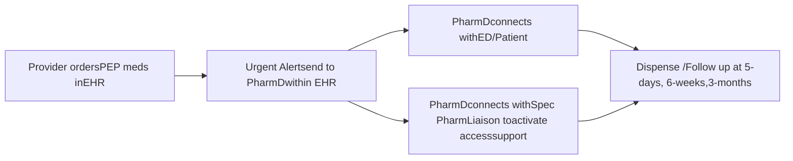

# HIV Post-Exposure Prophylaxis (PEP) Alerts in Emergency Departments (ED): Pharmacist-Initiated Linkage to Care

Daniel Jude, PharmD, AAHIVP, CSP, Jessica Mourani, PharmD Trellis logo

## PURPOSE / BACKGROUND

* Most sexual assault victims and blood born pathogen-exposed patients present to emergency departments (ED) for care and prevention of HIV-infection.

* Because of their integrated services, health system specialty pharmacies are uniquely equipped to handle the complex and urgent needs of HIV post-exposure prophylaxis (PEP) patients.

## OBJECTIVES

To examine the results of the first 15-months of specialty pharmacy services integrated into the ED patient-experience at 2 hospitals in the Twin Cities Metro area

## METHODS

* The health system specialty pharmacy worked with the information technology department to create a novel urgent alert within the electronic healthcare record (EHR) to fire whenever an antiretroviral was ordered by an ED provider, an indication for PEP or for urgent need for a person living with HIV

* The onsite specialty pharmacist downloaded the mobile application version of the EHR to have the alert send a notification via their mobile device.

* The program included collaboration with the local Infectious Disease clinic who would see occupational-PEP (oPEP) patients and the contracted Sexual Assault Response System nurse team for non-occupational PEP (nPEP).

* Once alerted, the pharmacist would visit or call into the ED to provide specialty pharmacy services to the patient.

* Services included: medication access support, medication counseling and education including assessing insurance status, mental health access, and primary care access.

* Interventions were completed to address barriers to medication access and adherence and to connect the patient to other social or support services, as well as optimize safety medication appropriateness

## DATA COLLECTION AND ENDPOINTS

* Arbor™, an advanced, proprietary patient management software was utilized for specialty pharmacy services and care; clinical notes were added to the EHR to promote provider-access to information

* Endpoints included risk event type, number of individuals starting therapy, payer type, fulfillment location, loss to follow-up status, quantity and type of interventions,

## RESULTS

A total of 89 individuals received orders for PEP initiation.
All orders were for dolutegravir and fixed dose emtricitabine/tenofovir disoproxil fumurate.

| Risk Event (n)=nPEP(o)=oPEP | # (%) pts n = 89 | Insurance Type              | # (%) pts n = 89 |
| --------------------------- | ---------------- | --------------------------- | ---------------- |
| (n) Sexual assault          | 49 (55.1%)       | Workman’s Compensation      | 31 (34.8%)       |
| (n) STI-check               | 6 (6.7%)         | Medical Assistance/Medicaid | 30 (33.7%)       |
| (n) Altercation             | 2 (2.2%)         | Commercial                  | 11 (12.4%)       |
| (n) 'Good-Samaritan’        | 1 (1.1%)         | Free drug – mfg program     | 7 (7.9%)         |
| (o) Needle stick            | 23 (25.8%)       | Medicare Part D             | 2 (2.2%)         |
| (o) Fluid                   | 8 (9.0%)         | Unknown                     | 8 (9.0%)         |

| Lost to Follow Up at Anytime? | Rx Filled with Health System Pharmacy? | Lost to Follow Up at Anytime? | Status |
| ----------------------------- | -------------------------------------- | ----------------------------- | ------ |
| Yes n=32 (40.5%)              | n=79 (88.8%)                           | n=8 (80%)                     | Yes    |
| No-Go n=3 (3.38%)             | n=10 (11.2%)                           |                               |        |
| No n=44 (55.7%)               |                                        | n=2 (20%)                     | No     |

## RESULTS

## Number of Interventions by Category

| Intervention Category       | Number of Interventions |
| --------------------------- | ----------------------- |
| Drug-Drug Interaction       | 15                      |
| Adverse Event - Side Effect | 15                      |
| PCP Care Coordination       | 9                       |
| Pharmacy Care Coordination  | 7                       |
| Discontinue Orders          | 7                       |
| Adherence                   | 6                       |
| Benefits Counselor Referral | 5                       |
| Lab Care Coordination       | 3                       |
| Mental Health Referral      | 3                       |
| PrEP Referral               | 2                       |
| Adverse Event - Lab         | 2                       |
| Regimen Optimization        | 1                       |
| Disclosure Prevention       | 1                       |
| Housing Specialist Referral | 1                       |
| HIV Disease State Education | 1                       |

A total of 78 interventions across 60 individual patients.

## Communication Preference

| Preference (n=89) | Count |
| ----------------- | ----- |
| Phone Only        | 17    |
| Email or Text     | 72    |

* Orders were discontinued when patients were lost to follow up prior to filling the outpatient prescriptions

* Four of the 5 Benefits Counsel Referrals to a local AIDS Service Organization resulted in new active insurance through the state-sponsored programs

* Of the 2 referrals for Pre-Exposure Prophylaxis, 1 was loss to follow up and 1 declined

* Majority of drug-drug interactions were cation chelation issues or regular NSAID use

* Nausea was a commonly reported and often self-limiting side effect, mostly associated with therapy initiation

* HIV screening at 3-month post risk-exposure was unavailable due to follow up with employee health or with outside primary care

* Automated surveys from ED mailed to address on file forced a conversation with family; proactive prevention was implemented to support patient privacy when risk of disclosure determined

## CONCLUSIONS

* PEP Prescriptions being filled within the health system decreased the Lost to Follow Up rate from 80% to just over 40% demonstrating the importance of prescription capture.

* Integrated health system specialty pharmacy services are expertly positioned to help drive access and care for sexual assault victims and all other patients that elect to initiate PEP.

* The priority alert built into the electronic health record was very successful in identifying and connecting patients to pharmacy care and subsequent interventions

* A large number of interventions were completed for both nPEP and oPEP patients, including the high value of connecting patients to insurance coverage

* Health-systems should consider the value of similar programs to advance care for underserved populations, minimize revenue loss from outside workman’s comp claims, and retain revenue from the ARV prescriptions to justify the pharmacy care services.

