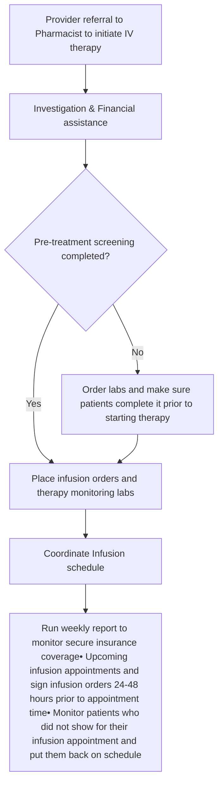

# Impact of Clinical Pharmacist-Led Non-Oncology Infusion Management in Tertiary Academic Medical Center Rheumatology Clinic

Boston Medical Center logo

Douglas Schneidmuller, PharmD1; Amanuel Kehasse, PhD. PharmD2

1Boston Medical Center; 2ClearWay Health

## Background

* Intravenously administered medications require complex coordination of care. The impact of clinical pharmacists in medication access support, drug and disease stated education, and therapy monitoring of oral and self-administered injectable medications has been documented.

* However, there is a paucity of evidence on their impact in the management of infusion therapies. In 2019, we implemented a unique pharmacist-led non-oncology infusion ordering protocol to address the operational and clinical complexities of infusion administered medications.

## Objective

The purpose of this study was to investigate the operational and financial impact of clinical pharmacist-led non-oncology infusion therapy management protocol in patients with rheumatic disorders.

## Methods

* This was a single center retrospective, descriptive study to assess the impact of a clinic imbedded rheumatology pharmacist.

* Under Collaborative Drug Therapy Management (CDTM) protocol, we created a workflow and non-oncology infusion therapy ordering and reporting tools.

* Pre and post pharmacist-led ordering protocol implementation data were exported from the EMR for analysis.

* For operational impact, percent of infusion orders placed by a pharmacist and the average wait time between infusion ordering to infusion appointment time pre and post protocol implementation was calculated.

* For financial impact, average time saved by providers and revenue associated with provider time spared was calculated.

## Infusion Workflow

## Results

On average, Rheumatology clinic orders 1350 infusion orders per year for a total of 250 unique patients

| Role       | Infusion Order Volume (%) |
| ---------- | ------------------------- |
| Pharmacist | 85                        |
| Physician  | 15                        |

| Protocol Status | % of patients with delayed infusion |
| --------------- | ----------------------------------- |
| Pre-Protocol    | 9.60                                |
| Post protocol   | 0.00                                |

| Medication       | % Infusion Order Volume |
| ---------------- | ----------------------- |
| Rituximab        | 28                      |
| Gammagard        | 22                      |
| Infliximab       | 18                      |
| Tocilizumab      | 10                      |
| Anifrolumab      | 8                       |
| Pegloticase      | 5                       |
| Abatacept        | 3                       |
| Golimumab        | 2                       |
| Belimumab        | 1                       |
| Obinutuzumab     | 1                       |
| Cyclophosphamide | 1                       |
| zeledronic acid  | 0.5                     |
| Ocrelizumab      | 0.5                     |

Clock icon representing time saved

~ 30 hour provider time saved per month

Stethoscope icon representing reduced delay

Average infusion delay reduced by 2.5 hours

Dollar sign icon representing revenue

Provider time saving and eliminating infusion wait time resulted in $0.4 M revenue to the health system per year

## Discussion

Infusion therapy management is a complicated process that requires an inter-disciplinary approach. Pharmacists as part of the integrated care team, are ideally positioned to optimize medication access, adherence and ensure the intended clinical outcome is achieved.

The Boston Medical Center rheumatology clinic orders an average of 1350 infusion orders per year for total of 250 patients. Before the pharmacist-led non-oncology infusion management protocol implementation, an average of 130 infusion order delays per year resulting in an average of 2.5 hours delay to start infusion therapy, resulting in lengthy occupancy of infusion chairs, limiting access to other patients. After protocol implementation, 85% of infusion orders were placed by a pharmacist 24-48 hours prior to the scheduled infusion time, eliminating the unnecessary delay.

Our initiative also resulted in an average of 30 hours of provider time saved per month. This is associated with an estimated $0.4 million per year revenue and/or cost saving opportunity for the health system.

**In conclusion:** Integrating clinical pharmacist services results in better clinical, operational and financial outcome to patients and the health system.

