# IMPACT OF SPECIALTY PHARMACIST INTEGRATION ON TIME TO PIMAVANSERIN MEDICATION ACCESS Vanderbilt University Medical Center logo

Sabrina Livezey, PharmD1 | Robert McCormick2 | Nisha Shah, PharmD1 | Josh DeClercq, MS3 | Leena Choi, PhD3 | Autumn Zuckerman, PharmD, BCPS, AAHIVP, CSP1
1Specialty Pharmacy, Vanderbilt University Medical Center, 2University of Tennessee College of Pharmacy, 3Department of Biostatistics, Vanderbilt University Medical Center

## BACKGROUND

* Pimavanserin is the only FDA-approved treatment for Parkinson’s Disease-related psychosis.1

* Pimavanserin can be difficult to access due to insurance authorization requirements and limited distribution network requirements.

* Safety and efficacy monitoring is needed to ensure adherence and clinical benefit once therapy is initiated.

* Objective: Determine the impact of specialty pharmacist integration on time to access for pimavanserin.

## Figure 1. Clinic Workflow

### Before Vanderbilt Specialty Pharmacy Integration

```mermaid
graph LR
    A[MD decides to treat] --> B[Message sent to Nurse]
    B --> C[Nurse completes treatment form]
    C --> D[Treatment form signed and faxed to medication hub]
    D --> E[Hub sends BI results to MD office]
    E --> F[MD office completes PA +/- appeal]
    F --> G[MD office notifies hub of approval]
    G --> H[Hub sends prescription to dispensing pharmacy]
    H --> I[Medication shipped to patient]
```

### After Vanderbilt Specialty Pharmacy Integration

MD=prescribing physician; BI=benefits investigation; PA=prior authorization

## METHODS

**Design**: Single-center, retrospective cohort
**Sample**: Patients prescribed pimavanserin through neurology clinic from May 2016 - July 2018
**Primary Outcome**: Medication access time, defined as days between treatment decision and insurance approval

## RESULTS

| Table 1. Sample Demographics | Table 1. Sample Demographics Before integration % (n) N=33 | Table 1. Sample Demographics After integration % (n) N=61 |
| ---------------------------- | ------------------------------------------------------------------ | ----------------------------------------------------------------- |
| Age, years (mean ± SD)       | 70.4 ± 7.5                                                         | 74.9 ± 8.8                                                        |
| Gender (male)                | 82% (27)                                                           | 79% (48)                                                          |
| Race (Caucasian)             | 91% (30)                                                           | 98% (60)                                                          |
| Insurance                    |                                                                    |                                                                   |
| Commercial                   | 24% (8)                                                            | 16% (10)                                                          |
| Medicare/Medicaid            | 76% (25)                                                           | 84% (51)                                                          |
| Financial assistance         |                                                                    |                                                                   |
| Yes                          | N/A                                                                | 70.5% (43)                                                        |
| No                           | N/A                                                                | 14.8% (9)                                                         |
| Data unavailable             | N/A                                                                | 14.8% (9)                                                         |

### Figure 2. Median time from treatment decision to access

| Before integration Date of Treatment Decision | Before integration Access Time (days) |
| ------------------------------------------------- | ----------------------------------------- |
| 2016-07                                           | 35                                        |
| 2016-08                                           | 20                                        |
| 2016-09                                           | 15                                        |
| 2016-10                                           | 30                                        |
| 2016-11                                           | 10                                        |
| 2016-12                                           | 130                                       |
| 2017-01                                           | 40                                        |
| 2017-02                                           | 35                                        |
| 2017-03                                           | 38                                        |
| 2017-04                                           | 15                                        |
| 2017-05                                           | 100                                       |
| 2017-06                                           | 55                                        |
| 2017-07                                           | 15                                        |
| After integration                                 |                                           |
| Date of Treatment Decision                        | Access Time (days)                        |
| 2017-07                                           | 5                                         |
| 2017-08                                           | 45                                        |
| 2017-09                                           | 10                                        |
| 2017-10                                           | 8                                         |
| 2017-11                                           | 12                                        |
| 2017-12                                           | 5                                         |
| 2018-01                                           | 10                                        |
| 2018-02                                           | 25                                        |
| 2018-03                                           | 5                                         |
| 2018-04                                           | 25                                        |
| 2018-05                                           | 10                                        |
| 2018-06                                           | 5                                         |
| 2018-07                                           | 10                                        |

| Integration Status | Access Time (days) |
| ------------------ | ------------------ |
| Before integration | 24.5               |
| After integration  | 3                  |

Down arrow icon **21 day average** decrease in time to medication access
Up arrow icon **16% increase** in pimavanserin approval
Up arrow icon **18% increase** in pimavanserin initiation

### Figure 3. Factors associated with time to access

| Factor                              | Odds Ratio | 95% CI    |
| ----------------------------------- | ---------- | --------- |
| Male vs. female                     | 1.3        | 0.3 — 3.0 |
| Age (per 10 years)                  | 2.7        | 0.7 — 5.2 |
| Commercial vs. government insurance | 5          | 2.5 — 10  |
| Pharmacist integration: no vs yes   | 23         | 10 — 50   |

* **23-fold increase** in odds of experiencing a longer time to access before integration.
* Government insurance associated with shorter access time.

### Figure 4. Impact on approval and therapy initiation

| Outcome   | Before integration (%) | After integration (%) |
| --------- | ---------------------- | --------------------- |
| Approved  | 82                     | 95                    |
| Initiated | 79                     | 93                    |

### Table 2. Pharmacist Interventions

| Type of intervention                                    | Number |
| ------------------------------------------------------- | ------ |
| Insurance approval/financial assistance                 | 135    |
| Medication counseling                                   | 58     |
| Coordination of care (Provider/caregiver communication) | 57     |
| Patient monitoring                                      | 56     |
| Side effect\* management                                | 6      |
| Medication adherence                                    | 1      |

\*patient-reported side effects included confusion, nausea, peripheral edema, and combative behavior

## CONCLUSIONS

* An integrated clinical pharmacist can expedite treatment access and initiation, while also providing monitoring for drug safety and efficacy.

* Further research is needed to assess clinic outcomes associated with faster access to pimavanserin.

**References**:
1. Nuplazid (pimavanserin) tablets [package insert]. San Diego, CA: Acadia Pharmaceuticals Inc.; April 2016.

**Disclosures**:
Nisha B. Shah receives research support from AbbVie Inc. Autumn D. Zuckerman receives research support from Sanofi Inc. and Gilead.

