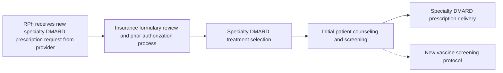

# IMPLEMENTING A VACCINE SCREENING PROTOCOL FOR SPECIALTY DISEASE MODIFYING ANTI-RHEUMATIC DRUGS (DMARDS) IN AN INTEGRATED OUTPATIENT RHEUMATOLOGY CLINIC

Laura Petry, PharmD | Marci Saknini, PharmD, CSP | Bridget Lynch, PharmD, MD | Autumn Zuckerman, PharmD, BCPS, AAHIVP, CSP | Kristen Whelchel, PharmD, CSP

QR Code

VANDERBILT UNIVERSITY MEDICAL CENTER logo

## BACKGROUND

* Specialty DMARDs used in rheumatic diseases cause immunosuppression and have specific vaccine recommendations.

* Creating a standardized vaccine screening processes encourages consistent review of vaccine eligibility.

## OBJECTIVE

* Ensure delivery of proper vaccine recommendations through implementation and evaluation of a standardized vaccine screening process in rheumatology patients.

## METHODS

| Setting            | \* Outpatient rheumatology office with imbedded health-system specialty pharmacists at an academic medical center                                                                                                                                                                                                                                                                                         |
| ------------------ | --------------------------------------------------------------------------------------------------------------------------------------------------------------------------------------------------------------------------------------------------------------------------------------------------------------------------------------------------------------------------------------------------------- |
| Design             | \* Quality improvement project that created an electronic health record (EHR) form embedded in standardized, drug-specific counseling notes for specialty pharmacists to document vaccine recommendations made during counseling sessions for patients starting new specialty DMARDs. \* Current vaccine recommendations were summarized and provided to pharmacists as a condensed written resource. |
| Inclusion Criteria | \* Patients prescribed a new specialty DMARD by a Vanderbilt Cool Springs Rheumatology provider and receiving counseling by an integrated specialty pharmacist between 09/01/2021 and 10/29/21.                                                                                                                                                                                                           |
| Outcomes           | \* Number of eligible patients screened for vaccines \* Number and type of vaccines recommended \* Pharmacist-reported efficiency of screening protocol                                                                                                                                                                                                                                           |

## FIGURE 1. IMPLEMENTATION IN WORKFLOW

## RESULTS

### FIGURE 2. EHR VACCINE SCREENING FORM

**Clinical screenings reviewed**: [x] Immunization Record [x] Hepatitis B [x] TB
**Patient received vaccine counseling**: [x] Yes [ ] No
**Immunization recommended**: [x] pneumonia [x] influenza [x] zoster [ ] none

### FIGURE 3. COUNSELING NOTE TEXT

**Vaccine and ID Assessment**:
**Clinical screenings reviewed**: **Immunization Record, Hepatitis B and TB**
**Patient received vaccine counseling**: **Yes**
**Immunization recommended**: **pneumonia, influenza and zoster**

### FIGURE 4. SCREENED PATIENTS

| Category                     | Number of patients | Percentage of eligible |
| ---------------------------- | ------------------ | ---------------------- |
| Total eligible patients      | 106                |                        |
| Received vaccine screening   | 76                 | 71.7%                  |
| Vaccine recommendations made | 72                 | 67.9%                  |

\* 94.7% of patients screened received recommendations.

### FIGURE 5. TYPES OF VACCINES

| Vaccine Type | Percentage (n) |
| ------------ | -------------- |
| Influenza    | 49% (n=59)     |
| Zoster       | 28% (n=33)     |
| Pneumonia    | 23% (n=28)     |

### PHARMACIST IMPLEMENTATION SURVEYS

Efficiency of the vaccine screening process: (0 = not efficient, 10 = highly efficient)

| Phase                     | Efficiency Score |
| ------------------------- | ---------------- |
| Pre-implementation (n=5)  | 4.2              |
| Post-implementation (n=6) | 8                |

### COMMENTS

* “It is very easy to use and clear in the chart.”

* “…a great resource for us to use to ensure appropriate vaccines are being recommended and completed.”

### SUGGESTED IMPROVEMENTS

* “We discuss the COVID vaccine with almost every patient. It would be great to include that...”

* Include dose series option for multi-dose vaccines

* Pull vaccine date information: “Toggling…to find vaccines dates was a little inefficient.”

* Add declined or previously completed vaccines

* Auto-insert previously completed labs

## FUTURE DIRECTIONS

* Allow prescription attachment to counseling documentation for provider review

* Auto-populating the vaccine screening form in counseling notes rather than inserting via EHR typing shortcuts

* Long-term follow-up to determine which patients receive recommended vaccines

* Create and provide vaccine information handouts to patients

* Pulling in lab or vaccine values from previously completed forms

## CONCLUSIONS

* Implementation of a standardized vaccine screening protocol led to successful screening in most eligible patients

* 94.7% of patients screened received specific vaccine recommendations

* The vaccine screening protocol was overall rated as efficient by specialty pharmacists

bDMARD = biologic disease modifying anti-rheumatic drugs; PharmD = specialty pharmacist, EHR = electronic health record

