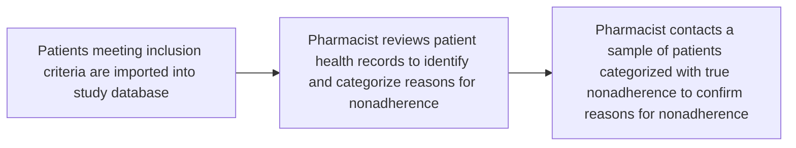
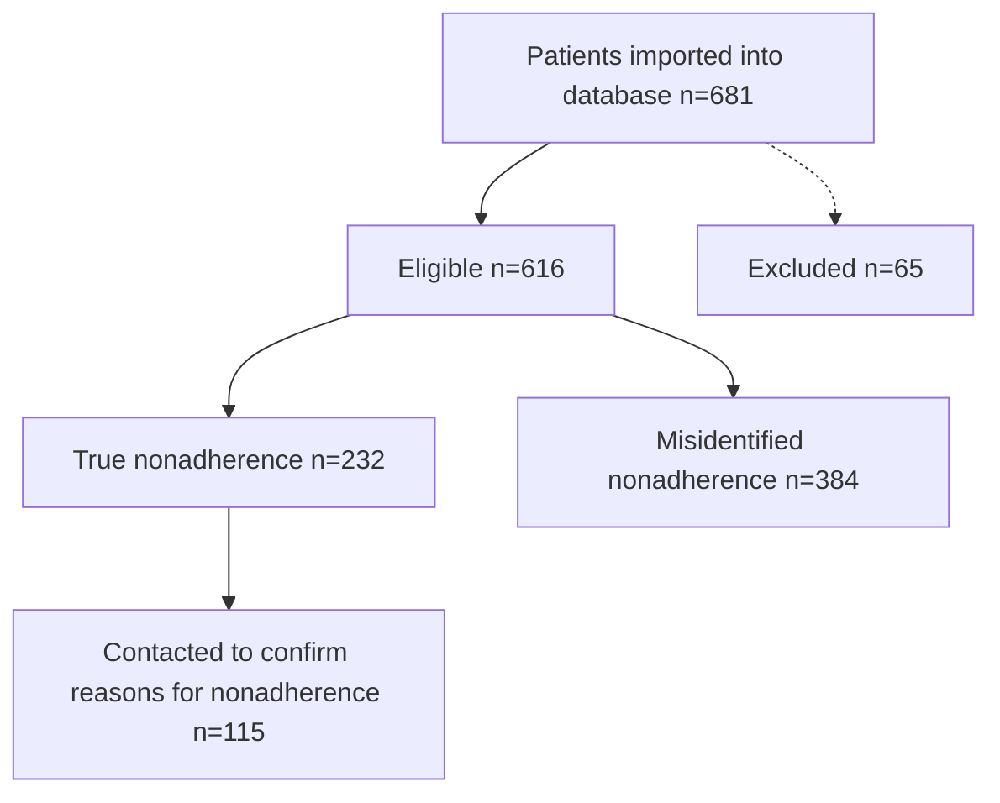

# IDENTIFYING NONADHERENCE TO SPECIALTY MEDICATIONS
Vanderbilt University Medical Center logo

AMANDA M. KIBBONS, PHARMD1, MEGAN PETER, PHD1, JACOB BELL, BS, CPHT1, JACOB JOLLY, PHARMD, MMHC, CSP2, ELIZABETH CHERRY, PHARMD, CSP1, BASSEL ALHASHEMI, BS1, NISHA B. SHAH, PHARMD1, AUTUMN D. ZUCKERMAN, PHARMD, BCPS, AAHIVP, CSP1, VANDERBILT LEARNING HEALTHCARE SYSTEM INVESTIGATORS
1VANDERBILT SPECIALTY PHARMACY, VANDERBILT UNIVERSITY MEDICAL CENTER
2BLUE FIN GROUP

## BACKGROUND

Pharmacy claims data, commonly used to calculate medication adherence, are unable to discern true nonadherence from appropriate gaps in therapy frequently required with specialty medications.

## OBJECTIVE

Identify and categorize reasons for nonadherence and determine the rate of misidentified nonadherence to specialty medications

## METHODS

| Design    | Prospective, cohort study at an integrated health-system specialty pharmacy within an academic medical center                                                                                                                                                                                                                                                                                                        |
| --------- | -------------------------------------------------------------------------------------------------------------------------------------------------------------------------------------------------------------------------------------------------------------------------------------------------------------------------------------------------------------------------------------------------------------------- |
| Inclusion | Patients prescribed eligible medications dispensed by health-system specialty pharmacy with PDC <90% in previous 4 months, between May 10th, 2019 and September 10th, 2019                                                                                                                                                                                                                                           |
| Exclusion | • Medication prescribed by an outside provider • Deceased before study enrollment • Planned treatment discontinuation in the next 8 months • 2+ unique specialty medications from same clinic in previous 4 months • 30+ gap days in previous 4 months and last fill >30 days from import date                                                                                                       |
| Outcomes  | Categorize reasons for nonadherence • Categories were developed from patient and clinical pharmacist focus groups • Categories confirmed in pilot study  Rates of misidentified and true nonadherence • **Misidentified nonadherence** = PDC <90% and an appropriate reason for gaps in therapy • **True non-adherence** = PDC <90% and no appropriate reason for gaps in therapy identified |

## RESULTS

### FIGURE 1. REASONS FOR NONADHERENCE REVIEWED

Most patients reviewed had an appropriate reason for nonadherence and thus were categorized as misidentified nonadherence.

Most instances of misidentified nonadherence were for clinically appropriate reason for gaps in therapy (Table 2 and Figure 2).

True nonadherence was most commonly due to memory problems or being unreachable to schedule a refill (Figure 3).

### TABLE 1. PATIENT CHARACTERISTICS, N(%) OR MEDIAN [IQR]

| Characteristics       | All patients n=681 | True nonadherence n=232 | Misidentified nonadherence n=384 |
| --------------------- | ------------------ | ----------------------- | -------------------------------- |
| Age, years            | 51 \[39, 65]       | 52 \[42, 65]            | 49 \[36, 64]                     |
| Gender, Female        | 454 (67)           | 166 (72)                | 250 (65)                         |
| Race                  |                    |                         |                                  |
| White                 | 556 (86)           | 195 (86)                | 315 (85)                         |
| Black                 | 77 (12)            | 28 (12)                 | 45 (12)                          |
| Other                 | 17 (2)             | 5 (2)                   | 10 (3)                           |
| Insurance Type        |                    |                         |                                  |
| Commercial            | 379 (56)           | 129 (56)                | 219 (57)                         |
| Medicaid              | 63 (9)             | 15 (7)                  | 44 (11)                          |
| Medicare              | 236 (35)           | 88 (38)                 | 121 (32)                         |
| Other                 | 3 (<1)             | 0 (0)                   | 1 (<1)                           |
| Clinic                |                    |                         |                                  |
| Rheumatology          | 276 (41)           | 73 (31)                 | 182 (47)                         |
| Multiple Sclerosis    | 83 (12)            | 49 (21)                 | 31 (8)                           |
| Lipid                 | 70 (10)            | 37 (16)                 | 31 (8)                           |
| Other                 | 252 (37)           | 73 (31)                 | 143 (37)                         |
| Prescribed Medication |                    |                         |                                  |
| adalimumab            | 136 (20)           | 31 (13)                 | 90 (23)                          |
| etanercept            | 89 (13)            | 31 (13)                 | 53 (14)                          |
| evolocumab            | 51 (7)             | 29 (13)                 | 21 (5)                           |
| Other                 | 405 (59)           | 141 (61)                | 223 (58)                         |

### FIGURE 2. REASONS FOR MISIDENTIFIED NONADHERENCE N=384

| Reason                 | Percentage |
| ---------------------- | ---------- |
| CLINICAL               | 38         |
| DISCONTINUATION        | 20         |
| EXTERNAL PHARMACY FILL | 12         |
| CHANGED GPI            | 12         |
| FINANCIAL              | 6          |
| INCONGRUENCY OF CLAIMS | 6          |
| OTHER\*                | 6          |

\*Other reasons include delay in treatment initiation or shipping issues

### TABLE 2. CLINICAL REASONS FOR MISIDENTIFIED NONADHERENCE N=146

| REASON                                        | N (%)   |
| --------------------------------------------- | ------- |
| Appropriately held for illness/Infection      | 55 (38) |
| Drug intolerance/Adverse effect               | 28 (19) |
| Alternate dosing under prescriber supervision | 26 (18) |
| Surgery/Procedure                             | 20 (14) |
| Weaning or tapering of dose                   | 10 (7)  |
| Lab abnormalities                             | 4 (3)   |
| Temporary drug interaction                    | 2 (1)   |
| Pregnancy                                     | 1 (<1)  |

### FIGURE 3. REASONS FOR TRUE NONADHERENCE N=115

| Reason                 | Percentage |
| ---------------------- | ---------- |
| MEMORY                 | 50         |
| UNREACHABLE            | 32         |
| UNRESPONSIVE           | 16         |
| CLINICAL               | 13         |
| SOCIAL ISSUES          | 10         |
| HEALTH LITERACY        | 9          |
| PHARMACY/ CLINIC ERROR | 9          |
| NO KNOWN REASON        | 7          |
| FINANCIAL              | 4          |

Unresponsive refers to patients who did not comply with the necessary requirements for continuing treatment (labs, paperwork, etc.)

## CONCLUSIONS

* A single pharmacy database cannot capture everywhere a patient obtains medication or if they change or discontinue therapy, so patients can be misidentified as nonadherent based on claims data.

* Reasons for true and misidentified nonadherence vary by patients and clinics.

* Despite the high cost of specialty therapies, few patients were nonadherent due to cost, likely explained by specialty pharmacy coordinating benefits and financial assistance.

* Clinically appropriate gaps in therapy should be accounted for when evaluating adherence to specialty therapies.

## FUTURE DIRECTIONS

* Better methods are needed to identify true nonadherence to specialty medications.

* Further research is needed to determine the best ways to reduce true nonadherence, especially memory and ability to reach the patient.

## REFERENCES

1. Canfield SL, J Manag Care Spec Pharm, doi: 10.18553/jmcp.2019.25.10.1073.

2. Paolella D., J Manag Care Spec Pharm, doi: 10.18553/jmcp.2019.25.11.1282.

