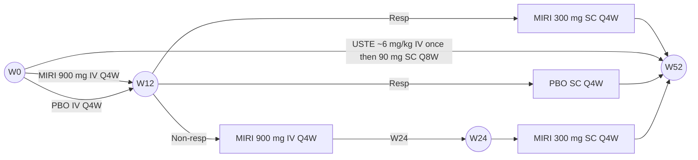

# Mirikizumab Improves Fatigue, Bowel Urgency, and Quality of Life in Patients With Moderately to Severely Active Crohn’s Disease: Results From a Phase 3 Clinical Trial

Scan the QR code for a list of all Lilly content presented at the congress. (https://lillyscience.lilly.com/congress/nasp2024). Other company and product names are trademarks of their respective owners.

Subrata Ghosh1, Minhu Chen2, Monika Fischer3, Marla Dubinsky4, Vipul Jairath5, Tadakazu Hisamatsu6, Marc Ferrante7, Laurent Peyrin-Biroulet8, Britta Siegmund9, Theresa Hunter Gibble10, Zhantao Lin10, Marijana Protic10, Nathan Morris10, Simon Travis11, Elizabeth Lubelczyk (Non-author Presenter)10

1APC Microbiome Ireland, College of Medicine and Health, University College Cork, Cork, Ireland; 2The First Affiliated Hospital of Sun Yat-sen University, Guangzhou, China; 3Indiana University, Indianapolis, Indiana, USA; 4Icahn School of Medicine at Mt Sinai, New York, NY, USA; 5Western University, London, ON, Canada; Alimentiv, London, ON, Canada; 6Kyorin University, Tokyo, Japan; 7Department of Gastroenterology and Hepatology University Hospitals Leuven, KU Leuven, Belgium; 8Nancy University Hospital, Inserm U1256 NGERE, Lorraine University, Lorraine, France; 9Infectiology and Rheumatology, Charité-Universitätsmedizin, Berlin, Germany; 10Eli Lilly and Company, Indianapolis, USA; 11Kenney Institute, Translational Gastroenterology Unit and Biomedical Research Centre, University of Oxford, Oxford, UK

Study was sponsored by Eli Lilly and Company

## OBJECTIVE

* To evaluate the impact of mirikizumab vs. Placebo on fatigue, bowel urgency, and health-related quality of life (hrqol) through 52 weeks in patients with moderately to severely active Crohn's disease (CD) in the phase 3, treat-through, VIVID-1 study (NCT03926130)

## CONCLUSION

* Treatment with mirikizumab resulted in significant improvements vs. placebo in fatigue, bowel urgency, and HRQoL at Week 12 and Week 52 in patients with moderately to severely active CD

* Among mirikizumab-treated patients:

    - FACIT-Fatigue score improved by 5.9 and 7.5 at Weeks 12 and 52, respectively

    - Urgency NRS score improved by 3.2 at Week 52, and was significantly improved vs. placebo from Weeks 8-52

    - IBDQ total score improved by 36.9 and 43.8 at Weeks 12 and 52, respectively

    - Approximately half achieved the composite endpoints of clinical response at Week 12 + IBDQ response at Week 52 (53.7%) or clinical response at Week 12 + IBDQ remission at Week 52 (47.0%)

National Association of Specialty Pharmacy (NASP); Nashville, TN, USA; October 6-9, 2024

## BACKGROUND

* Mirikizumab is a humanized immunoglobulin G4 (IgG4) monoclonal antibody (mAb) that inhibits interleukin (IL)-23 by binding to an epitope on the p19 subunit

* Mirikizumab is approved for the treatment of adults with moderately to severely active ulcerative colitis and under development for CD1,2

## METHODS

### VIVID-1 Study Design

52 weeks of continuous blinded treatment

Note: The VIVID-1 trial was a Phase 3, randomized, double-blind, double-dummy, active- and PBO-controlled, treat-through study; from Week 8 through Week 20, all participants received their assigned treatment and matching PBO via both IV and SC administration.

## KEY RESULTS

### Fatigue Was Significantly Improved With Mirikizumab vs. Placebo at Week 12 and Week 52

| Category | Placebo (N=199) | Mirikizumab (N=579) |
| -------- | --------------- | ------------------- |
| Week 12  | 2.64            | 5.86                |
| Week 52  | 3.08            | 7.47                |

Notes: Data are LSM (95% CI), and comparisons were performed using ANCOVA with mBOCF. For participants in the placebo group who switched to mirikizumab at Week 12, baseline values were carried forward to derive the change from baseline at Week 52. Increase in FACIT-Fatigue score indicates improvement.

From Week 12 to 52, there was a 27% vs. 17% improvement in FACIT-Fatigue score in the mirikizumab vs. placebo groups.

## METHODS

### Key eligibility criteria

* Moderately to severely active CD as defined by unweighted daily average stool frequency (SF) ≥4 and/or unweighted daily average abdominal pain (AP) ≥2 at baseline

* Simple Endoscopic Score for Crohn’s Disease (SES-CD) ≥7 for patients with ileal-colonic disease or ≥4 for patients with isolated ileal disease within 21 days before randomization

* Inadequate response, loss of response, or intolerance to ≥1 corticosteroid, immunomodulator, or approved biologic therapy for CD

### Efficacy Endpoints at Week 12 and Week 52

**Change from baseline:**

* Functional Assessment of Chronic Illness Therapy-Fatigue (FACIT-Fatigue)

    - A 13-item instrument used to measure fatigue in patients with chronic illness; total score ranges from 0-52, with a lower score indicating greater fatigue

* Urgency Numeric Rating Scale (NRS)

    - An 11-point instrument ranging from 0 (no urgency) to 10 (worst possible urgency) used to measure severity of the urgency to have a bowel movement in the past 24 hours; score of <3 = “no urgency”

* Inflammatory Bowel Disease Questionnaire (IBDQ)

    - A 32-item questionnaire measuring 4 domains (bowel symptoms, systemic symptoms, emotional function, social function); responses are graded from 1 (a very serious problem) to 7 (not a problem at all); total score ranges from 32-224, with a higher score indicating better quality of life

**Response/remission rate:**

* IBDQ response

    - A ≥16-point improvement from baseline3

* IBDQ remission

    - A total score ≥1703

## KEY RESULTS (Continued)

### Bowel Urgency Was Significantly Improved With Mirikizumab vs. Placebo Through Week 52

| Weeks | Placebo (N=199) | Mirikizumab (N=579) |
| ----- | --------------- | ------------------- |
| 0     | 0               | 0                   |
| 4     | -0.8            | -1.2                |
| 8     | -1.2            | -1.8                |
| 12    | -1.58           | -2.44               |
| 16    | -1.5            | -2.5                |
| 20    | -1.4            | -2.6                |
| 24    | -1.3            | -2.7                |
| 28    | -1.2            | -2.8                |
| 32    | -1.2            | -2.9                |
| 36    | -1.2            | -3.0                |
| 40    | -1.2            | -3.1                |
| 44    | -1.2            | -3.1                |
| 48    | -1.2            | -3.2                |
| 52    | -1.23           | -3.24               |

\*\* p<0.01; \*\*\*\* p<0.0001
Notes: Data are LSM (95% CI), and comparisons were performed using ANCOVA with mBOCF. For participants in the placebo group who switched to mirikizumab at Week 12, baseline values were carried forward to derive the change from baseline at Week 52. Decrease in Urgency NRS score indicates improvement.

* Mean baseline Urgency NRS score was 6.6 in both groups

* At baseline, 93.5% and 94.5% of patients in the placebo and mirikizumab groups, respectively, had an Urgency NRS score ≥3

### Mirikizumab Significantly Improved IBDQ Total and Domain Scores vs. Placebo at Week 12 and Week 52

| IBDQ Total Score Category | IBDQ Total Score Placebo (N=199) | IBDQ Total Score Mirikizumab (N=579) |
| ----------------------------- | ------------------------------------ | ---------------------------------------- |
| Week 12                       | 17.39                                | 36.29                                    |
| Week 52                       | 16.50                                | 43.82                                    |

| IBDQ Domain Scores Category Week | IBDQ Domain Scores Bowel Symptoms PBO | IBDQ Domain Scores Bowel Symptoms MIRI | IBDQ Domain Scores Systemic Symptoms PBO | IBDQ Domain Scores Systemic Symptoms MIRI | IBDQ Domain Scores Emotional Function PBO | IBDQ Domain Scores Emotional Function MIRI | IBDQ Domain Scores Social Function PBO | IBDQ Domain Scores Social Function MIRI |
| ---------------------------------------- | --------------------------------------------- | ---------------------------------------------- | ------------------------------------------------ | ------------------------------------------------- | ------------------------------------------------- | -------------------------------------------------- | ---------------------------------------------- | ----------------------------------------------- |
| Week 12                                  | 4.94                                          | 12.59                                          | 2.42                                             | 5.73                                              | 6.96                                              | 13.65                                              | 3.13                                           | 7.44                                            |
| Week 52                                  | 4.95                                          | 15.76                                          | 2.52                                             | 5.81                                              | 5.03                                              | 11.36                                              | 2.62                                           | 6.10                                            |

Notes: Data are LSM (95% CI), and comparisons were performed using ANCOVA with mBOCF. For participants in the placebo group who switched to mirikizumab at Week 12, baseline values were carried forward to derive the change from baseline at Week 52. Increase in IBDQ score indicates improvement.

### Statistical Analysis

* Included patients in the Primary Analysis Set, defined as all randomized patients who have baseline SES-CD ≥7 (or ≥4 for isolated ileal disease) and who received ≥1 dose of study drug

* For binary variables, adjusted risk differences were compared using the Cochran-Mantel-Haenszel test with NRI

* For continuous variables, LSM change from baseline was compared using ANCOVA with mBOCF

* For participants who discontinued treatment, had specified changes in concomitant medication, or who switched from placebo to mirikizumab at Week 12, baseline values were carried forward subsequently

* For other missing data, last observation carried forward was used

### A Greater Proportion of Patients Achieved IBDQ Response and IBDQ Remission With Mirikizumab vs. Placebo at Week 12 and Week 52

| IBDQ Response Category | IBDQ Response Placebo (N=199) | IBDQ Response Mirikizumab (N=579) |
| -------------------------- | --------------------------------- | ------------------------------------- |
| Week 12                    | 26.1                              | 45.2                                  |
| Week 52                    | 26.1                              | 69.1                                  |

| IBDQ Remission Category | IBDQ Remission Placebo (N=199) | IBDQ Remission Mirikizumab (N=579) |
| --------------------------- | ---------------------------------- | -------------------------------------- |
| Week 12                     | 19.6                               | 27.6                                   |
| Week 52                     | 19.6                               | 52.3                                   |

Notes: Data are % (95% CI) calculated using NRI, and comparisons were performed using the Cochran-Mantel-Haenszel chi-square test. IBDQ response defined as a ≥16-point improvement from baseline; IBDQ remission defined as total score ≥170.

### A Greater Proportion of Patients Achieved the Composite Endpoint of Clinical Response at Week 12 and IBDQ Response or IBDQ Remission at Week 52 With Mirikizumab vs. Placebo

| Composite of Clinical Response at Week 12 + IBDQ Response at Week 52 Placebo (N=199) | Composite of Clinical Response at Week 12 + IBDQ Response at Week 52 Mirikizumab (N=579) |
| ---------------------------------------------------------------------------------------- | -------------------------------------------------------------------------------------------- |
| 26.1                                                                                     | 53.7                                                                                         |

| Composite of Clinical Response at Week 12 + IBDQ Remission at Week 52 Placebo (N=199) | Composite of Clinical Response at Week 12 + IBDQ Remission at Week 52 Mirikizumab (N=579) |
| ----------------------------------------------------------------------------------------- | --------------------------------------------------------------------------------------------- |
| 19.6                                                                                      | 47.0                                                                                          |

Notes: Data are % (95% CI) calculated using NRI, and comparisons were performed using the Cochran-Mantel-Haenszel chi-squared test. Clinical response defined as ≥30% decrease in stool frequency and/or abdominal pain and neither score worse than baseline. IBDQ response defined as a ≥16-point improvement from baseline; IBDQ remission defined as total score ≥170.

## RESULTS

### Patient Demographics, Characteristics, and Patient-Reported Outcome Scores at Baseline

| Characteristic                 | PBO (N=199)  | MIRI (N=579) |
| ------------------------------ | ------------ | ------------ |
| Age, years                     | 36.3 (12.7)  | 36.0 (13.2)  |
| Male, n (%)                    | 118 (59.3)   | 332 (57.3)   |
| Weight, kg                     | 69.6 (19.0)  | 68.0 (18.3)  |
| BMI, kg/m²                     | 23.8 (5.8)   | 23.2 (5.4)   |
| Prior biologic exposure, n (%) | 109 (54.8)   | 317 (54.7)   |
| Prior biologic failure, n (%)  | 97 (48.7)    | 281 (48.5)   |
| Duration of CD, years          | 7.8 (7.4)    | 7.4 (8.2)    |
| FACIT-Fatigue                  | 32.3 (11.1)  | 31.5 (11.6)  |
| Urgency NRS                    | 6.6 (2.1)    | 6.6 (2.1)    |
| IBDQ Total Score               | 131.2 (32.4) | 127.4 (33.2) |
| Bowel symptoms subscore        | 38.7 (9.8)   | 37.9 (9.7)   |
| Systemic symptoms subscore     | 18.5 (5.6)   | 17.7 (5.7)   |
| Emotional function subscore    | 52.2 (13.9)  | 50.9 (14.4)  |
| Social function subscore       | 21.8 (7.3)   | 20.8 (7.2)   |

Notes: Data are mean (SD) unless stated otherwise. Biologic agents included anti-tumor necrosis factor antibodies and anti-integrin antibodies.

Acknowledgments: Sonal Saxena, PhD, an employee of Eli Lilly Services India Pvt. Ltd., provided medical writing support.

Abbreviations: ANCOVA=analysis of covariance; CI=confidence interval; CD=Crohn’s disease; FACIT-Fatigue=Functional Assessment of Chronic Illness Therapy-Fatigue; IBDQ=Inflammatory Bowel Disease Questionnaire; IV=intravenous; LSM=least squares mean; mBOCF=modified baseline observation carried forward; MIRI=mirikizumab; NRS=Numeric Rating Scale; NRI=non-responder imputation; Non-resp=non-responder; PBO=placebo; Q4W=every 4 weeks; Q8W=every 8 weeks; R=randomization; Resp=responder; SC=subcutaneous; USTE=ustekinumab; W=Week.
Disclosures: S. Ghosh has received research grants from: Eli Lilly and Company; served on steering committees for: AbbVie and Bristol Myers Squibb; received consultancy fees from: AbbVie, Celltrion, Ferring Pharmaceuticals, Galapagos NV, Janssen, Pfizer, and Takeda; T. Hisamatsu has received lecture fees from: AbbVie, EA Pharma, Gilead Sciences, Janssen Pharmaceutical K.K., JIMRO, Kyorin, Mitsubishi Tanabe Pharma, Mochida Pharmaceutical, Pfizer, and Takeda; has received honoraria as an advisory board member or consultant for: AbbVie, EA Pharma, Eli Lilly and Company, Gilead Sciences, Janssen Pharmaceutical K.K., Mitsubishi Tanabe Pharma, Pfizer, and Takeda; and has received pharmaceutical/research grants from: AbbVie, Alfresa Pharma, Daiichi Sankyo, EA Pharma, JIMRO, Kyorin, Mitsubishi Tanabe Pharma, Mochida Pharmaceutical, Nichi-Iko Pharmaceutical, Nippon Kayaku, Pfizer, Takeda, and Zeria Pharmaceutical; M. Fischer has received consulting fees from: AbbVie, Bristol Myers Squibb, Eli Lilly and Company, Ferring Pharmaceuticals, Janssen, Pfizer, Rebiotix, Scioto Biosciences, and Seres Therapeutics; M. Dubinsky has received honoraria as a consultant for: AbbVie, Arena Pharmaceuticals, Boehringer Ingelheim, Bristol Myers Squibb, Celgene, Eli Lilly and Company, F. Hoffmann-La Roche, Genentech, Gilead Sciences, Janssen, Pfizer, Prometheus Therapeutics and Diagnostics, Takeda, and UCB Pharma; has been contracted for research by: AbbVie, Janssen, Pfizer, and Prometheus Biosciences; has stock interest in: TrellusHealth; and has received licensing fees from: Takeda; V. Jairath has received fees or grant and/or research support and/or served as a consultant and/or speaker for: AbbVie, Alimentiv, Arena Pharmaceuticals, Asahi Kasei Pharma, Asieris Pharmaceuticals, AstraZeneca, Bristol Myers Squibb, Celltrion, Eli Lilly and Company, Ferring Pharmaceuticals, Flagship Pioneering, Fresenius Kabi, Galapagos NV, Genentech, Gilead Sciences, GlaxoSmithKline, Janssen, Merck, Metacrine, Mylan, Pandion Therapeutics, Pendopharm, Pfizer, Prometheus Therapeutics and Diagnostics, Protagonist Therapeutics, Reistone Biopharma, Roche, Sandoz, Second Genome, Sorriso Pharmaceuticals, Takeda, Teva, Topivert, Ventyx Biosciences, and Vividion Therapeutics; M. Chen has received speaker’s fees from: AbbVie, AstraZeneca, China Medical System Holding Limited, Ipsen, Johnson & Johnson, and Takeda; M. Ferrante has received fees for grants and/or contracts from: AbbVie, Amgen, Biogen, Janssen Cilag, Pfizer, Takeda, and Viatris; AbbVie, AgomAb Therapeutics, Boehringer Ingelheim, Celgene, Celltrion, Eli Lilly, Janssen-Cilag, MRM Health, MSD, Pfizer, Takeda and ThermoFisher; speaker fees from: AbbVie, Biogen, Boehringer Ingelheim, Falk, Ferring, Janssen-Cilag, MSD, Pfizer, Takeda, Truvion Healthcare and Viatris; L. Peyrin-Biroulet has received personal fees from: AbbVie, Allergan, Alma, Amgen, Applied Molecular Transport, Arena Pharmaceuticals, Biogen, Bristol Myers Squibb, Boehringer Ingelheim, Celgene, Celltrion Healthcare, Eli Lilly and Company, Enterome, Enthera, Ferring Pharmaceuticals, Fresenius Kabi, Galapagos NV, Genentech, Gilead Sciences, Hikma, InDex Pharmaceuticals, Inotrem, Janssen, Merck Sharp & Dohme, Mylan, Nestlé, Norgine, Oppilan Pharma, OSE Immunotherapeutics, Pfizer, Pharmacosmos, Roche, Samsung Bioepis, Sandoz, Sterna Biologicals, Sublimity Therapeutics, Takeda, Theravance Biopharma, Tillotts Pharma AG, and Vifor Pharma; grants from: AbbVie, Merck Sharp & Dohme, and Takeda; and stock options from: CTMA; B. Siegmund has served as a consultant and/or speaker for: AbbVie, Arena Pharmaceuticals, Bristol Myers Squibb, Boehringer Ingelheim, CED Service GmbH, Celgene, Dr. Falk Pharma, Eli Lilly and Company, Ferring Pharmaceuticals, Galapagos NV, Janssen, Novartis, Pfizer, Prometheus Therapeutics and Takeda; T. Hunter Gibble, Z. Lin, M. Protic, and N. Morris are current employees and shareholders of: Eli Lilly and Company. Medical writing assistance was provided by Alice Carruthers, PhD, and Renee E. Granger, PhD, of ProScribe – Envision Pharma Group, and was funded by Eli Lilly and Company; S. Travis has received grants from: AbbVie, BUHLMANN Diagnostics, ECCO, Eli Lilly and Company, Ferring Pharmaceuticals, International Organization for the Study of Inflammatory Bowel Disease, Janssen, Merck Sharp & Dohme, Norman Collison Foundation, Pfizer, Procter & Gamble, Schering-Plough, Takeda, UCB and Warner Chilcott; and reports other disclosures from: Abacus Pharma, AbbVie, Actial Farmaceutica, ai4gi, Alcimed, Allergan, Amgen, Aptel, Arena Pharmaceuticals, Asahi Kasei Pharma, Aspen Pharmacare, Astellas, AstraZeneca, Atlantic Pharmaceuticals, Barco, Biocare Medical, Biogen, BL Pharma, Boehringer Ingelheim, Bristol Myers Squibb, BUHLMANN Diagnostics, Calcico Therapeutics, Celgene, Cellerix, Cerimon Pharmaceuticals, ChemoCentryx, Chiesi, Cisbio, Comcast, Coronado Biosciences, Cosmo Pharmaceuticals, Dr. Falk Pharma, Ducentis BioTherapeutics, Dynavax Technologies, Elan Pharma, Eli Lilly and Company, Enterome, Equillium, Ferring Pharmaceuticals, Galapagos NV, Genentech/Roche, Genzyme, Gilead Sciences, GlaxoSmithKline, Glenmark Pharmaceuticals, Grünenthal, GW Pharmaceuticals, Immunocore, Indigo Biosciences, Janssen, Lexicon Pharmaceuticals, Medarex, MedTrix, Merck, Merrimack Pharmaceuticals, Mestag Therapeutics, Millennium Pharmaceuticals, Neovacs, Novartis, Novo Nordisk, NPS Pharmaceuticals/Nycomed, Ocera Therapeutics, OPTIMA Pharma, Origin Pharma, Otsuka, Palau Pharma, Pentax Medical, Pfizer, PharmaVentures, Phesi, Phillips Pharma Group, Procter & Gamble, Pronota, Proximagen, Resolute Pharma, Robarts Clinical Trials, Sandoz, Santarus, SatisfaiHealth, Sensyne Health, Shire, Sigmoid Pharma, Sorriso Pharmaceuticals, Souffinez, SynDermix, Synthon, Takeda, Theravance Biopharma, TiGenix, TillottsPharma AG, Topivert, Trino Therapeutics with Wellcome Trust, TxCell SA, UCB Pharma, Vertex Pharma, VHsquared, Vifor Pharma, Warner Chilcott, and Zeria Pharmaceutical.

Previously presented at the European Crohn’s & Colitis Organisation - 19th Congress; Stockholm, Sweden; February 21 – 24, 2024

References: 1. OMVOH [European Public Assessment Report Product Information]. The Netherlands: Eli Lilly Nederland B.V., 2023. 2. Sands BE, et al. Gastroenterology. 2022;162:495-508. 3. Irvine EJ. Inflamm Bowel Dis. 2008;144:554-565.

Copyright ©2024 Eli Lilly and Company. All rights reserved.

