Market 32 by Price Chopper logo Price Chopper logo # Utilizing a transdisciplinary team to enhance a specialty pharmacy team’s perception of their readiness to provide PEP patient care

University of Rochester logo **J. Jeyakumar1, J. Cerulli1, D. Morse2, S. Przybyla3, J. Cullen2, A. Roberts4, S. Guisinger4, C. Cerulli2**
1 Albany College of Pharmacy and Health Sciences, 2 University of Rochester Susan B. Anthony Center, 3 University at Buffalo, 4 Northeast Shared Services

## BACKGROUND

* The Centers for Disease Control and Prevention (CDC) recommend patients initiate post-exposure prophylaxis (PEP) within 72 hours of potential HIV exposure (e.g., consensual and nonconsensual sexual contact, needle sticks) and continue for 28 days to reduce risk.1

* Access to therapy can vary based on state legislation & insurance coverage. In New York State, a victim of sexual assault <u>></u> 18 years presenting to emergency department is provided a 7-day course of therapy but must present to a pharmacy for the remaining 21 days of therapy.2 \*\*

* Price Chopper Specialty Pharmacy (PCSP) provides prescription processing, insurance billing, copay assistance, medication dispensing, and counseling to patients receiving PEP therapy.

* During implementation of a performance improvement project designed to ensure patients received PEP therapy within 72 hours of exposure, logistical reasons for delays included prescription (Rx) clarifications, insurance or workers’ compensation issues, and the lack of inclusion of salient information on prescriptions (e.g., nPEP vs oPEP, days supply (DS) provided at point of care POC).3

* The pharmacy team also encountered challenges communicating with patients who experienced trauma and experienced emotional depletion following care provision. What remained unknown is the specialty pharmacy team’s perception of their readiness to address the complex issues surrounding PEP therapy and what tools they need to provide care.

## OBJECTIVES

A transdisciplinary team comprised of specialty pharmacists, an attorney/PhD, a physician, and public health experts was utilized to achieve the following outcomes:

A) Conduct interviews with specialty pharmacists, patient care coordinators, and technicians explore barriers and facilitators experienced when discussing PEP with patients

B) Develop a tool kit to enhance the pharmacy team’s proficiency in providing sensitive PEP patient care

## METHODS

* The University of Rochester IRB deemed this project quality improvement.

* To participate in the interview phase, PCSP teammates received an email from the Manager of Pharmacy Services and Business Development which contained an information sheet detailing the purpose of the interview & consent statement, and information needed to schedule an interview with one of two interviewers (CC, DM). Participants could opt to receive a $50 gift card.

* Using community-based participatory research principles, the team developed an interview guide to gather demographic & background info and obtain barriers and facilitators experienced when providing PEP care.4

* Participants reviewed a draft flow chart to guide PEP patient conversations within pharmacy workflow and to provide patients with additional support.

* Audio-recorded Zoom interviews were deidentified and transcribed for coding.

* Two investigators (CC, DM) piloted a coding framework and analyzed the data at the primary level using Bounded Rationality as the coding framework to answer the phenomenon being examined for improvement.5

* Bounded Rationality illustrates the complexities in decision-making by individuals embedded in systems controlled by policy frameworks.5

## PROJECT OUTCOMES

### Interview Participant Characteristics

| Participant Information                     | N=9    |
| ------------------------------------------- | ------ |
| Average years in pharmacy practice          | 11     |
| Participants who identify as female, n (%)  | 8 (88) |
| Pharmacists, n (%)                          | 6 (66) |
| Patient Care Coordinators/technicians, n(%) | 3 (33) |
| Average length of interviews, minutes       | 35.8   |

### PEP Toolkit Content Identified

| Prescriber Development                                                  | Pharmacy Team Development                                                                           | Patient Support                                |
| ----------------------------------------------------------------------- | --------------------------------------------------------------------------------------------------- | ---------------------------------------------- |
| Patient experience obtaining PEP Rx                                     | Provision of Trauma Informed Care & Self Care                                                       | PEP information for various indications        |
| Pharmacy experience providing PEP Rx                                    | Navigating Communication & Privacy challenges in Special Populations (adolescents/young adults)     | PrEP information                               |
| Methods to enhance experiences (provide 7DS at POC, include info on Rx) | Creating supportive environment: team training, prescriber outreach, network of in-stock pharmacies | SANE and other support materials and resources |

### Barriers & Facilitators Identified by Participants

```mermaid
graph TD
    BR[Bounded Rationality:] --> SI[System interactions: ED, Urgent Care, Primary Care]
    BR --> MSB[Must dispense in original sealed bottle #30]
    BR --> PI[Patient insight to the reason they need Rx]
    BR --> PDS[Patients don't seek or delay care  presents Rx > 72 hrs, RPh decision to fill]
    BR --> IMC[Insurance/Medicaid not covering Rxs]
    BR --> CWP[Coordination when patient has lot going/facing other  symptoms and/or needing other meds: Nausea, Plan B, Antibiotic]

    SI --> PC[Personal Constraints:]
    MSB --> PC
    PI --> PC
    PDS --> PC
    IMC --> PC
    CWP --> PC

    PC --> TT[Would like additional trauma training for calls with specific  patient populations: sex assault survivors, cases involving  assault of children, patients with developmental disabilities]
    PC --> PH[Individual's personal histories with exposures may make PEP  calls harder: sex assault, needle stick]
    PC --> ST[Stress due to call, patient volume & more time with each]
    PC --> RI[Needing to stay on the phone and/or recall insurance for  permission]
    PC --> UP[Use of 'patient proxies', patient too upset to speak]

    OC[Organizational Constraints:] --> MN[Medication not in stock]
    OC --> WC[Workers' Comp offices not open/slow answers]
    OC --> PP[Passing patient off to another Rx provider after patient  shared trauma]
    OC --> MI[Missing/inaccurate Rx information or notes]
    OC --> FW[Fitting in-depth calls into workflow with others]
    OC --> PN[PCSP phone number deidentified, patient not  answering]
    OC --> NK[Not knowing if patient received Sex Assault  counseling/advocate]

    PC --> FIP[Facilitators Inform Process:]
    OC --> FIP

    FIP --> RN[Prescriber Rx notations: time exposure, #DS given, oPEP vs  nPEP, SA Counseling provision]
    FIP --> SN[Pharmacy staff know network where PEP meds in stock in real  time]
    FIP --> PA[Need to raise public awareness of PEP]
    FIP --> SA[Improving system approach to navigating late night Friday calls]
    FIP --> RN2[Pharmacy team having resource numbers]
```

## DISCUSSION

* Interviews with PCSP teammates highlighted several barriers and facilitators in the care process for patients needing PEP which can be used to implement improvements.

* An important finding was the need for education and outreach to prescribers to ensure an understanding of the patient experience acquiring PEP medications, the challenges that pharmacists face billing and providing prescriptions, as well as the importance of including salient information on electronic prescriptions such as the identification of nPEP versus oPEP and other exposure details.

* The interviews informed the content needed for the training toolkit to enable training for all team members: pharmacists, student pharmacists, technicians.

* Project limitations include that the small sample size, and use of one specialty pharmacy. This could limit the patient populations that were discussed amongst the participants which did not include underserved populations such as LGBT individuals, veterans, incarcerated persons, or law enforcement personnel. Investigators noted possible privacy concerns for young adults needing PEP therapy as there was an increase in age (26 years) to where individuals can stay on their parent’s health insurance.

\*\* NYS: § 2805-i of Public Health Law and Executive Law Section 631 requires hospitals to offer and make available 7-day starter pack of HIV PEP to survivors of sexual assault who are 18 years of age or older; the full 28-day supply of HIV PEP to survivors of sexual assault who are less than 18 years of age.2

### References

1. Post-exposure prophylaxis (PEP). Centers for Disease Control and Prevention. August 24, 2022. Accessed August 19, 2024. https://www.cdc.gov/hiv/risk/pep/index.html

2. Treatment of Sexual Offense Victims and Maintenance of Evidence in a Sexual Offense ch 45 article 28 Accessed August 19, 2024. https://www.nysenate.gov/legislation/laws/PBH/2805-I

3. Cerulli J, Harris A, Morse D, Przybyla S, Cullen J, Roberts A, Guisinger S, Cerulli C. Achieving Quality Pharmacy Care for HIV Post Exposure Prophylaxis (PEP) Therapy. National Association of Specialty Pharmacy (NASP) 2023 Annual Meeting and Expo, Texas Sept 2023. (poster 61).

4. Israel, B. A., Schulz, A. J., Parker, E. A., & Becker, A. B. (2001). Community-based participatory research: Policy recommendations for promoting a partnership approach in health research. Education for Health, 14, 182-197. doi:10.1080/13576280110051055

5. Simon, H. A. Theories of bounded rationality. Decision and Organization 1, 161–176 (1972).

Audio icon

