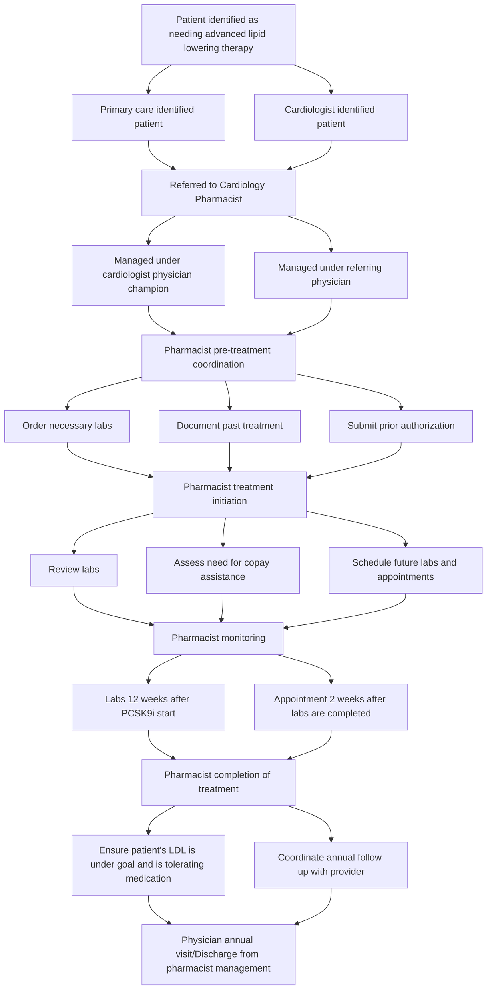

# Beyond the Prescription: The Specialty Clinical Pharmacist’s Role in Managing Advanced Lipid Therapy Geisinger

Amanda M. Popko PharmD, BCACP, Michael DiMaggio PharmD, Susanne Burns PharmD, MBA
Geisinger, Danville, PA

**Background:**

Initiation of advanced lipid-lowering therapies, such as PCSK9 inhibitors, is often hindered by complex insurance processes, including prior authorizations, step therapy, and high out-of-pocket costs. These barriers can delay or prevent treatment initiation, contributing to poor lipid control and increased cardiovascular risk.1

Embedding pharmacists within cardiology clinics enables comprehensive medication management. From therapy initiation to monitoring, pharmacist involvement has the potential to streamline access and improve patient outcomes.

**Objectives:**

* Describe the workflow of a system-wide, pharmacist-led lipid management program.

* Highlight the patient identification and referral process from primary care and cardiology providers to cardiology pharmacists.

* Demonstrate how pharmacist involvement improves provider access, patient adherence, and the use of specialty pharmacy services for dispensing and monitoring

**Baseline Metrics**

| 7   | **Embedded Cardiology Clinical Pharmacists** Working under collaborative practice agreement |
| --- | ----------------------------------------------------------------------------------------------- |
| 1   | **Average Physician Touch Points** During first year of PCSK9i therapy                      |
| 82  | **Patients Started on PCSK9i** Per month                                                    |
| 71% | **Proportion of Days Covered for PCSK9i** Geisinger Health Plan Members 2023-24             |

**Process**

**Potential Outcomes:**

Co-management between pharmacists and providers in cardiology clinics for advanced lipid therapy significantly enhances care delivery. By embedding pharmacists into the care team, provider access is increased through reduced patient touchpoints. Pharmacists streamline the process by coordinating care, managing medications, monitoring adherence and efficacy, and leveraging in-house specialty pharmacy services.

This model is expected to:

* Improve patient satisfaction

* Decrease barriers to medication access

* Reduce delays in therapy initiation

* Enhance long-term adherence and clinical outcomes

**Next Steps:**

* Expand pharmacist-led lipid management into additional clinics

* Explore other therapeutic areas where a similar pharmacist–physician collaborative relationship would apply

* Evaluate long-term cardiovascular outcomes and cost savings

**References**

1. Ference BA, Robinson JG, Brook RD, et al. Variation in PCSK9 and HMGCR and Risk of Cardiovascular Disease and Diabetes. N Engl J Med. 2016;375(22):2144-2153. doi:10.1056/NEJMoa1604304

Presented at 2024 American Society of Health System Pharmacists Midyear Clinical Meeting, New Orleans, Louisiana
Presented at the 2025 National Association of Specialty Pharmacy, Denver, Colorado

