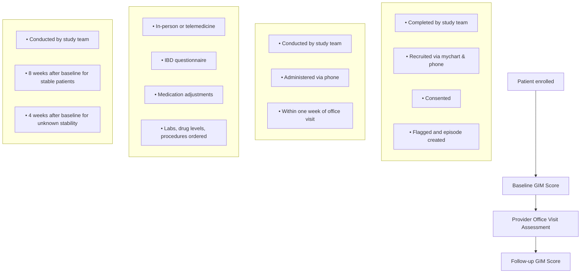

UW Health and Pharmacy logos UW Health and Pharmacy logos

# Validation of a Pharmacist Monitoring Tool for Patients with Inflammatory Bowel Disease

Connie Vo, PharmD, CSP<sup>1</sup>; Kristina M. Heimerl, PharmD, BCACP<sup>1</sup>
Jaynika B. Patel, PharmD<sup>1</sup> James Langley, PharmD, MS<sup>1</sup>

## B A C K G R O U N D

* Monitoring specialty medications utilized for treating inflammatory bowel diseases (IBD) is important due to their potential to cause adverse effects and need for dose adjustments to ensure optimal response

* Validated IBD physician assessment tools standardize assessment of disease state activity, but do not address medication-related concerns which lead to lower applicability of the tools for pharmacists

* In 2019 at University of Wisconsin (UW) Health, a pharmacist IBD patient monitoring tool, the gastro-intestinal metric (GIM) Score, was developed in collaboration with payors, patients, physicians, and pharmacists to standardize assessments and identify suboptimal medication efficacy

> A validated pharmacist-specific IBD patient monitoring tool can standardize pharmacist assessments, allowing for a consistent approach to recommending medication optimization and disease state follow-up

| Assessment Question            | Category                  |
| ------------------------------ | ------------------------- |
| General well-being             | Disease state progression |
| Abdominal pain                 |                           |
| Bowel frequency                |                           |
| Blood in stool                 |                           |
| Resolution of symptom attempts |                           |
| Work/school productivity       | Medication efficacy       |
| Next dose awareness            |                           |
| Missed doses                   |                           |
| Medication adverse effects     |                           |
|                                |                           |


* The GIM Score is currently being utilized by the specialty pharmacy team during routine telephone follow-ups with patients taking IBD specialty medications

## O B J E C T I V E S

* <u>Validate the GIM Score</u> through comparison of pharmacist and physician assessments of patients' IBD control at the time of office visit (baseline)
* Measure the accuracy of the GIM Score to develop a cutoff score for IBD stability and responsiveness of the GIM Score for patients with changing disease activity

## M E T H O D S

**Type**: Prospective cohort study
**Time frame**: August 1, 2024 to July 31, 2025
**IRB**: Minimal risk research approval
**Study team**: specialty pharmacists, student researchers, biostatistician
**Inclusion criteria**: Established with a UW Health gastroenterologist (GI) and has an office visit scheduled during the study period; gastroenterologist is the prescriber of the patient's adalimumab (or adalimumab biosimilar), certolizumab, ustekinumab, risankizumab, tofacitinib, upadacitinib or ozanimod; adherent to IBD medication (PDC>0.7); participant in UW Health Specialty Pharmacy Medication Management Program
**Exclusion criteria**: Pediatrics (<18 years old), pregnant, prisoners



## R E S U L T S

Table 1. Demographic Information (n=152)

| Variables               | Value (%)  |
| ----------------------- | ---------- |
| Age                     |            |
| median (range) years    | 48 (19-82) |
| Sex                     |            |
| Female                  | 80 (52.6)  |
| Male                    | 71 (46.7)  |
| Non-binary              | 1 (0.7)    |
| Race                    |            |
| White                   | 140 (92.1) |
| African American        | 5 (3.3)    |
| Asian                   | 4 (2.6)    |
| Unknown                 | 2 (1.3)    |
| Indian or Alaska Native | 1 (0.7)    |
| IBD diagnosis           |            |
| Crohn's disease         | 112 (73.7) |
| Ulcerative colitis      | 40 (26.3)  |
| Severe disease          |            |
| J-pouch or ostomy       | 22 (14.5)  |


Specialty IBD Medications Prescribed

| Outpatient Specialty Medication | Count |
| ------------------------------- | ----- |
| ustekinumab                     | 35    |
| upadacitinib                    | 25    |
| tofacitinib                     | 10    |
| risankizumab-rzaa               | 38    |
| certolizumab                    | 2     |
| adalimumab-ryvk                 | 1     |
| adalimumab-fkjp                 | 1     |
| adalimumab-bwwd                 | 1     |
| adalimumab-adaz                 | 10    |
| adalimumab-aaty                 | 15    |
| Adalimumab                      | 48    |


## R E S U L T S I N P R O G R E S S

```mermaid
graph TD
    A[482 patients eligible to recruit] --> B[152 consented/included in overall biostatistician analysis]
    A -- "184 unable to schedule office visit during study due to clinic access" --> X1[Excluded]
    A -- "70 did not engage" --> X1
    A -- "21 declined study participation" --> X1
    A -- "20 insurance mandated switch to alternative pharmacy" --> X1
    A -- "15 no follow-up GI office visit scheduled" --> X1
    A -- "9 outpatient specialty medication discontinued" --> X1
    A -- "5 transferred GI care" --> X1
    A -- "1 pregnant" --> X1
    A -- "1 deceased" --> X1

    B --> C[121 included in primary outcome analysis (validity)]
    B -- "31 lost to follow-up (did not engage after consenting)" --> X2[Excluded]

    C --> D[103 included in secondary outcome analysis (accuracy, responsiveness)]
    C -- "18 lost to follow-up (did not engage after baseline GIM score)" --> X3[Excluded]
```

## D I S C U S S I O N

* Integration of recruitment processes into specialty pharmacy workflows supports patient enrollment

* Collaborating with gastroenterology clinic providers and staff can increase visibility of specialty pharmacy research

* Limited gastroenterology clinic access can be a barrier to gathering clinic visit data

* Patient contact methods in addition to telephone, electronic health record messaging and letters are needed to support engagement

## R E F E R E N C E S

1. Cai Z, Wang S, Li J. Treatment of Inflammatory Bowel Disease: A Comprehensive Review. Front Med (Lausanne). 2021;8:765474.

2. Harvey RF, Bradshaw JM. A simple index of Crohn's-disease activity. Lancet. 1980;1(8167):514.

3. Best WR, Becktel JM, Singleton JW. Rederived values of the eight coefficients of the Crohn's Disease Activity Index (CDAI). Gastroenterology . 1979;77(4 Pt 2):843-6.

4. Lewis JD, Chuai S, Nessel L, Lichtenstein GR, Aberra FN, Ellenberg JH. Use of the noninvasive components of the Mayo score to assess clinical response in ulcerative colitis. Inflamm Bowel Dis. 2008;14(12):1660-6.

5. Walmsley RS, Ayres RC, Pounder RE, Allan RN. A simple clinical colitis activity index. Gut. 1998;43(1):29-32.

### Affiliations

1. Department of Pharmacy, UW Hospitals and Clinics; Madison, Wisconsin

UW Health logo


