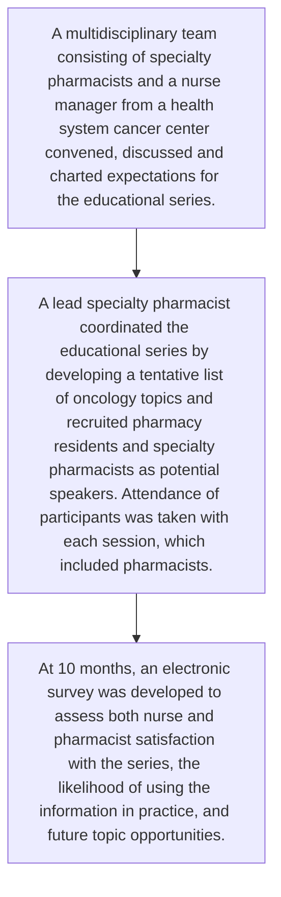

Yale New Haven Health logo

# Specialty Pharmacist Led Nursing Education Series

Michael Zummo, PharmD, CSP1, Bisni Narayanan PharmD MS1, Brooke Schrameck MSN, RN2, Terri Sue Rubino PharmD, CSP1, Vinay Sawant RPH, MPH, MBA1, Michele Riccardi PharmD, BCPS1;

1Yale New Haven Health, Department of Pharmacy, New Haven, CT; 2 YNHH Department of Nursing- Smilow Cancer Hospital

NASP National Association of Specialty Pharmacy logo

## Background

❑ Outpatient Pharmacy Services (OPS) is a specialty pharmacy at Yale New Haven Health which includes a health system cancer center.

❑ The tremendous growth in targeted oral oncolytic agents has presented unique challenges in education and training.

❑ Pharmacists have been shown to have an impact on the education of hematology/oncology nurses.1

❑ OPS specialty pharmacists have a unique advantage to deliver oral oncolytic education; they have knowledge of new agents on the market, are integrated into the health system, and work closely with the nurses at the cancer center.

❑ Upon identifying an educational gap on new oral oncology medications among oncology nurses, an educational series was created.

## Objectives

To create, implement, and evaluate a pilot education series for the outpatient oncology practice nurses on oral oncology medications.

## Methods

## Results

### Survey Response Rate = 16.2%

| Category               | Value |
| ---------------------- | ----- |
| Pharmacist Respondents | 9     |
| None Responders        | 165   |
| Nurse Respondents      | 23    |

### Nurse and Pharmacist Attendance per Education Session

| Date      | Attendees |
| --------- | --------- |
| 8/1/2021  | 21        |
| 9/1/2021  | 15        |
| 10/1/2021 | 30        |
| 11/1/2021 | 17        |
| 12/1/2021 | 25        |
| 1/1/2022  | 30        |
| 2/1/2022  | 50        |
| 3/1/2022  | 36        |
| 4/1/2022  | 43        |
| 5/1/2022  | 44        |

\* Expansion of invitees to Cancer Center Clinical Pharmacists and Increase to Two Sessions a Month in February 2022.

### Responses to Survey Questions

How satisfied are you with the Smilow RN/ OPS pharmacist nurse education series?

| Satisfaction Level    | # of respondents |
| --------------------- | ---------------- |
| Very dissatisfied     | 0                |
| Somewhat dissatisfied | 0                |
| Somewhat satisfied    | 12               |
| Very satisfied        | 20               |

How likely are you to use the information from the RN education series in your practice?

| Frequency       | # of respondents |
| --------------- | ---------------- |
| Very rarely     | 0                |
| Somewhat rarely | 1                |
| Somewhat often  | 11               |
| Very often      | 20               |

What topics would you like to see more of in the incoming months?

| Topic                                                                                                                   | # of respondents |
| ----------------------------------------------------------------------------------------------------------------------- | ---------------- |
| New oral chemotherapy agents on the market                                                                              | 12               |
| Other topic involved with the fulfillment of specialty oncology medications (MAP process, safe crushing technique, etc) | 6                |
| Outpatient pharmacy services operations/work-flow review                                                                | 4                |
| Review of oral oncology therapeutic classes of medicine (Her2 agents, CLL agents, Braf+ melanoma, etc)                  | 16               |

### Examples of Education Series Topics

Examples of Education Series Topics icon
* Oral chemotherapy pharmacist reassessments and education
* Medication assistance program
* Hazardous medication handling at home
* CDK 4/6 Inhibitors a closer look
* Targeted oral chemotherapy in the setting of HER2+ Breast Cancer
* BTK & BCL inhibitors for CLL
* Dissolving & crushing oral chemotherapy

**Individual Oral Agents**
* Lumakras
* Retevmo
* Tazverik
* Fotivda

### Staff Comments About The Educational Series

> “The monthly meetings have been so informative and it is nice to have education geared to nurses dealing with oral oncolytics. Most education is IV based”

> “I like hearing about the OPS process, MAP and other issues like crushing of meds for people unable to swallow”

> “This series is phenomenal and the topics are very apt and helpful in everyday practice, This forum also brings us pharmacists & Smilow practice nurses together”

> “These presentations are AMAZING!! Thank you for all who are involved in making this happen!! Keep them coming!! I have enjoyed all of the topics so far”

## Discussion

❑ The initial education session was given on August 2021 and subsequent education sessions were carried out monthly to May 2022 with the exception of January 2022.

❑ Upon request, in February 2022 the invitation to the education series was extended to all cancer center RNs and clinical pharmacists.

❑ There was an increase in attendance from 20 attendees in August 2021 to 44 attendees in May 2022.

❑ Topics presented included an overview of the oral oncolytic fulfillment process and education on new oncolytic medications.

❑ An electronic survey was sent out to the attendees (both nurses and pharmacists) in May 2022 and had 32 respondents.

❑ Approximately 62.5% of participants were very satisfied and 37.5% were somewhat satisfied with the educational series. None of the survey participants were dissatisfied with the series.

❑ Approximately 62.5% of survey participants replied that they were likely to use the information “very often” in their practice.

❑ For future educational topics, the majority of participants preferred education on oncolytic medications with 50% preferring a review of oral oncology therapeutic classes and 38% preferring education on new oral oncolytics.

## Conclusions

A successful pilot nursing educational series was created and implemented at a large health system with an integrated specialty pharmacy. Specialty pharmacists are uniquely positioned to close the educational gap among nursing and pharmacy staff.

## Future Directions

These results will guide the development of an educational program to be offered to all cancer center staff.

References: 1. Christine M. Fisher, Abby J. Kim, Joshua J. Elder; Impact of a Pharmacist-Led Chemotherapy Education Program on the Knowledge of Pediatric Hematology/Oncology Nurses. The Journal of Pediatric Pharmacology and Therapeutics 1 September 2017; 22 (5): 332–337. doi: https://doi.org/10.5863/1551-6776-22.5.332

Disclosure: The authors of this presentation have nothing to disclose concerning possible financial or personal relationships with commercial entities that may have a direct or indirect interest in the subject matter of this presentation. NASP Annual Meeting & Expo 2022. September 19-22, 2022.

