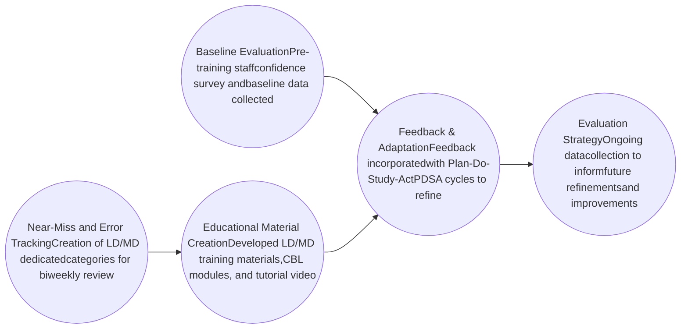

# Standardizing Specialty Pharmacy Practices: Addressing Risk in Loading Dose and Maintenance Dose Management UVAHealth logo

Shelby Braginetz, PharmD, CSP | Marie McCreight, PharmD, CSP | Leslie DuVal, PharmD

University of Virginia Specialty & Home Delivery Pharmacy

## Background

<mark>In a health system specialty pharmacy, recurring errors have been identified for loading and maintenance dose (LD/MD) prescriptions</mark>

A 39-year old patient with ulcerative colitis was prescribed a JAK-inhibitor for an 8-week loading dose, followed by a maintenance dose

<mark>Due to a lack of LD/MD standard operating procedures</mark>

| Two refill requests were accepted on the LD script | Patient received 12 weeks of LD | No MD prescription was on file |
| -------------------------------------------------- | ------------------------------- | ------------------------------ |

**Result: Excess high-dose JAK-inhibitor exposure, risk of adverse events, and delay in maintenance phase**

This prompted an internal review of the possibility and occurrence of similar LD/MD errors across specialty pharmacy operations

<mark>High-Risk Workflow Vulnerability</mark>

* Inconsistent clinic prescribing practices
* No standardized documenting or tracking of LD/MD regimens
* Lack of clarity across intake, clinical review, and prescription processing

<mark>Clinical Significance</mark>

* Proper sequencing of LD/MD is essential for achieving clinical goals and maximizing cost-effectiveness
* Delays or misalignments can negatively impact quality-adjusted life years (QALYs), drive unnecessary healthcare resource utilization (HCRU), and compromise patient-reported outcomes (PROs)
* These risks can erode the long-term value of specialty therapies

## Objectives

**Primary** ≥75% reduction in LD/MD-related near misses/errors

**Secondary**
* ≥25% increase in staff-reported confidence in managing complex dosing regimens
* ≥90% staff education and attestation completion rate within one month of launch
* LD/MD near-miss and error trend analysis

**Tertiary**
* Feasibility of proposed queue standardization
* Develop a long-term specialty pharmacy onboarding module for new hire pharmacists and technicians

## Methodology

## Future Considerations

| \*\*Intervention not adopted widely\*\* | Embed LD/MD logic into electronic medical record  |
| --------------------------------------- | ------------------------------------------------- |
| \*\*Errors persist despite training\*\* | Restructure high-risk queues in Willow Ambulatory |
| \*\*High refill error rate\*\*          | Limit autofill eligibility for loading doses      |

## Baseline Data

### Types of LD/MD Errors

| Category          | Percentage |
| ----------------- | ---------- |
| Wrong Frequency   | 22%        |
| LD Refilled       | 28%        |
| MD Sent Before LD | 50%        |

### Medication Specific Near-Misses and Errors

| Medication | Errors |
| ---------- | ------ |
| Bimzelx    | 2      |
| Cosentyx   | 3      |
| Dupixent   | 1      |
| Emgality   | 5      |
| Adalimumab | 4      |
| Kesimpta   | 1      |
| Rinvoq     | 2      |
| Taltz      | 3      |

### Trends in LD/MD Errors Over Time

| Month    | LD Refilled | MD Before LD | Wrong Frequency |
| -------- | ----------- | ------------ | --------------- |
| January  | 1           | 1            | 1               |
| February | 1           | 1            | 1               |
| March    | 2           | 2            | 2               |
| April    | 6           | 7            | 5               |
| May      | 3           | 3            | 3               |
| June     | 4           | 4            | 3               |
| July     | 4.5         | 5            | 3               |

### Staff Confidence in LD/MD Workflow

| Confidence Level    | Percentage |
| ------------------- | ---------- |
| Confident (7-10)    | 56.9%      |
| Neutral (5-6)       | 13.0%      |
| Not Confident (1-4) | 30.1%      |

### Formal Training Exposure Rates

| Training Exposure | Percentage |
| ----------------- | ---------- |
| Maybe             | 24.1%      |
| No                | 48.3%      |
| Yes               | 27.6%      |

See the Training Document – Scan for Access [QR Code: SCAN ME]

Disclosure Statement: This project was conducted as part of a quality improvement initiative within University of Virginia Specialty Pharmacy. No external financial support of conflicts of interest are present

