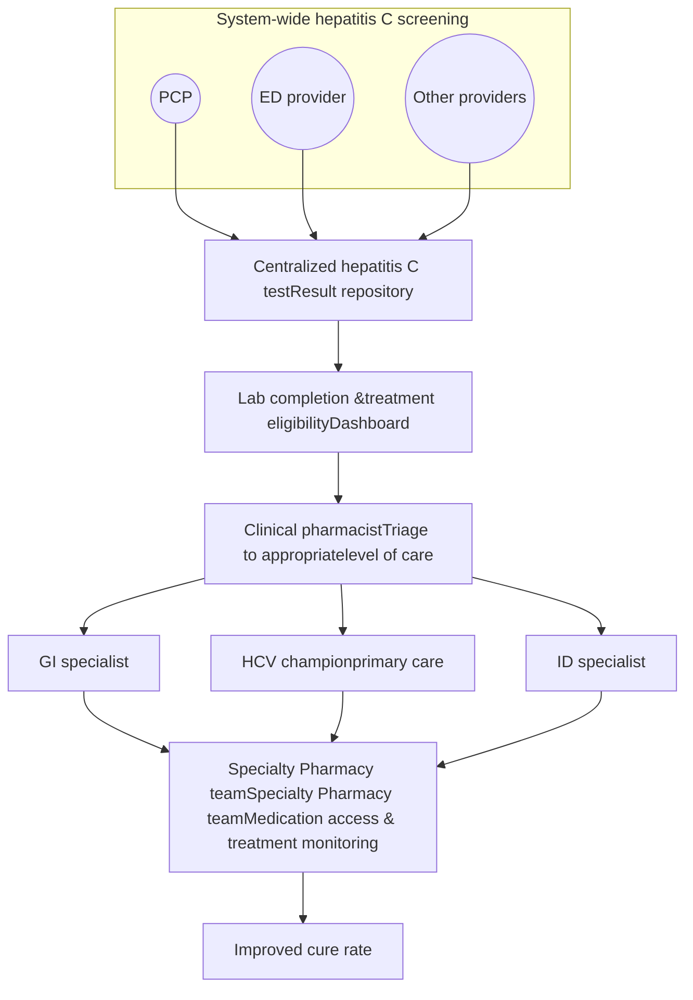

Clearway Health logo

# Hepatitis C Treatment Outcomes: The Collaborative Roles of Pharmacists and Pharmacy Technicians

Brenda Shih, PharmD, BCACP; Elena Troufi, CPhT; Fesehaye Zewdie, PharmD
Clearway Health, NeighborHealth

## Background

Hepatitis C is a public health threat, affecting over 2 million people in the United States (U.S.). The World Health Organization (WHO) and U.S. Viral Hepatitis National Strategic Plan aim for a 90% reduction in new hepatitis C infections by the year 2030. Despite the availability of effective direct-acting antiviral (DAAs) options, only 1 in 3 patients who test positive for hepatitis C infection are cured.

Several studies highlight the pivotal role that pharmacists play in hepatitis C virus treatment in supporting access to care, providing medication management, and improving sustained virologic response (SVR) rates. However, there is less information available on the impact of a collaborative approach with both pharmacists and pharmacy technicians within a hepatitis C service.

Currently at NeighborHealth, a collaborative approach with a pharmacist and a pharmacy technician is utilized for the hepatitis C program. A general overview of the test-to-treat algorithm for the service is shown in Figure 1. The roles and responsibilities for pharmacists and pharmacy technicians are described in a standard operating procedure (Figure 2). Prior to the technician joining the service, the pharmacist provided the pharmacy technician with relevant training on hepatitis C disease monitoring and treatment. The pharmacy technician is not permitted to conduct pharmacist-specific tasks, such as patient counseling. The pharmacist may assist in pharmacy technician roles if needed.

## Objective

The purpose of this study is to assess the impact of integrated pharmacy teams on hepatitis C treatment initiation, adherence and outcomes.

## Methodology

* **Study Design**: Single center, retrospective, observational study

* **Inclusion Criteria**: Adult patients who are candidates for DAA hepatitis C treatment between December 1st, 2024 to December 31st, 2025 at NeighborHealth clinics

* **Exclusion Criteria**: Patients treated outside of NeighborHealth clinics, pediatric patients under 18 years old, and deceased patients

## Primary Outcomes

* Percent of patients linked to care

* Percent of patients with confirmed care

Figure 1: Test-to-treat Algorithm

Figure 2: Roles and Responsibilities of Specialty Pharmacy Team

| Pharmacy Technician                                          | Pharmacist                               |
| ------------------------------------------------------------ | ---------------------------------------- |
| Benefit investigation                                        | Dashboard monitoring and linkage to care |
| Prior Authorization (PA) submission and outcome notification | Peer-to-peer and appeals                 |
| Coordination of medication deliveries                        | Initial patient review and counseling    |
| Resolving medication access issues                           | Treatment monitoring and management      |
| Service data collection                                      | SVR lab coordination                     |
|                                                              | Post-treatment care coordination         |
|                                                              | Service data collection and reporting    |

