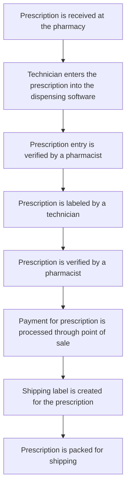

# Evaluating Efficiency through Workflow Productivity Metrics in a Health System Specialty Pharmacy

Kristen Lawrence, PharmD, CSP
CHRISTUS Specialty Pharmacy – Tyler, Texas

CHRISTUS Health logo

## Background

As specialty pharmacy services expand within the pharmacy landscape; health system specialty pharmacies increasingly need to assess and optimize operational efficiency. Productivity metrics are essential for evaluating staff competency, identifying areas for additional training, and determining the success of newly implemented processes. These metrics can precisely track the time pharmacy technicians spend on daily tasks identify factors that cause interruptions and help establish a staffing model that maintains high-quality patient care. Workflow efficiency directly impacts patient access to therapy, timeliness of care, and overall staff satisfaction. Evaluating productivity through objective, reproducible metrics can provide actionable insight to staffing needs, task allocation, and process redesign.

## Objectives

To assess workflow efficiency in a health system specialty pharmacy by utilizing time studies to analyze productivity metrics, generate benchmarks, and identify factors causing delays and opportunities for improvement.

## Methods

This project will utilize operational data from a health system specialty pharmacy to assess technician productivity across various workflow tasks. Time studies will be conducted to measure the duration of each workflow step. The tasks under scrutiny will include data entry, labeling, point of sale transactions, the creation of shipping labels, and the packaging of prescriptions for shipment. These benchmarks will provide a comprehensive understanding of workflow efficiency and highlight areas for potential process improvements, ultimately enhancing the overall productivity of the pharmacy team.

## Methods Continued

### Workflow assessment

* The existing pharmacy workflow will be utilized for data collection.

* Details for order entry, labeling, point of sale, shipping label creation, and packing will be outlined to ensure that each technician is following the same process for accurate data collection.

### Metric Selecting

* The metric used in this project will be the number of tasks completed within a given time frame.

### Data collection

* Data will be collected through direct observation of technicians performing tasks utilizing a stopwatch and documenting task completions and interruptions that occur.

* Time studies will provide detail into how long each task takes to complete.

* Interruptions will be documented in activity logs to provide additional insight into productivity.

* Historical data from the dispensing software will be reviewed to assess task completion monthly per full time employee assignment

### Analysis

* Averages of time studies will be used to determine benchmarks for each task.

* Staffing benchmarks will be determined by dividing the number of task completions monthly by the number of full-time employees typically assigned to those tasks.

## Existing Pharmacy Workflow

## References

1. Gannon M, Billmeyer A, Decoske M, Schomberg R. Health System Specialty Pharmacy Staffing Metrics: Development of Internal Benchmarking. ASHP 2021.

## Disclosures

The author of this presentation has nothing to disclose concerning possible financial or personal relationships with commercial entities that may have a direct or indirect interest in the subject matter of this presentation.

