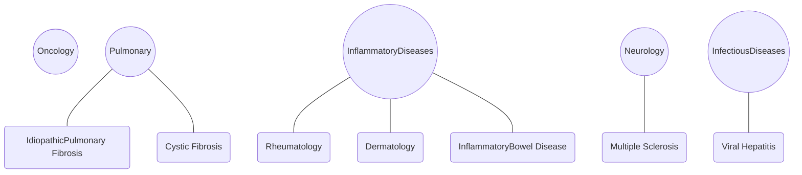

# Development of a Specialty Pharmacy Productivity Benchmarking Model

UK HealthCare logo

Thom Platt, PharmD, PhD; Rushabh Shah, PharmD, MBA, AAHIVP, CSP; Wendy Ramey, BSPharm, RPh, CSP; Meghan Driggs, PharmD, BCPS, CSP; Samantha Bochenek, PharmD, MBA, BCPS, CSP
University of Kentucky HealthCare Specialty Pharmacy & Infusion Services, Lexington, KY

The authors have no conflicts of interest to disclose

## BACKGROUND

* Benchmarking in healthcare is used to evaluate productivity on the basis of workflows, policies, and performance in hopes of optimizing current practices and improving patient outcomes.

* Internal benchmarking allows organizations to examine internal processes to determine allocation of institutional resources.

* Benchmarking has been utilized in areas of pharmacy practice (common metrics are: rate of prescription verification or time to fill).

* Currently there is no validated model to evaluate productivity in specialty pharmacy workflows.

* The purpose of this study was to develop a novel internal benchmarking model to measure productivity in specialty pharmacy practice.

## METHODS

* Six key performance indicators were identified for the pilot study: prior authorizations (PAs), appeals, financial assistance, onboarding (patient education), clinical assessments, and care plan activities (Figure 1).

* Pharmacists from the branches included in the pilot (Figure 2) utilized a time reporting excel tool to measure the length of time to perform key performance indicators. Data were uploaded on a weekly basis to a secured folder on the health system’s intranet where only specialty pharmacists had access.

* Raw task numbers for key performance indicators were collected utilizing the reporting functionality from the patient management system or based on new patient enrollment numbers for onboarding activities.

* Median time to complete each key performance indicator, raw task numbers, and staffing hours were utilized to establish a benchmark of the overall productivity level. Inflammatory diseases was identified as the benchmark the maturity of the branch workflows, tenure of its’ pharmacists, and its’ perceived workload.

### Figure 1: Key Performance Indicators for Benchmarking

| Intake               | Clinical Management  |
| -------------------- | -------------------- |
| Prior Authorizations | Onboarding           |
| Appeals              | Clinical Assessments |
| Financial Assistance | Care Plan Activities |

### Figure 2: Branches and Disease States Included in Pilot Study

## RESULTS

* Data were collected over the span of six weeks from December 2018 to February 2019, with a hiatus in data collection from 12/22/2018 to 1/7/2019.

* A total of 406 time data points were submitted by pharmacists during the data collection period.

* Intake activities associated with new prescriptions (prior authorization, appeals, and financial assistance) had low rates of response, therefore, they were dropped. Only clinical activities were included in the final analysis.

* Analysis of time data showed the oncology branch spent twice as long on clinical assessments compared to the other branches (7.23 minutes vs. 14.86 minutes; p<0.0001).

* No other significant findings from time data were revealed during statistical analysis.

* Benchmarks compared against the inflammatory diseases branch showed varied levels of overall productivity. Levels within 20% of the benchmark were considered within the goal range. (Figure 3).

* Neurology and Infectious Diseases were within the goal range compared to the benchmark (inflammatory diseases).

* Pulmonary showed a lower productivity level than the benchmark with a level of 0.64.

* Oncology showed a higher productivity level than the benchmark with a level of 2.55.

## CONCLUSIONS

* In this pilot, a novel model of specialty pharmacy productivity benchmarking was developed that can aggregate and compare data across multiple service lines and activities.

* Lack of response rate in activities related to intake, that are commonly not pharmacist specific, was a major limitation to this pilot. In the future technicians will also be included in the study and data collection will occur over a longer period of time

* Innate differences in branch workflows and software used (different ambulatory vs. inpatient EHRs and patient management system documentation requirements) had a dramatic impact on benchmark results (i.e. oncology time to complete clinical assessments).

* Pharmacist buy-in was also a barrier to collection of time data. Developing strategies to improve responses from pharmacists will be crucial to developing a full productivity model.

## FUTURE DIRECTIONS

* Implementation of the next phase of model development is underway.

* Technician and pharmacist activities will both be measured.

* New key performance indicators include: PAs, appeals, benefits investigation, initial drug education, onboarding activities, clinical assessments, refills, physician consults, financial assistance, operations metrics, cold chain metrics, clinical interventions, and laboratory review.

* New methodology for the collection time data has been developed. Time data will be collected via an online RedCap survey, fixed data collection windows for specific key performance indicators were removed, and the data collection window was extended to a span of four months.

* Improving buy-in with frequent check-ins, pharmacist and technician education, and reduced burden on workflows.

### Figure 3: Benchmarked productivity levels per branch

| Branch                | Ratio Activity Level vs. Benchmark |
| --------------------- | ---------------------------------- |
| Pulmonary             | 0.64                               |
| Neurology             | 0.83                               |
| Infectious Diseases   | 0.84                               |
| Inflammatory Diseases | 1.00                               |
| Oncology              | 2.55                               |

UK HealthCare logo thumbnail

