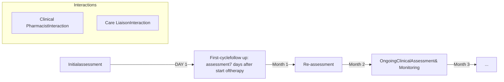

SHIELDS HEALTH SOLUTIONS logo

# Hospital Utilization Rates for Oncology Patients in an Integrated Health System Compared to a National Network

Martha Stutsky, PharmD; Dale Fasching, PharmD, MBA; Diana Miller; Laura West; Carolkim Huynh, PharmD; Christopher Barr; Jennifer L. Donovan, PharmD

**DISCLOSURES**

The authors of this presentation have nothing to disclose concerning possible financial or personal relationships with commercial entities that may have a direct or indirect interest in the subject matter of this presentation

## BACKGROUND

* Integrated Health System Specialty Pharmacies (HSSPs) have shown improved outcomes1-3 and lower medical expenses4 for patients yet are largely excluded from restricted drug and payer networks. A group of HSSPs implemented a comprehensive patient care model for oncology patients.

* Much of the healthcare utilization for oncology patients peaks during the first three months of therapy, in part due to medication toxicities. Patient engagement at the onset of therapy may prevent these events, potentially improving outcomes and cost of care.

* The objective was to compare hospital utilization rates within the first three months of oral oncolytic therapy for patients enrolled within HSSPs to patients within a national network not associated with an integrated care model.

Figure 1: HSSP Oncology Patient Journey

## METHODS

* Retrospective observational study evaluating self-reported hospital utilization rates in HSSP patients receiving an oncology medication from January 2018 through February 2022. Patients were identified from the therapy management platform.

- Inclusion Criteria: Adult and pediatric patients new to therapy with an oral oncolytic and enrolled in the HSSP patient management program (PMP) for a minimum of three months

- Exclusion Criteria: Transfer patients on therapy prior to enrollment in HSSP patient management program; patients opted out of PMP

* Patients with the following ICD 10 codes were identified: brain (C71), breast (C50), colorectal (C18; C20), hematology (C91, C92, C90, C83, C85, C88), lung (C34), and prostate (C61).

* Comparator (National Network) Group: A national health insurer de-identified database of 12.6 million Medicare Advantage (MA) members was used to identify patients filling self-administered specialty oncology medications from July 2018 to December 2019. Hospital utilization event rates were identified for the first three months of therapy.

* **Primary outcome**: Hospital utilization rates during the first three months of therapy, which were calculated for the HSSP group from patient report

## RESULTS

From the HSSP group, 2730 patients meeting the inclusion criteria were identified. Of these patients, 9% (n=247) reported hospital utilization, compared to 22% (1994/8960) in the national network group.

Figure 2: Hospital Utilization Rate at Three Months of Therapy

| Drug         | HSSP Group Patients with Event | HSSP Group Total Patients | HSSP Group Event Rate (%) | National Network Overall Patients with Event | National Network Overall Total Patients | National Network Overall Event Rate (%) |
| ------------ | ---------------------------------- | ----------------------------- | ----------------------------- | ------------------------------------------------ | ------------------------------------------- | ------------------------------------------- |
| Abiraterone  |                                    |                               |                               | 19                                               | 364                                         | 5%                                          |
| Afinitor     |                                    |                               |                               | 0                                                | 69                                          | 0%                                          |
| Alecensa     | 4                                  | 22                            | 18%                           | 17                                               | 69                                          | 25%                                         |
| Calquence    | 7                                  | 133                           | 5%                            | 14                                               | 41                                          | 34%                                         |
| Capecitabine |                                    |                               |                               |                                                  |                                             |                                             |
| Everolimus   |                                    |                               |                               |                                                  |                                             |                                             |
| Gleevec      | 2                                  | 42                            | 5%                            |                                                  |                                             |                                             |
| Ibrance      | 10                                 | 149                           | 7%                            | 41                                               | 1091                                        | 4%                                          |
| Imatinib     |                                    |                               |                               |                                                  |                                             |                                             |
| Imbruvica    | 16                                 | 249                           | 6%                            | 207                                              | 882                                         | 23%                                         |
| Ninlaro      | 3                                  | 21                            | 14%                           | 31                                               | 123                                         | 25%                                         |
| Orgovyx      | 4                                  | 116                           | 3%                            |                                                  |                                             |                                             |
| Revlimid     |                                    |                               |                               | 636                                              | 1613                                        | 39%                                         |
| Sprycel      | 4                                  | 53                            | 8%                            | 57                                               | 211                                         | 27%                                         |
| Tabrecta     | 2                                  | 13                            | 15%                           |                                                  |                                             |                                             |
| Tagrisso     | 25                                 | 226                           | 11%                           | 66                                               | 364                                         | 18%                                         |
| Temozolomide | 52                                 | 363                           | 14%                           | 237                                              | 708                                         | 33%                                         |
| Venclexta    | 49                                 | 234                           | 21%                           | 256                                              | 437                                         | 59%                                         |
| Verzenio     | 4                                  | 66                            | 6%                            | 14                                               | 232                                         | 6%                                          |
| Xeloda       | 51                                 | 563                           | 9%                            | 330                                              | 1191                                        | 28%                                         |
| Xtandi       | 9                                  | 188                           | 5%                            | 31                                               | 796                                         | 4%                                          |
| Zytiga       | 5                                  | 292                           | 2%                            | 38                                               | 769                                         | 5%                                          |
| Total        | 247                                | 2730                          | 9%                            | 1994                                             | 8960                                        | 22%                                         |

## CONCLUSIONS

* The hospital utilization rate of HSSP oncology patients within the first three months of therapy was lower than that of a national network, enrolled in standard specialty pharmacy patient management.

* The utilization rate calculated from claims data in the national network demonstrates the risk of avoidable medical events in the first three months of therapy.

* An integrated care model with close clinical monitoring and follow-up during this time period may help reduce the risk of medically avoidable events and overall total healthcare expenditures, which peak at the start of oncology therapy.

**REFERENCES**

1 Barnes E, Zhao J, Giumenta A, Johnson M. The effect of an integrated health system specialty pharmacy on HIV antiretroviral therapy adherence, viral suppression, and CD4 count in an outpatient infection disease clinic. Journal of Managed Care & Specialty Pharmacy. 2020;26(2)95-102.

2 Reynolds VW, Chinn ME, Jolly JA, et al. Integrated specialty pharmacy yields high PCSK9 inhibitor access and initiation rates. Journal of Clinical Lipidology. 2019;13(2):254-264.

3 Shah NB, Mitchell, RE, Proctor, ST, et al. High rates of medication adherence in patients with pulmonary arterial hypertension: an integrated specialty pharmacy approach. PLoS ONE. 2019;14(6):e0217798.

4 Soni A, Smith BS, Scornavacca T, et al. Association of use of an integrated specialty pharmacy with total medical expenditures among members of an accountable care organization . JAMA Network Open. 2020;3(10):e2018772.

QR Code

SCAN ME icon

NASP 2023 Annual Meeting

