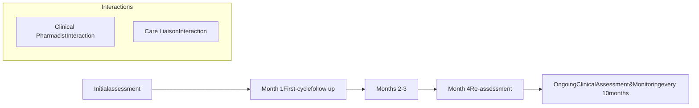

Sentara logo

SHIELDS HEALTH SOLUTIONS logo Proprium PHARMACY logo

# Impact of an Integrated Health System Specialty Pharmacy on HIV Clinical Outcomes

Elizabeth Maloy, PharmD, BCACP, CSP; Angelo Jones, PharmD, BCPS; Shreevidya Periyasamy, MS, HIA; Y. Caleb Chun, MA; Christopher Barr, Amy Riggs, PharmD, MBA, CSP; Jeremy Spires, PharmD; Jim Schwamburger, BS Pharm, MBA; Martha Stutsky, PharmD, BCPS

## BACKGROUND

* Patients with HIV who adhere to antiretroviral therapy (ART) achieve and maintain viral load (VL) suppression. Previous research has shown that adherence rates of ≥ 95% are necessary for optimal ART efficacy and VL suppression.1

* However, for this population there are limited data on the impact of integrated health system specialty pharmacy (HSSP) and patient demographic factors on clinical outcomes, specifically viral load suppression.

* The purpose of this analysis was to describe the impact of a HSSP model and socio-demographic factors on clinical outcomes in patients with HIV.

Figure 1: HSSP HIV Patient Journey

Clinical Pharmacist Interaction icon Clinical Pharmacist Interaction Care Liaison Interaction icon Care Liaison Interaction

## METHODS

**Study Design**: This was a single-center, retrospective, observational analysis of adult and pediatric patients with HIV on ARV therapy filling with the Proprium Specialty Pharmacy from January to December 2022.

* **Inclusion Criteria**: Patients on HIV ART enrolled in Proprium patient management program (PMP) for > 6 months with a reportable VL or if on service < 6 months with a VL of < 200 copies/mL with a clinical assessment in the past one year

**Primary Outcome**: HIV viral load suppression

**Data Identification**: The following demographic information was collected through the electronic medical record or specialty pharmacy management system:

* Age, gender, race/ethnicity, out of pocket (OOP) medication cost, days on service in the specialty pharmacy, primary insurance type, VL suppression, and adherence measured by proportion of days covered (PDC).

**Analysis**: A logit regression model using Rstudio 2023.03.0+386 evaluated the impact of demographic variables on VL suppression. PDC level of 95% was utilized for analysis.

## RESULTS

Table 1 summarizes patient characteristics and their association with VL suppression. In the Proprium population, VL suppression was 94%, higher than national averages (Figure 1). Only 6% of patients had any OOP cost (Figure 2), with the most patients in the Medicare group (OOP mean $25.72; median $0; max $908.54), followed by the commercial group (OOP mean $0.79; median $0; max $79.07). Average PDC in the Proprium group was 92%, and PDC ≥ 95% was associated with VL suppression.

Figure 1: Viral Load Suppression Rates

| National Average² | Ryan White HIV/AIDS³ | PROPRIUM |
| ----------------- | -------------------- | -------- |
| 65%               | 89.4%                | 94%      |

Viral Load Suppression Rates chart

Table 1: Patient Characteristics and Impact on VL Suppression

| Characteristic            | N=642        | p-value |
| ------------------------- | ------------ | ------- |
| Age (years)¹              | 47           | 0.25    |
| Sex (n, %)                |              |         |
| M                         | 463 (72%)    | 0.39    |
| F                         | 179 (28%)    |         |
| Race (n, %)               |              |         |
| Black                     | 394 (61%)    | 0.86    |
| White                     | 171 (27%)    | 0.79    |
| Unknown/Other             | 77 (12%)     | 0.39    |
| Hispanic or Latino (n, %) |              |         |
| No                        | 533 (83%)    |         |
| Yes                       | 94 (15%)     | 0.43    |
| Unknown                   | 15 (2%)      |         |
| Days on Service²          | 1710         | 0.50    |
| (range)                   | (2-2454)     |         |
| Out-of-Pocket Cost²       | $0           | < 0.005 |
| (range)                   | ($0-$908.54) |         |
| Insurance Type (n, %)     |              |         |
| Commercial                | 298 (46%)    | 0.96    |
| Managed Medicaid          | 178 (28%)    | 0.55    |
| Medicare                  | 82 (13%)     | 0.52    |
| Unknown/Other             | 84 (13%)     |         |
| PDC ≥ 95% (n, %)          | 346 (54%)    | 0.08    |

1 Mean
2 Median

Figure 2: Out of Pocket Cost by Insurance Type

| Insurance Type   | Total Patients (%) | Total Patients (n) | Patients with Any OOP Cost (%) | Patients with Any OOP Cost (n) |
| ---------------- | ------------------ | ------------------ | ------------------------------ | ------------------------------ |
| Commercial       | 100%               | 298                | 2%                             | 6                              |
| Managed Medicaid | 100%               | 178                | 0%                             | 0                              |
| Medicare         | 100%               | 82                 | 35%                            | 29                             |
| Unknown/Other    | 100%               | 84                 | 1%                             | 1                              |

PDC >= 95% icon **PDC ≥ 95%** Associated with VL suppression (p=0.08)

## CONCLUSIONS

* The lack of significant impact of age, gender, time on service, race/ethnicity, and insurance on VL suppression demonstrates the consistency of the HSSP model and impact on HIV clinical outcomes.

* The significant association between presence of OOP cost and improved VL suppression is likely due to the large percentage of patients with no OOP cost in the sample (>94%).

* The impact of medication adherence on VL suppression is consistent with previous findings and underscores the importance of careful monitoring and follow-up within this population.

QR Code SCAN ME icon

DISCLOSURES

The authors of this presentation have nothing to disclose concerning possible financial or personal relationships with commercial entities that may have a direct or indirect interest in the subject matter of this presentation

REFERENCES

1. Paterson DL, et al. Adherence to protease inhibitor therapy and outcomes in patients with HIV infection. Ann Intern Med. 2000;133(1):21-30.
2. Viral Suppression and Barriers to Care. CDC. cdc.gov/hiv/statistics/overview/in-us/viral-suppression.html.
3. Health Resources and Services Administration. Ryan White HIV/AIDS Program Annual Client-Level Data Report 2021. hab.hrsa.gov/data/data-reports.

