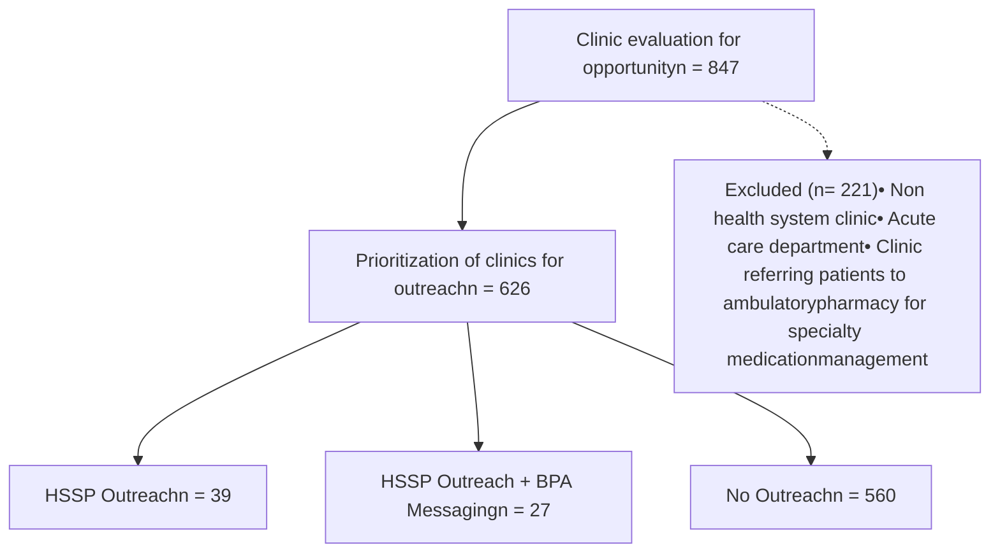

Yale New Haven Health logo

# Comparing approaches to drive clinical continuity

Kimhouy Tong, PharmD, BCPS; Ryan Isaccson, PharmD, MBA; Todd Cooperman, MBA, PRS, PAHM; Vinay Sawant, RPh, MPH, MBA
Yale New Haven Health, Department of Pharmacy, New Haven, CT

NASP National Association of Specialty Pharmacy logo

## Background

* Health system specialty pharmacies (HSSP) facilitate the coordinated provision of clinical, financial, and operational services to patients on specialty medications.

* Despite these benefits, not all specialty medication prescriptions remain within the health system.

* On May 1, 2021, the Yale New Haven Health HSSP launched an initiative to improve clinical continuity, defined as the provision of specialty drug orders from health system clinics to the HSSP.

* This initiative employed an interdisciplinary outreach team complemented by electronic health record (EHR) messaging for clinics that opt into a Best Practice Advisory (BPA) that recommends the HSSP to clinicians ordering a specialty medication to an external pharmacy.

## Objectives

To determine whether the implementation of a clinical continuity outreach team with or without the BPA improves clinical continuity.

## Methods

* Retrospective review of specialty medication orders placed in EHR

### Inclusion/Exclusion Criteria

* Inclusion:

  * Medications ordered to external pharmacy using health system EHR

  * Orders placed October 1, 2020 through May 31, 2022

* Exclusion:

  * Non-health system clinics

  * Acute care departments

  * Clinics referring patients to ambulatory pharmacy for specialty medication management

### Data collection

* Report of medication orders placed within EHR

* Comparator groups:

  * Departments with no outreach

  * Departments with HSSP outreach

  * Departments with HSSP outreach + BPA messaging

### Analysis

* Primary Outcome: Proportion of specialty medication orders that remain within the health system (prescription capture)

* Statistical tests: Chi-squared for categorical variable, student t-test for continuous variable, statistical significance declared for p< 0.05

## Results

Figure 1. Clinic evaluation flowchart

Figure 2. Percent Change in Prescription Capture Post- Implementation of HSSP Outreach Team

| Outreach Type       | Change in Prescription Capture (%) | Significance |
| ------------------- | ---------------------------------- | ------------ |
| HSSP Outreach       | 30.5                               | ns           |
| HSSP Outreach + BPA | 30.2                               | P=0.02       |
| No Outreach         | 3.0                                |              |

Figure 3. Percent Change in Prescription Capture in Hospital and Non-Hospital Based Clinics

| Outreach Type       | Non-Hospital Based Clinics (%) | Hospital Based Clinics (%) |
| ------------------- | ------------------------------ | -------------------------- |
| HSSP Outreach       | 82.0                           | 10.0                       |
| HSSP Outreach + BPA | 33.0                           | 25.0                       |
| No Outreach         | 6.0                            | 3.0                        |

## Discussion

* Clinical continuity improved from baseline by approximately 30% for clinics with any HSSP outreach.

* Significantly higher than the 3% organic growth observed in departments with no outreach.

* The BPA resulted in 16% of orders initially placed to external pharmacies to remain within the health system.

* Prescription capture increased in hospital and non- hospital based clinics. However, health system clinics affiliated with the medical school and partner medical groups responded very favorably to specialty pharmacy services highlighted by the HSSP outreach team relative to clinics affiliated with health system hospitals.

* Hospital based clinics responded most favorably to a multi- faceted strategy that includes tailored outreach from the HSSP team paired with BPA messaging.

* Non- hospital based clinics may respond more positively to face-to-face interactions with HSSP representatives.

* Clinics participating in a complementary ambulatory pharmacy initiative were excluded to more clearly evaluate the impact of the HSSP outreach team.

## Conclusions

Health system specialty pharmacy outreach to clinics, with or without enhanced electronic tools, can improve prescription capture and enhance clinical continuity within a healthcare system.

## Future Directions

* Results will guide future clinic prioritization within the health system.

* Outreach approach will be tailored based on clinic type.

* Planned future subgroup analyses to include clinics receiving ambulatory pharmacy specialty medication support services.

## Acknowledgements

* We would like to thank our HSSP outreach team Mark D’Ambrosi, Aislinn Devoe, and Natalie Amendola for their tireless efforts to connect clinics to HSSP services.

Disclosure: The authors of this presentation have the following to disclose concerning possible financial or personal relationships with commercial entities that may have a direct or indirect interest in the subject matter of this presentation: Kimhouy Tong, PharmD, BCPS; Ryan Isaccson, PharmD, MBA; Todd Cooperman, MBA, PRS, PAHM; Vinay Sawant, RPh, MPH, MBA.

NASP Annual Meeting & Expo 2022. September 19-22, 2022

