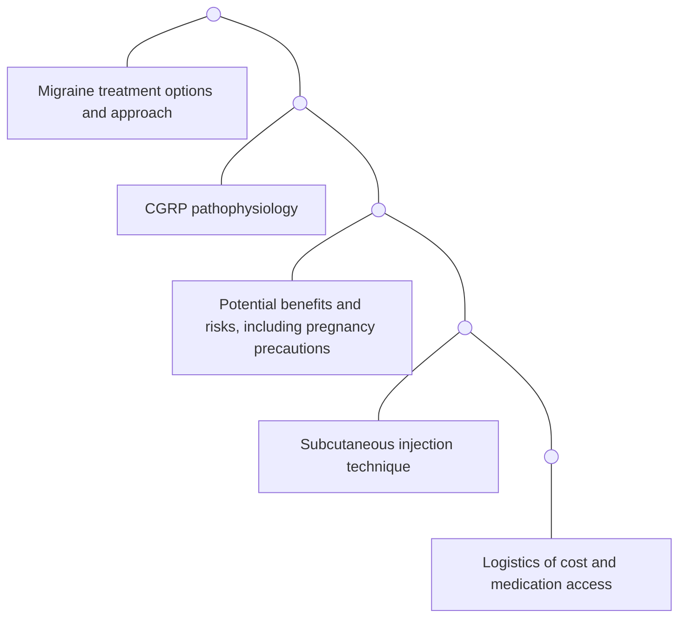

# Impact of multidisciplinary patient education sessions on expectations and understanding of new CGRP treatments

Wake Forest Baptist Health logo

Alyssa Stewart, PharmD1; Jennifer Young, PharmD, BCPS, CSP1; Lauren Strauss, DO, FAHS2; Starla Wise, DO2;
Laura Granetzke, FNP2; Sandhya Kumar, MD2; Jaime Speiser, PhD3; Amy Guzik, MD2; Nathaniel O’Connell, PhD3; Rebecca Erwin Wells, MD, MPH, FAHS2
Department of Pharmacy1; Department of Neurology2; Department of Biostatistics and Data Science, Division of Public Health Sciences3

## BACKGROUND & OBJECTIVES

* The new calcitonin gene-related peptide (CGRP) antagonist medications offer exciting new treatment options for migraine prevention

* Finding effective and efficient ways to educate patients about these new treatments can be challenging

* We aimed to develop and evaluate a patient-oriented, multidisciplinary presentation to inform patients about this new drug class to increase patient understanding and decrease provider and pharmacist education burden

## METHODS

* Three live, one-hour patient informational sessions were led jointly by a headache medicine neurologist and a clinical pharmacist from the institution’s specialty pharmacy in Oct-Nov 2018

* Topics included:

## METHODS, cont.

* The third session was video-recorded for patients to view electronically, either at home or in-clinic, beginning Feb 2019

* Patient surveys were completed before and after watching the in-person or online session

* Data reflects patient responses from Oct 2018 through May 2019, though this initiative is ongoing

* Patients had the ability to fill at the institution’s specialty pharmacy, who assisted with benefits investigation and prior authorization

* Approved by the Wake Forest School of Medicine Institutional Review Board

## RESULTS

* A total of 84 patients participated in the informational session (41 in-person; 43 online)

| Baseline Characteristics (n=84)             | Baseline Characteristics (n=84) |
| ------------------------------------------- | ------------------------------- |
| Caucasian, n (%)                            | 73 (87)                         |
| Age, mean (SD)                              | 49 (12)                         |
| Commercially insured, n (%)                 | 61 (73)                         |
| Hold at least bachelor’s degree, n (%)      | 44 (52)                         |
| Monthly headache frequency, mean (SD)       | 18 (9.2)                        |
| MIDAS\* score, mean (SD)                    | 63 (53)                         |
| # prior preventive meds, mean (SD)          | 7.3 (4.9)                       |
| # prior supplements, mean (SD)              | 2.3 (2.0)                       |
| *# prior integrative treatments, mean (SD)* | *5.6 (3.8)*                     |

\*Migraine Disability Assessment Scores (MIDAS) >21 represent severe disability

## RESULTS, cont.

### Patient survey responses pre and post-educational session

| Survey question                           | Pre-survey | Post-survey |
| ----------------------------------------- | ---------- | ----------- |
| Comfortable with administration technique | 84%        | 97%\*       |
| Confident in CGRP understanding           | 68%        | 97%\*       |

\*p<0.01

* 71 participants completed both pre- and post-surveys

* There was no statistically significant difference between the in-person and online sessions for the two measures above

* Nearly all participants (98%) felt confident in adhering to monthly injection frequency before the session, and this remained true in the post-survey (100%)

* 97% of participants would recommend the session to friends or family with migraine

## CONCLUSIONS

* The multidisciplinary informational session was an effective and efficient method of educating patients about new CGRP treatments while concurrently decreasing provider and pharmacist education burden

* Patients’ knowledge base improved and they felt well-informed

* The online video was as effective as the in-person session in educating patients, but improved access and availability

* Future studies could assess impact of such educational sessions on adherence and clinical response

## ACKNOWLEDGEMENTS

* Rebecca Wells is supported by the National Center for Complementary & Integrative Health (NCCIH) of the National Institutes of Health under Award Number K23AT008406. The content is solely the responsibility of the authors and does not necessarily represent the official views of the National Institutes of Health

* REDCap at Wake Forest Baptist School of Medicine is supported through UL1TR00142

* We are especially grateful to Charles Pierce, Vinish Kumar, Rebekah Sammons, Gennifer Manuel, Rachel Graham, and Wake Forest Baptist Specialty Pharmacy staff for their support of this process

**Contact:**
Alyssa Stewart, PharmD
Clinical Pharmacist, Specialty Pharmacy
Wake Forest Baptist Medical Center
Winston-Salem, NC
apstewar@wakehealth.edu

