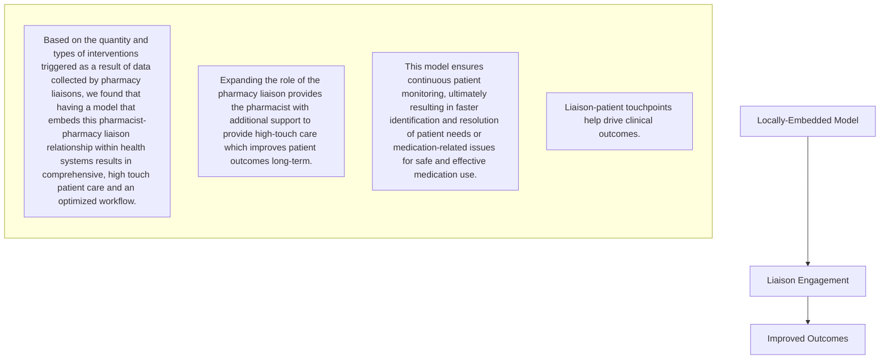

# Impact of Health System Specialty Pharmacist-Liaison Teams on Patient Outcomes

Trellis Rx logo

Sarah Mehaffey, CPhT, Britt Sager, BS, CPhT, Rusty Hammonds, CPhT, Jessica Mourani, Pharm.D.

## BACKGROUND

* The relationship between clinical pharmacists and pharmacy liaisons is paramount in enabling health system specialty pharmacy services to provide patients high-touch care.

* Trellis Rx, a technology-enabled specialty pharmacy services provider, has developed a system that empowers pharmacy liaisons to serve in a more active role in patient care.

* Pharmacy liaisons working onsite at health systems collect safety- and efficacy-related data using a standard questionnaire in Arbor®, Trellis Rx’s proprietary specialty pharmacy technology platform. This triggers protocol-driven interventions, which are reviewed and completed by the pharmacy liaison’s onsite pharmacist counterpart.

* Expanding the role of the pharmacy liaison provides the pharmacist with additional support which improves patient outcomes long-term.

## OBJECTIVES

* The primary goal of this study was to quantify and assess the number and types of interventions triggered as a result of data collected by pharmacy liaisons using a standard questionnaire in Arbor during monthly patient touchpoints and then reviewed and completed by their pharmacist counterpart to improve patient outcomes.

## METHODS

| Design   | This was a retrospective, multisite study from April 2019-March 2020 analyzing interventions triggered as a result of data collected by pharmacy liaisons using a standard questionnaire in Arbor.                                                                                                                                                                                                                                  |
| -------- | ----------------------------------------------------------------------------------------------------------------------------------------------------------------------------------------------------------------------------------------------------------------------------------------------------------------------------------------------------------------------------------------------------------------------------------- |
| Setting  | Our high-touch care model involves initial counseling and education with the pharmacist, monthly touchpoints with the pharmacy liaison, and ongoing counseling and support from the pharmacist. During the monthly pharmacy liaison touchpoints, pharmacy liaisons collect safety- and efficacy-related data using a standard questionnaire in Arbor, triggering protocol-driven interventions for pharmacist follow-up and review. |
| Measures | Interventions triggered as a result of data collected during pharmacy liaison touchpoints and then completed by a clinical pharmacist. Intervention data was sorted into subtypes and assessed for outcomes.                                                                                                                                                                                                                        |
| Analysis | A total of 4,200 interventions triggered as a result of pharmacy liaison touchpoints were analyzed.                                                                                                                                                                                                                                                                                                                                 |

## RESULTS

FIGURE 1:

| Intervention Subtypes                              |
| -------------------------------------------------- |
| Adherence                                          |
| Regimen Change                                     |
| Drug Interaction                                   |
| Adverse Event                                      |
| Lab Requirement                                    |
| Referral of service or Linkage to Care Opportunity |

> Multiple intervention types were triggered as a result of data collected by pharmacy liaisons during patient touchpoints.

FIGURE 2&3 :

Intervention Subtype

| Intervention Subtype | Count |
| -------------------- | ----- |
| Adherence            | 1800  |
| Regimen Change       | 50    |
| Drug Interaction     | 20    |
| Adverse Event        | 600   |

### Top Intervention Recommendations

| Recommendation Type               | Count |
| --------------------------------- | ----- |
| Disease/Drug Education            | 560   |
| Lifestyle                         | 350   |
| Adherence Aid                     | 340   |
| Counseling on Mitigation Strategy | 330   |

* 4,200 interventions were triggered based on data collected by pharmacy liaisons during patient touchpoints.

* These interventions, which were reviewed and completed by the pharmacy liaison’s pharmacist counterpart, resulted in therapy changes, dosing modifications, discontinuations, holding of therapy, additional patient education, lab orders, additional provider visits, and adherence aid recommendations.

## CONCLUSIONS

## REFERENCES

1. Zullig LL, Peterson ED, Bosworth HB. Ingredients of Successful Interventions to Improve Medication Adherence. JAMA. 2013;310(24):2611-2612

2. Fera T, Kanel KT, Bolinger ML, Fink AE, Iheasirim S. Clinical support role for a pharmacy technician within a primary care resource center. Am J Health Syst Pharm. 2018 Feb 1;75(3):139-144

