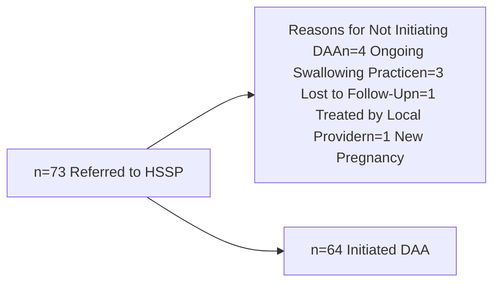
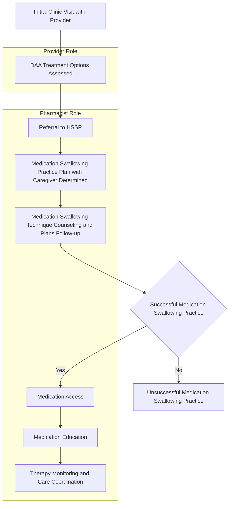

# PEDIATRIC HEPATITIS C PATIENT OUTCOMES IN A TERTIARY ACADEMIC MEDICAL CENTER UTILIZING AN INTEGRATED HEALTH SYSTEM SPECIALTY PHARMACY MODEL

Vanderbilt University Medical Center logo
QR code

ALICIA B. CARVER, PHARMD, BCPS, CSP1 | CORI EDMONDS, PHARMD, BCPS, CSP1 | KRISTEN WHELCHEL, PHARMD, CSP1 | RYAN MOORE, MS2 | LEENA CHOI, PHD2 | LYNETTE GILLIS, MD3,4
1VANDERBILT SPECIALTY PHARMACY, VANDERBILT UNIVERSITY MEDICAL CENTER, 2DEPARTMENT OF BIOSTATISTICS, VANDERBILT UNIVERSITY MEDICAL CENTER, 3DEPARTMENT OF PEDIATRIC GASTROENTEROLOGY, HEPATOLOGY AND NUTRITION, MONROE CARELL, JR. CHILDREN’S HOSPITAL AT VANDERBILT, 4UNIVERSITY OF LOUISVILLE SCHOOL OF MEDICINE

## BACKGROUND

* Real-world data utilizing direct-acting antivirals (DAAs) in patients aged <18 years with chronic hepatitis C (CHC) in countries outside of the United States demonstrates high efficacy and tolerability, however similar data is lacking in the United States where barriers to DAA accessibility have been reported.

* Pediatric hepatologists in the Pediatric Hepatology Clinic at the Monroe Carell, Jr. Children’s Hospital at Vanderbilt (MCJCHV) began utilizing an integrated Health System Specialty Pharmacy (HSSP) model in 2017 to assist with DAA selection, initiation and management in CHC patients aged <18 years.

* **OBJECTIVE**: Evaluate the efficacy of DAAs for CHC pediatric patients utilizing an HSSP model.

## METHODS

| Design             | Single-center, retrospective, cohort study                                                                                                                                           |
| ------------------ | ------------------------------------------------------------------------------------------------------------------------------------------------------------------------------------ |
| Sample             | Patients <18 years old who were evaluated and referred to the HSSP for DAA initiation by a pediatric hepatologist at the Pediatric Hepatology Clinic at MCJCHV                       |
| Exclusion Criteria | Patients never initiating DAA                                                                                                                                                        |
| Study Period       | January 2017 - September 2022                                                                                                                                                        |
| Primary Outcome    | Rates of sustained virologic response (SVR) at least 12 weeks post-DAA completion                                                                                                    |
| Secondary Outcomes | Initial DAA swallowing success frequency and rates of response, patient-reported side effects, patient-reported adherence rates, drug-drug interaction (DDI) rate and DDI management |

## FIGURE 1: PATIENT REFERRAL OUTCOMES

## RESULTS

## TABLE 1: BASELINE CHARACTERISTICS

|                                           | 3-5 years n=20            | 6-11 years n=32             | 12-17 years n=12          | Overall n=64                |
| ----------------------------------------- | ----------------------------- | ------------------------------- | ----------------------------- | ------------------------------- |
| Median age, years (IQR)                   | 5 (4-5)                       | 7 (6-8.25)                      | 15 (13.75-15.25)              | 6 (5-9.25)                      |
| Male, n (%)                               | 12 (60%)                      | 13 (41%)                        | 3 (25%)                       | 28 (44%)                        |
| White, n (%)                              | 14 (70%)                      | 25 (78%)                        | 8 (67%)                       | 47 (73%)                        |
| Weight, kg - median (IQR)                 | 18.8 (17.1-20.8)              | 27.3 (24.8-33.3)                | 55.7 (43.5-62.4)              | 26.6 (19.9-38.9)                |
| Height, cm - median (IQR)                 | 105 (101-110)                 | 124 (118-132)                   | 157 (151-163)                 | 120 (110-141)                   |
| BMI, kg/m² - median (IQR)                 | 17 (15.4-18.3)                | 17.6 (16.5-20.5)                | 21.8 (19.2-24.8)              | 18 (16.3-21.6)                  |
| Genotype, n (%)                           |                               |                                 |                               |                                 |
| 1                                         | 17 (85%)                      | 22 (69%)                        | 10 (83%)                      | 49 (77%)                        |
| 2                                         | 1 (5%)                        | 2 (6%)                          | 0 (0%)                        | 3 (5%)                          |
| 3                                         | 2 (10%)                       | 8 (25%)                         | 1 (8%)                        | 11 (17%)                        |
| 4                                         | 0 (0%)                        | 0 (0%)                          | 1 (8%)                        | 1 (2%)                          |
| Cirrhosis, n (%)                          | 0 (0%)                        | 1 (3%)                          | 0 (0%)                        | 1 (2%)                          |
| Treatment experienced, n (%)              | 0 (0%)                        | 0 (0%)                          | 0 (0%)                        | 0 (0%)                          |
| Baseline viral load, IU/mL - median (IQR) | 852,079 (295,219 - 3,668,653) | 1,396,356 (423,922 - 2,928,785) | 554,147 (349,904 - 2,215,088) | 1,077,115 (392,422 - 3,240,835) |
| Baseline AST, U/L - median (IQR)          | 56.5 (44.8-72.0)              | 42 (33.8-54.2)                  | 37 (30.2-50.5)                | 45.5 (34.8-62.0)                |
| Baseline ALT, U/L - median (IQR)          | 64 (41.0-88.2)                | 45.5 (33.8-65.0)                | 48 (29.8-70.0)                | 49.5 (34.0-79.0)                |
| Treatment regimen, n (%)                  |                               |                                 |                               |                                 |
| LDV/SOF 90/400mg T x12                    | 0 (0%)                        | 3 (9%)                          | 8 (67%)                       | 11 (17%)                        |
| LDV/SOF 45/200mg T x12                    | 11 (55%)                      | 15 (47%)                        | 0 (0%)                        | 26 (41%)                        |
| LDV/SOF 45/200mg P x12                    | 2 (10%)                       | 1 (3%)                          | 0 (0%)                        | 3 (5%)                          |
| LDV/SOF 33.75/150mg P x12                 | 3 (15%)                       | 0 (0%)                          | 0 (0%)                        | 3 (5%)                          |
| SOF/VEL 400/100mg T x12                   | 0 (0%)                        | 4 (13%)                         | 0 (0%)                        | 4 (6%)                          |
| SOF/VEL 400/100mg P x12                   | 0 (0%)                        | 2 (6%)                          | 0 (0%)                        | 2 (3%)                          |
| SOF/VEL 200/50mg T x12                    | 3 (15%)                       | 7 (22%)                         | 0 (0%)                        | 10 (16%)                        |
| SOF/VEL 200/50mg P x12                    | 1 (5%)                        | 0 (0%)                          | 0 (0%)                        | 1 (2%)                          |
| GLE/PIB 300/120mg T x8                    | 0 (0%)                        | 0 (0%)                          | 4 (33%)                       | 4 (6%)                          |
| Insurance type, n (%)                     |                               |                                 |                               |                                 |
| Medicaid                                  | 17 (85%)                      | 26 (81%)                        | 10 (83%)                      | 53 (83%)                        |
| Commercial                                | 3 (15%)                       | 6 (19%)                         | 2 (17%)                       | 11 (17%)                        |

Abbreviations: ALT, alanine aminotransferase; AST, aspartate aminotransferase; GLE/PIB, glecaprevir/pibrentasvir; IQR, interquartile range; LDV/SOF, ledipasvir/sofosbuvir; P, pellets; SOF/VEL, sofosbuvir/velpatasvir; T, tablets

## FIGURE 3: SVR RATES

| Category           | Yes | No | Lost to Follow-Up | Reinfection |
| ------------------ | --- | -- | ----------------- | ----------- |
| Overall (n=64)     | 92  | 2  | 5                 | 2           |
| 3-5 years (n=20)   | 90  | 5  | 5                 | 0           |
| 6-11 years (n=32)  | 97  | 0  | 3                 | 0           |
| 12-17 years (n=12) | 83  | 8  | 8                 | 0           |

## FIGURE 4: MEDICATION SWALLOWING PRACTICE SUCCESS RATES AND RESPONSE

| Category    | No Swallowing Practice Indicated | Swallowing Practice Indicated |
| ----------- | -------------------------------- | ----------------------------- |
| Overall     | 55 (n=35)                        | 45\* (n=29)                   |
| 3-5 years   | 40 (n=8)                         | 60\* (n=12)                   |
| 6-11 years  | 47 (n=15)                        | 53\* (n=17)                   |
| 12-17 years | 100 (n=12)                       | 0\* (n=0)                     |

*# patient contacts = 99 (Overall), 52 (3-5 years), 47 (6-11 years), 0 (12-17 years)
\*Patient contacts occurred during swallowing practice plan. The number of contacts indicates how many times the pharmacist spoke with the patient or caregiver from referral until swallowing practice was successful.

## TABLE 2: PATIENT-REPORTED SIDE EFFECTS

|                                           | LDV/SOF (n=43) n | SOF/VEL (n=17) n | GLE/PIB (n=4) n | TOTAL (n=64) n |
| ----------------------------------------- | -------------------- | -------------------- | ------------------- | ------------------ |
| Patients reporting any side effect, n (%) | 23 (54%)             | 9 (53%)              | 2 (50%)             | 34 (53%)           |
| Headache                                  | 9                    | 4                    | 0                   | 13                 |
| Fatigue                                   | 9                    | 3                    | 1                   | 13                 |
| Nausea                                    | 4                    | 4                    | 1                   | 9                  |
| Vomiting                                  | 3                    | 3                    | 1                   | 7                  |
| Sleep Disturbances                        | 3                    | 2                    | 0                   | 5                  |
| Joint Pain                                | 1                    | 0                    | 0                   | 1                  |
| Behavioral Changes                        | 3                    | 1                    | 0                   | 4                  |
| Appetite Changes                          | 2                    | 0                    | 0                   | 2                  |
| Constipation                              | 1                    | 0                    | 0                   | 1                  |
| Abdominal Pain                            | 2                    | 0                    | 0                   | 2                  |
| Pruritis                                  | 0                    | 0                    | 1                   | 1                  |
| Tinnitus                                  | 0                    | 1                    | 0                   | 1                  |
| Coagulopathy                              | 2                    | 0                    | 0                   | 2                  |
| Herpes Outbreak                           | 1                    | 0                    | 0                   | 1                  |
| Dyspepsia                                 | 0                    | 2                    | 0                   | 2                  |

## FIGURE 5: ADHERENCE RATES

| Adherence Status | Percentage | Count |
| ---------------- | ---------- | ----- |
| No Missed Doses  | 69%        | n=44  |
| Missed Dose(s)   | 31%        | n=20  |

### Reasons for Missed Doses
* Unknown (n=6)
* Vomiting (n=6)
* Swallowing Difficulty (n=4)
* Forgetfulness (n=2)
* Alternate Caregiver (n=1)
* Insurance Lapse (n=1)

Median number of doses missed = 2
Note: The only patient that did not achieve SVR reported 13 missed doses

## FIGURE 6: DRUG-DRUG INTERACTIONS AND MANAGEMENT

17% (11/64) patients with potential DDA DDIs
* Acid-Reducing Agents
* Herbal Supplements
* Oxcarbazepine

**Management:**
* Dose and timing of non-DAA adjusted (n=1) icon icon
* Timing of non-DAA adjusted (n=4) icon icon
* Discontinued non-DAA (n=6) icon icon

## CONCLUSIONS

* Utilization of an integrated HSSP model for DAA selection, insurance approval, initiation and management yielded high SVR rates in patients <18 years of age.

* Just under half of patients were unable to swallow medication practice dosage form at initial clinic visit and subsequently required numerous pharmacist contacts to successfully swallow practice medication.

* More than half of patients reported a potential side effect, with the most common being headache, fatigue, nausea, vomiting, behavioral changes and sleep disturbances. No side effect resulted in treatment discontinuation.

* Missed doses were infrequent and most commonly due to vomiting or medication administration difficulty.

* Drug interactions were minimal and managed by the pharmacist.

• All authors have no relevant financial relationships to disclose.

